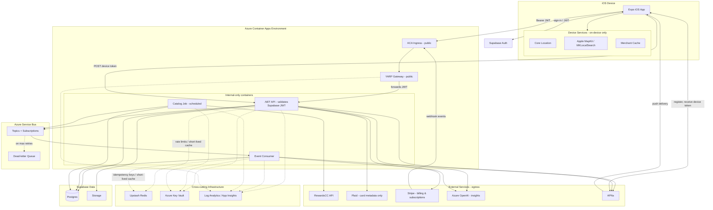
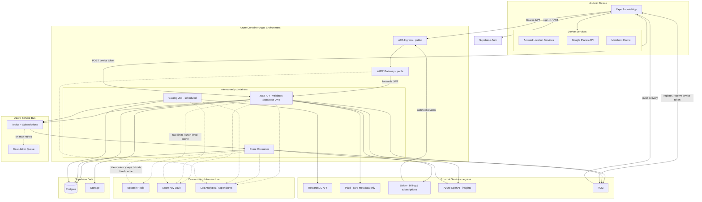

# MVP Architecture

This MVP keeps infrastructure cost controlled while using managed auth, storage, messaging, secrets, and observability from the start.

## iOS MVP Diagram

## iOS MVP Choices

- Use Expo for the iOS app shell.
- Use Core Location for foreground location, stop detection, and optional background permission flows.
- Use Apple MapKit / MKLocalSearch for nearby merchant lookup to avoid Google Places cost on iOS.
- Keep a small on-device merchant cache for recent places and duplicate suppression.
- Keep Apple MapKit / MKLocalSearch-derived place data on-device only; do not persist MapKit-derived merchant results to Supabase or server-side caches.
- Use Supabase Auth for sign-in and JWT issuance.
- Send the Supabase JWT from the iOS app to the backend in the `Authorization` header.
- Use Azure Container Apps ingress only for inbound iOS traffic.
- Make YARP the only public-facing application container.
- Keep the .NET API, event consumer, and catalog job internal-only inside the Container Apps environment.
- Use YARP for reverse proxy, routing, request shaping, and gateway policies.
- Validate Supabase JWTs in the .NET API using Supabase JWKS.
- Use a separate .NET API container for business APIs.
- Send push notifications through APNs.
- Register APNs push tokens via `POST /api/v1/devices` after sign-in and on every cold start; store them in Supabase Postgres keyed by token.
- Remove APNs tokens on user sign-out (`DELETE /api/v1/devices/:token`) and when APNs returns `BadDeviceToken` or `Unregistered`.
- Publish async events from the API to Azure Service Bus topics with subscriptions.
- Use Service Bus dead-letter queues for failed messages that exceed retry limits.
- Use a separate event consumer container for queued/background work.
- Have the event consumer subscribe to both API-published events and Catalog Job-published events so catalog changes can trigger cache invalidation and notifications.
- Use Supabase for auth, Postgres storage, and file storage.
- Use Upstash Redis for rate limits, short-lived cache, and distributed coordination when needed.
- Use Azure Key Vault for Plaid, RewardsCC, Stripe, Azure OpenAI, Supabase service-role, APNs, and other service secrets.
- Use Log Analytics / Application Insights for gateway, API, consumer, and catalog job telemetry.
- Use RewardsCC as the card/reward provider, subject to its caching and storage terms.
- Use Plaid optionally for account/card metadata only, not transactions or liabilities.
- Use Stripe for paid plan billing, the 7-day free trial, subscription lifecycle, payment-method management, and webhook-driven entitlement updates.
- Create the Stripe customer from the .NET API on first paid action; expose `/api/v1/billing/checkout` and `/api/v1/billing/portal` that return Stripe-hosted URLs the iOS app opens via in-app browser.
- Validate Stripe webhook signatures at YARP/API, persist entitlement state in Postgres, and publish a `subscription.changed` event to Service Bus for downstream consumers.
- Note: on iOS, Apple's App Store rules generally require Apple In-App Purchase for digital subscriptions consumed in-app. Confirm the Stripe-only flow against the current App Store Review Guidelines (reader-app exception, external-link entitlement, or web-only checkout) before shipping.
- Use Azure OpenAI for reward-optimization AI insights surfaced in the Insights tab and for personalized nudges.
- Generate AI insights asynchronously: the API enqueues an `insights.generate` event, the Event Consumer calls Azure OpenAI, persists the result in Postgres, and pushes via APNs when complete.
- Gate Azure OpenAI calls behind the per-user "Personalized AI insights" privacy toggle and behind the user's plan entitlement.

## Android MVP Diagram

## Android MVP Choices

- Use Expo for the Android app shell.
- Use Android Location Services for foreground location, stop detection, and optional background permission flows.
- Use Google Places for nearby merchant lookup on Android.
- Keep a small on-device merchant cache to reduce Google Places calls and duplicate suggestions.
- Persist Google Places-derived data only as allowed by Google Maps Platform terms; prefer storing internal merchant/category mappings and provider IDs instead of raw place payloads.
- Add backend quotas for Android place lookups to control Google Places spend.
- Use Supabase Auth for sign-in and JWT issuance.
- Send the Supabase JWT from the Android app to the backend in the `Authorization` header.
- Use Azure Container Apps ingress only for inbound Android traffic.
- Make YARP the only public-facing application container.
- Keep the .NET API, event consumer, and catalog job internal-only inside the Container Apps environment.
- Use YARP for reverse proxy, routing, request shaping, and gateway policies.
- Validate Supabase JWTs in the .NET API using Supabase JWKS.
- Use a separate .NET API container for business APIs.
- Send push notifications through FCM.
- Register FCM push tokens via `POST /api/v1/devices` after sign-in and on every cold start; store them in Supabase Postgres keyed by token.
- Remove FCM tokens on user sign-out (`DELETE /api/v1/devices/:token`) and when FCM reports an invalid or unregistered token.
- Publish async events from the API to Azure Service Bus topics with subscriptions.
- Use Service Bus dead-letter queues for failed messages that exceed retry limits.
- Use a separate event consumer container for queued/background work.
- Have the event consumer subscribe to both API-published events and Catalog Job-published events so catalog changes can trigger cache invalidation and notifications.
- Use Supabase for auth, Postgres storage, and file storage.
- Use Upstash Redis for rate limits, short-lived cache, and distributed coordination when needed.
- Use Azure Key Vault for Plaid, RewardsCC, Stripe, Azure OpenAI, Supabase service-role, FCM, and other service secrets.
- Use Log Analytics / Application Insights for gateway, API, consumer, and catalog job telemetry.
- Use RewardsCC as the card/reward provider, subject to its caching and storage terms.
- Use Plaid optionally for account/card metadata only, not transactions or liabilities.
- Use Stripe for paid plan billing, the 7-day free trial, subscription lifecycle, payment-method management, and webhook-driven entitlement updates.
- Create the Stripe customer from the .NET API on first paid action; expose `/api/v1/billing/checkout` and `/api/v1/billing/portal` that return Stripe-hosted URLs the Android app opens via Custom Tabs.
- Validate Stripe webhook signatures at YARP/API, persist entitlement state in Postgres, and publish a `subscription.changed` event to Service Bus for downstream consumers.
- Note: on Android, Google Play Billing is required for digital subscriptions distributed via the Play Store. Confirm the Stripe-only flow against current Play Console policy (Payments Policy exemptions, alternative billing pilot, or web-only checkout) before shipping.
- Use Azure OpenAI for reward-optimization AI insights surfaced in the Insights tab and for personalized nudges.
- Generate AI insights asynchronously: the API enqueues an `insights.generate` event, the Event Consumer calls Azure OpenAI, persists the result in Postgres, and pushes via FCM when complete.
- Gate Azure OpenAI calls behind the per-user "Personalized AI insights" privacy toggle and behind the user's plan entitlement.

## Upgrade Points

- Add more YARP, API, and consumer replicas as traffic grows.
- Add more Service Bus topics/subscriptions when async workflows split by domain.
- Add Azure Front Door or Application Gateway if managed edge routing, WAF, or global balancing is required.
- Add separate consumers for heavier domains such as transaction analytics, notifications, catalog sync, or receipt processing.

## Related Docs

- [MVP Tooling Guide](./mvp-tooling-guide.md)
- [Scaling Architecture](./scaling-architecture.md)
