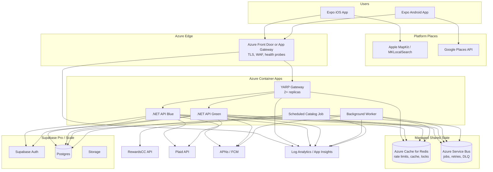

# Scaling Architecture

This target architecture adds managed shared state, durable messaging, stronger edge controls, and independently scalable services.

## Scaling Choices

- Front Door or Application Gateway handles managed edge routing, TLS, WAF, and health probes.
- YARP remains the application gateway for route-level logic, transforms, blue/green routing, and app-aware policies.
- Redis stores distributed rate-limit counters, short-lived merchant/category cache, feature flags, and locks.
- Azure Service Bus replaces the Postgres queue for durable jobs, retries, scheduled messages, and dead-letter handling.
- API blue/green revisions can receive weighted traffic through YARP or Container Apps revision traffic.
- Background workers consume durable jobs for push notifications, Plaid refreshes, merchant enrichment, and other async work.

## Code Design Requirement

Keep infrastructure behind replaceable interfaces:

- `IRateLimitStore`: memory now, Redis later.
- `ICacheStore`: memory now, Redis later.
- `IQueueClient`: Postgres queue now, Service Bus later.
- `ICardCatalogProvider`: RewardsCC now, internal/alternate provider later.
- `IMerchantResolver`: Apple MapKit, Google Places, and cached merchant resolvers.
