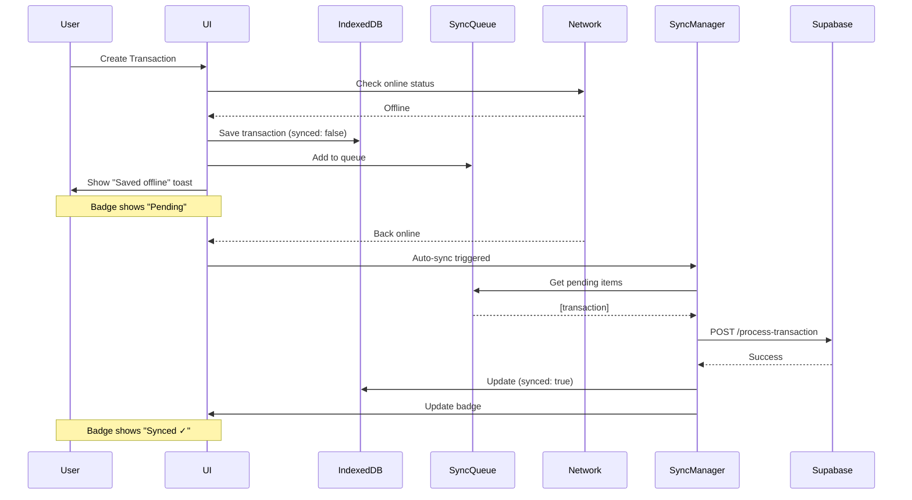
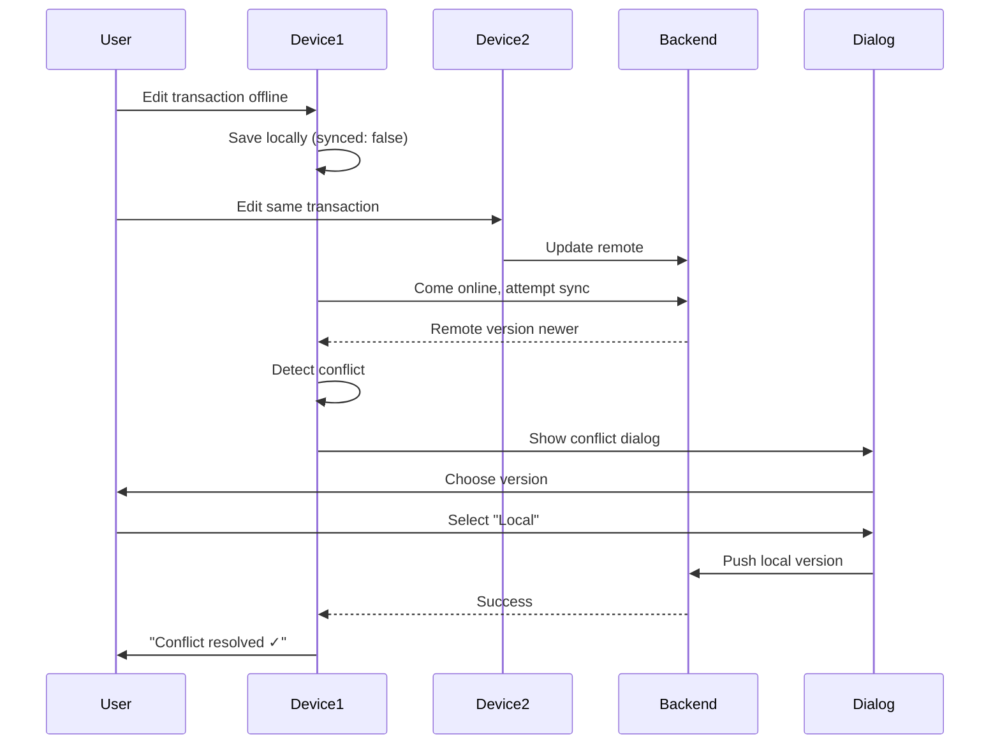

# Offline-First Architecture Guide

## Overview

TrueSpend implements a complete offline-first architecture that allows users to create and manage transactions and budgets without an internet connection. All changes are automatically synchronized when connectivity is restored.

## Architecture Components

### 1. IndexedDB Layer (`src/lib/db/indexedDB.ts`)
- **Status**: ACTIVE (Production Ready)
- **Purpose**: Structured offline data storage
- **Object Stores**:
  - `transactions` - User spending records
  - `budgets` - Budget limits and tracking
  - `geofences` - Location-based boundaries
  - `syncQueue` - Pending sync operations
  - `settings` - App configuration

### 2. Storage Adapter (`src/services/storage/IndexedDBAdapter.ts`)
- **Purpose**: Cross-platform storage abstraction
- **Methods**:
  - `init()` - Initialize storage
  - `get/set/getAll/delete` - Basic CRUD
  - `query()` - Filter operations
  - `bulkSet()` - Batch operations

### 3. Sync Manager (`src/services/syncManager.ts`)
- **Purpose**: Background sync with retry logic
- **Features**:
  - Exponential backoff (1s → 16s max)
  - Max 5 retries per operation
  - Auto-sync every 30 seconds
  - Status events: idle | syncing | error | offline

### 4. Offline Sync Service (`src/services/offlineSync.ts`)
- **Purpose**: Bidirectional sync with conflict detection
- **Features**:
  - Push local changes to remote
  - Pull remote changes to local
  - Detect timestamp-based conflicts
  - User-driven conflict resolution

## Usage

### Hook: `useOfflineStorage()`

```typescript
import { useOfflineStorage } from '@/hooks/useOfflineStorage';

function MyComponent() {
  const { storage, saveOffline, status, resolveConflict } = useOfflineStorage();

  // Status object
  status.isOnline        // boolean - network status
  status.isSyncing       // boolean - sync in progress
  status.pendingChanges  // number - unsynced items
  status.lastSyncTime    // Date | null - last successful sync
  status.conflicts       // SyncConflict[] - unresolved conflicts

  // Save offline with auto-queue
  const id = await saveOffline('transactions', data, 'CREATE');

  // Resolve conflicts
  await resolveConflict(conflict, 'local' | 'remote');
}
```

## UI Components

### OfflineIndicator (`src/components/network/OfflineIndicator.tsx`)
- **Location**: Fixed top-right corner
- **States**:
  - 🟢 Excellent Connection (auto-hides after 5s)
  - 🟢 Good Connection (auto-hides after 5s)
  - 🟡 Slow Connection
  - 🔴 Poor Connection
  - 🔴 Offline (pulsing animation)
- **Features**: Click to dismiss, tooltip with network details

### SyncStatusBadge (`src/components/sync/SyncStatusBadge.tsx`)
- **Location**: Next to each transaction/budget item
- **States**:
  - ✓ Synced (green)
  - ⏱ Pending (gray)
  - ⟳ Syncing... (animated spinner)
  - ⚠ Error (red, click to retry)

### ConflictResolutionDialog (`src/components/sync/ConflictResolutionDialog.tsx`)
- **Purpose**: Visual diff and conflict resolution
- **Features**:
  - Side-by-side comparison
  - Keyboard shortcuts: L (local), R (remote), D (diff), ESC (close), Enter (confirm)
  - Highlighted differences when diff enabled
  - "Decide Later" option

## Offline-First Flow

### Creating a Transaction Offline



### Conflict Resolution Flow



## Performance Expectations

| Operation | Target | Measured |
|-----------|--------|----------|
| IndexedDB Init | <50ms | ~20-40ms |
| Local Write | <10ms | ~2-8ms |
| Local Read | <5ms | ~1-3ms |
| Sync Queue Process | <100ms/item | ~50-80ms/item |
| Network Detection | <20ms | ~10-15ms |

## Troubleshooting

### Issue: Changes not syncing

**Check:**
1. Network status in OfflineIndicator
2. Sync queue size: `storage.count('syncQueue')`
3. Console logs for `[SyncManager]` errors
4. Check if auto-sync is running

**Fix:**
```typescript
// Manual sync trigger
import { syncManager } from '@/services/syncManager';
await syncManager.sync();
```

### Issue: Conflict dialog not appearing

**Check:**
1. Conflict array in status: `status.conflicts`
2. Console logs for `[App] Conflict detected`
3. Event listeners in SyncManagerWrapper

**Debug:**
```typescript
// Check for conflicts manually
import { offlineSyncService } from '@/services/offlineSync';
const result = await offlineSyncService.sync('transactions', localData, async (conflict) => {
  console.log('Conflict:', conflict);
  return 'manual';
});
```

### Issue: Data lost after sync

**Check:**
1. Ensure `synced: true` is set after successful sync
2. Check RLS policies on backend tables
3. Verify user authentication

**Prevention:**
- Always test sync with duplicate data first
- Use export/import for backup before major syncs

## Migration System

### Adding a New Field

```typescript
// In src/lib/db/indexedDB.ts
const DB_VERSION = 2; // Increment version

const migrations: Record<number, MigrationHandler> = {
  2: async (db, oldVersion, newVersion) => {
    console.log('[Migration] Adding tags field to transactions');
    
    // Get existing data
    const tx = db.transaction('transactions', 'readwrite');
    const store = tx.objectStore('transactions');
    const allRecords = await store.getAll();
    
    // Add new field with default value
    await Promise.all(
      allRecords.map(record => 
        store.put({ ...record, tags: [] })
      )
    );
    
    await tx.done;
  },
};
```

### Adding a New Index

```typescript
const migrations: Record<number, MigrationHandler> = {
  3: async (db) => {
    const tx = db.transaction('transactions', 'readwrite');
    const store = tx.objectStore('transactions');
    
    // Check if index exists first
    if (!store.indexNames.contains('by-category')) {
      store.createIndex('by-category', 'category');
      console.log('[Migration] Created index: by-category');
    }
    
    await tx.done;
  },
};
```

## Best Practices

### 1. Always Save Locally First
```typescript
// ✅ CORRECT - Offline-first
const addTransaction = async (data) => {
  if (!navigator.onLine) {
    await storage.set('transactions', id, { ...data, synced: false });
    return id;
  }
  const result = await api.create(data);
  await storage.set('transactions', result.id, { ...result, synced: true });
  return result.id;
};

// ❌ WRONG - Online-first
const addTransaction = async (data) => {
  const result = await api.create(data);
  return result.id;
};
```

### 2. Show Sync Status to Users
```typescript
// Always indicate sync state
<Card>
  <CardTitle>
    Transaction Name
    <SyncStatusBadge status={item.synced ? 'synced' : 'pending'} />
  </CardTitle>
</Card>
```

### 3. Handle Conflicts Gracefully
```typescript
// Let users decide on conflicts, don't auto-resolve
const onConflict = async (conflict) => {
  // Show dialog, wait for user choice
  return new Promise<ConflictResolution>((resolve) => {
    showConflictDialog(conflict, resolve);
  });
};
```

### 4. Test Offline Scenarios
```typescript
// Simulate offline in tests
test('create offline', async ({ context }) => {
  await context.setOffline(true);
  // ... test offline functionality
  await context.setOffline(false);
  // ... verify sync
});
```

## Health Monitoring

Use the health check utility to diagnose issues:

```typescript
import { runHealthCheck } from '@/lib/db/indexedDBHealth';

const health = await runHealthCheck();

console.log('Status:', health.status); // 'healthy' | 'warning' | 'error'
console.log('Stores:', health.summary.totalStores);
console.log('Records:', health.summary.totalRecords);
console.log('Quota:', health.summary.quotaUsed / health.summary.quotaAvailable * 100 + '%');

// Individual checks
health.checks.forEach(check => {
  console.log(`${check.name}: ${check.status} - ${check.message}`);
});
```

## Security Considerations

1. **Authentication Required**: All sync operations require authenticated user
2. **RLS Policies**: Backend enforces row-level security on all tables
3. **Local Data Encryption**: Consider encrypting sensitive local data
4. **Conflict Resolution**: Never auto-resolve conflicts with sensitive data

## Future Enhancements

- [ ] Add conflict preview before sync starts
- [ ] Implement "Apply to All" for batch conflicts
- [ ] Add battery-aware sync (reduce frequency on low battery)
- [ ] Implement partial sync (sync subset of data)
- [ ] Add data compression for large payloads
- [ ] Implement delta sync (only changed fields)
