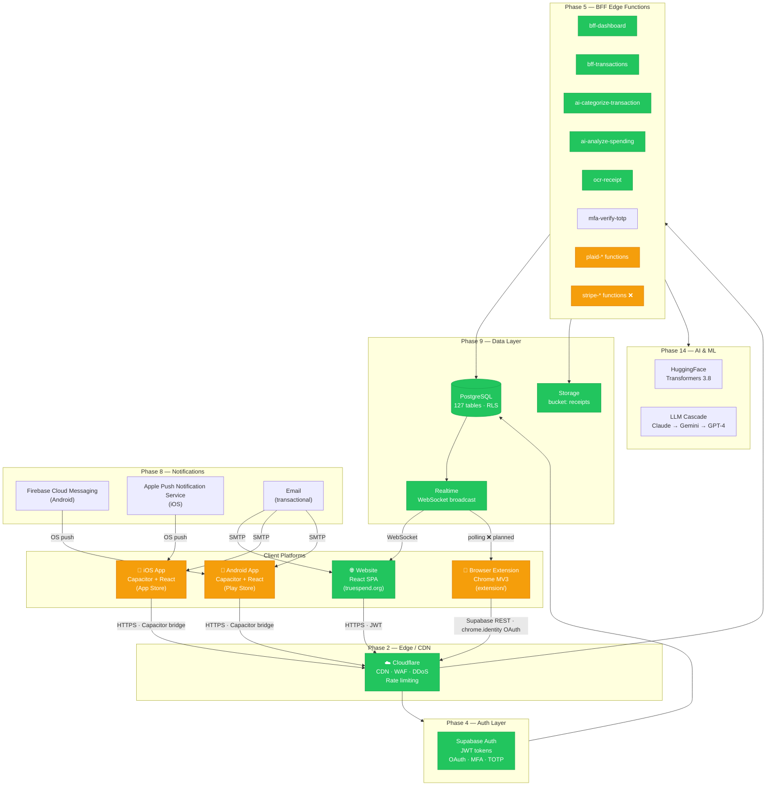
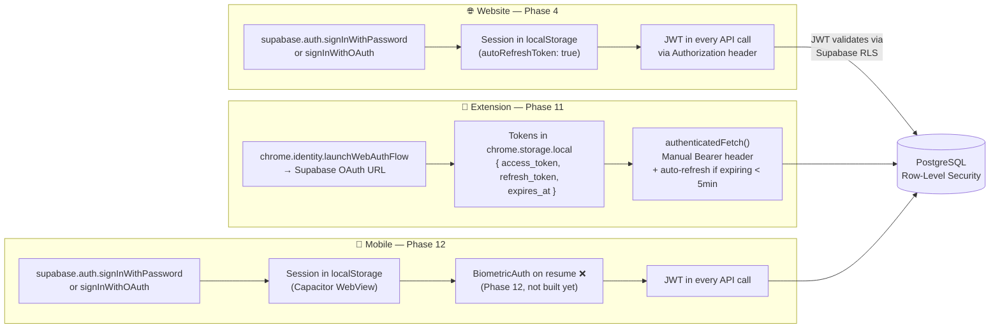
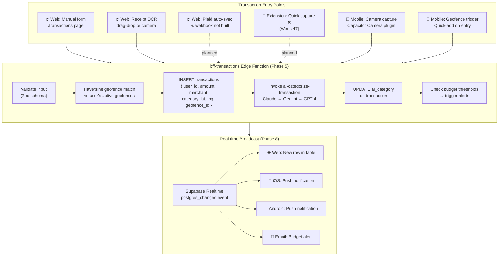
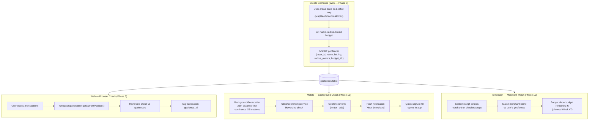
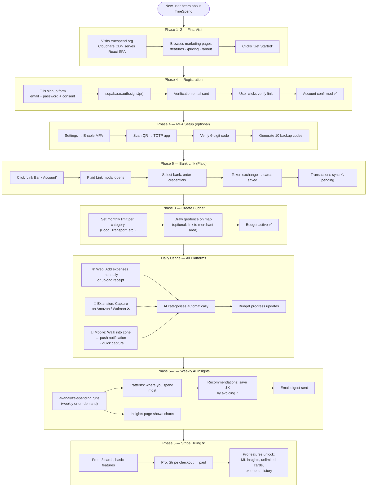
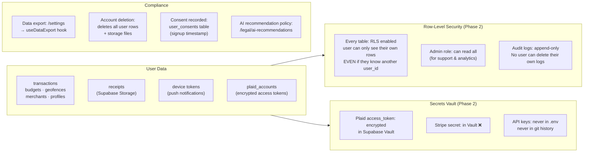
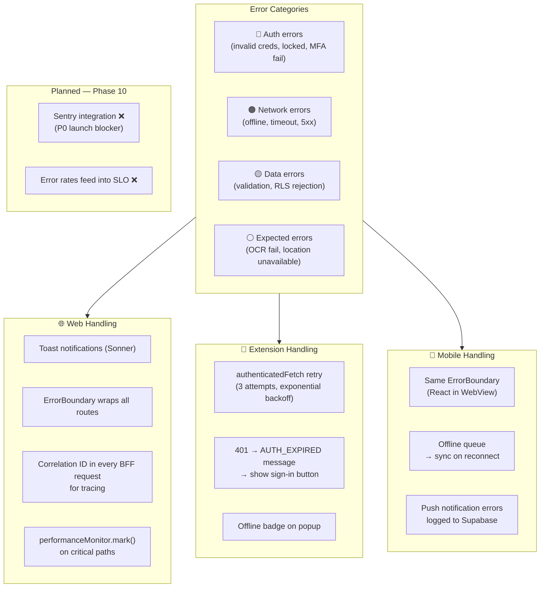

# TrueSpend — Combined Traffic Flow (All Platforms)

> **Reference document** — end-to-end view of how all three platforms  
> (Website · Browser Extension · iOS/Android) share the same backend.  
> Read the individual flow docs for per-platform detail.

---

## 1. All Platforms → Shared Backend



---

## 2. Auth — How Each Platform Authenticates



---

## 3. Transaction Data — All Entry Points

Every transaction ultimately flows to the same `transactions` table via the BFF.



---

## 4. Geofencing — All Platform Touch Points



---

## 5. Push Notification — Backend to Device

```mermaid
sequenceDiagram
    participant EF as Edge Function (any trigger)
    participant DB as PostgreSQL
    participant UD as user_devices table
    participant FCM as Firebase / APNs
    participant IOS as iOS Device
    participant AND as Android Device

    Note over EF,DB: Trigger: budget_alert / geofence_enter / anomaly

    EF->>DB: SELECT user_devices WHERE user_id AND push_enabled = true
    DB-->>EF: fcm_token, platform per device

    loop For each device token
        EF->>FCM: POST messages:send (token, title, body, type, route)
        FCM->>IOS: APNs delivery (iOS)
        FCM->>AND: FCM delivery (Android)
    end

    IOS-->>IOS: OS shows notification
    AND-->>AND: OS shows notification

    Note over IOS,AND: User taps notification

    IOS->>IOS: pushNotificationActionPerformed\ndata.type → navigate to route
    AND->>AND: pushNotificationActionPerformed\ndata.type → navigate to route
```

---

## 6. Complete User Journey — New User to Active



---

## 7. Phase × Platform Matrix

> Which phase built which capability, and which platforms it affects.

| Phase | What Was Built | Web | Extension | Mobile |
|---|---|:---:|:---:|:---:|
| **Phase 1** | Offline storage, camera, error boundary, base routing | ✅ | — | ✅ |
| **Phase 2** | Cloudflare CDN, WAF, rate limiter, BFF client | ✅ | ✅ | ✅ |
| **Phase 3** | Geofencing, budget alerts, Leaflet map, Haversine match | ✅ | — | ✅ |
| **Phase 4** | Auth, MFA, TOTP, session activity, password reset | ✅ | ✅ | ✅ |
| **Phase 5** | BFF edge functions, AI categorise, OCR, email | ✅ | ✅ | ✅ |
| **Phase 6** | Plaid link UI + exchange, Stripe ❌ | ✅ | — | — |
| **Phase 7** | Heatmap, native GPS, deal alerts, location insights | ✅ | — | ✅ |
| **Phase 8** | Feature flags, A/B test, anomaly detection, realtime | ✅ | 🟡 | ✅ |
| **Phase 9** | Audit logs, data masking, backup, cross-region DR | ✅ | ✅ | ✅ |
| **Phase 10** | SLO, incidents, performance, observability dashboards | ✅ | — | — |
| **Phase 11** | Chrome extension (service worker, popup, merchant detector ✅, capture ❌) | — | 🟡 55% | — |
| **Phase 12** | Capacitor iOS/Android native folders exist, on-device builds unverified | — | — | 🟡 35% |
| **Phase 13** | Redis cache, read replica, GraphQL ❌ | ✅ | ✅ | ✅ |
| **Phase 14** | HuggingFace ML infra, model registry, training pipeline | ✅ | — | — |
| **Phase 15** | Advanced ML (ranking, forecast, RL, collab filter) ❌ | ❌ | — | — |
| **Phase 16** | Cost optimisation (Bloom filters, ARIMA, Gorilla) ❌ | ❌ | ❌ | — |

---

## 8. Data Ownership & Privacy — All Platforms



---

## 9. Error Handling — Across All Platforms



---

## Document Index

| Document | What it covers |
|---|---|
| [TRAFFIC_FLOW_WEBSITE.md](./TRAFFIC_FLOW_WEBSITE.md) | System architecture, auth, transactions, OCR, Plaid, Stripe, geofence alerts, AI insights — web only |
| [TRAFFIC_FLOW_EXTENSION.md](./TRAFFIC_FLOW_EXTENSION.md) | Extension install, OAuth, merchant detection, budget popup, expense capture, API retry logic |
| [TRAFFIC_FLOW_MOBILE.md](./TRAFFIC_FLOW_MOBILE.md) | App launch, biometric auth, background geofencing, push notifications, camera OCR, offline sync |
| **TRAFFIC_FLOW_COMBINED.md** | **This file — all platforms converging on shared backend, phase matrix, full user journey** |
| [MILESTONE_TRACKER.md](./MILESTONE_TRACKER.md) | Phase-by-phase weekly milestones, status, blockers, and launch checklist |
| [ARCHITECTURE.md](./ARCHITECTURE.md) | Technical architecture — 19 layers, database schema, RLS, edge functions |
| [API.md](./API.md) | Edge function request/response schemas, error codes, auth headers |
