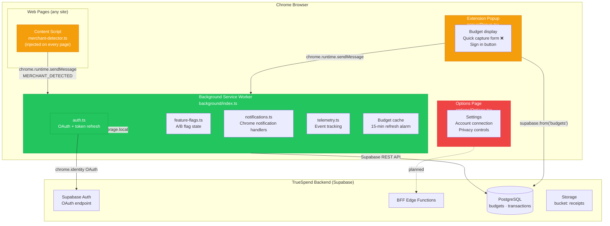
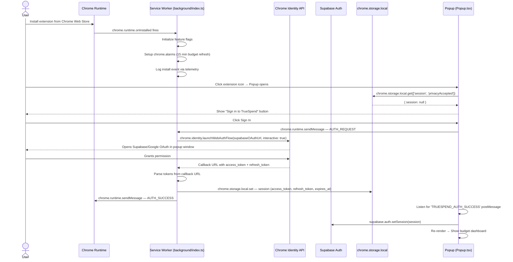
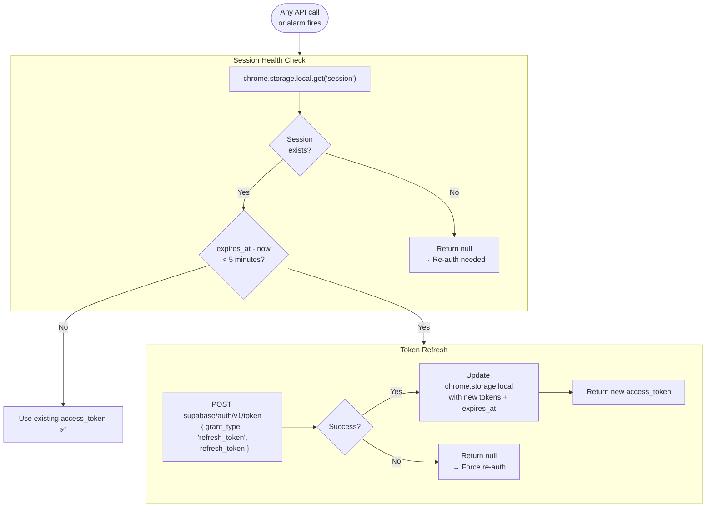
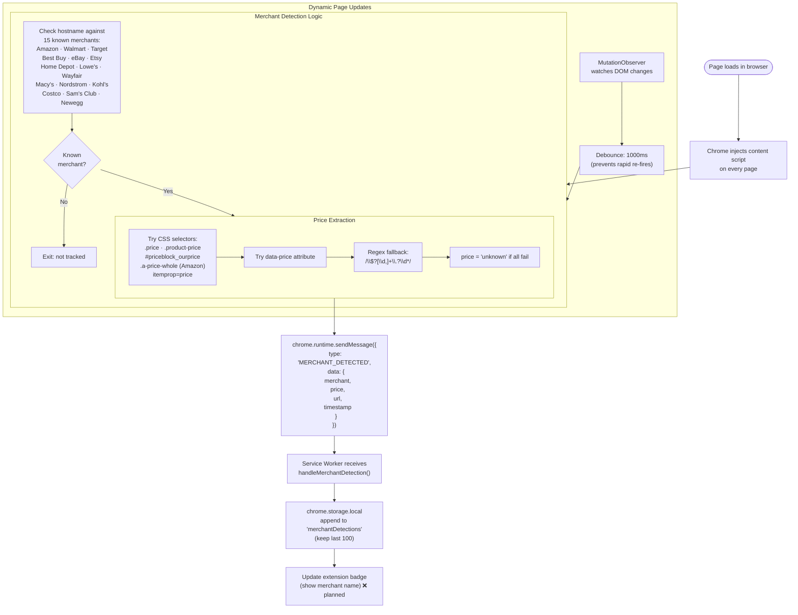
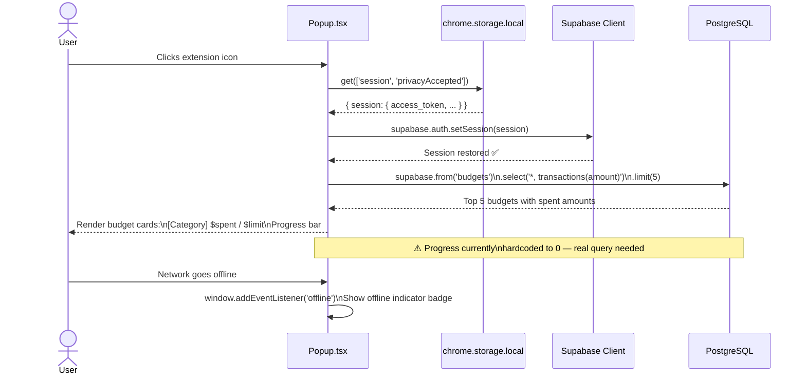
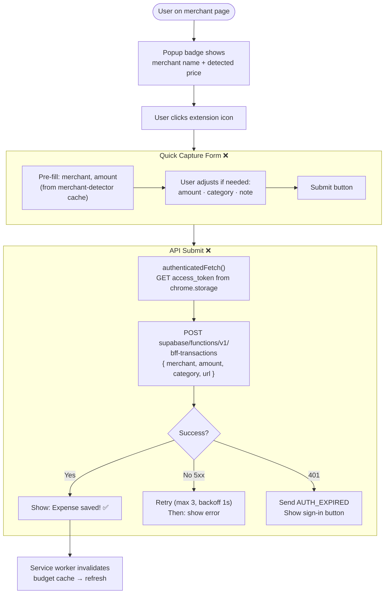
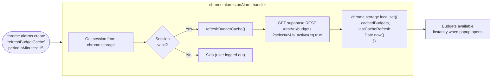
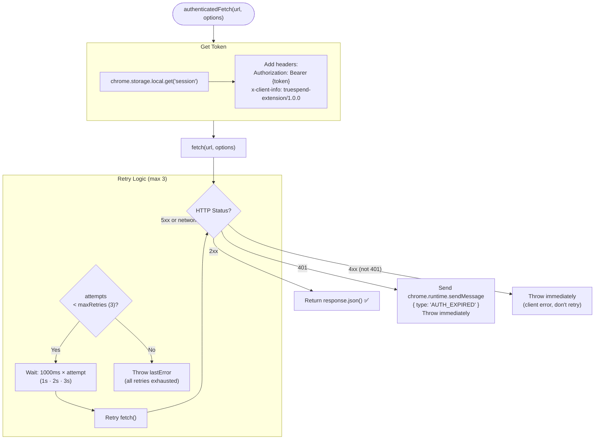

# TrueSpend — Browser Extension Traffic Flow

> **Platform:** Chrome Extension · Manifest V3 · Service Worker  
> **Phase:** 11 (30% complete — scaffold done, capture & sync pending)  
> **Location:** `extension/`

---

## 1. Extension Architecture Overview

---

## 2. Extension Install & First-Time Auth Flow

---

## 3. Token Refresh Flow (background/auth.ts)

---

## 4. Merchant Detection Flow (content/merchant-detector.ts)

---

## 5. Budget Check via Popup

---

## 6. Expense Capture via Popup ❌ Week 47 — Not Yet Built

---

## 7. Background Budget Cache Refresh

---

## 8. API Client Retry Logic (extension/shared/api-client.ts)

---

## Phase 11 — Weekly Milestone Status

| Week | Milestone | Status |
|---|---|---|
| Week 46 | Manifest V3 scaffold + service worker | ✅ Done |
| Week 46 | background/auth.ts — OAuth + token refresh | ✅ Done |
| Week 46 | background/feature-flags.ts | ✅ Done |
| Week 46 | background/telemetry.ts | ✅ Done |
| Week 46 | background/notifications.ts | ✅ Done |
| Week 46 | extension/shared/api-client.ts (retry logic) | ✅ Done |
| Week 46 | extension/shared/storage.ts | ✅ Done |
| Week 46 | Popup scaffold + budget display | ✅ Done |
| Week 46 | Options page scaffold | ✅ Done |
| Week 47 | Merchant detector content script (15 merchants, MutationObserver) | ✅ Done |
| **Week 47** | **Popup: budget spending real calculation (currently $0 hardcoded)** | ❌ |
| **Week 47** | **Popup: one-click expense capture form** | ❌ |
| **Week 47** | **Options: account connect (OAuth flow)** | ❌ |
| **Week 47** | **Production extension build pipeline (Vite config)** | ❌ |
| **Week 47** | **Chrome Web Store listing** | ❌ |
