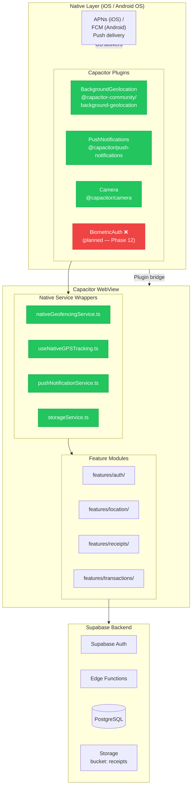
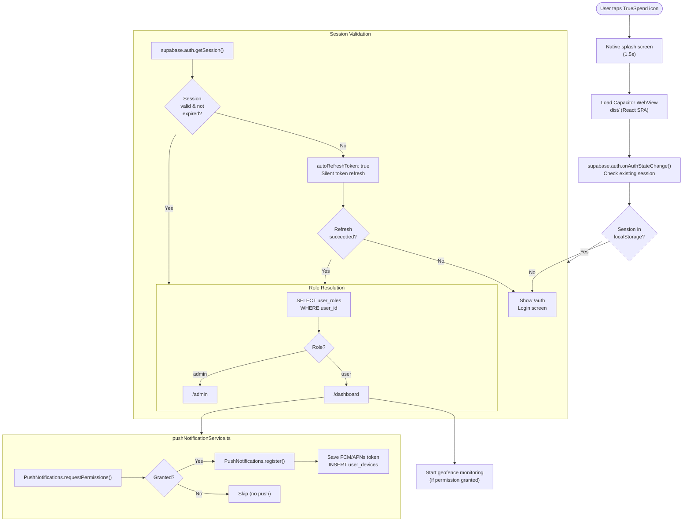
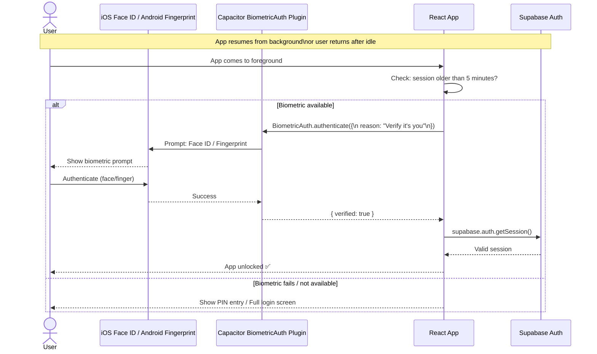
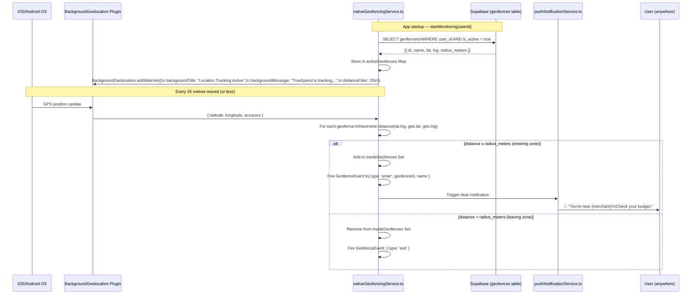
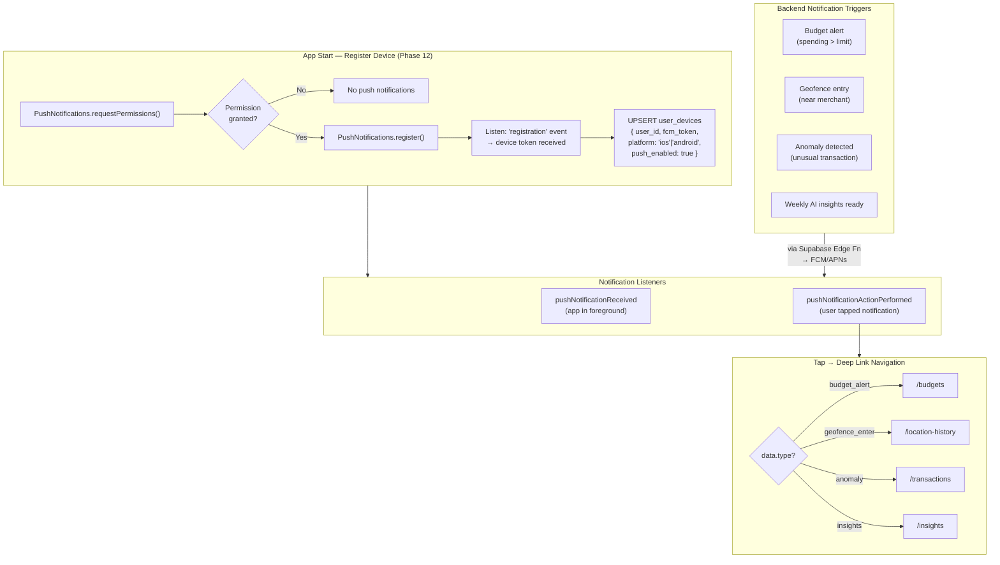
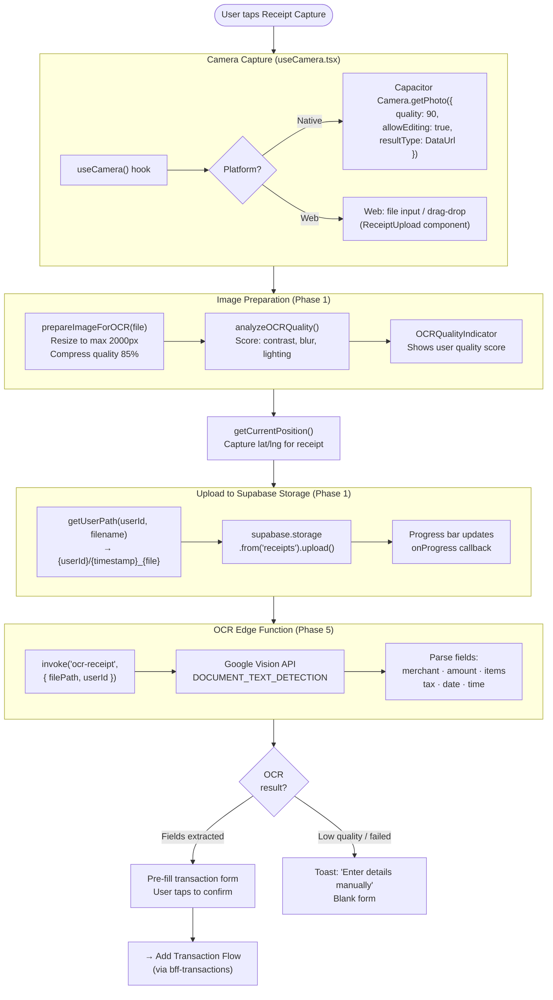
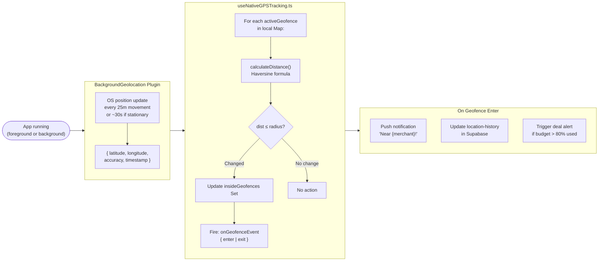
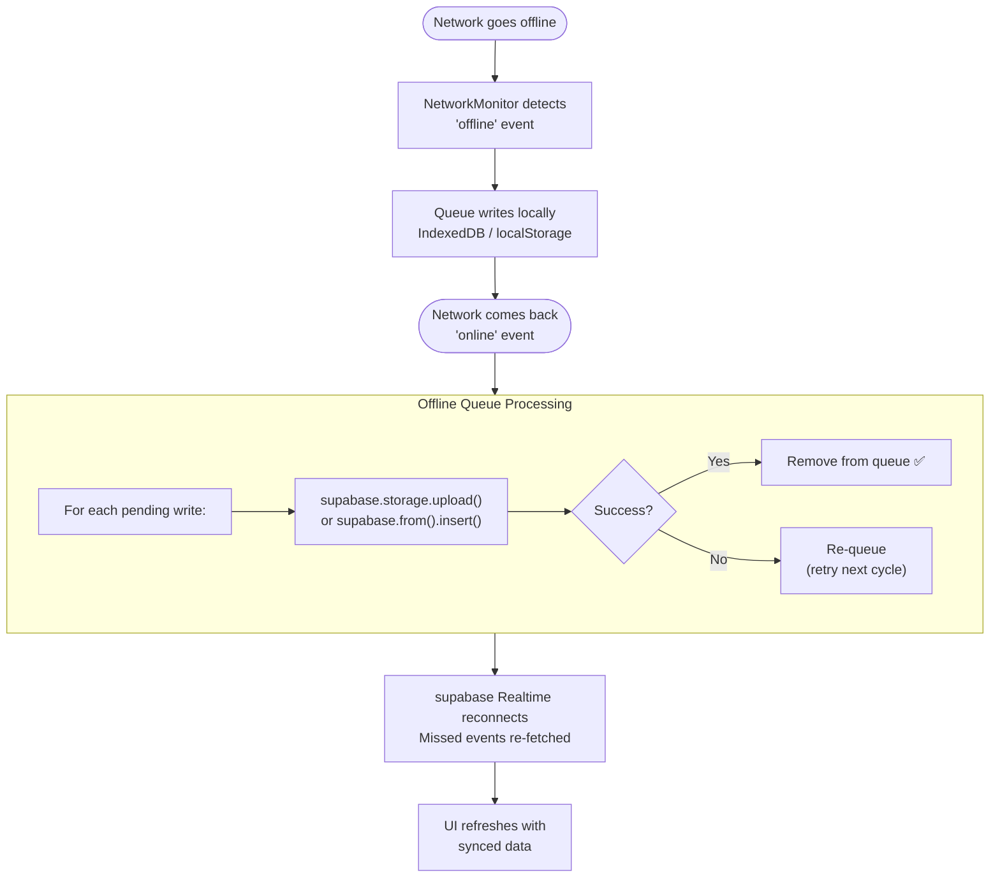

# TrueSpend — iOS & Android Traffic Flow

> **Platform:** Capacitor 7.6 wrapping the React SPA  
> **App ID:** `ai.truespend.app`  
> **Phase:** 12 (20% complete — Capacitor configured, native builds not yet done)  
> **Channels:** iOS (App Store) · Android (Play Store)

---

## 1. Mobile App Architecture

---

## 2. App Launch & Auth Check Flow

---

## 3. Biometric Auth Flow ❌ Phase 12 — Not Yet Built

---

## 4. Background Geofencing Flow (nativeGeofencingService.ts)

---

## 5. Push Notification Flow (pushNotificationService.ts)

---

## 6. Receipt Capture — Mobile Camera Flow

---

## 7. Background GPS & Geofence Check Cycle

---

## 8. Offline → Online Sync Flow (storageService.ts)

---

## Phase 12 — Weekly Milestone Status

| Week | Milestone | Status |
|---|---|---|
| Week 48 | Capacitor iOS 7.6.5 configured | ✅ Done |
| Week 48 | Capacitor Android 7.6.5 configured | ✅ Done |
| Week 48 | BackgroundGeolocation plugin wired | ✅ Done |
| Week 48 | PushNotifications plugin wired | ✅ Done |
| Week 48 | capacitor.config.ts (appId, server, plugins) | ✅ Done |
| **Week 48** | **iOS: Xcode build passes on device** | ❌ |
| **Week 48** | **Android: Gradle build passes on device** | ❌ |
| **Week 48** | **Native splash screen + app icons (all resolutions)** | ❌ |
| **Week 48** | **Deep-link handling (OAuth callback, email verify)** | ❌ |
| **Week 49** | **Biometric auth (Face ID / Fingerprint)** | ❌ |
| **Week 49** | **iOS: TestFlight internal distribution** | ❌ |
| **Week 49** | **Android: Play Console internal track** | ❌ |
| **Week 49** | **App Store metadata + screenshots** | ❌ |
| **Week 49** | **Play Store listing (privacy policy URL required)** | ❌ |

---

## iOS vs Android Differences

| Feature | iOS | Android |
|---|---|---|
| Push | APNs | Firebase Cloud Messaging |
| Auth prompt | Face ID / Touch ID | Fingerprint / Face Unlock |
| Background geo | Core Location | Fused Location Provider |
| Build tool | Xcode 15+ | Android Studio / Gradle |
| Distribution | App Store / TestFlight | Play Store / Internal Track |
| Storage sandbox | App Container | App-specific storage |
| Deeplink scheme | `truespend://` | Intent filter |
| Min OS | iOS 16+ | Android 7+ (API 24) |
