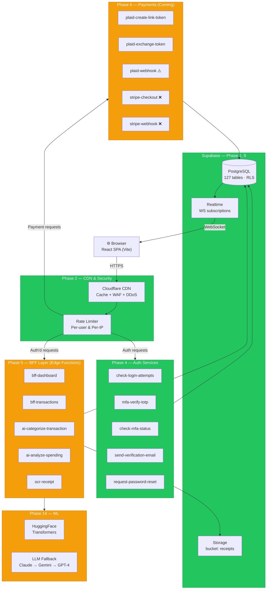
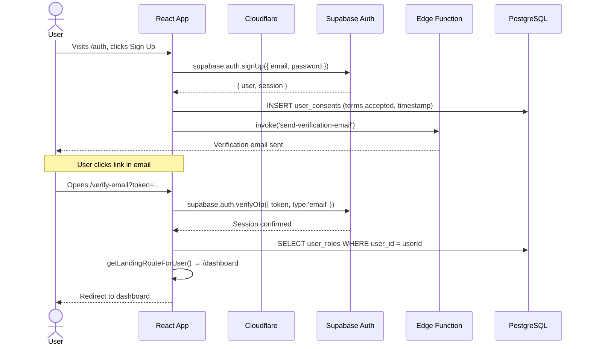
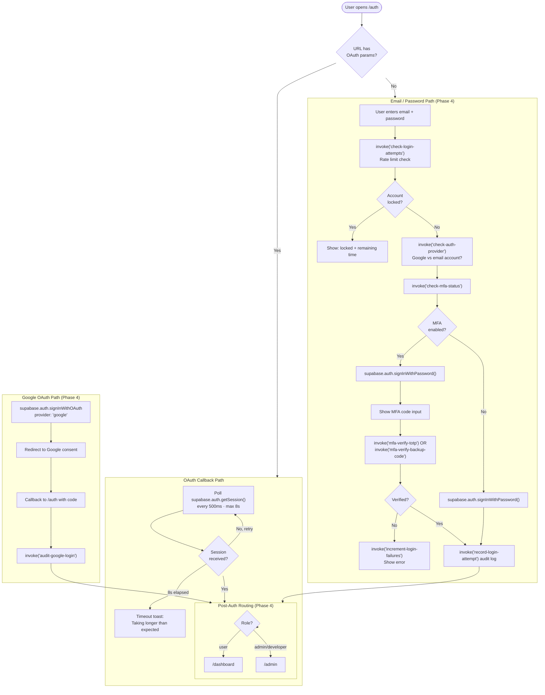
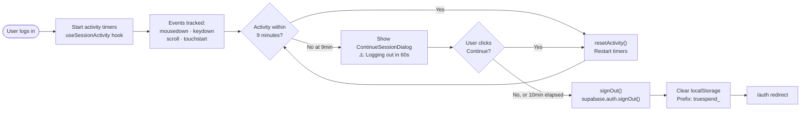
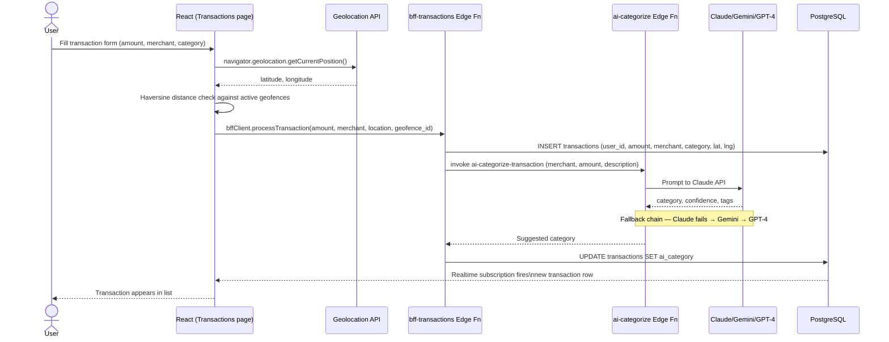
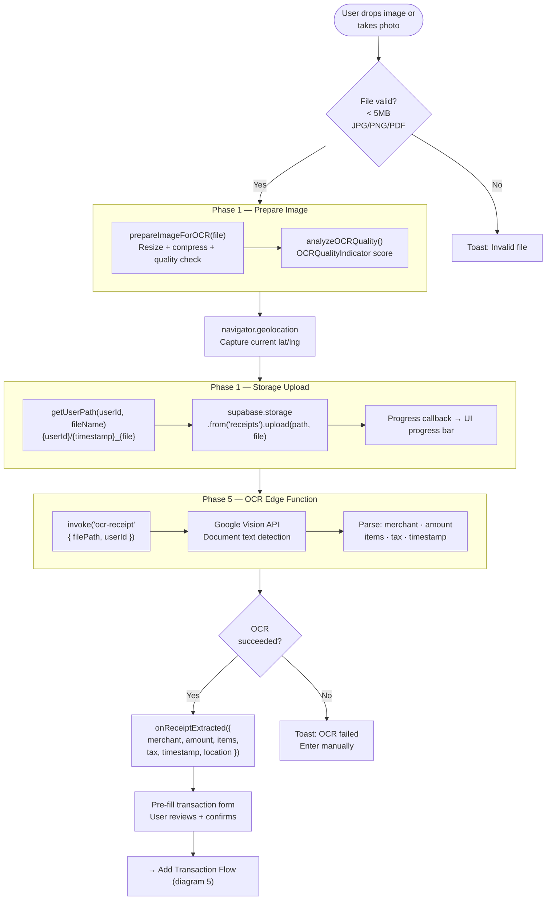
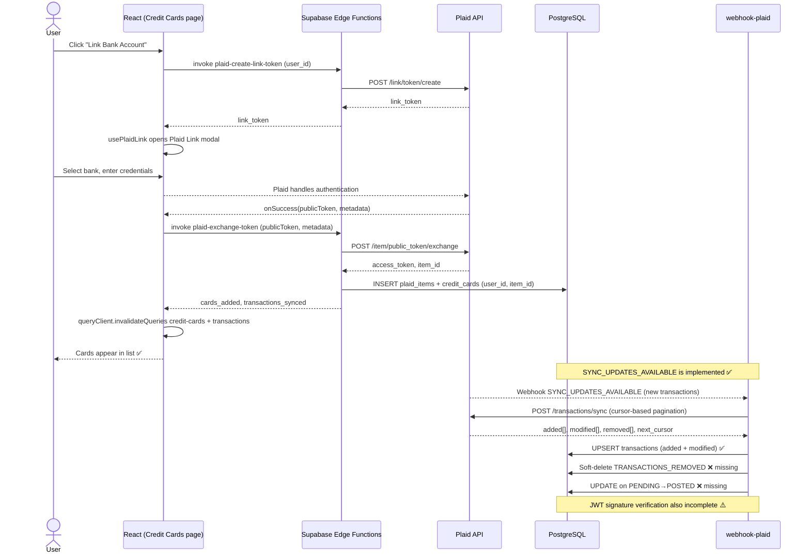
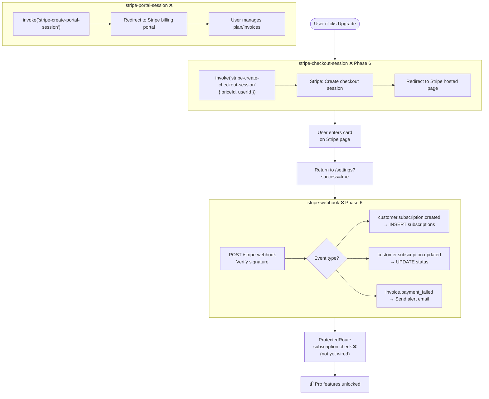
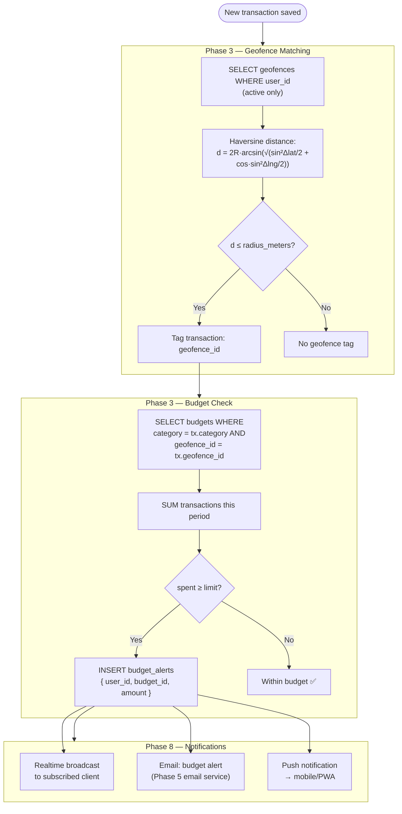
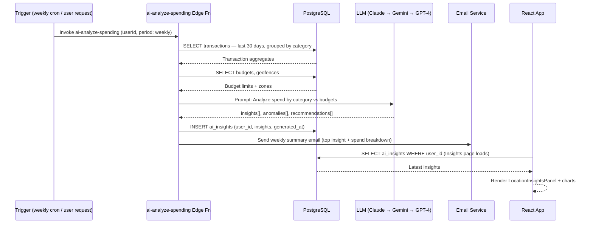

# TrueSpend — Website Traffic Flow

> **Platform:** React 18 SPA · Supabase backend · Cloudflare CDN  
> **Reference commit:** main (post PR #24)  
> **Phases covered:** 1–10, 13–14

---

## 1. System Architecture — Request Layers

Every browser request passes through this 9-layer stack before touching the database.

---

## 2. New User Registration & Email Verification

---

## 3. Login — Full Auth Flow with MFA

---

## 4. Session Activity & Auto-Logout

---

## 5. Add Transaction — Full Data Flow

---

## 6. Receipt OCR Flow

---

## 7. Plaid Bank Link Flow ⚠️ Partially Implemented

---

## 8. Stripe Subscription Flow ❌ Not Yet Implemented

---

## 9. Budget + Geofence Alert Flow

---

## 10. AI Spending Insights Flow

---

## Phase Map — Website

| Phase | Component | Status | URL / Location |
|---|---|---|---|
| Phase 1 | Offline storage, camera, error boundary | ✅ | `src/features/sync/`, `src/features/receipts/` |
| Phase 2 | Rate limiter, BFF client, CSP reporter | ✅ | `src/shared/lib/api/`, Cloudflare |
| Phase 3 | Geofencing, budget alerts, map creator | ✅ | `src/features/location/` |
| Phase 4 | Auth, MFA, session activity, password reset | ✅ | `src/features/auth/` |
| Phase 5 | BFF edge functions, AI categorise, email | 🟡 75% | `supabase/functions/` — `bff-transactions` missing |
| Phase 6 | Plaid sync ✅ partial · Stripe billing ❌ 0% | 🟡 50% | `src/features/credit-cards/`, `src/integrations/stripe/` (stub) |
| Phase 7 | Heatmap, GPS, deal alerts, location insights | ✅ | `src/features/location/` |
| Phase 8 | Feature flags, A/B test, anomaly detection, realtime | ✅ | `src/features/ml/`, `src/features/notifications/` |
| Phase 9 | Audit logs, data masking, backup | ✅ | Supabase policies + Edge Fns |
| Phase 10 | SLO tracking, incidents, performance monitor | 🟡 95% | `src/features/observability/`, `src/pages/internal/` |
| Phase 13 | Redis cache, read replica, BFF caching | 🟡 40% | `src/features/location/components/CacheLayerMetrics` |
| Phase 14 | HuggingFace model infra, training pipelines | 🟡 80% | `src/features/ml/` |
