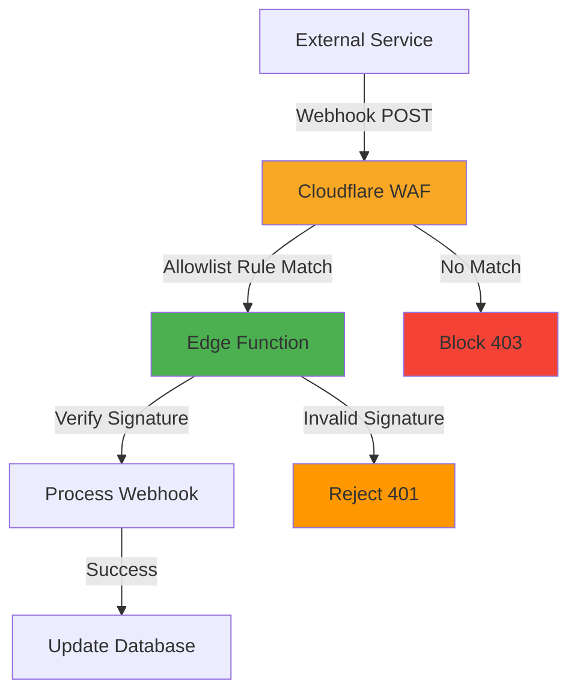

# Webhook Security Guide
## TrueSpend v4.2 - External API Integration Security

**Version**: 1.0  
**Last Updated**: 2025-11-12  
**Applies To**: Phase 3+ (Smart Expense Categorization & Beyond)

---

## 📋 Overview

This guide provides security configuration templates for integrating external webhook endpoints from financial and affiliate marketing services into TrueSpend v4.2, which currently runs behind Cloudflare WAF.

### Current Security Posture
✅ **Production Configuration** (Phase 2):
- Cloudflare WAF active - blocks automated tools and bots
- Rate limiting on API Gateway
- CSP, security headers, and DDoS protection enabled

### Integration Requirement
When implementing webhook endpoints for external services, you **must** configure Cloudflare allowlist rules to permit legitimate webhook traffic while maintaining security for other endpoints.

---

## 🔒 Security Strategy

### Webhook Security Model



### Three-Layer Defense
1. **Cloudflare WAF**: IP-based or path-based allowlist
2. **Signature Verification**: Cryptographic validation in edge function
3. **Request Validation**: Payload structure and business logic checks

---

## 🎯 Planned Integrations

### External Services
| Service | Purpose | Webhook Type | Priority |
|---------|---------|--------------|----------|
| **Plaid** | Financial data aggregation | Transaction updates | High |
| **Stripe** | Payment processing | Payment events | High |
| **Impact** | Affiliate marketing | Conversion tracking | Medium |
| **CJ (Commission Junction)** | Affiliate network | Referral tracking | Medium |

---

## 🛠️ Implementation Guide

### Phase 1: Prepare Webhook Endpoint

#### 1. Create Edge Function
```typescript
// supabase/functions/webhook-plaid/index.ts

import { createClient } from 'https://esm.sh/@supabase/supabase-js@2.80.0';
import { createHmac } from 'https://deno.land/std@0.177.0/node/crypto.ts';

const corsHeaders = {
  'Access-Control-Allow-Origin': '*',
  'Access-Control-Allow-Headers': 'authorization, x-client-info, apikey, content-type, plaid-verification',
};

Deno.serve(async (req) => {
  if (req.method === 'OPTIONS') {
    return new Response(null, { headers: corsHeaders });
  }

  try {
    // 1. Verify Plaid signature
    const signature = req.headers.get('plaid-verification');
    const body = await req.text();
    
    const expectedSignature = createHmac('sha256', Deno.env.get('PLAID_WEBHOOK_SECRET') ?? '')
      .update(body)
      .digest('hex');
    
    if (signature !== expectedSignature) {
      return new Response(
        JSON.stringify({ error: 'Invalid signature' }),
        { status: 401, headers: { ...corsHeaders, 'Content-Type': 'application/json' } }
      );
    }

    // 2. Parse and validate webhook payload
    const webhook = JSON.parse(body);
    
    if (!webhook.webhook_type || !webhook.webhook_code) {
      return new Response(
        JSON.stringify({ error: 'Invalid payload structure' }),
        { status: 400, headers: { ...corsHeaders, 'Content-Type': 'application/json' } }
      );
    }

    // 3. Process webhook based on type
    const supabase = createClient(
      Deno.env.get('SUPABASE_URL') ?? '',
      Deno.env.get('SUPABASE_SERVICE_ROLE_KEY') ?? ''
    );

    switch (webhook.webhook_type) {
      case 'TRANSACTIONS':
        // Handle transaction webhook
        await handleTransactionUpdate(supabase, webhook);
        break;
      
      case 'ITEM':
        // Handle item webhook
        await handleItemUpdate(supabase, webhook);
        break;
      
      default:
        console.log('Unknown webhook type:', webhook.webhook_type);
    }

    return new Response(
      JSON.stringify({ received: true }),
      { status: 200, headers: { ...corsHeaders, 'Content-Type': 'application/json' } }
    );
  } catch (error) {
    console.error('Webhook processing error:', error);
    return new Response(
      JSON.stringify({ error: 'Internal server error' }),
      { status: 500, headers: { ...corsHeaders, 'Content-Type': 'application/json' } }
    );
  }
});

async function handleTransactionUpdate(supabase: any, webhook: any) {
  // Implementation for transaction updates
  console.log('Processing transaction webhook:', webhook.webhook_code);
}

async function handleItemUpdate(supabase: any, webhook: any) {
  // Implementation for item updates
  console.log('Processing item webhook:', webhook.webhook_code);
}
```

#### 2. Configure Secrets
```bash
# In Lovable Cloud (via UI or CLI)
PLAID_CLIENT_ID=your_client_id
PLAID_SECRET=your_secret
PLAID_WEBHOOK_SECRET=your_webhook_secret
STRIPE_WEBHOOK_SECRET=your_stripe_webhook_secret
# etc.
```

---

### Phase 2: Configure Cloudflare Allowlist

#### Option A: IP-Based Allowlist (Recommended for Known IP Ranges)

Navigate to: **Cloudflare Dashboard > Security > WAF > Custom Rules**

##### Plaid Webhook Allowlist
```
Rule Name: Allow Plaid Webhooks
Expression:
  (http.request.uri.path eq "/functions/v1/webhook-plaid") and
  (ip.src in {54.81.125.132/32 54.165.242.34/32 35.174.38.70/32})

Action: Allow
```

**Plaid IP Ranges** (as of 2025-11):
- Production: `54.81.125.132/32`, `54.165.242.34/32`, `35.174.38.70/32`
- Sandbox: `52.21.47.157/32`

> ⚠️ **Important**: Verify current IPs at https://plaid.com/docs/api/webhooks/#ip-addresses

##### Stripe Webhook Allowlist
```
Rule Name: Allow Stripe Webhooks
Expression:
  (http.request.uri.path eq "/functions/v1/webhook-stripe") and
  (ip.src in {3.18.12.63/32 3.130.192.231/32 13.235.14.237/32 13.235.122.149/32})

Action: Allow
```

**Stripe IP Ranges** (as of 2025-11):
- See: https://stripe.com/docs/ips

#### Option B: Path + Header-Based Allowlist (Fallback)

Use when provider doesn't publish stable IP ranges:

```
Rule Name: Allow Impact Webhooks
Expression:
  (http.request.uri.path eq "/functions/v1/webhook-impact") and
  (http.request.method eq "POST") and
  (http.user_agent contains "Impact-Radius")

Action: Allow
```

---

### Phase 3: Test Webhook Security

#### 1. Test Allowlist Rule
```bash
# Should FAIL (blocked by WAF)
curl -X POST https://yourdomain.com/functions/v1/webhook-plaid \
  -H "Content-Type: application/json" \
  -d '{"test": "data"}'

# Expected: 403 Forbidden (WAF block)
```

#### 2. Test from Allowed IP (using VPN/proxy if needed)
```bash
# Should FAIL (invalid signature)
curl -X POST https://yourdomain.com/functions/v1/webhook-plaid \
  -H "Content-Type: application/json" \
  -d '{"webhook_type": "TRANSACTIONS"}'

# Expected: 401 Unauthorized (signature verification failed)
```

#### 3. Use Provider Test Mode
- **Plaid**: Use sandbox environment to send test webhooks
- **Stripe**: Use Stripe CLI: `stripe listen --forward-to https://yourdomain.com/functions/v1/webhook-stripe`

---

## 🔐 Provider-Specific Configurations

### 1. Plaid

#### Documentation
- Webhooks: https://plaid.com/docs/api/webhooks/
- IP Addresses: https://plaid.com/docs/api/webhooks/#ip-addresses
- Verification: https://plaid.com/docs/api/webhooks/#webhook-verification

#### Edge Function Template
See "Phase 1: Prepare Webhook Endpoint" above.

#### Cloudflare Rule
```
Rule Name: Allow Plaid Webhooks
Expression:
  (http.request.uri.path eq "/functions/v1/webhook-plaid") and
  (ip.src in {54.81.125.132/32 54.165.242.34/32 35.174.38.70/32})
Action: Allow
Priority: 10
```

#### Verification Method
- **Header**: `plaid-verification` (HMAC SHA-256)
- **Secret**: Retrieve from Plaid Dashboard > Webhooks
- **Implementation**: See edge function above

---

### 2. Stripe

#### Documentation
- Webhooks: https://stripe.com/docs/webhooks
- IPs: https://stripe.com/docs/ips
- Verification: https://stripe.com/docs/webhooks/signatures

#### Edge Function Template
```typescript
// supabase/functions/webhook-stripe/index.ts

import { createClient } from 'https://esm.sh/@supabase/supabase-js@2.80.0';
import Stripe from 'https://esm.sh/stripe@14.0.0?target=deno';

const stripe = new Stripe(Deno.env.get('STRIPE_SECRET_KEY') ?? '', {
  apiVersion: '2023-10-16',
  httpClient: Stripe.createFetchHttpClient(),
});

const corsHeaders = {
  'Access-Control-Allow-Origin': '*',
  'Access-Control-Allow-Headers': 'authorization, x-client-info, apikey, content-type, stripe-signature',
};

Deno.serve(async (req) => {
  if (req.method === 'OPTIONS') {
    return new Response(null, { headers: corsHeaders });
  }

  try {
    const signature = req.headers.get('stripe-signature');
    const body = await req.text();

    // Verify Stripe signature
    let event;
    try {
      event = stripe.webhooks.constructEvent(
        body,
        signature ?? '',
        Deno.env.get('STRIPE_WEBHOOK_SECRET') ?? ''
      );
    } catch (err) {
      return new Response(
        JSON.stringify({ error: `Webhook signature verification failed: ${err.message}` }),
        { status: 400, headers: { ...corsHeaders, 'Content-Type': 'application/json' } }
      );
    }

    // Process event
    const supabase = createClient(
      Deno.env.get('SUPABASE_URL') ?? '',
      Deno.env.get('SUPABASE_SERVICE_ROLE_KEY') ?? ''
    );

    switch (event.type) {
      case 'payment_intent.succeeded':
        await handlePaymentSuccess(supabase, event.data.object);
        break;
      
      case 'payment_intent.payment_failed':
        await handlePaymentFailure(supabase, event.data.object);
        break;
      
      default:
        console.log(`Unhandled event type: ${event.type}`);
    }

    return new Response(
      JSON.stringify({ received: true }),
      { status: 200, headers: { ...corsHeaders, 'Content-Type': 'application/json' } }
    );
  } catch (error) {
    console.error('Webhook error:', error);
    return new Response(
      JSON.stringify({ error: 'Internal server error' }),
      { status: 500, headers: { ...corsHeaders, 'Content-Type': 'application/json' } }
    );
  }
});

async function handlePaymentSuccess(supabase: any, paymentIntent: any) {
  console.log('Payment succeeded:', paymentIntent.id);
  // Update transaction status in database
}

async function handlePaymentFailure(supabase: any, paymentIntent: any) {
  console.log('Payment failed:', paymentIntent.id);
  // Handle failed payment
}
```

#### Cloudflare Rule
```
Rule Name: Allow Stripe Webhooks
Expression:
  (http.request.uri.path eq "/functions/v1/webhook-stripe") and
  (ip.src in {3.18.12.63/32 3.130.192.231/32 13.235.14.237/32 13.235.122.149/32 18.157.43.168/32 18.157.58.123/32 18.157.135.97/32})
Action: Allow
Priority: 11
```

#### Verification Method
- **Header**: `stripe-signature`
- **Library**: Official Stripe SDK handles verification
- **Secret**: Retrieve from Stripe Dashboard > Webhooks

---

### 3. Impact (Impact Radius)

#### Documentation
- Webhooks: https://developer.impact.com/default/documentation/Rest-Adv-v8#operations-Webhooks
- Postback URLs: Use `/functions/v1/webhook-impact`

#### Edge Function Template
```typescript
// supabase/functions/webhook-impact/index.ts

import { createClient } from 'https://esm.sh/@supabase/supabase-js@2.80.0';
import { createHmac } from 'https://deno.land/std@0.177.0/node/crypto.ts';

const corsHeaders = {
  'Access-Control-Allow-Origin': '*',
  'Access-Control-Allow-Headers': 'authorization, x-client-info, apikey, content-type',
};

Deno.serve(async (req) => {
  if (req.method === 'OPTIONS') {
    return new Response(null, { headers: corsHeaders });
  }

  try {
    const url = new URL(req.url);
    const params = url.searchParams;

    // Impact sends data as query parameters
    const conversionId = params.get('conversion_id');
    const status = params.get('status');
    const payout = params.get('payout');
    const signature = params.get('signature');

    // Verify signature (if Impact provides one)
    // Note: Check Impact documentation for exact verification method

    const supabase = createClient(
      Deno.env.get('SUPABASE_URL') ?? '',
      Deno.env.get('SUPABASE_SERVICE_ROLE_KEY') ?? ''
    );

    // Log conversion in database
    await supabase
      .from('affiliate_conversions')
      .insert({
        provider: 'impact',
        conversion_id: conversionId,
        status: status,
        payout: parseFloat(payout ?? '0'),
        raw_data: Object.fromEntries(params.entries()),
      });

    return new Response(
      'OK',
      { status: 200, headers: corsHeaders }
    );
  } catch (error) {
    console.error('Impact webhook error:', error);
    return new Response(
      JSON.stringify({ error: 'Internal server error' }),
      { status: 500, headers: { ...corsHeaders, 'Content-Type': 'application/json' } }
    );
  }
});
```

#### Cloudflare Rule
```
Rule Name: Allow Impact Webhooks
Expression:
  (http.request.uri.path eq "/functions/v1/webhook-impact") and
  (http.request.method eq "GET" or http.request.method eq "POST") and
  (http.user_agent contains "Impact")
Action: Allow
Priority: 12
```

> ⚠️ **Note**: Impact typically doesn't provide stable IP ranges. Use user-agent + path filtering.

---

### 4. CJ (Commission Junction)

#### Documentation
- Postback Documentation: https://help.cj.com/en_us/web-services/technical-integration.htm

#### Edge Function Template
Similar to Impact template above.

#### Cloudflare Rule
```
Rule Name: Allow CJ Webhooks
Expression:
  (http.request.uri.path eq "/functions/v1/webhook-cj") and
  (http.request.method eq "GET" or http.request.method eq "POST")
Action: Allow
Priority: 13
```

---

## 📊 Monitoring & Maintenance

### Webhook Monitoring Checklist

#### Daily (First Week After Launch)
- [ ] Check edge function logs for webhook errors
- [ ] Review Cloudflare WAF activity log for blocked legitimate requests
- [ ] Verify webhook processing latency (target: < 500ms)

#### Weekly
- [ ] Review webhook success rate (target: > 99%)
- [ ] Check for failed signature verifications
- [ ] Monitor database writes from webhooks

#### Monthly
- [ ] Verify provider IP ranges haven't changed
- [ ] Update Cloudflare rules if needed
- [ ] Review webhook retry patterns

### Database Schema for Webhook Logs

```sql
-- Track webhook processing
CREATE TABLE webhook_logs (
  id UUID PRIMARY KEY DEFAULT gen_random_uuid(),
  provider TEXT NOT NULL, -- 'plaid', 'stripe', 'impact', 'cj'
  webhook_type TEXT NOT NULL,
  status TEXT NOT NULL, -- 'success', 'failed', 'retry'
  payload JSONB,
  error_message TEXT,
  processing_time_ms INTEGER,
  created_at TIMESTAMP WITH TIME ZONE DEFAULT now()
);

-- Index for monitoring queries
CREATE INDEX idx_webhook_logs_provider_status ON webhook_logs(provider, status, created_at DESC);
```

---

## 🚨 Troubleshooting

### Common Issues

#### 1. Webhooks Blocked by WAF
**Symptom**: 403 Forbidden responses  
**Diagnosis**:
- Check Cloudflare > Security > Events
- Filter by path: `/functions/v1/webhook-*`
- Look for "WAF Managed Rules" blocks

**Solution**:
- Verify Cloudflare allowlist rule is active
- Check IP address matches provider's documented range
- Ensure rule priority is correct (lower number = higher priority)

#### 2. Signature Verification Failures
**Symptom**: 401 Unauthorized responses  
**Diagnosis**:
- Check edge function logs
- Look for "Invalid signature" messages

**Solution**:
- Verify webhook secret is correct in Lovable Cloud secrets
- Check signature header name matches provider's specification
- Test with provider's sandbox/test mode

#### 3. High Latency
**Symptom**: Webhook processing > 1 second  
**Diagnosis**:
- Check edge function execution time in logs
- Review database query performance

**Solution**:
- Optimize database queries (add indexes)
- Process heavy operations asynchronously
- Consider queuing mechanism for complex processing

---

## 🎯 Best Practices

### Security
1. **Always verify signatures** - Never trust webhook payloads without cryptographic verification
2. **Use separate endpoints** - One edge function per provider for isolation
3. **Log everything** - Retain webhook logs for debugging and audit
4. **Implement idempotency** - Handle duplicate webhooks gracefully
5. **Rate limit webhooks** - Protect against webhook floods (though rare)

### Reliability
1. **Return 200 quickly** - Acknowledge webhook within 3 seconds
2. **Process asynchronously** - For complex operations, queue and process later
3. **Handle retries** - Providers will retry failed webhooks, design idempotent handlers
4. **Monitor failures** - Set up alerts for failed webhook processing

### Maintenance
1. **Document IP changes** - Providers occasionally update webhook IPs
2. **Test regularly** - Use provider test/sandbox modes monthly
3. **Review logs** - Check webhook logs weekly for patterns
4. **Update dependencies** - Keep edge function libraries current

---

## 📅 Implementation Timeline

### When to Implement

**Phase 3 (Weeks 8-11)**: Smart Expense Categorization
- ✅ Plaid webhooks (transaction updates)
- ⚠️ Stripe webhooks (if payment processing launched)

**Phase 4+**: Marketing & Monetization
- ⚠️ Impact webhooks (affiliate conversions)
- ⚠️ CJ webhooks (referral tracking)

### Pre-Implementation Checklist
- [ ] Provider account created and verified
- [ ] Webhook secrets obtained from provider dashboard
- [ ] Edge function created and tested locally
- [ ] Secrets configured in Lovable Cloud
- [ ] Cloudflare allowlist rule created
- [ ] Test webhook sent successfully
- [ ] Monitoring and logging confirmed working

---

## 📞 Support Resources

### Provider Support
- **Plaid**: https://support.plaid.com/
- **Stripe**: https://support.stripe.com/
- **Impact**: https://help.impact.com/
- **CJ**: https://www.cj.com/contact

### Internal Resources
- Security Dashboard: `/admin/security`
- Edge Function Logs: Lovable > Cloud > Edge Functions
- Cloudflare Dashboard: https://dash.cloudflare.com/

---

**Document Version**: 1.0  
**Last Updated**: 2025-11-12  
**Next Review**: Before Phase 3 implementation  
**Owner**: Development Team
