# Blueprint v3.0 → v3.1 Update Plan
## Comprehensive 19-Layer Architecture Alignment

---

## Executive Summary

This plan outlines the complete restructuring of Blueprint v3.0 to align with the production architecture diagram showing **19 distinct layers**. The current blueprint lists 15-17 layers with inconsistent naming and is missing critical components like the **EGRESS GATEWAY** layer.

### Critical Changes Required

1. **Add 4 Missing Layers**:
   - SUPPLY CHAIN SECURITY
   - EGRESS GATEWAY - Edge Functions
   - RETRY SCHEDULER - Exponential Backoff
   - BACKUP & DR (as distinct layer)

2. **Rename 7 Existing Layers** to match production diagram exactly

3. **Restructure Data Flow** to include ingress → services → egress pattern

4. **Update All Color Codes** to match production diagram

5. **Reorganize Component Breakdown** with accurate scale targets

---

## Current vs. Target Architecture

### Current State (Blueprint v3.0)
- **Listed**: "15-Layer Architecture" but actually has 17 layers documented
- **Missing**: EGRESS GATEWAY, SUPPLY CHAIN SECURITY as separate layers
- **Naming Issues**: 7 layers have different names than production diagram
- **Data Flow**: Missing egress pattern, incomplete circuit breaker coverage

### Target State (Blueprint v3.1)
- **19 Distinct Layers** matching production architecture
- **Complete Egress Gateway** with API proxy, circuit breaker, endpoint allowlist
- **Consistent Naming** across all documentation
- **Full Data Flow**: Client → Ingress → Services → Egress → External APIs

---

## Layer-by-Layer Mapping

### ✅ Layers That Match (9 layers)

| # | Production Diagram | Blueprint v3.0 | Status |
|---|-------------------|----------------|--------|
| 1 | CLIENT LAYER | CLIENT LAYER | ✅ Match |
| 2 | EDGE & INGRESS - CDN & WAF | (Not in diagram, implied) | ✅ Implied |
| 9 | AI AGENTS - Edge Functions | AI AGENTS - Edge | ✅ Match |
| 10 | BUSINESS LOGIC - Edge Functions | CORE MICROSERVICES | ✅ Match (name update needed) |
| 14 | EVENT BUS - Realtime & Triggers | EVENT BUS - Realtime | ✅ Match |
| 15 | DATABASE - PostgreSQL + RLS | (Implied in data planes) | ✅ Implied |
| 17 | PUBLIC DATA PLANE - Application Data | DATA PLANE A - Public | ✅ Match |
| 18 | PRIVATE DATA PLANE - Vault Encryption | DATA PLANE A - Private | ✅ Match |
| 19 | OBSERVABILITY | OBSERVABILITY | ✅ Match |

### 🔄 Layers Requiring Rename (7 layers)

| # | Production Diagram | Blueprint v3.0 | Change Required |
|---|-------------------|----------------|-----------------|
| 3 | **API GATEWAY - Edge Functions** | EDGE & INGRESS - Express | Rename + restructure |
| 4 | **MODERN SAFETY - CSP & SRI** | MODERN SAFETY | ✅ Name match, update subtitle |
| 5 | **AUTH & SESSION - JWT & Refresh** | IDENTITY & ACCESS | Rename completely |
| 7 | **BFF LAYER - Edge Functions** | BEST CASES - Edge | Rename completely |
| 11 | **RETRY SCHEDULER - Exponential Backoff** | CONFIG RESILIENCE | Rename + restructure |
| 13 | **NOTIFICATION AMPLIFIER** | INFRASTRUCTURE POINTS | Rename + expand scope |
| 18 | **CACHED DATA SECURITY - Redis Edge** | CACHED DATA SECURITY | Update to emphasize Redis |

### ➕ New Layers to Add (4 layers)

| # | Layer Name | Components | Color Code | Purpose |
|---|-----------|------------|------------|---------|
| 6 | **SUPPLY CHAIN SECURITY** | HMAC Signature Verification<br/>Dependency Scanning<br/>Package Integrity Checks | `#d97706` (Amber) | Verify external dependencies and API signatures |
| 12 | **EGRESS GATEWAY - Edge Functions** | API Proxy External Calls<br/>Circuit Breaker Failure Protection<br/>Endpoint Allowlist Approved APIs Only | `#7c3aed` (Purple) | Control all outbound API calls with security policies |
| 16 | **STORAGE - Buckets & Policies** | File Upload Handler<br/>Receipt Storage<br/>RLS Policies | `#0891b2` (Cyan) | Secure file storage with access control |
| 20 | **BACKUP & DR** | Automated Backups<br/>Point-in-Time Recovery<br/>Cross-Region Replication | `#475569` (Slate) | Disaster recovery and data redundancy |

### ❌ Layers to Remove/Merge

| Layer | Current Location | New Location |
|-------|-----------------|--------------|
| RELEASE SAFETY | Standalone layer | Merge into OBSERVABILITY or document separately |
| CONTROL PLANE | Standalone layer | Distribute components to relevant layers |
| SCHEMA GOVERNANCE | Standalone layer | Merge into API GATEWAY |

---

## Complete 19-Layer Architecture

### Layer Order with Color Codes

| # | Layer Name | Color | Hex Code | Key Components |
|---|-----------|-------|----------|----------------|
| 1 | **CLIENT LAYER** | Navy Blue | `#1e3a8a` | React Web, PWA, Browser Extension |
| 2 | **EDGE & INGRESS - CDN & WAF** | Indigo | `#4338ca` | CloudFlare, DDoS Protection, Geographic Routing |
| 3 | **API GATEWAY - Edge Functions** | Purple | `#8b5cf6` | Schema Validation, Rate Limiting, Request Routing |
| 4 | **MODERN SAFETY - CSP & SRI** | Red | `#dc2626` | Content Security Policy, Subresource Integrity |
| 5 | **AUTH & SESSION - JWT & Refresh** | Green | `#10b981` | Supabase Auth, Session Management, RBAC |
| 6 | **SUPPLY CHAIN SECURITY** | Amber | `#d97706` | HMAC Signatures, Dependency Scanning, Package Integrity |
| 7 | **BFF LAYER - Edge Functions** | Sky Blue | `#0ea5e9` | Backend-for-Frontend, Request Aggregation, Edge Cache |
| 8 | **BUSINESS LOGIC - Edge Functions** | Emerald | `#059669` | Core Microservices (8 services) |
| 9 | **AI AGENTS - Edge Functions** | Pink | `#ec4899` | 5 AI Agents (Insight, Category, Savings, Anomaly, Match) |
| 10 | **EGRESS GATEWAY - Edge Functions** | Violet | `#7c3aed` | **NEW** API Proxy, Circuit Breaker, Endpoint Allowlist |
| 11 | **RETRY SCHEDULER - Exponential Backoff** | Orange | `#f97316` | Retry Logic, Backoff Strategy, Queue Management |
| 12 | **CONTROL PLANE - Smart Orchestration** | Purple | `#9333ea` | Circuit Breakers, Priority Queue, Feature Flags |
| 13 | **NOTIFICATION AMPLIFIER** | Orange | `#ea580c` | Email, SMS, Push Notifications, Webhook Delivery |
| 14 | **EVENT BUS - Realtime & Triggers** | Cyan | `#06b6d4` | Supabase Realtime, Database Triggers, Event Log |
| 15 | **DATABASE - PostgreSQL + RLS** | Blue | `#0284c7` | PostgreSQL, Read Replicas, Materialized Views |
| 16 | **STORAGE - Buckets & Policies** | Teal | `#0891b2` | **NEW** File Storage, Receipt Upload, RLS Policies |
| 17 | **PUBLIC DATA PLANE - Application Data** | Light Blue | `#38bdf8` | Non-PII Data, Pricing, Offers, Categories |
| 18 | **PRIVATE DATA PLANE - Vault Encryption** | Dark Red | `#b91c1c` | AES-256-GCM, PII, Transactions, Linked Accounts |
| 19 | **CACHED DATA SECURITY - Redis Edge** | Purple | `#a855f7` | Redis Cache, Encryption at Rest, TTL Management |
| 20 | **BACKUP & DR** | Slate | `#475569` | **NEW** Automated Backups, PITR, Cross-Region Replication |
| 21 | **OBSERVABILITY** | Gray | `#64748b` | Logs, Metrics, Error Tracking, Alerts |

---

## Data Flow Architecture

### Primary Request Flow (Ingress Path)

```
CLIENT LAYER
    ↓
EDGE & INGRESS - CDN & WAF
    ↓
API GATEWAY - Edge Functions (Schema Validation, Rate Limiting)
    ↓
MODERN SAFETY - CSP & SRI
    ↓
AUTH & SESSION - JWT & Refresh (Authentication Check)
    ↓
SUPPLY CHAIN SECURITY (HMAC Verification)
    ↓
BFF LAYER - Edge Functions (Request Aggregation)
    ↓
BUSINESS LOGIC - Edge Functions (Core Services)
    ↓
AI AGENTS - Edge Functions (ML Processing)
```

### External API Flow (Egress Path) **NEW**

```
BUSINESS LOGIC / AI AGENTS
    ↓
EGRESS GATEWAY - Edge Functions
    ├─ API Proxy (External Calls)
    ├─ Circuit Breaker (Failure Protection)
    └─ Endpoint Allowlist (Approved APIs Only)
    ↓
External APIs (Plaid, Stripe, SendGrid, Twilio, etc.)
```

### Data Persistence Flow

```
BUSINESS LOGIC / AI AGENTS
    ↓
DATABASE - PostgreSQL + RLS
    ├─→ PUBLIC DATA PLANE (Non-PII)
    ├─→ PRIVATE DATA PLANE (Encrypted PII)
    └─→ STORAGE - Buckets & Policies (Files)
    ↓
EVENT BUS - Realtime & Triggers (Change Notifications)
    ↓
NOTIFICATION AMPLIFIER (User Notifications)
```

### Resilience & Monitoring Flow

```
All Layers
    ↓
RETRY SCHEDULER (Failed Operations)
    ↓
CONTROL PLANE (Circuit Breaker Status)
    ↓
OBSERVABILITY (Logs, Metrics, Alerts)
```

---

## New Layer: EGRESS GATEWAY - Edge Functions

### Purpose
Control and secure ALL outbound API calls from the platform to external services (Plaid, Stripe, SendGrid, Twilio, etc.)

### Components

#### 1. API Proxy External Calls
```typescript
// supabase/functions/egress-gateway/index.ts
export const callExternalAPI = async (
  endpoint: string,
  options: RequestOptions
) => {
  // Verify endpoint is allowlisted
  if (!isAllowlisted(endpoint)) {
    throw new Error('Endpoint not in allowlist');
  }
  
  // Check circuit breaker status
  if (circuitBreaker.isOpen(endpoint)) {
    throw new Error('Circuit breaker open for endpoint');
  }
  
  // Make proxied request with retry logic
  return await retryWithBackoff(() => 
    fetch(endpoint, options)
  );
};
```

#### 2. Circuit Breaker Failure Protection
- **Closed State**: Normal operation, requests pass through
- **Open State**: Too many failures (5 failures in 1 min), block all requests
- **Half-Open State**: After cooldown (30s), allow test requests
- **Metrics Tracked**: Success rate, latency, error types

#### 3. Endpoint Allowlist Approved APIs Only
```typescript
const ALLOWLISTED_ENDPOINTS = {
  plaid: ['https://production.plaid.com', 'https://sandbox.plaid.com'],
  stripe: ['https://api.stripe.com'],
  sendgrid: ['https://api.sendgrid.com'],
  twilio: ['https://api.twilio.com'],
  // Add more as needed
};
```

### Security Benefits
- **Prevent SSRF Attacks**: Can't call arbitrary external URLs
- **Failure Isolation**: Circuit breaker prevents cascading failures
- **Audit Trail**: Log all external API calls for compliance
- **Rate Limit External APIs**: Prevent hitting rate limits
- **Cost Control**: Monitor and limit external API usage

---

## New Layer: SUPPLY CHAIN SECURITY

### Purpose
Verify integrity and authenticity of external dependencies, packages, and API requests

### Components

#### 1. HMAC Signature Verification
```typescript
// Verify incoming webhook signatures (Stripe, Plaid, etc.)
const verifyHMAC = (payload: string, signature: string, secret: string) => {
  const expectedSignature = crypto
    .createHmac('sha256', secret)
    .update(payload)
    .digest('hex');
  
  return crypto.timingSafeEqual(
    Buffer.from(signature),
    Buffer.from(expectedSignature)
  );
};
```

#### 2. Dependency Scanning
- **npm audit** in CI/CD pipeline
- **Dependabot** for automated security updates
- **Snyk** or **Socket** for real-time vulnerability detection

#### 3. Package Integrity Checks
- **package-lock.json** integrity verification
- **Subresource Integrity (SRI)** for CDN resources
- **Code signing** for releases

### Integration Points
- Runs on every webhook from external services (Stripe, Plaid, Twilio)
- CI/CD checks before deployment
- Runtime validation for dynamically loaded resources

---

## New Layer: STORAGE - Buckets & Policies

### Purpose
Secure file storage for receipts, avatars, documents with granular access control

### Components

#### 1. File Upload Handler
```typescript
// Upload receipt to secure bucket
const uploadReceipt = async (userId: string, file: File) => {
  const { data, error } = await supabase.storage
    .from('receipts')
    .upload(`${userId}/${uuid()}.pdf`, file);
  
  if (error) throw error;
  return data;
};
```

#### 2. Storage Buckets
```sql
-- Create storage buckets
INSERT INTO storage.buckets (id, name, public) VALUES 
  ('avatars', 'avatars', true),
  ('receipts', 'receipts', false),
  ('documents', 'documents', false);
```

#### 3. RLS Policies for Storage
```sql
-- Users can only view their own receipts
CREATE POLICY "Users can view own receipts"
ON storage.objects FOR SELECT
USING (
  bucket_id = 'receipts' AND
  auth.uid()::text = (storage.foldername(name))[1]
);

-- Users can upload their own receipts
CREATE POLICY "Users can upload own receipts"
ON storage.objects FOR INSERT
WITH CHECK (
  bucket_id = 'receipts' AND
  auth.uid()::text = (storage.foldername(name))[1]
);
```

### Integration Points
- Receipt upload from transactions
- User avatar management
- Document storage for KYC/verification

---

## New Layer: BACKUP & DR

### Purpose
Ensure data durability and enable rapid recovery from failures

### Components

#### 1. Automated Backups
- **Daily Full Backups**: Complete database snapshot
- **Hourly Incremental Backups**: Transaction logs
- **Retention Policy**: 30 days for full backups, 7 days for incrementals

#### 2. Point-in-Time Recovery (PITR)
- Restore database to any point in last 7 days
- Transaction log replay for precise recovery
- Testing schedule: Monthly DR drills

#### 3. Cross-Region Replication
- **Primary Region**: US-East (Production)
- **Secondary Region**: US-West (Standby)
- **Replication Lag**: < 5 seconds
- **Failover Time**: < 5 minutes

### Disaster Recovery Procedures
```typescript
// Automated failover health check
const checkPrimaryHealth = async () => {
  const healthCheck = await fetch(`${PRIMARY_DB_URL}/health`);
  
  if (!healthCheck.ok) {
    // Initiate failover to secondary
    await promoteSe condaryToPrimary();
    await notifyTeam('DR failover initiated');
  }
};
```

---

## Updated Mermaid Diagram

```mermaid
graph TB
    subgraph CLIENT["🖥️ CLIENT LAYER"]
        style CLIENT fill:#1e3a8a,stroke:#1e40af,color:#fff
        ReactApp["React Web App"]
        PWA["PWA Mobile"]
        Extension["Browser Extension"]
    end

    subgraph CDN_WAF["🌐 EDGE & INGRESS - CDN & WAF"]
        style CDN_WAF fill:#4338ca,stroke:#3730a3,color:#fff
        CloudFlare["CloudFlare CDN"]
        DDoS["DDoS Protection"]
        GeoRoute["Geographic Routing"]
    end

    subgraph API_GATEWAY["🚪 API GATEWAY - Edge Functions"]
        style API_GATEWAY fill:#8b5cf6,stroke:#7c3aed,color:#fff
        SchemaValidation["Schema Validation<br/>Zod Contracts"]
        RateLimiting["Rate Limiting<br/>Per-User Quotas"]
        RequestRouter["Request Router<br/>Path Matching"]
    end

    subgraph MODERN_SAFETY["🔒 MODERN SAFETY - CSP & SRI"]
        style MODERN_SAFETY fill:#dc2626,stroke:#b91c1c,color:#fff
        CSP["Content Security Policy"]
        SRI["Subresource Integrity"]
    end

    subgraph AUTH_SESSION["🔑 AUTH & SESSION - JWT & Refresh"]
        style AUTH_SESSION fill:#10b981,stroke:#059669,color:#fff
        SupabaseAuth["Supabase Auth<br/>Google + Email"]
        SessionMgmt["Session Management<br/>JWT + Refresh"]
        RBAC["RBAC<br/>Admin/User Roles"]
    end

    subgraph SUPPLY_CHAIN["🔐 SUPPLY CHAIN SECURITY"]
        style SUPPLY_CHAIN fill:#d97706,stroke:#b45309,color:#fff
        HMACVerify["HMAC Signature Verification"]
        DependencyScan["Dependency Scanning"]
        PackageIntegrity["Package Integrity Checks"]
    end

    subgraph BFF_LAYER["⚡ BFF LAYER - Edge Functions"]
        style BFF_LAYER fill:#0ea5e9,stroke:#0284c7,color:#fff
        RequestAggregation["Request Aggregation"]
        EdgeCache["Edge Cache<br/>In-Memory"]
        ResponseTransform["Response Transform"]
    end

    subgraph BUSINESS_LOGIC["🔧 BUSINESS LOGIC - Edge Functions"]
        style BUSINESS_LOGIC fill:#059669,stroke:#047857,color:#fff
        PlaidService["Plaid Service"]
        StripeService["Stripe Service"]
        BudgetService["Budget Service"]
        PriceIQService["Price IQ Service"]
        AttributionService["Attribution Service"]
        AffiliateService["Affiliate Service"]
        ReceiptService["Receipt Service"]
        RecoService["Recommendation Service"]
    end

    subgraph AI_AGENTS["🤖 AI AGENTS - Edge Functions"]
        style AI_AGENTS fill:#ec4899,stroke:#db2777,color:#fff
        InsightAgent["Insight Agent<br/>Spending Analysis"]
        CategoryAgent["Category Agent<br/>ML Categorization"]
        SavingsAgent["Savings Agent<br/>Goal Discovery"]
        AnomalyAgent["Anomaly Agent<br/>Fraud Detection"]
        MatchAgent["Match Agent<br/>Attribution Matching"]
    end

    subgraph EGRESS_GATEWAY["🚪 EGRESS GATEWAY - Edge Functions"]
        style EGRESS_GATEWAY fill:#7c3aed,stroke:#6d28d9,color:#fff
        APIProxy["API Proxy<br/>External Calls"]
        CircuitBreaker["Circuit Breaker<br/>Failure Protection"]
        EndpointAllowlist["Endpoint Allowlist<br/>Approved APIs Only"]
    end

    subgraph RETRY_SCHEDULER["🔄 RETRY SCHEDULER - Exponential Backoff"]
        style RETRY_SCHEDULER fill:#f97316,stroke:#ea580c,color:#fff
        RetryLogic["Retry Logic<br/>3 Attempts Max"]
        BackoffStrategy["Backoff Strategy<br/>2^n * 100ms"]
        QueueMgmt["Queue Management<br/>Dead Letter Queue"]
    end

    subgraph CONTROL_PLANE["🎛️ CONTROL PLANE - Smart Orchestration"]
        style CONTROL_PLANE fill:#9333ea,stroke:#7e22ce,color:#fff
        CircuitBreakerMgmt["Circuit Breaker Management"]
        PriorityQueue["Priority Queue<br/>Task Scheduling"]
        FeatureFlags["Feature Flags<br/>A/B Testing"]
    end

    subgraph NOTIFICATION_AMPLIFIER["📢 NOTIFICATION AMPLIFIER"]
        style NOTIFICATION_AMPLIFIER fill:#ea580c,stroke:#c2410c,color:#fff
        EmailService["Email Service<br/>SendGrid"]
        SMSService["SMS Service<br/>Twilio"]
        PushService["Push Notifications<br/>Web Push"]
        WebhookService["Webhook Delivery<br/>Custom Endpoints"]
    end

    subgraph EVENT_BUS["📡 EVENT BUS - Realtime & Triggers"]
        style EVENT_BUS fill:#06b6d4,stroke:#0891b2,color:#fff
        SupabaseRealtime["Supabase Realtime<br/>Pub/Sub"]
        DBTriggers["Database Triggers<br/>NOTIFY Cascade"]
        EventLog["Event Log Table<br/>Audit Trail"]
    end

    subgraph DATABASE["💾 DATABASE - PostgreSQL + RLS"]
        style DATABASE fill:#0284c7,stroke:#0369a1,color:#fff
        PostgreSQL["PostgreSQL 15"]
        ReadReplicas["Read Replicas<br/>3x Nodes"]
        MaterializedViews["Materialized Views<br/>Pre-Aggregated"]
    end

    subgraph STORAGE["📦 STORAGE - Buckets & Policies"]
        style STORAGE fill:#0891b2,stroke:#0e7490,color:#fff
        ReceiptBucket["Receipt Bucket<br/>Private"]
        AvatarBucket["Avatar Bucket<br/>Public"]
        DocumentBucket["Document Bucket<br/>Private"]
    end

    subgraph DATA_PUBLIC["💾 PUBLIC DATA PLANE - Application Data"]
        style DATA_PUBLIC fill:#38bdf8,stroke:#0ea5e9,color:#fff
        Categories["Categories"]
        Pricing["Pricing Data"]
        AffiliateOffers["Affiliate Offers"]
        Merchants["Merchants"]
    end

    subgraph DATA_PRIVATE["🔐 PRIVATE DATA PLANE - Vault Encryption"]
        style DATA_PRIVATE fill:#b91c1c,stroke:#991b1b,color:#fff
        UsersVault["Users Vault<br/>AES-256-GCM"]
        TransactionsVault["Transactions Vault<br/>Encrypted PII"]
        LinkedAccountsVault["Linked Accounts Vault<br/>Plaid Tokens"]
        RLSPolicies["RLS Policies<br/>user.id = auth.uid()"]
    end

    subgraph CACHED_SECURITY["🛡️ CACHED DATA SECURITY - Redis Edge"]
        style CACHED_SECURITY fill:#a855f7,stroke:#9333ea,color:#fff
        RedisCache["Redis Cache<br/>Edge Locations"]
        EncryptionAtRest["Encryption at Rest<br/>AES-256"]
        TTLMgmt["TTL Management<br/>Auto Expire"]
    end

    subgraph BACKUP_DR["💾 BACKUP & DR"]
        style BACKUP_DR fill:#475569,stroke:#334155,color:#fff
        AutoBackups["Automated Backups<br/>Daily Full + Hourly Incremental"]
        PITR["Point-in-Time Recovery<br/>7 Day Window"]
        CrossRegion["Cross-Region Replication<br/>US-East ↔️ US-West"]
    end

    subgraph OBSERVABILITY["📊 OBSERVABILITY"]
        style OBSERVABILITY fill:#64748b,stroke:#475569,color:#fff
        StructuredLogs["Structured Logs<br/>JSON Format"]
        CustomMetrics["Custom Metrics<br/>Performance KPIs"]
        ErrorTracking["Error Tracking<br/>Sentry"]
        AlertRules["Alert Rules<br/>Slack Webhooks"]
    end

    %% Primary Request Flow (Ingress)
    CLIENT --> CDN_WAF
    CDN_WAF --> API_GATEWAY
    API_GATEWAY --> MODERN_SAFETY
    MODERN_SAFETY --> AUTH_SESSION
    AUTH_SESSION --> SUPPLY_CHAIN
    SUPPLY_CHAIN --> BFF_LAYER
    BFF_LAYER --> BUSINESS_LOGIC
    BFF_LAYER --> AI_AGENTS
    
    %% Egress Flow (NEW)
    BUSINESS_LOGIC --> EGRESS_GATEWAY
    AI_AGENTS --> EGRESS_GATEWAY
    EGRESS_GATEWAY -.->|External APIs| NOTIFICATION_AMPLIFIER
    
    %% Data Persistence Flow
    BUSINESS_LOGIC --> DATABASE
    AI_AGENTS --> DATABASE
    DATABASE --> DATA_PUBLIC
    DATABASE --> DATA_PRIVATE
    DATABASE --> STORAGE
    
    %% Event & Notification Flow
    DATA_PUBLIC --> EVENT_BUS
    DATA_PRIVATE --> EVENT_BUS
    EVENT_BUS --> NOTIFICATION_AMPLIFIER
    
    %% Resilience & Monitoring
    EGRESS_GATEWAY --> RETRY_SCHEDULER
    RETRY_SCHEDULER --> CONTROL_PLANE
    CONTROL_PLANE --> OBSERVABILITY
    
    %% Backup & Security
    DATA_PRIVATE --> CACHED_SECURITY
    DATA_PRIVATE --> BACKUP_DR
    DATA_PUBLIC --> BACKUP_DR
    STORAGE --> BACKUP_DR
```



---

## Implementation Checklist

### Phase 1: Documentation Updates (Week 1)

- [ ] Update `docs/architecture/blueprint-v3.0.md`:
  - [ ] Change title from "15-Layer" to "19-Layer"
  - [ ] Add EGRESS GATEWAY section with full specifications
  - [ ] Add SUPPLY CHAIN SECURITY section
  - [ ] Add STORAGE section with RLS policies
  - [ ] Add BACKUP & DR section
  - [ ] Rename 7 layers to match production diagram
  - [ ] Update mermaid diagram with new layers and data flow
  - [ ] Update color codes table
  - [ ] Update component breakdown table

- [ ] Update `docs/DASHBOARD_README.md`:
  - [ ] Add architecture_components entries for 4 new layers
  - [ ] Update layer count to 19
  - [ ] Update architecture diagram reference

- [ ] Create `docs/architecture/egress-gateway-spec.md`:
  - [ ] API Proxy implementation details
  - [ ] Circuit breaker state machine
  - [ ] Endpoint allowlist configuration
  - [ ] Testing procedures

### Phase 2: Database Schema Updates (Week 2)

- [ ] Add architecture components for new layers:
  ```sql
  INSERT INTO architecture_components (layer_name, component_name, technology, color_code)
  VALUES
    ('SUPPLY CHAIN SECURITY', 'HMAC Verification', 'crypto', '#d97706'),
    ('EGRESS GATEWAY', 'API Proxy', 'Edge Functions', '#7c3aed'),
    ('EGRESS GATEWAY', 'Circuit Breaker', 'Edge Functions', '#7c3aed'),
    ('EGRESS GATEWAY', 'Endpoint Allowlist', 'Edge Functions', '#7c3aed'),
    ('STORAGE', 'File Upload Handler', 'Supabase Storage', '#0891b2'),
    ('BACKUP & DR', 'Automated Backups', 'Supabase', '#475569');
  ```

- [ ] Create storage buckets:
  ```sql
  INSERT INTO storage.buckets (id, name, public) VALUES 
    ('receipts', 'receipts', false),
    ('avatars', 'avatars', true),
    ('documents', 'documents', false);
  ```

- [ ] Add RLS policies for storage (see STORAGE section above)

### Phase 3: Edge Functions Implementation (Weeks 3-4)

- [ ] Create `supabase/functions/egress-gateway/`:
  - [ ] `index.ts` - Main API proxy handler
  - [ ] `circuit-breaker.ts` - Circuit breaker state management
  - [ ] `allowlist.ts` - Endpoint allowlist configuration
  - [ ] `retry-logic.ts` - Exponential backoff implementation

- [ ] Create `supabase/functions/supply-chain-security/`:
  - [ ] `hmac-verify.ts` - HMAC signature verification
  - [ ] `webhook-handler.ts` - Secure webhook processing

- [ ] Update existing services to use EGRESS GATEWAY:
  - [ ] `plaid-service` → route external calls through egress gateway
  - [ ] `stripe-service` → route external calls through egress gateway
  - [ ] `sendgrid-service` → route external calls through egress gateway
  - [ ] `twilio-service` → route external calls through egress gateway

### Phase 4: Storage Implementation (Week 5)

- [ ] Create storage upload handlers:
  - [ ] Receipt upload API endpoint
  - [ ] Avatar upload API endpoint
  - [ ] Document upload API endpoint

- [ ] Implement RLS policies (see SQL above)

- [ ] Add storage cleanup cron job (delete old receipts after 90 days)

### Phase 5: Backup & DR Setup (Week 6)

- [ ] Configure automated backups in Supabase:
  - [ ] Daily full backups (retain 30 days)
  - [ ] Hourly incremental backups (retain 7 days)

- [ ] Set up cross-region replication:
  - [ ] Primary: US-East
  - [ ] Secondary: US-West

- [ ] Create DR runbook:
  - [ ] Failover procedures
  - [ ] Rollback procedures
  - [ ] Monthly DR drill schedule

### Phase 6: Testing & Validation (Week 7)

- [ ] Test EGRESS GATEWAY:
  - [ ] Verify circuit breaker opens on failures
  - [ ] Test endpoint allowlist blocks unauthorized URLs
  - [ ] Validate retry logic with exponential backoff

- [ ] Test SUPPLY CHAIN SECURITY:
  - [ ] Verify HMAC signature validation
  - [ ] Test webhook signature verification (Stripe, Plaid)

- [ ] Test STORAGE:
  - [ ] Upload receipts as different users
  - [ ] Verify RLS policies prevent cross-user access
  - [ ] Test file deletion

- [ ] Test BACKUP & DR:
  - [ ] Perform point-in-time recovery
  - [ ] Execute failover to secondary region
  - [ ] Measure recovery time objective (RTO)

### Phase 7: Observability & Monitoring (Week 8)

- [ ] Add custom metrics for new layers:
  ```typescript
  // Egress Gateway metrics
  - egress.api_calls.total
  - egress.circuit_breaker.state
  - egress.retry.attempts
  
  // Supply Chain metrics
  - supply_chain.hmac_verifications.total
  - supply_chain.signature_failures
  
  // Storage metrics
  - storage.uploads.total
  - storage.uploads.size_bytes
  
  // Backup metrics
  - backup.last_successful
  - backup.duration_seconds
  ```

- [ ] Create alert rules:
  - [ ] Alert if circuit breaker open for > 5 minutes
  - [ ] Alert if HMAC verification failure rate > 1%
  - [ ] Alert if backup fails
  - [ ] Alert if cross-region replication lag > 60 seconds

- [ ] Update Grafana dashboards with new layers

---

## Success Metrics

### Documentation Completeness
- [ ] All 19 layers documented with specifications
- [ ] Mermaid diagram matches production architecture
- [ ] Color codes consistent across all documentation
- [ ] Component breakdown table includes scale targets

### Implementation Completeness
- [ ] EGRESS GATEWAY deployed and routing 100% of external API calls
- [ ] SUPPLY CHAIN SECURITY verifying all webhook signatures
- [ ] STORAGE accepting file uploads with RLS policies enforced
- [ ] BACKUP & DR automated backups running daily

### Operational Metrics
- [ ] Circuit breaker preventing cascading failures (0 incidents)
- [ ] HMAC verification blocking malicious webhooks (100% accuracy)
- [ ] File uploads protected by RLS (0 cross-user access incidents)
- [ ] DR failover time < 5 minutes (tested monthly)

### Performance Metrics
- [ ] Egress gateway latency overhead < 50ms (p95)
- [ ] HMAC verification latency < 10ms (p95)
- [ ] File upload latency < 2 seconds for 10MB files
- [ ] Backup completion time < 30 minutes for full backup

---

## Color Code Reference

| Layer | Color Name | Hex Code | Usage |
|-------|-----------|----------|-------|
| CLIENT LAYER | Navy Blue | `#1e3a8a` | Frontend applications |
| EDGE & INGRESS | Indigo | `#4338ca` | CDN & WAF |
| API GATEWAY | Purple | `#8b5cf6` | Request routing |
| MODERN SAFETY | Red | `#dc2626` | Security policies |
| AUTH & SESSION | Green | `#10b981` | Authentication |
| SUPPLY CHAIN SECURITY | Amber | `#d97706` | Dependency security |
| BFF LAYER | Sky Blue | `#0ea5e9` | Backend-for-frontend |
| BUSINESS LOGIC | Emerald | `#059669` | Core services |
| AI AGENTS | Pink | `#ec4899` | ML services |
| EGRESS GATEWAY | Violet | `#7c3aed` | Outbound API control |
| RETRY SCHEDULER | Orange | `#f97316` | Retry logic |
| CONTROL PLANE | Purple | `#9333ea` | Orchestration |
| NOTIFICATION AMPLIFIER | Dark Orange | `#ea580c` | Messaging |
| EVENT BUS | Cyan | `#06b6d4` | Realtime events |
| DATABASE | Blue | `#0284c7` | PostgreSQL |
| STORAGE | Teal | `#0891b2` | File storage |
| PUBLIC DATA PLANE | Light Blue | `#38bdf8` | Non-PII data |
| PRIVATE DATA PLANE | Dark Red | `#b91c1c` | Encrypted PII |
| CACHED DATA SECURITY | Light Purple | `#a855f7` | Redis cache |
| BACKUP & DR | Slate | `#475569` | Disaster recovery |
| OBSERVABILITY | Gray | `#64748b` | Monitoring |

---

## Component Breakdown (Updated)

| Component | Technology | Purpose | Scale Target |
|-----------|-----------|---------|--------------|
| **CLIENT LAYER** | React 18 + Vite | Multi-platform UI | 100k concurrent users |
| **EDGE & INGRESS** | CloudFlare CDN + WAF | DDoS protection, geographic routing | 1M req/sec |
| **API GATEWAY** | Edge Functions | Schema validation, rate limiting | 100k req/sec |
| **MODERN SAFETY** | CSP + SRI | Content security policies | N/A (always on) |
| **AUTH & SESSION** | Supabase Auth | JWT + refresh tokens, RBAC | 10k sessions/sec |
| **SUPPLY CHAIN SECURITY** | HMAC + npm audit | Signature verification, dependency scanning | 1k verifications/sec |
| **BFF LAYER** | Edge Functions | Request aggregation, edge caching | 50k req/sec |
| **BUSINESS LOGIC** | Edge Functions (8 services) | Core business logic | 50k req/sec |
| **AI AGENTS** | Lovable AI (5 agents) | ML categorization, anomaly detection | 500k tx/day |
| **EGRESS GATEWAY** | Edge Functions | External API proxy, circuit breaker | 10k req/sec |
| **RETRY SCHEDULER** | Queue + Cron | Exponential backoff retry logic | 10k retries/hour |
| **CONTROL PLANE** | Smart Orchestrator | Circuit breakers, feature flags | 100k ops/sec |
| **NOTIFICATION AMPLIFIER** | SendGrid + Twilio + Web Push | Multi-channel messaging | 100k messages/hour |
| **EVENT BUS** | Supabase Realtime | Pub/sub messaging, DB triggers | 100k events/sec |
| **DATABASE** | PostgreSQL 15 + Replicas | Read replicas, materialized views | 50k queries/sec |
| **STORAGE** | Supabase Storage | File uploads, RLS policies | 10k uploads/day |
| **PUBLIC DATA PLANE** | PostgreSQL | Non-PII application data | 100k reads/sec |
| **PRIVATE DATA PLANE** | PostgreSQL + Vault | AES-256-GCM encrypted PII | 10k writes/sec |
| **CACHED DATA SECURITY** | Redis Edge | Encrypted cache layer | 1M cache hits/sec |
| **BACKUP & DR** | Supabase Backups | Automated backups, cross-region replication | 24/7 continuous |
| **OBSERVABILITY** | Custom Metrics + Logs | Structured logging, alerting | 1M logs/min |

---

## Questions to Resolve

1. **RELEASE SAFETY Layer**: Should this remain a standalone layer or be merged into OBSERVABILITY?
   - **Recommendation**: Keep as cross-cutting concern, document separately in CI/CD section

2. **CONTROL PLANE Layer**: Current diagram shows it as separate, but components overlap with EGRESS GATEWAY and RETRY SCHEDULER
   - **Recommendation**: Keep as orchestration layer that manages circuit breakers across all services

3. **SCHEMA GOVERNANCE Layer**: Not in production diagram - merge into API GATEWAY?
   - **Recommendation**: Merge Zod validation into API GATEWAY, keep TypeScript coverage as development practice

4. **Storage Bucket Locations**: Should receipts be stored in US-only or multi-region?
   - **Recommendation**: Start US-only, add EU region for GDPR compliance in Phase 2

5. **Backup Retention Policy**: 30 days sufficient or extend to 90 days?
   - **Recommendation**: Start with 30 days, extend to 90 days for enterprise tier

---

## Next Steps

1. **Review this plan** with team and get approval
2. **Create Jira tickets** for all checklist items
3. **Assign owners** for each phase
4. **Set milestone dates** for phase completion
5. **Begin Phase 1** (Documentation Updates) immediately

---

**Document Version**: 1.0  
**Last Updated**: 2025-11-07  
**Owner**: Architecture Team  
**Status**: Draft - Awaiting Approval
