# TrueSpend Blueprint v3.0 - Enterprise Production Architecture

> **Production-Grade Financial Intelligence Platform**  
> Built entirely on Lovable native stack for 100,000+ concurrent users  
> 15-Layer Security-First, Event-Driven, AI-Native Architecture

---

## Executive Summary

**TrueSpend v3.0** is an enterprise-grade financial intelligence platform that transforms the v2.0 blueprint into a production-hardened, multi-layered system. This architecture introduces 15 distinct architectural layers including release safety, cached data security, configuration resilience, modern safety, and advanced infrastructure orchestration.

### Key Capabilities

- **Real-time Financial Intelligence**: Multi-bank aggregation with ML-powered categorization and anomaly detection
- **Enterprise Security**: 7 security layers (Content Security Policy, Subresource Integrity, RLS, Vault encryption, JWT + Refresh tokens, RBAC, Audit trails)
- **Affiliate Commerce**: Intelligent price tracking with attribution matching and historical pricing
- **Advanced Reliability**: Circuit breakers, rate limiting, retry logic with exponential backoff, health checks, failover mechanisms
- **Scalability**: Read replicas, edge caching, materialized views, geographic edge routing
- **Observability**: Structured logging, custom metrics, error tracking, alert rules with Slack integration

### Technology Foundation

| Layer | Technologies |
|-------|-------------|
| **Frontend** | React 18, TypeScript, Vite, Tailwind CSS, shadcn/ui, Browser Extension API |
| **Backend** | Lovable Cloud (Supabase), PostgreSQL with Read Replicas, Edge Functions (Deno), Realtime Pub/Sub |
| **AI Layer** | Lovable AI (GPT-4 + Claude), Rule-based ML hybrids, Vector embeddings |
| **Integrations** | Plaid (Banking), Stripe (Payments), Email Provider (Sendgrid), SMS (Twilio), Push Notifications |
| **Infrastructure** | GitHub Actions CI/CD, Staging Environment, Canary Deployments, Geographic Edge Routing |
| **Security** | AES-256-GCM Vault Encryption, CSP, SRI, HMAC SHA-256, Zod Runtime Validation, JWT Auth |
| **Observability** | Structured JSON Logs, Custom Metrics, Error Tracking, Alert Rules (Slack Webhooks) |

---

## Architecture Overview

```mermaid
graph TB
    subgraph CLIENT["🖥️ CLIENT LAYER"]
        BrowserExt["Browser Extension<br/>For Capture"]
        MobileApp["Mobile Web/App<br/>PWA Capable"]
        ReactApp["React Web App<br/>Vite/Tailwind + Shadcn"]
    end

    subgraph RELEASE_SAFETY["🚀 RELEASE SAFETY - CI/CD"]
        GitHubActions["GitHub Actions<br/>CI/CD-based Deploys"]
        StagingEnv["Staging Env<br/>Critical Path"]
        SmokeTests["Smoke Tests<br/>Critical Path"]
        CanaryRollback["% Canary Rollback<br/>Kill Switch"]
    end

    subgraph MODERN_SAFETY["🔒 MODERN SAFETY - Browser Security"]
        CSP["Content Security Policy<br/>CSP Protections"]
        SRI["Subresource Integrity<br/>File Guarantees"]
    end

    subgraph BEST_CASES["⚡ BEST CASES - Edge Performance"]
        BFFGateway["BFF API Gateway<br/>Request Aggregation"]
        EdgeCache["Edge Cache<br/>In-Memory Hit Rate"]
        RateLimiter["Rate Limiter<br/>Per-User Quotas"]
    end

    subgraph EDGE_INGRESS["🌐 EDGE & INGRESS - Express Gateway"]
        SchemaValidator["Schema Validator<br/>Zod Contract Checks"]
        RequestRateLimit["Request Rate Limit<br/>E2E Protection"]
        PreventNonCheck["Prevent Non-Check<br/>WARM Max"]
        GeoEdge["Geographic Edge<br/>Country Routing"]
        APIProxy["API Proxy<br/>External Req"]
        EndpointAliasing["Endpoint Aliasing<br/>Secured APIs Only"]
        CircuitBreakerGW["Circuit Breaker<br/>Failure Parameters"]
    end

    subgraph AI_AGENTS["🤖 AI AGENTS - Edge Functions"]
        InsightAgent["Insight Agent<br/>Spending Analysis"]
        CategoryAgent["Category Agent<br/>ML Categorization"]
        SavingsAgent["Savings Agent<br/>Goal Discovery"]
        AnomalyAgent["Anomaly Agent<br/>QoL Detection"]
        MatchAgent["Match Agent<br/>Attribution Matching"]
    end

    subgraph CORE_SERVICES["🔧 CORE MICROSERVICES - In Functions"]
        RecoAPI["Recommendation API<br/>Personalized Offers"]
        PriceIQService["Price IQ Service<br/>Historical Pricing"]
        AttributionService["Attribution Service<br/>Click → Purchase"]
        BudgetService["Budget Service<br/>Rules + Alerts"]
        AffiliateService["Affiliate Service<br/>Link Generator"]
        PlaidService["Plaid Service<br/>Bank Sync"]
        ReceiptService["Receipt Service<br/>Upload + Parse"]
        StripeService["Stripe Service<br/>Subscription Mgmt"]
    end

    subgraph CONTROL_PLANE["🎛️ CONTROL PLANE - Smart Orchestrator"]
        CircuitBreaker["Circuit Breaker<br/>Rate → 5 ER Features"]
        PriorityQueue["Priority Queue<br/>Task Scheduling"]
        FeatureFlags["Feature Flags<br/>LaunchDarkly-style"]
    end

    subgraph DATA_PUBLIC["💾 DATA PLANE A - Public"]
        SupabasePublic["Supabase DB<br/>Read Replicas"]
        PrebuiltStatic["Prebuilt, Static<br/>Pricing, RLS"]
        MaterializedViews["Materialized Views<br/>Pre-Aggregated Stats"]
    end

    subgraph DATA_PRIVATE["🔐 DATA PLANE A - Private"]
        SupabaseVault["Supabase DB + Vault<br/>Encrypted Encryption"]
        UsersTransactions["Users, Transactions<br/>RLS, Accounts"]
        RLSPolicies["RLS Policies<br/>user.id == user_id"]
    end

    subgraph OBSERVABILITY["📊 OBSERVABILITY"]
        StructuredLogs["Structured Logs<br/>JSON Format"]
        CustomMetrics["Custom Metrics<br/>Performance Tracking"]
        ErrorTracking["Error Tracking<br/>Sentry-like Dashboard"]
        AlertRules["Alert Rules<br/>Slack Webhooks"]
    end

    subgraph CACHED_SECURITY["🛡️ CACHED DATA SECURITY"]
        ItemEncryption["Item-level Encryption<br/>Sensitive Data"]
        BackupIntegrity["Backup Integrity<br/>Signature+Rules"]
        SecretsManagement["Secrets Management<br/>Edge Config Vault"]
    end

    subgraph CONFIG_RESILIENCE["🔄 CONFIGURATION RESILIENCE"]
        DBProtection["Database Protection<br/>Authentication/Authorization"]
        SignatureVerify["Signature Verify<br/>HMAC SHA-256"]
        FrontOutbyDate["Front Outby-Date<br/>At-Least-Once Delivery"]
        RetryBackoff["Retry/Backoff<br/>Exponential Backoff"]
    end

    subgraph EVENT_BUS["📡 EVENT BUS - Realtime"]
        SupabaseRealtime["Supabase Realtime<br/>Publish-Dispatch"]
        DBTriggers["Database Triggers<br/>NOTIFY Cascade"]
        EventLogTable["Event Log Table<br/>Audit Trail"]
    end

    subgraph IDENTITY_ACCESS["🔑 IDENTITY & ACCESS"]
        SupabaseAuth["Supabase Auth<br/>Google OAuth + Email"]
        UserRolesTable["User Roles Table<br/>Admin/User+RBAC"]
        RowLevelSecurity["Row Level Security<br/>Per-User Data Isolation"]
        SessionManagement["Session Management<br/>JWT + Refresh"]
    end

    subgraph SCHEMA_GOVERNANCE["📋 SCHEMA GOVERNANCE"]
        TypeScriptCoverage["TypeScript Coverage<br/>Shared Types"]
        ZodValidation["Zod Validation<br/>Runtime Checks"]
        APIVersioning["API Versioning<br/>v1, v2 Routes"]
    end

    subgraph INFRA_POINTS["🔌 INFRASTRUCTURE POINTS"]
        EmailProvider["Email Provider<br/>Sendgrid Email"]
        PushNotifications["Push Notifications<br/>Web Push API"]
        SMSProvider["SMS Provider<br/>Twilio Integration"]
    end

    ReactApp --> MODERN_SAFETY
    BrowserExt --> MODERN_SAFETY
    MobileApp --> MODERN_SAFETY
    
    MODERN_SAFETY --> BEST_CASES
    BEST_CASES --> EDGE_INGRESS
    
    EDGE_INGRESS --> AI_AGENTS
    EDGE_INGRESS --> CORE_SERVICES
    
    AI_AGENTS --> CONTROL_PLANE
    CORE_SERVICES --> CONTROL_PLANE
    
    CONTROL_PLANE --> DATA_PUBLIC
    CONTROL_PLANE --> DATA_PRIVATE
    
    DATA_PUBLIC --> EVENT_BUS
    DATA_PRIVATE --> EVENT_BUS
    
    EVENT_BUS --> OBSERVABILITY
    
    CORE_SERVICES --> INFRA_POINTS
    
    RELEASE_SAFETY -.-> ReactApp
    CACHED_SECURITY -.-> DATA_PRIVATE
    CONFIG_RESILIENCE -.-> CORE_SERVICES
    IDENTITY_ACCESS -.-> DATA_PRIVATE
    SCHEMA_GOVERNANCE -.-> EDGE_INGRESS
```



---

## Architecture Principles

### 1. **Security-First Design** (7 Layers)
- **Layer 1**: Content Security Policy (CSP) + Subresource Integrity (SRI)
- **Layer 2**: Row-Level Security (RLS) on all tables
- **Layer 3**: AES-256-GCM Vault encryption for PII
- **Layer 4**: JWT + Refresh token session management
- **Layer 5**: RBAC (Role-Based Access Control)
- **Layer 6**: HMAC SHA-256 signature verification
- **Layer 7**: Audit trails via Event Log table

### 2. **Event-Driven Architecture**
- Supabase Realtime for pub/sub messaging
- Database triggers (NOTIFY cascade)
- Event log table for audit trails
- At-least-once delivery semantics

### 3. **AI-Native Intelligence**
- 5 specialized AI agents (Insight, Category, Savings, Anomaly, Match)
- Rule-based + LLM hybrid approach
- Vector embeddings for semantic search
- 95%+ accuracy targets

### 4. **Performance & Scalability**
- Read replicas for read-heavy workloads
- Edge caching with in-memory hit rates
- Materialized views for pre-aggregated stats
- Geographic edge routing
- Rate limiting (per-user quotas)

### 5. **Reliability & Resilience**
- Circuit breakers (Rate → 5 ER features)
- Retry logic with exponential backoff
- Health checks and failover
- Canary deployments with kill switch

### 6. **Observability & Monitoring**
- Structured JSON logging
- Custom performance metrics
- Error tracking (Sentry-like)
- Alert rules with Slack webhooks

---

## Component Breakdown

| Component | Technology | Purpose | Scale Target |
|-----------|-----------|---------|--------------|
| **Frontend** | React 18 + Vite | Multi-platform UI (Web, Mobile, Extension) | 100k concurrent |
| **Express Gateway** | Edge Functions | API proxy, schema validation, rate limiting | 10k req/sec |
| **AI Agents** | Lovable AI | Transaction categorization, anomaly detection | 500k tx/day |
| **Core Services** | Edge Functions | Business logic microservices | 5k req/sec |
| **Control Plane** | Smart Orchestrator | Circuit breakers, priority queue, feature flags | 10k ops/sec |
| **Data Plane A - Public** | PostgreSQL + Replicas | Read-heavy data (pricing, offers) | 10k reads/sec |
| **Data Plane A - Private** | PostgreSQL + Vault | Encrypted PII (users, transactions) | 5k writes/sec |
| **Event Bus** | Supabase Realtime | Pub/sub messaging, database triggers | 10k events/sec |
| **Observability** | Custom + Structured Logs | Monitoring, alerting, error tracking | 100k logs/min |
| **Infrastructure Points** | Email, SMS, Push | External integrations | 10k msgs/hour |

---

## Database Schema Architecture

### Data Plane A - Private (Encrypted PII)

#### `users_vault` (Encrypted)
```sql
CREATE TABLE users_vault (
  id UUID PRIMARY KEY DEFAULT gen_random_uuid(),
  auth_id UUID REFERENCES auth.users(id) UNIQUE NOT NULL,
  email_encrypted TEXT NOT NULL, -- AES-256-GCM
  phone_encrypted TEXT, -- AES-256-GCM
  full_name_encrypted TEXT NOT NULL, -- AES-256-GCM
  date_of_birth_encrypted TEXT, -- AES-256-GCM
  ssn_last_4_encrypted TEXT, -- AES-256-GCM
  encryption_key_id UUID NOT NULL, -- Reference to key in vault
  created_at TIMESTAMPTZ DEFAULT NOW(),
  updated_at TIMESTAMPTZ DEFAULT NOW()
);

CREATE INDEX idx_users_vault_auth_id ON users_vault(auth_id);
```

#### `linked_accounts_vault` (Encrypted)
```sql
CREATE TABLE linked_accounts_vault (
  id UUID PRIMARY KEY DEFAULT gen_random_uuid(),
  user_id UUID REFERENCES users_vault(id) ON DELETE CASCADE,
  plaid_access_token_encrypted TEXT NOT NULL, -- AES-256-GCM
  plaid_item_id TEXT NOT NULL,
  institution_id TEXT NOT NULL,
  institution_name TEXT NOT NULL,
  account_id_encrypted TEXT NOT NULL, -- AES-256-GCM
  account_name TEXT NOT NULL,
  account_type TEXT NOT NULL,
  account_subtype TEXT,
  mask TEXT, -- Last 4 digits (not encrypted)
  available_balance DECIMAL(12,2),
  current_balance DECIMAL(12,2),
  currency_code TEXT DEFAULT 'USD',
  is_active BOOLEAN DEFAULT true,
  last_synced_at TIMESTAMPTZ,
  created_at TIMESTAMPTZ DEFAULT NOW(),
  updated_at TIMESTAMPTZ DEFAULT NOW()
);

CREATE INDEX idx_linked_accounts_user_id ON linked_accounts_vault(user_id);
CREATE INDEX idx_linked_accounts_plaid_item ON linked_accounts_vault(plaid_item_id);
```

#### `transactions_vault` (Encrypted)
```sql
CREATE TABLE transactions_vault (
  id UUID PRIMARY KEY DEFAULT gen_random_uuid(),
  user_id UUID REFERENCES users_vault(id) ON DELETE CASCADE,
  linked_account_id UUID REFERENCES linked_accounts_vault(id) ON DELETE CASCADE,
  plaid_transaction_id TEXT UNIQUE NOT NULL,
  amount DECIMAL(12,2) NOT NULL,
  iso_currency_code TEXT DEFAULT 'USD',
  date DATE NOT NULL,
  authorized_date DATE,
  name TEXT NOT NULL,
  merchant_name TEXT,
  merchant_name_encrypted TEXT, -- AES-256-GCM (if sensitive)
  category_id UUID REFERENCES categories(id),
  category_confidence DECIMAL(3,2), -- 0.00 to 1.00
  is_pending BOOLEAN DEFAULT false,
  payment_channel TEXT, -- online, in store, other
  transaction_type TEXT, -- place, special, unresolved
  location_address TEXT,
  location_city TEXT,
  location_region TEXT,
  location_postal_code TEXT,
  location_country TEXT,
  location_lat DECIMAL(10,8),
  location_lon DECIMAL(11,8),
  is_anomaly BOOLEAN DEFAULT false,
  anomaly_score DECIMAL(3,2), -- 0.00 to 1.00
  anomaly_reason TEXT,
  affiliate_offer_id UUID REFERENCES affiliate_offers(id),
  affiliate_savings DECIMAL(12,2),
  created_at TIMESTAMPTZ DEFAULT NOW(),
  updated_at TIMESTAMPTZ DEFAULT NOW()
);

CREATE INDEX idx_transactions_user_id ON transactions_vault(user_id);
CREATE INDEX idx_transactions_account_id ON transactions_vault(linked_account_id);
CREATE INDEX idx_transactions_date ON transactions_vault(date DESC);
CREATE INDEX idx_transactions_category ON transactions_vault(category_id);
CREATE INDEX idx_transactions_anomaly ON transactions_vault(is_anomaly) WHERE is_anomaly = true;
```

### Data Plane B - Application Data (Public/Non-PII)

#### `categories`
```sql
CREATE TABLE categories (
  id UUID PRIMARY KEY DEFAULT gen_random_uuid(),
  name TEXT NOT NULL UNIQUE,
  display_name TEXT NOT NULL,
  parent_category_id UUID REFERENCES categories(id),
  icon_name TEXT,
  color_hex TEXT,
  sort_order INT DEFAULT 0,
  is_active BOOLEAN DEFAULT true,
  created_at TIMESTAMPTZ DEFAULT NOW()
);

CREATE INDEX idx_categories_parent ON categories(parent_category_id);
```

#### `budgets`
```sql
CREATE TABLE budgets (
  id UUID PRIMARY KEY DEFAULT gen_random_uuid(),
  user_id UUID REFERENCES users_vault(id) ON DELETE CASCADE,
  category_id UUID REFERENCES categories(id) ON DELETE CASCADE,
  amount DECIMAL(12,2) NOT NULL,
  period TEXT NOT NULL, -- monthly, weekly, yearly
  start_date DATE NOT NULL,
  end_date DATE,
  alert_threshold DECIMAL(3,2) DEFAULT 0.80, -- 80%
  is_active BOOLEAN DEFAULT true,
  created_at TIMESTAMPTZ DEFAULT NOW(),
  updated_at TIMESTAMPTZ DEFAULT NOW()
);

CREATE INDEX idx_budgets_user_id ON budgets(user_id);
CREATE INDEX idx_budgets_category ON budgets(category_id);
CREATE INDEX idx_budgets_period ON budgets(period, start_date);
```

#### `savings_goals`
```sql
CREATE TABLE savings_goals (
  id UUID PRIMARY KEY DEFAULT gen_random_uuid(),
  user_id UUID REFERENCES users_vault(id) ON DELETE CASCADE,
  name TEXT NOT NULL,
  target_amount DECIMAL(12,2) NOT NULL,
  current_amount DECIMAL(12,2) DEFAULT 0,
  target_date DATE NOT NULL,
  category_id UUID REFERENCES categories(id),
  is_achieved BOOLEAN DEFAULT false,
  achieved_at TIMESTAMPTZ,
  created_at TIMESTAMPTZ DEFAULT NOW(),
  updated_at TIMESTAMPTZ DEFAULT NOW()
);

CREATE INDEX idx_savings_goals_user_id ON savings_goals(user_id);
```

#### `affiliate_offers`
```sql
CREATE TABLE affiliate_offers (
  id UUID PRIMARY KEY DEFAULT gen_random_uuid(),
  merchant_name TEXT NOT NULL,
  merchant_logo_url TEXT,
  offer_title TEXT NOT NULL,
  offer_description TEXT,
  offer_type TEXT NOT NULL, -- cashback, coupon, deal
  cashback_percentage DECIMAL(5,2),
  coupon_code TEXT,
  affiliate_url TEXT NOT NULL,
  affiliate_network TEXT NOT NULL, -- impact, cj, rakuten, etc.
  category_id UUID REFERENCES categories(id),
  is_active BOOLEAN DEFAULT true,
  starts_at TIMESTAMPTZ,
  expires_at TIMESTAMPTZ,
  created_at TIMESTAMPTZ DEFAULT NOW(),
  updated_at TIMESTAMPTZ DEFAULT NOW()
);

CREATE INDEX idx_affiliate_offers_merchant ON affiliate_offers(merchant_name);
CREATE INDEX idx_affiliate_offers_category ON affiliate_offers(category_id);
CREATE INDEX idx_affiliate_offers_active ON affiliate_offers(is_active) WHERE is_active = true;
```

#### `event_log` (Audit Trail)
```sql
CREATE TABLE event_log (
  id UUID PRIMARY KEY DEFAULT gen_random_uuid(),
  user_id UUID REFERENCES users_vault(id),
  event_type TEXT NOT NULL, -- user_login, transaction_synced, budget_alert, etc.
  event_payload JSONB,
  event_source TEXT NOT NULL, -- edge_function, frontend, background_job
  ip_address INET,
  user_agent TEXT,
  created_at TIMESTAMPTZ DEFAULT NOW()
);

CREATE INDEX idx_event_log_user_id ON event_log(user_id);
CREATE INDEX idx_event_log_type ON event_log(event_type);
CREATE INDEX idx_event_log_created ON event_log(created_at DESC);
```

#### `budget_guards` (Protection Layer)
```sql
CREATE TABLE budget_guards (
  id UUID PRIMARY KEY DEFAULT gen_random_uuid(),
  user_id UUID REFERENCES users_vault(id) ON DELETE CASCADE,
  budget_id UUID REFERENCES budgets(id) ON DELETE CASCADE,
  triggered_at TIMESTAMPTZ NOT NULL,
  spent_amount DECIMAL(12,2) NOT NULL,
  budget_amount DECIMAL(12,2) NOT NULL,
  threshold_percentage DECIMAL(3,2) NOT NULL,
  notification_sent BOOLEAN DEFAULT false,
  created_at TIMESTAMPTZ DEFAULT NOW()
);

CREATE INDEX idx_budget_guards_user ON budget_guards(user_id);
CREATE INDEX idx_budget_guards_budget ON budget_guards(budget_id);
```

#### `budget_alerts`
```sql
CREATE TABLE budget_alerts (
  id UUID PRIMARY KEY DEFAULT gen_random_uuid(),
  user_id UUID REFERENCES users_vault(id) ON DELETE CASCADE,
  budget_id UUID REFERENCES budgets(id) ON DELETE CASCADE,
  alert_type TEXT NOT NULL, -- warning, exceeded, reset
  message TEXT NOT NULL,
  is_read BOOLEAN DEFAULT false,
  created_at TIMESTAMPTZ DEFAULT NOW()
);

CREATE INDEX idx_budget_alerts_user ON budget_alerts(user_id, is_read);
```

#### `circuit_breaker_state`
```sql
CREATE TABLE circuit_breaker_state (
  id UUID PRIMARY KEY DEFAULT gen_random_uuid(),
  service_name TEXT NOT NULL UNIQUE,
  state TEXT NOT NULL, -- closed, open, half_open
  failure_count INT DEFAULT 0,
  last_failure_at TIMESTAMPTZ,
  last_success_at TIMESTAMPTZ,
  updated_at TIMESTAMPTZ DEFAULT NOW()
);
```

#### `replica_health`
```sql
CREATE TABLE replica_health (
  id UUID PRIMARY KEY DEFAULT gen_random_uuid(),
  replica_name TEXT NOT NULL UNIQUE,
  is_healthy BOOLEAN DEFAULT true,
  last_check_at TIMESTAMPTZ DEFAULT NOW(),
  lag_bytes BIGINT,
  lag_seconds INT,
  updated_at TIMESTAMPTZ DEFAULT NOW()
);
```

#### `price_history` (Price IQ Service)
```sql
CREATE TABLE price_history (
  id UUID PRIMARY KEY DEFAULT gen_random_uuid(),
  merchant_name TEXT NOT NULL,
  product_name TEXT NOT NULL,
  product_url TEXT,
  price DECIMAL(12,2) NOT NULL,
  currency_code TEXT DEFAULT 'USD',
  captured_at TIMESTAMPTZ DEFAULT NOW(),
  created_at TIMESTAMPTZ DEFAULT NOW()
);

CREATE INDEX idx_price_history_merchant ON price_history(merchant_name);
CREATE INDEX idx_price_history_product ON price_history(product_name);
CREATE INDEX idx_price_history_captured ON price_history(captured_at DESC);
```

#### `attribution_clicks` (Attribution Service)
```sql
CREATE TABLE attribution_clicks (
  id UUID PRIMARY KEY DEFAULT gen_random_uuid(),
  user_id UUID REFERENCES users_vault(id) ON DELETE CASCADE,
  affiliate_offer_id UUID REFERENCES affiliate_offers(id) ON DELETE CASCADE,
  click_id TEXT UNIQUE NOT NULL,
  clicked_at TIMESTAMPTZ DEFAULT NOW(),
  ip_address INET,
  user_agent TEXT,
  referrer TEXT,
  created_at TIMESTAMPTZ DEFAULT NOW()
);

CREATE INDEX idx_attribution_clicks_user ON attribution_clicks(user_id);
CREATE INDEX idx_attribution_clicks_offer ON attribution_clicks(affiliate_offer_id);
CREATE INDEX idx_attribution_clicks_id ON attribution_clicks(click_id);
```

#### `attribution_conversions` (Attribution Service)
```sql
CREATE TABLE attribution_conversions (
  id UUID PRIMARY KEY DEFAULT gen_random_uuid(),
  attribution_click_id UUID REFERENCES attribution_clicks(id) ON DELETE CASCADE,
  transaction_id UUID REFERENCES transactions_vault(id) ON DELETE CASCADE,
  conversion_amount DECIMAL(12,2) NOT NULL,
  commission_amount DECIMAL(12,2),
  converted_at TIMESTAMPTZ DEFAULT NOW(),
  created_at TIMESTAMPTZ DEFAULT NOW()
);

CREATE INDEX idx_attribution_conversions_click ON attribution_conversions(attribution_click_id);
CREATE INDEX idx_attribution_conversions_transaction ON attribution_conversions(transaction_id);
```

#### `user_roles` (RBAC)
```sql
CREATE TABLE user_roles (
  id UUID PRIMARY KEY DEFAULT gen_random_uuid(),
  user_id UUID REFERENCES users_vault(id) ON DELETE CASCADE,
  role TEXT NOT NULL, -- admin, user, premium
  granted_at TIMESTAMPTZ DEFAULT NOW(),
  granted_by UUID REFERENCES users_vault(id),
  created_at TIMESTAMPTZ DEFAULT NOW()
);

CREATE INDEX idx_user_roles_user ON user_roles(user_id);
CREATE INDEX idx_user_roles_role ON user_roles(role);
```

#### `api_versions`
```sql
CREATE TABLE api_versions (
  id UUID PRIMARY KEY DEFAULT gen_random_uuid(),
  version TEXT NOT NULL UNIQUE, -- v1, v2
  is_active BOOLEAN DEFAULT true,
  is_deprecated BOOLEAN DEFAULT false,
  deprecated_at TIMESTAMPTZ,
  sunset_at TIMESTAMPTZ,
  created_at TIMESTAMPTZ DEFAULT NOW()
);
```

#### `feature_flags`
```sql
CREATE TABLE feature_flags (
  id UUID PRIMARY KEY DEFAULT gen_random_uuid(),
  flag_key TEXT NOT NULL UNIQUE,
  flag_name TEXT NOT NULL,
  is_enabled BOOLEAN DEFAULT false,
  rollout_percentage INT DEFAULT 0, -- 0-100
  user_whitelist UUID[], -- Array of user IDs
  created_at TIMESTAMPTZ DEFAULT NOW(),
  updated_at TIMESTAMPTZ DEFAULT NOW()
);
```

---

## Row-Level Security (RLS) Policies

### Private Data (users_vault)
```sql
ALTER TABLE users_vault ENABLE ROW LEVEL SECURITY;

CREATE POLICY "Users can only view their own data"
  ON users_vault FOR SELECT
  USING (auth.uid() = auth_id);

CREATE POLICY "Users can only update their own data"
  ON users_vault FOR UPDATE
  USING (auth.uid() = auth_id);
```

### Private Data (linked_accounts_vault)
```sql
ALTER TABLE linked_accounts_vault ENABLE ROW LEVEL SECURITY;

CREATE POLICY "Users can only view their own accounts"
  ON linked_accounts_vault FOR SELECT
  USING (user_id IN (SELECT id FROM users_vault WHERE auth_id = auth.uid()));

CREATE POLICY "Users can only insert their own accounts"
  ON linked_accounts_vault FOR INSERT
  WITH CHECK (user_id IN (SELECT id FROM users_vault WHERE auth_id = auth.uid()));

CREATE POLICY "Users can only update their own accounts"
  ON linked_accounts_vault FOR UPDATE
  USING (user_id IN (SELECT id FROM users_vault WHERE auth_id = auth.uid()));

CREATE POLICY "Users can only delete their own accounts"
  ON linked_accounts_vault FOR DELETE
  USING (user_id IN (SELECT id FROM users_vault WHERE auth_id = auth.uid()));
```

### Private Data (transactions_vault)
```sql
ALTER TABLE transactions_vault ENABLE ROW LEVEL SECURITY;

CREATE POLICY "Users can only view their own transactions"
  ON transactions_vault FOR SELECT
  USING (user_id IN (SELECT id FROM users_vault WHERE auth_id = auth.uid()));

CREATE POLICY "Users can only insert their own transactions"
  ON transactions_vault FOR INSERT
  WITH CHECK (user_id IN (SELECT id FROM users_vault WHERE auth_id = auth.uid()));

CREATE POLICY "Users can only update their own transactions"
  ON transactions_vault FOR UPDATE
  USING (user_id IN (SELECT id FROM users_vault WHERE auth_id = auth.uid()));
```

### Application Data (budgets)
```sql
ALTER TABLE budgets ENABLE ROW LEVEL SECURITY;

CREATE POLICY "Users can manage their own budgets"
  ON budgets FOR ALL
  USING (user_id IN (SELECT id FROM users_vault WHERE auth_id = auth.uid()));
```

### Audit Trail (event_log)
```sql
ALTER TABLE event_log ENABLE ROW LEVEL SECURITY;

CREATE POLICY "Users can view their own events"
  ON event_log FOR SELECT
  USING (user_id IN (SELECT id FROM users_vault WHERE auth_id = auth.uid()));

CREATE POLICY "System can insert events"
  ON event_log FOR INSERT
  WITH CHECK (true); -- Allow service role to insert
```

### RBAC (user_roles)
```sql
ALTER TABLE user_roles ENABLE ROW LEVEL SECURITY;

CREATE POLICY "Users can view their own roles"
  ON user_roles FOR SELECT
  USING (user_id IN (SELECT id FROM users_vault WHERE auth_id = auth.uid()));

CREATE POLICY "Admins can manage all roles"
  ON user_roles FOR ALL
  USING (
    user_id IN (
      SELECT ur.user_id 
      FROM user_roles ur 
      JOIN users_vault uv ON ur.user_id = uv.id 
      WHERE uv.auth_id = auth.uid() AND ur.role = 'admin'
    )
  );
```

---

## Edge Functions Architecture

### 1. **Express Gateway** (API Proxy & Security)

#### `express-gateway/index.ts`
```typescript
import { serve } from "https://deno.land/std@0.168.0/http/server.ts";
import { z } from "https://deno.land/x/zod@v3.22.4/mod.ts";

// Schema Validator (Zod Contract Checks)
const transactionSchema = z.object({
  amount: z.number(),
  date: z.string().regex(/^\d{4}-\d{2}-\d{2}$/),
  merchant: z.string().min(1),
  category: z.string().optional(),
});

// Rate Limiter (Per-User Quotas)
const rateLimits = new Map<string, { count: number; resetAt: number }>();

function checkRateLimit(userId: string): boolean {
  const now = Date.now();
  const limit = rateLimits.get(userId);
  
  if (!limit || now > limit.resetAt) {
    rateLimits.set(userId, { count: 1, resetAt: now + 60000 }); // 1 min
    return true;
  }
  
  if (limit.count >= 100) return false; // 100 req/min
  limit.count++;
  return true;
}

// Geographic Edge Routing
function getRegionFromIP(ip: string): string {
  // Simplified - use GeoIP service in production
  return "us-east-1";
}

// Circuit Breaker Check
async function checkCircuitBreaker(serviceName: string): Promise<boolean> {
  const { data } = await supabase
    .from("circuit_breaker_state")
    .select("state")
    .eq("service_name", serviceName)
    .single();
  
  return data?.state !== "open";
}

serve(async (req) => {
  const userId = req.headers.get("x-user-id");
  const clientIP = req.headers.get("x-forwarded-for") || "unknown";
  
  // Rate Limiting
  if (!checkRateLimit(userId)) {
    return new Response("Rate limit exceeded", { status: 429 });
  }
  
  // Schema Validation
  try {
    const body = await req.json();
    transactionSchema.parse(body);
  } catch (error) {
    return new Response("Invalid schema", { status: 400 });
  }
  
  // Circuit Breaker
  if (!await checkCircuitBreaker("transaction-sync")) {
    return new Response("Service unavailable", { status: 503 });
  }
  
  // Route to appropriate service
  const region = getRegionFromIP(clientIP);
  console.log(`Routing to ${region}`);
  
  // Proxy to downstream service...
  return new Response(JSON.stringify({ success: true }), { status: 200 });
});
```

### 2. **AI Agents** (Edge Functions)

#### `insight-agent/index.ts` (Spending Analysis)
```typescript
import { serve } from "https://deno.land/std@0.168.0/http/server.ts";
import { createClient } from "https://esm.sh/@supabase/supabase-js@2";

serve(async (req) => {
  const { userId, timeRange } = await req.json();
  
  const supabase = createClient(
    Deno.env.get("SUPABASE_URL"),
    Deno.env.get("SUPABASE_SERVICE_ROLE_KEY")
  );
  
  // Fetch transactions
  const { data: transactions } = await supabase
    .from("transactions_vault")
    .select("amount, category_id, date")
    .eq("user_id", userId)
    .gte("date", timeRange.start)
    .lte("date", timeRange.end);
  
  // Analyze spending patterns
  const categorySpending = transactions.reduce((acc, tx) => {
    acc[tx.category_id] = (acc[tx.category_id] || 0) + tx.amount;
    return acc;
  }, {});
  
  // Generate insights
  const insights = Object.entries(categorySpending).map(([cat, amount]) => ({
    category: cat,
    amount,
    percentOfTotal: (amount / transactions.reduce((sum, tx) => sum + tx.amount, 0)) * 100,
    trend: "stable", // Calculate trend logic here
  }));
  
  return new Response(JSON.stringify({ insights }), { status: 200 });
});
```

#### `category-agent/index.ts` (ML Categorization)
```typescript
import { serve } from "https://deno.land/std@0.168.0/http/server.ts";

const CATEGORY_RULES = {
  "grocery": ["walmart", "target", "whole foods", "trader joe"],
  "dining": ["restaurant", "cafe", "starbucks", "mcdonald"],
  "transport": ["uber", "lyft", "gas", "shell", "chevron"],
};

function categorizeTransaction(merchantName: string): { category: string; confidence: number } {
  const lowerMerchant = merchantName.toLowerCase();
  
  for (const [category, keywords] of Object.entries(CATEGORY_RULES)) {
    for (const keyword of keywords) {
      if (lowerMerchant.includes(keyword)) {
        return { category, confidence: 0.95 };
      }
    }
  }
  
  // Fallback to LLM for ambiguous cases
  return { category: "other", confidence: 0.50 };
}

serve(async (req) => {
  const { transactions } = await req.json();
  
  const categorized = transactions.map(tx => ({
    ...tx,
    ...categorizeTransaction(tx.merchant_name),
  }));
  
  return new Response(JSON.stringify({ categorized }), { status: 200 });
});
```

#### `anomaly-agent/index.ts` (QoL Detection)
```typescript
import { serve } from "https://deno.land/std@0.168.0/http/server.ts";

function detectAnomalies(transactions: any[]): any[] {
  const amounts = transactions.map(tx => tx.amount);
  const mean = amounts.reduce((a, b) => a + b, 0) / amounts.length;
  const stdDev = Math.sqrt(
    amounts.reduce((sq, n) => sq + Math.pow(n - mean, 2), 0) / amounts.length
  );
  
  return transactions.map(tx => {
    const zScore = Math.abs((tx.amount - mean) / stdDev);
    const isAnomaly = zScore > 2; // 2 standard deviations
    
    return {
      ...tx,
      is_anomaly: isAnomaly,
      anomaly_score: Math.min(zScore / 3, 1), // Normalize to 0-1
      anomaly_reason: isAnomaly ? "Unusual amount" : null,
    };
  });
}

serve(async (req) => {
  const { transactions } = await req.json();
  const analyzed = detectAnomalies(transactions);
  
  return new Response(JSON.stringify({ transactions: analyzed }), { status: 200 });
});
```

### 3. **Core Microservices** (In Functions)

#### `price-iq-service/index.ts` (Historical Pricing)
```typescript
import { serve } from "https://deno.land/std@0.168.0/http/server.ts";
import { createClient } from "https://esm.sh/@supabase/supabase-js@2";

serve(async (req) => {
  const { merchantName, productName } = await req.json();
  
  const supabase = createClient(
    Deno.env.get("SUPABASE_URL"),
    Deno.env.get("SUPABASE_SERVICE_ROLE_KEY")
  );
  
  // Fetch price history
  const { data: priceHistory } = await supabase
    .from("price_history")
    .select("*")
    .eq("merchant_name", merchantName)
    .eq("product_name", productName)
    .order("captured_at", { ascending: false })
    .limit(30);
  
  // Calculate metrics
  const prices = priceHistory.map(p => p.price);
  const currentPrice = prices[0];
  const avgPrice = prices.reduce((a, b) => a + b, 0) / prices.length;
  const minPrice = Math.min(...prices);
  const maxPrice = Math.max(...prices);
  
  return new Response(JSON.stringify({
    currentPrice,
    avgPrice,
    minPrice,
    maxPrice,
    priceHistory,
    recommendation: currentPrice < avgPrice ? "Good deal!" : "Wait for better price",
  }), { status: 200 });
});
```

#### `attribution-service/index.ts` (Click → Purchase)
```typescript
import { serve } from "https://deno.land/std@0.168.0/http/server.ts";
import { createClient } from "https://esm.sh/@supabase/supabase-js@2";

serve(async (req) => {
  const { clickId, transactionId, amount } = await req.json();
  
  const supabase = createClient(
    Deno.env.get("SUPABASE_URL"),
    Deno.env.get("SUPABASE_SERVICE_ROLE_KEY")
  );
  
  // Find attribution click
  const { data: click } = await supabase
    .from("attribution_clicks")
    .select("*")
    .eq("click_id", clickId)
    .single();
  
  if (!click) {
    return new Response("Click not found", { status: 404 });
  }
  
  // Create conversion
  const { data: conversion } = await supabase
    .from("attribution_conversions")
    .insert({
      attribution_click_id: click.id,
      transaction_id: transactionId,
      conversion_amount: amount,
      commission_amount: amount * 0.05, // 5% commission
    })
    .select()
    .single();
  
  // Update transaction with affiliate info
  await supabase
    .from("transactions_vault")
    .update({
      affiliate_offer_id: click.affiliate_offer_id,
      affiliate_savings: conversion.commission_amount,
    })
    .eq("id", transactionId);
  
  return new Response(JSON.stringify({ conversion }), { status: 200 });
});
```

#### `budget-service/index.ts` (Rules + Alerts)
```typescript
import { serve } from "https://deno.land/std@0.168.0/http/server.ts";
import { createClient } from "https://esm.sh/@supabase/supabase-js@2";

async function checkBudgetGuards(userId: string, categoryId: string, amount: number) {
  const supabase = createClient(
    Deno.env.get("SUPABASE_URL"),
    Deno.env.get("SUPABASE_SERVICE_ROLE_KEY")
  );
  
  // Get active budget
  const { data: budget } = await supabase
    .from("budgets")
    .select("*")
    .eq("user_id", userId)
    .eq("category_id", categoryId)
    .eq("is_active", true)
    .single();
  
  if (!budget) return;
  
  // Calculate current spending
  const { data: transactions } = await supabase
    .from("transactions_vault")
    .select("amount")
    .eq("user_id", userId)
    .eq("category_id", categoryId)
    .gte("date", budget.start_date)
    .lte("date", budget.end_date);
  
  const totalSpent = transactions.reduce((sum, tx) => sum + tx.amount, 0);
  const percentUsed = totalSpent / budget.amount;
  
  // Trigger alert if threshold exceeded
  if (percentUsed >= budget.alert_threshold) {
    await supabase.from("budget_guards").insert({
      user_id: userId,
      budget_id: budget.id,
      triggered_at: new Date().toISOString(),
      spent_amount: totalSpent,
      budget_amount: budget.amount,
      threshold_percentage: percentUsed,
    });
    
    await supabase.from("budget_alerts").insert({
      user_id: userId,
      budget_id: budget.id,
      alert_type: percentUsed >= 1 ? "exceeded" : "warning",
      message: `You've spent ${(percentUsed * 100).toFixed(0)}% of your budget`,
    });
  }
}

serve(async (req) => {
  const { userId, categoryId, amount } = await req.json();
  await checkBudgetGuards(userId, categoryId, amount);
  
  return new Response(JSON.stringify({ success: true }), { status: 200 });
});
```

### 4. **Control Plane** (Smart Orchestrator)

#### `control-plane/index.ts`
```typescript
import { serve } from "https://deno.land/std@0.168.0/http/server.ts";
import { createClient } from "https://esm.sh/@supabase/supabase-js@2";

// Circuit Breaker Logic
async function updateCircuitBreaker(serviceName: string, success: boolean) {
  const supabase = createClient(
    Deno.env.get("SUPABASE_URL"),
    Deno.env.get("SUPABASE_SERVICE_ROLE_KEY")
  );
  
  const { data: state } = await supabase
    .from("circuit_breaker_state")
    .select("*")
    .eq("service_name", serviceName)
    .single();
  
  if (!state) {
    await supabase.from("circuit_breaker_state").insert({
      service_name: serviceName,
      state: "closed",
      failure_count: success ? 0 : 1,
      last_failure_at: success ? null : new Date().toISOString(),
      last_success_at: success ? new Date().toISOString() : null,
    });
    return;
  }
  
  let newState = state.state;
  let failureCount = state.failure_count;
  
  if (success) {
    failureCount = 0;
    newState = "closed";
  } else {
    failureCount++;
    if (failureCount >= 5) {
      newState = "open";
    }
  }
  
  await supabase
    .from("circuit_breaker_state")
    .update({
      state: newState,
      failure_count: failureCount,
      last_failure_at: success ? state.last_failure_at : new Date().toISOString(),
      last_success_at: success ? new Date().toISOString() : state.last_success_at,
    })
    .eq("service_name", serviceName);
}

// Priority Queue Logic
async function processPriorityQueue() {
  // Simplified - implement full priority queue logic
  const highPriorityTasks = ["transaction-sync", "anomaly-detection"];
  const lowPriorityTasks = ["price-history-update", "affiliate-offers-refresh"];
  
  // Process high priority first
  for (const task of highPriorityTasks) {
    console.log(`Processing high priority: ${task}`);
    // Execute task...
  }
}

// Feature Flags Check
async function isFeatureEnabled(flagKey: string, userId?: string): Promise<boolean> {
  const supabase = createClient(
    Deno.env.get("SUPABASE_URL"),
    Deno.env.get("SUPABASE_SERVICE_ROLE_KEY")
  );
  
  const { data: flag } = await supabase
    .from("feature_flags")
    .select("*")
    .eq("flag_key", flagKey)
    .single();
  
  if (!flag || !flag.is_enabled) return false;
  
  // Check user whitelist
  if (userId && flag.user_whitelist?.includes(userId)) return true;
  
  // Check rollout percentage
  const randomValue = Math.random() * 100;
  return randomValue < flag.rollout_percentage;
}

serve(async (req) => {
  const { action, serviceName, userId, flagKey } = await req.json();
  
  if (action === "circuit-breaker") {
    await updateCircuitBreaker(serviceName, true);
  } else if (action === "feature-flag") {
    const enabled = await isFeatureEnabled(flagKey, userId);
    return new Response(JSON.stringify({ enabled }), { status: 200 });
  }
  
  return new Response(JSON.stringify({ success: true }), { status: 200 });
});
```

---

## Security Layers

### Layer 1: Content Security Policy (CSP)
```html
<!-- index.html -->
<meta http-equiv="Content-Security-Policy" content="
  default-src 'self';
  script-src 'self' 'unsafe-inline' https://cdn.jsdelivr.net;
  style-src 'self' 'unsafe-inline' https://fonts.googleapis.com;
  img-src 'self' data: https:;
  font-src 'self' https://fonts.gstatic.com;
  connect-src 'self' https://*.supabase.co;
  frame-ancestors 'none';
  base-uri 'self';
  form-action 'self';
">
```

### Layer 2: Subresource Integrity (SRI)
```html
<script src="https://cdn.jsdelivr.net/npm/react@18.2.0/umd/react.production.min.js"
  integrity="sha384-..."
  crossorigin="anonymous"></script>
```

### Layer 3: HMAC Signature Verification
```typescript
// signature-verify.ts
import { createHmac } from "crypto";

export function verifyHMACSignature(
  payload: string,
  signature: string,
  secret: string
): boolean {
  const hmac = createHmac("sha256", secret);
  hmac.update(payload);
  const expectedSignature = hmac.digest("hex");
  
  return signature === expectedSignature;
}

// Usage in edge function
serve(async (req) => {
  const signature = req.headers.get("x-signature");
  const body = await req.text();
  
  if (!verifyHMACSignature(body, signature, Deno.env.get("WEBHOOK_SECRET"))) {
    return new Response("Invalid signature", { status: 401 });
  }
  
  // Process webhook...
});
```

### Layer 4: Session Management (JWT + Refresh)
```typescript
// session-management.ts
import { createClient } from "@supabase/supabase-js";

export async function refreshSession(refreshToken: string) {
  const supabase = createClient(
    import.meta.env.VITE_SUPABASE_URL,
    import.meta.env.VITE_SUPABASE_ANON_KEY
  );
  
  const { data, error } = await supabase.auth.refreshSession({
    refresh_token: refreshToken,
  });
  
  if (error) throw error;
  
  return {
    accessToken: data.session.access_token,
    refreshToken: data.session.refresh_token,
    expiresAt: data.session.expires_at,
  };
}
```

---

## Observability & Monitoring

### Structured Logging
```typescript
// logger.ts
interface LogEntry {
  timestamp: string;
  level: "info" | "warn" | "error";
  message: string;
  context: Record<string, any>;
  userId?: string;
  requestId?: string;
}

export function log(entry: Omit<LogEntry, "timestamp">): void {
  const logEntry: LogEntry = {
    timestamp: new Date().toISOString(),
    ...entry,
  };
  
  console.log(JSON.stringify(logEntry));
  
  // Send to external logging service if needed
  // await sendToDatadog(logEntry);
}

// Usage
log({
  level: "info",
  message: "Transaction synced successfully",
  context: {
    transactionId: "tx_123",
    amount: 50.00,
  },
  userId: "user_456",
  requestId: "req_789",
});
```

### Custom Metrics
```typescript
// metrics.ts
export class MetricsCollector {
  private metrics: Map<string, number> = new Map();
  
  increment(metricName: string, value: number = 1): void {
    const current = this.metrics.get(metricName) || 0;
    this.metrics.set(metricName, current + value);
  }
  
  gauge(metricName: string, value: number): void {
    this.metrics.set(metricName, value);
  }
  
  async flush(): Promise<void> {
    const entries = Array.from(this.metrics.entries()).map(([name, value]) => ({
      metric: name,
      value,
      timestamp: Date.now(),
    }));
    
    // Send to metrics service
    console.log("Metrics:", entries);
    
    this.metrics.clear();
  }
}

// Usage
const metrics = new MetricsCollector();
metrics.increment("transactions.synced");
metrics.gauge("database.query.duration_ms", 125);
await metrics.flush();
```

### Error Tracking
```typescript
// error-tracker.ts
interface ErrorContext {
  userId?: string;
  requestId?: string;
  additionalData?: Record<string, any>;
}

export function captureError(error: Error, context: ErrorContext): void {
  const errorPayload = {
    message: error.message,
    stack: error.stack,
    timestamp: new Date().toISOString(),
    ...context,
  };
  
  console.error("Error captured:", JSON.stringify(errorPayload));
  
  // Send to error tracking service
  // await sendToSentry(errorPayload);
}

// Usage
try {
  await syncTransactions();
} catch (error) {
  captureError(error, {
    userId: "user_123",
    requestId: "req_456",
    additionalData: { operation: "transaction-sync" },
  });
}
```

### Alert Rules (Slack Webhooks)
```typescript
// alerts.ts
export async function sendSlackAlert(message: string, severity: "info" | "warning" | "critical"): Promise<void> {
  const webhookUrl = Deno.env.get("SLACK_WEBHOOK_URL");
  
  const color = {
    info: "#36a64f",
    warning: "#ff9900",
    critical: "#ff0000",
  }[severity];
  
  await fetch(webhookUrl, {
    method: "POST",
    headers: { "Content-Type": "application/json" },
    body: JSON.stringify({
      attachments: [{
        color,
        text: message,
        ts: Math.floor(Date.now() / 1000),
      }],
    }),
  });
}

// Usage
await sendSlackAlert(
  "Circuit breaker opened for transaction-sync service",
  "critical"
);
```

---

## Infrastructure & DevOps

### Release Safety (CI/CD)

#### `.github/workflows/deploy.yml`
```yaml
name: Deploy to Production

on:
  push:
    branches: [main]

jobs:
  test:
    runs-on: ubuntu-latest
    steps:
      - uses: actions/checkout@v3
      - uses: actions/setup-node@v3
        with:
          node-version: 18
      - run: npm ci
      - run: npm test
      - run: npm run lint
      
  deploy-staging:
    needs: test
    runs-on: ubuntu-latest
    environment: staging
    steps:
      - uses: actions/checkout@v3
      - name: Deploy to Staging
        run: |
          curl -X POST ${{ secrets.STAGING_DEPLOY_URL }}
      - name: Run Smoke Tests
        run: npm run test:smoke
      - name: Wait for Health Check
        run: |
          for i in {1..10}; do
            if curl -f ${{ secrets.STAGING_URL }}/health; then
              echo "Health check passed"
              exit 0
            fi
            sleep 10
          done
          exit 1
  
  deploy-production:
    needs: deploy-staging
    runs-on: ubuntu-latest
    environment: production
    steps:
      - uses: actions/checkout@v3
      - name: Deploy to Production (Canary 10%)
        run: |
          curl -X POST ${{ secrets.PROD_DEPLOY_URL }} \
            -H "Content-Type: application/json" \
            -d '{"rollout_percentage": 10}'
      - name: Monitor Canary
        run: npm run monitor:canary
      - name: Rollout to 100%
        if: success()
        run: |
          curl -X POST ${{ secrets.PROD_DEPLOY_URL }} \
            -H "Content-Type: application/json" \
            -d '{"rollout_percentage": 100}'
      - name: Rollback on Failure
        if: failure()
        run: |
          curl -X POST ${{ secrets.PROD_ROLLBACK_URL }}
```

### Configuration Resilience

#### Retry Logic with Exponential Backoff
```typescript
// retry.ts
export async function retryWithBackoff<T>(
  fn: () => Promise<T>,
  maxRetries: number = 3,
  baseDelay: number = 1000
): Promise<T> {
  for (let i = 0; i < maxRetries; i++) {
    try {
      return await fn();
    } catch (error) {
      if (i === maxRetries - 1) throw error;
      
      const delay = baseDelay * Math.pow(2, i); // Exponential backoff
      console.log(`Retry ${i + 1}/${maxRetries} after ${delay}ms`);
      await new Promise(resolve => setTimeout(resolve, delay));
    }
  }
  
  throw new Error("Max retries exceeded");
}

// Usage
const data = await retryWithBackoff(async () => {
  const response = await fetch("https://api.plaid.com/...");
  if (!response.ok) throw new Error("API error");
  return response.json();
});
```

### Event Bus (At-Least-Once Delivery)

#### Database Triggers
```sql
-- Create trigger function
CREATE OR REPLACE FUNCTION notify_transaction_created()
RETURNS TRIGGER AS $$
BEGIN
  PERFORM pg_notify(
    'transaction_created',
    json_build_object(
      'id', NEW.id,
      'user_id', NEW.user_id,
      'amount', NEW.amount
    )::text
  );
  RETURN NEW;
END;
$$ LANGUAGE plpgsql;

-- Attach trigger
CREATE TRIGGER transaction_created_trigger
AFTER INSERT ON transactions_vault
FOR EACH ROW
EXECUTE FUNCTION notify_transaction_created();
```

#### Realtime Subscription
```typescript
// realtime-subscriber.ts
import { createClient } from "@supabase/supabase-js";

const supabase = createClient(url, key);

supabase
  .channel("transaction_created")
  .on("postgres_changes", {
    event: "INSERT",
    schema: "public",
    table: "transactions_vault",
  }, (payload) => {
    console.log("New transaction:", payload.new);
    // Trigger AI categorization agent
    // Trigger anomaly detection agent
    // Trigger budget guard check
  })
  .subscribe();
```

---

## Client Layer

### React Web App (Vite/Tailwind + Shadcn)
```typescript
// src/App.tsx
import { BrowserRouter, Routes, Route } from "react-router-dom";
import { Dashboard } from "./pages/Dashboard";
import { Transactions } from "./pages/Transactions";
import { Budgets } from "./pages/Budgets";
import { Savings } from "./pages/Savings";
import { AffiliateOffers } from "./pages/AffiliateOffers";

function App() {
  return (
    <BrowserRouter>
      <Routes>
        <Route path="/" element={<Dashboard />} />
        <Route path="/transactions" element={<Transactions />} />
        <Route path="/budgets" element={<Budgets />} />
        <Route path="/savings" element={<Savings />} />
        <Route path="/offers" element={<AffiliateOffers />} />
      </Routes>
    </BrowserRouter>
  );
}

export default App;
```

### Browser Extension (For Capture)
```typescript
// extension/content.ts
// Capture merchant data while browsing

chrome.runtime.onMessage.addListener((request, sender, sendResponse) => {
  if (request.action === "capturePrice") {
    const merchantName = document.querySelector(".merchant-name")?.textContent;
    const price = document.querySelector(".price")?.textContent;
    const productName = document.querySelector(".product-name")?.textContent;
    
    // Send to Price IQ Service
    fetch("https://your-edge-function.com/price-iq-service", {
      method: "POST",
      headers: { "Content-Type": "application/json" },
      body: JSON.stringify({ merchantName, productName, price }),
    });
    
    sendResponse({ success: true });
  }
});
```

### Mobile Web/App (PWA Capable)
```json
// public/manifest.json
{
  "name": "TrueSpend",
  "short_name": "TrueSpend",
  "start_url": "/",
  "display": "standalone",
  "background_color": "#ffffff",
  "theme_color": "#000000",
  "icons": [
    {
      "src": "/icon-192.png",
      "sizes": "192x192",
      "type": "image/png"
    },
    {
      "src": "/icon-512.png",
      "sizes": "512x512",
      "type": "image/png"
    }
  ]
}
```

---

## Success Metrics & KPIs

### Performance Metrics
- **API Response Time**: p50 < 100ms, p95 < 300ms, p99 < 500ms
- **Page Load Time**: First Contentful Paint < 1.5s
- **Time to Interactive**: < 3.5s
- **Database Query Time**: p95 < 50ms (with read replicas)
- **Edge Cache Hit Rate**: > 80%

### Reliability Metrics
- **System Uptime**: 99.9% (43.8 minutes downtime/month)
- **Error Rate**: < 0.1%
- **Circuit Breaker Trips**: < 5 per day
- **Transaction Sync Success Rate**: > 99.5%
- **Webhook Delivery Success Rate**: > 99%

### Security Metrics
- **Authentication Success Rate**: > 99.9%
- **RLS Policy Violations**: 0
- **Vault Decryption Failures**: 0
- **CSP Violations**: < 10 per day
- **Failed Login Attempts**: < 100 per day

### AI Metrics
- **Transaction Categorization Accuracy**: > 95%
- **Anomaly Detection Precision**: > 90%
- **Anomaly Detection Recall**: > 85%
- **Budget Advisor Acceptance Rate**: > 70%
- **Merchant Matching Accuracy**: > 92%

### Business Metrics
- **Daily Active Users (DAU)**: Target 10,000+
- **Monthly Active Users (MAU)**: Target 50,000+
- **Transaction Sync Rate**: > 100k transactions/day
- **Affiliate Click-Through Rate**: > 5%
- **Affiliate Conversion Rate**: > 2%
- **Average Revenue Per User (ARPU)**: Target $10/month

---

## Scaling Strategy

### Phase 1: 0-10k Users (Current v3.0)
- Single PostgreSQL instance with read replicas
- Edge functions auto-scale
- Basic observability

### Phase 2: 10k-50k Users
- Multi-region read replicas
- Advanced caching (Redis for hot data)
- Enhanced monitoring and alerting
- Horizontal scaling of edge functions

### Phase 3: 50k-100k Users
- Sharded database (by user_id)
- CDN for static assets
- Advanced AI models (fine-tuned GPT-4)
- Real-time analytics dashboards

### Phase 4: 100k+ Users
- Multi-region active-active setup
- Kafka for event streaming
- Dedicated AI inference servers
- Enterprise SLA guarantees

---

## Cost Analysis (v3.0)

### Infrastructure Costs (Monthly)

| Component | Service | Usage | Cost |
|-----------|---------|-------|------|
| **Database** | Supabase Pro | 8GB RAM, 50GB storage, 2 read replicas | $25 |
| **Edge Functions** | Supabase Edge | 10M invocations, 500GB-hours | $50 |
| **Storage** | Supabase Storage | 100GB files | $10 |
| **AI** | Lovable AI | 1M tokens/month | $100 |
| **Plaid** | Plaid Essentials | 10k transactions/month | $200 |
| **Stripe** | Stripe Payments | 2.9% + $0.30 per transaction | Variable |
| **Email** | Sendgrid Essentials | 100k emails/month | $20 |
| **SMS** | Twilio | 10k messages/month | $75 |
| **Monitoring** | Custom | Logs + metrics + alerts | $30 |
| **CI/CD** | GitHub Actions | 3,000 minutes/month | $0 (free tier) |
| **Total** | | | **~$510/month** |

### Cost Per User (at 10k users)
- **Infrastructure**: $510 / 10,000 = **$0.051/user/month**
- **Target ARPU**: $10/month
- **Gross Margin**: 99.5%

---

## Future Expansion

### Phase 1: Enhanced AI (Months 6-9)
- Fine-tuned LLMs for financial advice
- Personalized savings recommendations
- Predictive budgeting (forecast next month)
- Smart bill negotiation agent

### Phase 2: Social Features (Months 9-12)
- Family budget sharing
- Split expenses with friends
- Community-driven savings challenges
- Leaderboards and gamification

### Phase 3: Investment Integration (Months 12-15)
- Stock portfolio tracking
- Crypto wallet integration
- Robo-advisor for savings goals
- Tax optimization recommendations

### Phase 4: Business Edition (Months 15-18)
- Multi-user accounts with RBAC
- Expense reports and approvals
- Accounting software integration (QuickBooks, Xero)
- Advanced analytics and forecasting

---

## Conclusion

**TrueSpend v3.0** represents a production-grade, enterprise-ready financial intelligence platform built entirely on the Lovable native stack. With 15 architectural layers covering security, performance, reliability, and observability, this blueprint provides a comprehensive roadmap for building a scalable system capable of serving 100,000+ concurrent users.

### Key Differentiators
1. **Security-First**: 7 layers of security (CSP, SRI, RLS, Vault, JWT, RBAC, HMAC)
2. **Event-Driven**: Real-time reactivity with Supabase Realtime and database triggers
3. **AI-Native**: 5 specialized agents with 95%+ accuracy
4. **Production-Hardened**: Circuit breakers, retry logic, health checks, canary deployments
5. **Fully Observable**: Structured logging, custom metrics, error tracking, Slack alerts

### Next Steps
1. **Implement Phase 0**: Foundation setup (Week 1-2)
2. **Build MVP**: Core features (Weeks 3-12)
3. **Security Hardening**: Implement all 7 security layers (Weeks 13-16)
4. **Load Testing**: Validate scalability to 100k users (Week 17)
5. **Production Launch**: Go live with monitoring and rollback plan (Week 18-20)

---

## Appendices

### A. Technology Stack Summary

| Layer | Technologies |
|-------|-------------|
| **Client** | React 18, TypeScript, Vite, Tailwind CSS, shadcn/ui, Browser Extension, PWA |
| **Edge** | Supabase Edge Functions (Deno), Express Gateway, BFF Pattern |
| **Application** | Microservices Architecture, AI Agents, Control Plane |
| **Data** | PostgreSQL (Supabase), Read Replicas, Materialized Views, Vault Encryption |
| **AI** | Lovable AI (GPT-4 + Claude), Rule-based ML, Vector Embeddings |
| **Integrations** | Plaid, Stripe, Sendgrid, Twilio, Web Push API |
| **Security** | CSP, SRI, RLS, AES-256-GCM, JWT, HMAC SHA-256, RBAC |
| **Observability** | Structured JSON Logs, Custom Metrics, Error Tracking, Slack Alerts |
| **DevOps** | GitHub Actions, Canary Deployments, Smoke Tests, Rollback |

### B. Glossary

- **BFF**: Backend For Frontend - API gateway pattern
- **CSP**: Content Security Policy - Browser security header
- **SRI**: Subresource Integrity - Verify resource integrity
- **RLS**: Row-Level Security - Database-level access control
- **HMAC**: Hash-based Message Authentication Code
- **RBAC**: Role-Based Access Control
- **PWA**: Progressive Web App
- **Circuit Breaker**: Failure protection pattern
- **Canary Deployment**: Gradual rollout strategy
- **At-Least-Once Delivery**: Event delivery guarantee

---

**Document Version**: v3.0  
**Last Updated**: 2025-11-07  
**Status**: Production-Ready Blueprint  
**Target Audience**: Engineering Team, DevOps, Product Management
