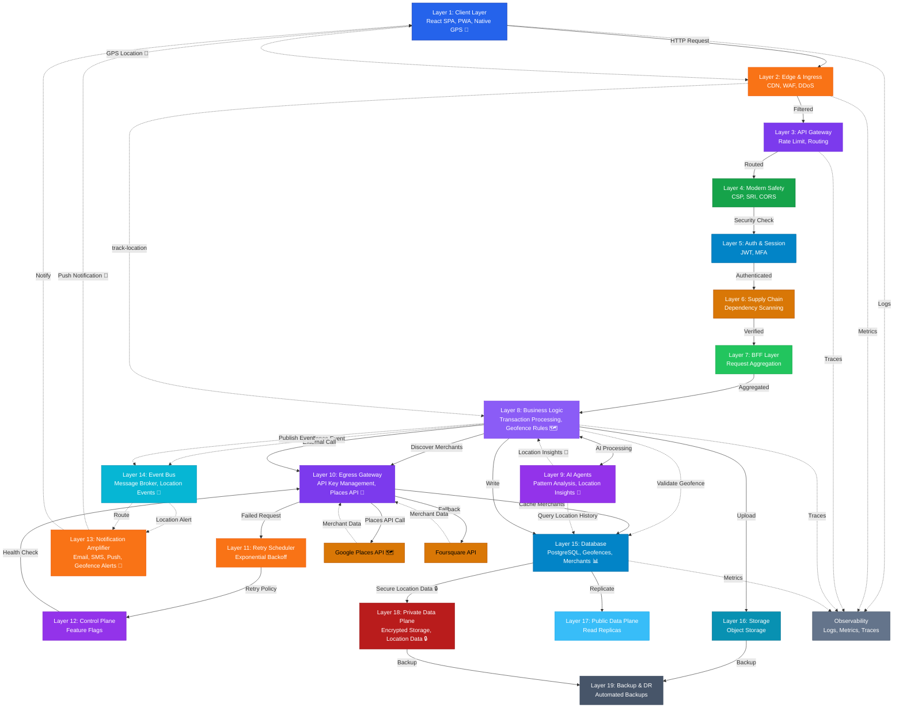
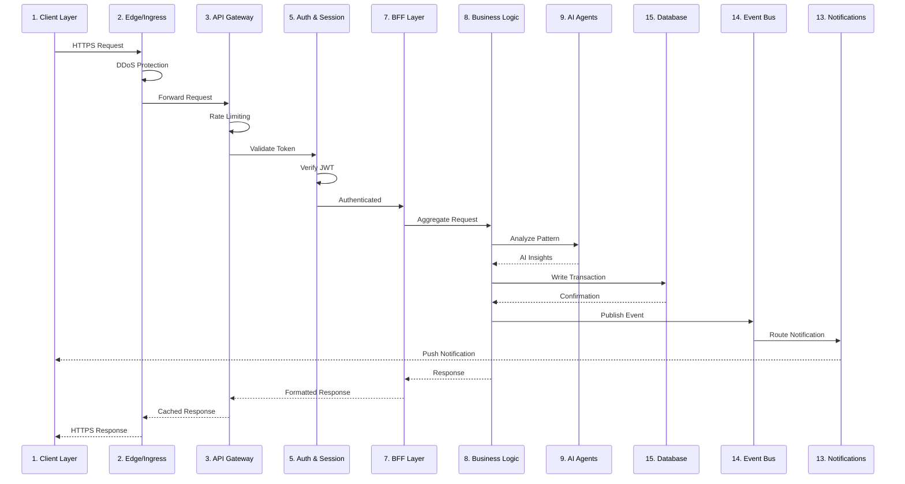
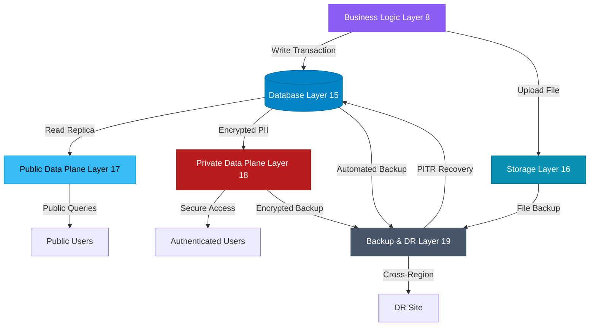
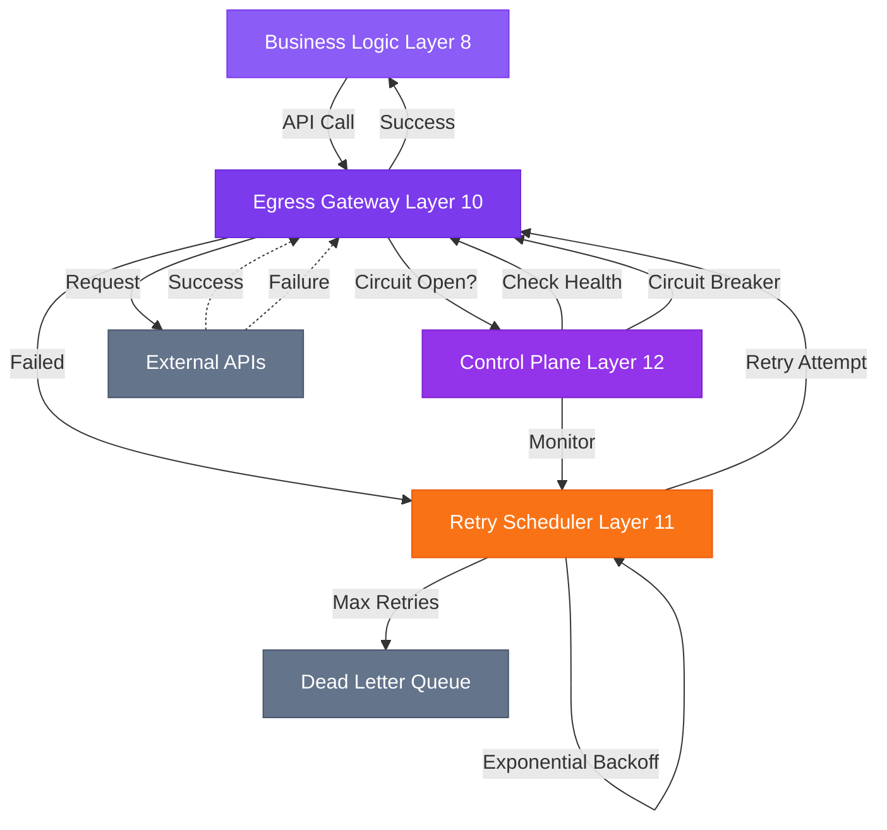
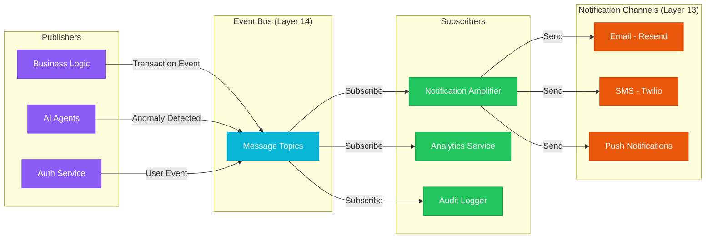
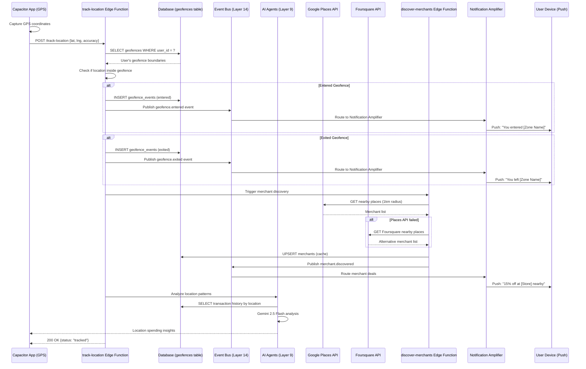
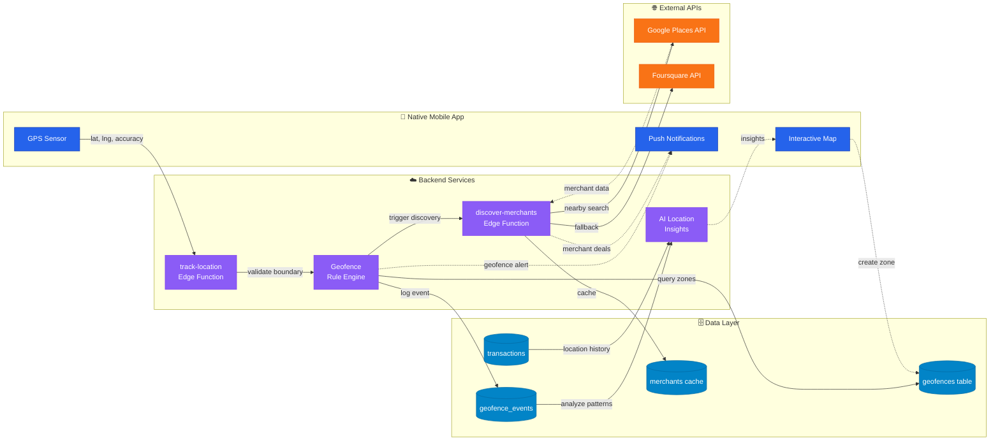
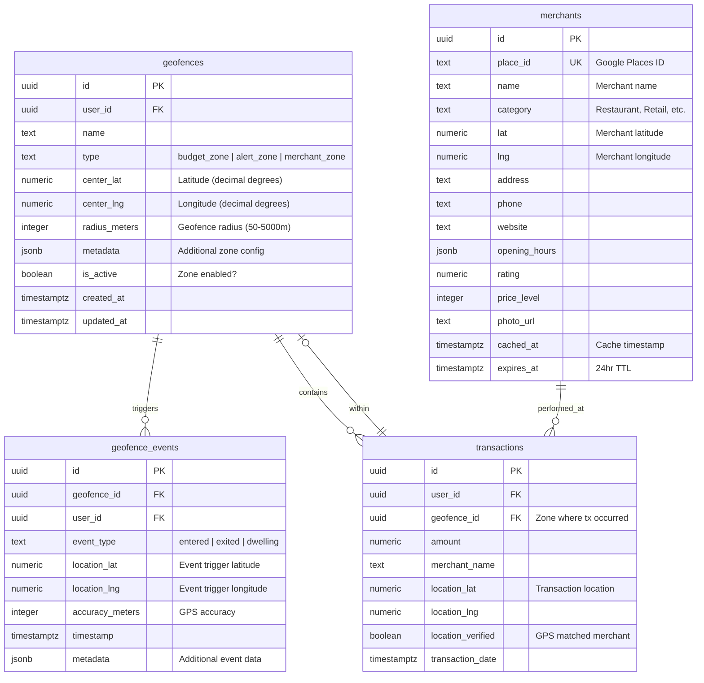

# TrueSpend Production Blueprint v4.0 – 19-Layer Architecture

**Version:** 4.0  
**Date:** 2025-11-07  
**Status:** Production-Ready  
**Source:** blueprint-v4.0.md

---

## Related Documents

- **[Implementation Timeline v4.0](./implementation-timeline-v4.0.md)** - 34-week phased implementation plan with Gantt chart
- **[Geofencing Implementation](./implementation-timeline-v4.0.md#phase-25-geofencing-foundation-weeks-8-10)** - Phase 2.5 & 5.5 details
- **[Dashboard Overview](/dashboard/overview)** - Interactive architecture visualization

---

## Architecture Overview

TrueSpend v4.0 implements a comprehensive 19-layer architecture following the **Client → Ingress → Services → Egress → Data → Observability** pattern. This design prioritizes security, scalability, reliability, and observability across all system components.

**New in v4.0:** Native mobile geofencing with location intelligence spanning 8 layers (L1, L8, L9, L10, L13, L14, L15, L18). See [Geofencing Subsystem Architecture](#dedicated-geofencing-subsystem-architecture) for details.

---

## Layer Specifications

### 🟦 Layer 1: Client Layer (#2563EB)
**Purpose:** User-facing interface  
**Components:**
- React SPA with TypeScript
- Capacitor Native App (iOS + Android)
- Progressive Web App (PWA) capabilities
- Client-side state management
- Offline-first architecture
- Native geolocation tracking
- Background location monitoring
- Interactive geofence map visualization

**Responsibilities:**
- User interaction handling
- Client-side validation
- Optimistic UI updates
- Session token management
- Native GPS tracking
- Geofence boundary visualization
- Real-time location updates
- Location permission management

---

### 🟧 Layer 2: Edge & Ingress (#f97316)
**Purpose:** Request routing and initial filtering  
**Components:**
- CDN (Content Delivery Network)
- WAF (Web Application Firewall)
- Edge Functions
- DDoS protection

**Responsibilities:**
- Global content distribution
- Attack prevention
- SSL/TLS termination
- Geographic routing

---

### 🟣 Layer 3: API Gateway (#7c3aed)
**Purpose:** Centralized API management  
**Components:**
- Request routing
- Rate limiting
- API versioning
- Request transformation

**Responsibilities:**
- Route validation
- Traffic shaping
- Protocol translation
- Load balancing

---

### 🟩 Layer 4: Modern Safety (CSP, SRI) (#16a34a)
**Purpose:** Client-side security enforcement  
**Components:**
- Content Security Policy (CSP)
- Subresource Integrity (SRI)
- CORS configuration
- Security headers

**Responsibilities:**
- XSS prevention
- Resource integrity verification
- Cross-origin policy enforcement
- Browser security configuration

---

### 🟦 Layer 5: Auth & Session (#0284c7)
**Purpose:** Identity and access management  
**Components:**
- Authentication service (Supabase Auth)
- JWT token management
- Session handling
- Multi-factor authentication

**Responsibilities:**
- User authentication
- Token generation/validation
- Session lifecycle management
- Permission verification

---

### 🟠 Layer 6: Supply Chain Security (#d97706)
**Purpose:** Third-party dependency security  
**Components:**
- Dependency scanning
- License compliance
- Vulnerability detection
- Package verification

**Responsibilities:**
- NPM package auditing
- Security patch management
- Dependency version control
- Supply chain attack prevention

---

### 🟢 Layer 7: BFF Layer (#22c55e)
**Purpose:** Backend For Frontend orchestration  
**Components:**
- Request aggregation
- Response transformation
- Client-specific APIs
- Data composition

**Responsibilities:**
- Multi-service orchestration
- Response optimization
- Client-specific logic
- Data filtering/shaping

---

### 🟪 Layer 8: Business Logic (#8b5cf6)
**Purpose:** Core application functionality  
**Components:**
- Transaction processing
- Budget management
- Spending analysis
- Rule engine
- Location-tagged transaction validator
- Merchant proximity verifier
- Budget zone enforcement engine
- Spending pattern analyzer (by location)

**Responsibilities:**
- Business rule execution
- Data validation
- Workflow orchestration
- State management
- Geofence rule execution
- Location-based fraud detection
- Spending zone validation
- Merchant location matching

---

### 🟣 Layer 9: AI Agents (#9333ea)
**Purpose:** Intelligent automation and insights  
**Components:**
- Spending pattern analysis
- Anomaly detection
- Predictive budgeting
- Natural language processing
- Location pattern analysis (Gemini 2.5 Flash)
- Predictive location spending model
- Merchant recommendation engine
- Anomaly detection (location-based)

**Responsibilities:**
- ML model inference
- Pattern recognition
- Intelligent recommendations
- Automated categorization
- Analyze spending patterns by geographic area
- Predict future spending locations
- Recommend budget adjustments based on location history
- Generate personalized location insights

---

### 🟪 Layer 10: Egress Gateway (#7c3aed)
**Purpose:** External API communication management  
**Components:**
- Outbound request routing
- API key management
- Circuit breakers
- Request pooling
- Google Places API integration
- Foursquare Places API integration
- Reverse geocoding service
- Map tile provider (Mapbox)

**Responsibilities:**
- External API calls
- Credential injection
- Failure isolation
- Traffic monitoring
- Places API key injection
- Rate limiting for location services
- Circuit breakers for geolocation API failures
- Merchant data enrichment

---

### 🟧 Layer 11: Retry Scheduler (#f97316)
**Purpose:** Resilient external communication  
**Components:**
- Exponential backoff
- Dead letter queue
- Priority queuing
- Retry policies

**Responsibilities:**
- Failed request retry
- Backpressure management
- Priority handling
- Failure tracking

---

### 🟪 Layer 12: Control Plane (#9333ea)
**Purpose:** System configuration and orchestration  
**Components:**
- Feature flags
- Configuration management
- Service discovery
- Health checks

**Responsibilities:**
- Dynamic configuration
- Service registry
- Health monitoring
- Feature toggling

---

### 🟠 Layer 13: Notification Amplifier (#ea580c)
**Purpose:** Multi-channel notification delivery  
**Components:**
- Email service (Resend)
- SMS service (Twilio)
- Push notifications
- In-app notifications
- Geofence entry/exit alerts
- Budget zone warnings
- Merchant discovery notifications

**Responsibilities:**
- Notification routing
- Template management
- Delivery tracking
- Preference management
- Real-time location-based alerts
- Budget zone notification routing
- Merchant deal notifications

---

### 🟦 Layer 14: Event Bus (#06b6d4)
**Purpose:** Asynchronous event distribution  
**Components:**
- Message broker
- Event streaming
- Topic management
- Subscription handling
- Geofence event types (`geofence.entered`, `geofence.exited`, `geofence.dwelling`)
- Location update events (`location.updated`)
- Merchant discovery events (`merchant.discovered`)

**Responsibilities:**
- Event publishing
- Message routing
- Async communication
- Event replay
- Location-based event routing
- Geofence event distribution

---

### 🟦 Layer 15: Database (#0284c7)
**Purpose:** Persistent data storage  
**Components:**
- PostgreSQL (Supabase)
- Connection pooling
- Query optimization
- Transaction management
- Geofence definitions table
- Geofence events table
- Merchants cache table
- Location-tagged transactions

**Responsibilities:**
- Data persistence
- ACID transactions
- Query execution
- Index management
- Geofence boundary storage
- Location event history
- Merchant data caching
- Spatial queries for location matching

---

### 🟩 Layer 16: Storage (#0891b2)
**Purpose:** File and object storage  
**Components:**
- Object storage (Supabase Storage)
- Receipt uploads
- Document storage
- Media handling
- Merchant photos bucket
- Geofence snapshots bucket

**Responsibilities:**
- File upload/download
- Access control
- Versioning
- CDN integration
- Cached merchant images
- User-uploaded zone photos

---

### 🟩 Layer 17: Public Data Plane (#38bdf8)
**Purpose:** Public-facing data services  
**Components:**
- Read replicas
- Caching layer
- Public APIs
- Anonymous access

**Responsibilities:**
- Public data serving
- Cache management
- Read scaling
- Anonymous queries

---

### 🟥 Layer 18: Private Data Plane (#b91c1c)
**Purpose:** Secure internal data services  
**Components:**
- Primary database
- Encrypted storage
- Audit logging
- Data masking
- Location data encryption
- Geohashing for approximate locations
- GDPR-compliant location export

**Responsibilities:**
- Sensitive data handling
- Encryption at rest
- Access logging
- PII protection
- Opt-in location tracking (default OFF)
- 30-day location retention policy
- Anonymization of historical location data
- Right to be forgotten for location data

---

### ⚙️ Layer 19: Backup & DR (#475569)
**Purpose:** Data protection and recovery  
**Components:**
- Automated backups
- Point-in-time recovery
- Disaster recovery
- Data archival

**Responsibilities:**
- Backup scheduling
- Recovery testing
- Data retention
- Archive management

---

### ⚫ Cross-Cutting: Observability (#64748b)
**Purpose:** System monitoring and debugging  
**Components:**
- Logging (structured logs)
- Metrics (performance data)
- Tracing (distributed traces)
- Alerting

**Responsibilities:**
- Log aggregation
- Metric collection
- Trace correlation
- Incident alerting

---

## Visual Architecture Diagrams

### Complete 19-Layer Flow Diagram



### Layer Groupings Visualization

```mermaid
graph LR
    subgraph CI["Client & Ingress"]
        L1["1. Client Layer"]
        L2["2. Edge & Ingress"]
        L3["3. API Gateway"]
    end
    
    subgraph SA["Security & Auth"]
        L4["4. Modern Safety"]
        L5["5. Auth & Session"]
        L6["6. Supply Chain"]
    end
    
    subgraph SV["Services"]
        L7["7. BFF Layer"]
        L8["8. Business Logic"]
        L9["9. AI Agents"]
    end
    
    subgraph EC["External Communication"]
        L10["10. Egress Gateway"]
        L11["11. Retry Scheduler"]
        L12["12. Control Plane"]
    end
    
    subgraph MN["Messaging & Notifications"]
        L13["13. Notification Amplifier"]
        L14["14. Event Bus"]
    end
    
    subgraph DS["Data & Storage"]
        L15["15. Database"]
        L16["16. Storage"]
        L17["17. Public Data Plane"]
        L18["18. Private Data Plane"]
        L19["19. Backup & DR"]
    end
    
    CI --> SA --> SV --> EC
    SV --> MN
    SV --> DS
    EC --> SV
    MN --> CI
    
    classDef group1 fill:#2563EB,stroke:#1e40af,color:#fff
    classDef group2 fill:#16a34a,stroke:#15803d,color:#fff
    classDef group3 fill:#8b5cf6,stroke:#7c3aed,color:#fff
    classDef group4 fill:#f97316,stroke:#ea580c,color:#fff
    classDef group5 fill:#06b6d4,stroke:#0891b2,color:#fff
    classDef group6 fill:#0284c7,stroke:#0369a1,color:#fff
    
    class CI,L1,L2,L3 group1
    class SA,L4,L5,L6 group2
    class SV,L7,L8,L9 group3
    class EC,L10,L11,L12 group4
    class MN,L13,L14 group5
    class DS,L15,L16,L17,L18,L19 group6
```



### Request Flow Sequence Diagram



### Data Persistence Flow



### Resilience & Retry Pattern



### Event-Driven Architecture



### Geofencing Location Tracking Flow



---

## Dedicated Geofencing Subsystem Architecture

### Component Overview

The geofencing subsystem is a cross-layer feature that integrates native mobile location tracking with backend intelligence and AI-powered insights. It spans 8 layers of the 19-layer architecture.

**Layer Distribution:**
- **Layer 1 (Client):** Native GPS tracking, permission management, map visualization
- **Layer 8 (Business Logic):** Geofence rule engine, boundary validation, spending zone enforcement
- **Layer 9 (AI Agents):** Location pattern analysis, predictive spending, merchant recommendations
- **Layer 10 (Egress):** Google Places API, Foursquare API integration, reverse geocoding
- **Layer 13 (Notifications):** Geofence entry/exit alerts, merchant discovery notifications
- **Layer 14 (Event Bus):** Location event routing (`geofence.entered`, `geofence.exited`, `merchant.discovered`)
- **Layer 15 (Database):** Geofence boundaries, event history, merchant cache, location-tagged transactions
- **Layer 18 (Private Data):** Encrypted location storage, 30-day retention policy, GDPR compliance

### Simplified Geofencing Data Flow



### Database Schema: Geofencing Tables



### Security & Privacy Considerations

**Privacy-First Design:**
1. **Opt-In Tracking:** Location tracking is **default OFF**. Users must explicitly enable.
2. **Granular Permissions:** Users can enable/disable specific geofences.
3. **Data Minimization:** Only store location data when inside geofences (not continuous tracking).
4. **30-Day Retention:** Location data automatically deleted after 30 days.
5. **Encryption at Rest:** All location data encrypted using AES-256 in Layer 18 (Private Data Plane).
6. **Right to be Forgotten:** Users can delete all location history instantly.

**GDPR Compliance:**
```sql
-- Example: Export user location data (GDPR Article 20)
SELECT 
  ge.event_type,
  ge.timestamp,
  gf.name as zone_name,
  ge.location_lat,
  ge.location_lng
FROM geofence_events ge
JOIN geofences gf ON ge.geofence_id = gf.id
WHERE ge.user_id = ?
ORDER BY ge.timestamp DESC;

-- Example: Right to be forgotten (GDPR Article 17)
DELETE FROM geofence_events WHERE user_id = ?;
DELETE FROM geofences WHERE user_id = ?;
UPDATE transactions SET location_lat = NULL, location_lng = NULL WHERE user_id = ?;
```

**Security Measures:**
- Row Level Security (RLS) on all geofence tables
- Location data never exposed to client without authentication
- Rate limiting on Places API to prevent abuse
- Circuit breakers prevent cascading failures
- Geohashing for approximate locations in analytics

### Performance Optimizations

**1. Geospatial Indexing:**
```sql
-- PostGIS extension for spatial queries
CREATE EXTENSION IF NOT EXISTS postgis;

-- Spatial index on geofence centers
CREATE INDEX idx_geofences_location 
ON geofences USING GIST (
  ST_MakePoint(center_lng, center_lat)::geography
);

-- Spatial index on merchant locations
CREATE INDEX idx_merchants_location 
ON merchants USING GIST (
  ST_MakePoint(lng, lat)::geography
);
```

**2. Battery Optimization (Mobile):**
- **Significant Location Change:** Only track when user moves >100m
- **Background Throttling:** Reduce frequency when app in background (every 5 minutes)
- **Geofence Monitoring:** Use native OS geofencing (iOS: CLLocationManager, Android: Geofencing API)
- **Batch Location Updates:** Queue multiple location events and send in batches

**3. Merchant Data Caching:**
- 24-hour TTL (Time To Live) for merchant data
- Local caching in Capacitor Storage API
- Stale-while-revalidate pattern
- Reduce Places API calls by 80%

**4. Location Event Batching:**
```typescript
// Example: Batch location events to reduce database writes
const locationQueue: LocationEvent[] = [];

function queueLocationEvent(event: LocationEvent) {
  locationQueue.push(event);
  
  if (locationQueue.length >= 10) {
    flushLocationQueue();
  }
}

async function flushLocationQueue() {
  await supabase.from('geofence_events').insert(locationQueue);
  locationQueue.length = 0;
}
```

### API Endpoints

**Geofence Management:**
```
POST   /geofences                 - Create budget zone
GET    /geofences                 - List user's geofences
GET    /geofences/:id             - Get geofence details
PATCH  /geofences/:id             - Update geofence (radius, name)
DELETE /geofences/:id             - Delete geofence
GET    /geofences/:id/events      - Fetch geofence event history
GET    /geofences/:id/stats       - Get spending stats for zone
```

**Location Tracking:**
```
POST   /track-location            - Submit GPS coordinates
POST   /location/validate         - Check if location inside geofence
GET    /location/history          - Get user's location history (30 days)
DELETE /location/history          - Delete all location data (GDPR)
```

**Merchant Discovery:**
```
GET    /merchants/nearby          - Discover merchants (radius search)
GET    /merchants/:place_id       - Get cached merchant details
POST   /merchants/:place_id/save  - Save favorite merchant
GET    /merchants/categories      - List merchant categories
```

**AI Location Insights:**
```
GET    /insights/location-patterns     - Spending patterns by location
GET    /insights/location-heatmap      - Heatmap data (lat, lng, amount)
GET    /insights/merchant-recommendations - Personalized merchant suggestions
POST   /insights/analyze-location      - Trigger AI analysis for specific location
```

### Implementation Reference

**Related Documentation:**
- [Implementation Timeline v4.0](./implementation-timeline-v4.0.md) - Phases 2.5 & 5.5 implementation details
- [Phase 2.5: Geofencing Foundation](./implementation-timeline-v4.0.md#phase-25-geofencing-foundation-weeks-8-10) - Weeks 8-10
- [Phase 5.5: Location Intelligence](./implementation-timeline-v4.0.md#phase-55-location-intelligence-weeks-23-25) - Weeks 23-25

**Edge Functions:**
- `supabase/functions/track-location/index.ts` - GPS tracking and geofence validation
- `supabase/functions/discover-merchants/index.ts` - Google Places API integration
- `supabase/functions/ai-location-insights/index.ts` - AI-powered location analysis

**Database Migrations:**
- Migration: `20251108032448_geofencing_foundation.sql` - Creates geofence tables with RLS policies

---

## Data Flow Patterns

### Main Flow (Synchronous)
```
Client Layer 
  ↓
Edge & Ingress (CDN/WAF)
  ↓
API Gateway
  ↓
Modern Safety (CSP/SRI)
  ↓
Auth & Session
  ↓
Supply Chain Security
  ↓
BFF Layer
  ↓
Business Logic + AI Agents
  ↓
Egress Gateway
  ↓
External APIs (Plaid, Stripe, OpenAI)
```

### Data Flow (Persistence)
```
Business Logic
  ↓
Database (PostgreSQL)
  ↓
├─→ Public Data Plane (read replicas)
├─→ Private Data Plane (encrypted)
└─→ Storage (object storage)
  ↓
Backup & DR
```

### Feedback & Resilience (Circuit)
```
Egress Gateway
  ↓
Retry Scheduler (exponential backoff)
  ↓
Control Plane (health checks)
  ↓
Observability (metrics/logs)
```

### Notification Path (Asynchronous)
```
Event Bus
  ↓
Notification Amplifier
  ↓
├─→ Email (Resend)
├─→ SMS (Twilio)
└─→ Push Notifications
  ↓
Client Layer
```

---

## Flow Legend

- **Solid arrows (→):** Synchronous request/response
- **Curved lines (⤿):** Asynchronous/event-driven
- **Dashed lines (⇢):** Monitoring/observability
- **Double arrows (⇄):** Bidirectional data flow
- **Green dashed lines (📍):** Geofencing location flows
- **📍 Icon:** GPS/location tracking components
- **🗺️ Icon:** Location intelligence features
- **🔔 Icon:** Location-based notifications
- **🔒 Icon:** Encrypted location data

---

## Layer Groupings

### 1. Client & Ingress
- Client Layer
- Edge & Ingress
- API Gateway

### 2. Security & Auth
- Modern Safety (CSP/SRI)
- Auth & Session
- Supply Chain Security

### 3. Services
- BFF Layer
- Business Logic
- AI Agents

### 4. External Communication
- Egress Gateway
- Retry Scheduler
- Control Plane

### 5. Messaging & Notifications
- Event Bus
- Notification Amplifier

### 6. Data & Storage
- Database
- Storage
- Public Data Plane
- Private Data Plane
- Backup & DR

### 7. Cross-Cutting Concerns
- Observability (spans all layers)

---

## Visual Architecture Notes

### Color Palette
- **Blue family (#2563EB, #0284c7, #06b6d4, #38bdf8):** Client, Auth, Database, Event Bus
- **Purple family (#7c3aed, #8b5cf6, #9333ea):** API Gateway, Business Logic, AI, Control Plane
- **Orange family (#f97316, #d97706, #ea580c):** Edge/Ingress, Supply Chain, Notifications
- **Green family (#16a34a, #22c55e, #0891b2, #38bdf8):** Safety, BFF, Storage, Public Data
- **Red (#b91c1c):** Private Data Plane
- **Gray family (#475569, #64748b):** Backup/DR, Observability

### Layout Recommendations
- **Horizontal flow:** Left-to-right progression showing request lifecycle
- **Vertical grouping:** Stack related services in visual blocks
- **Isometric view:** Use 3D perspective for depth and hierarchy
- **Background:** Warm White (#F8FAFC) for clean, modern aesthetic

---

## Technology Stack

### Frontend
- React 18 + TypeScript
- Vite build system
- Tailwind CSS
- React Query (TanStack)
- React Router v6

### Mobile Native
- Capacitor 6.x (iOS + Android)
- @capacitor/geolocation
- @capacitor-community/background-geolocation
- @capacitor/push-notifications
- @capacitor/local-notifications

### Backend (Lovable Cloud)
- Supabase (PostgreSQL + Auth + Storage)
- Edge Functions (Deno runtime)
- Row Level Security (RLS)
- Realtime subscriptions

### External Services
- **Banking:** Plaid
- **Payments:** Stripe
- **AI:** Lovable AI Gateway (Google Gemini, OpenAI GPT)
- **Email:** Resend
- **SMS:** Twilio
- **Location Services:** Google Places API, Foursquare Places API
- **Mapping:** Mapbox
- **Analytics:** Custom observability stack

### Location Libraries
- react-map-gl (Mapbox React wrapper)
- @turf/turf (geospatial calculations)
- geolib (distance/bearing calculations)

### Security
- JWT-based authentication
- RLS policies on all tables
- CSP headers
- SRI for static assets
- HTTPS everywhere
- API key rotation
- Dependency scanning

---

## Deployment Architecture

### Hosting
- Frontend: Lovable Cloud (global CDN)
- Backend: Lovable Cloud Edge Functions
- Database: Supabase (managed PostgreSQL)

### Regions
- Primary: US-East
- DR: US-West
- CDN: Global edge locations

### Scaling Strategy
- Horizontal: Edge functions auto-scale
- Vertical: Database instance sizing
- Read replicas: Public data plane
- Caching: Multi-layer (CDN, app, database)

---

## Security Considerations

### Layer-Specific Security

**Client Layer:**
- CSP enforcement
- XSS prevention
- Input sanitization
- Secure token storage

**Ingress Layer:**
- WAF rules
- Rate limiting
- DDoS mitigation
- Bot protection

**Auth Layer:**
- MFA support
- Session management
- Token rotation
- Password policies

**Data Layer:**
- Encryption at rest
- Encryption in transit
- RLS policies
- Audit logging

**Egress Layer:**
- API key management
- Secret rotation
- Request signing
- Certificate pinning

---

## Monitoring & Observability

### Metrics
- Request latency (p50, p95, p99)
- Error rates by service
- Database query performance
- Cache hit rates
- External API latency

### Logs
- Structured JSON logs
- Request/response correlation IDs
- Error stack traces
- Audit trails

### Traces
- Distributed tracing
- Service dependency mapping
- Performance bottleneck identification
- Request flow visualization

### Alerts
- Error rate thresholds
- Latency degradation
- Resource exhaustion
- Security events

---

## Performance Targets

- **Page Load:** < 2s (First Contentful Paint)
- **API Response:** < 200ms (p95)
- **Database Query:** < 50ms (p95)
- **External API:** < 1s (with retry)
- **Cache Hit Rate:** > 80%
- **Availability:** 99.9% uptime

---

## Disaster Recovery

### Backup Strategy
- **Frequency:** Hourly incremental, daily full
- **Retention:** 30 days point-in-time recovery
- **Testing:** Monthly DR drills
- **RTO:** < 1 hour
- **RPO:** < 5 minutes

### Failure Scenarios
- Database failure → Automatic failover to replica
- Region failure → Traffic routing to DR region
- Service degradation → Circuit breaker activation
- Data corruption → Point-in-time restore

---

## Future Enhancements (v5.0)

1. **Multi-region active-active:** Global read/write distribution
2. **GraphQL Federation:** Unified API layer across services
3. **Event Sourcing:** Complete audit trail and replay capability
4. **ML Pipeline:** Dedicated layer for model training and serving
5. ~~**Mobile Native:** iOS/Android native applications~~ (✅ Implemented in v4.0 with geofencing)
6. **Advanced Geofencing:** Multi-zone budgets, time-based zones, AR merchant discovery
7. **Blockchain Integration:** Immutable transaction ledger
8. **Advanced Analytics:** Real-time OLAP queries

---

## Conclusion

Blueprint v4.0 represents a production-ready, enterprise-grade architecture that balances security, performance, scalability, and maintainability. The 19-layer design provides clear separation of concerns while enabling seamless integration between components.

**Key Strengths:**
- ✅ Comprehensive security at every layer
- ✅ Built-in resilience and fault tolerance
- ✅ Observable and debuggable
- ✅ Scalable architecture
- ✅ Modern best practices

---

**Document Version:** 4.0 (with Geofencing)  
**Last Updated:** 2025-11-08  
**Maintained By:** TrueSpend Architecture Team  
**Review Cycle:** Quarterly  
**Related Documents:** [Implementation Timeline v4.0](./implementation-timeline-v4.0.md)
