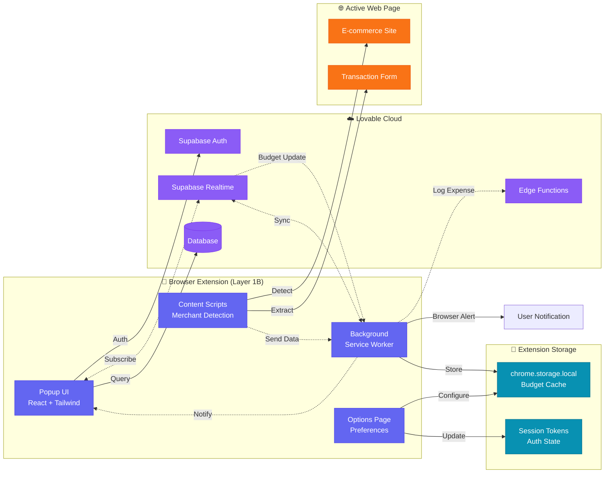
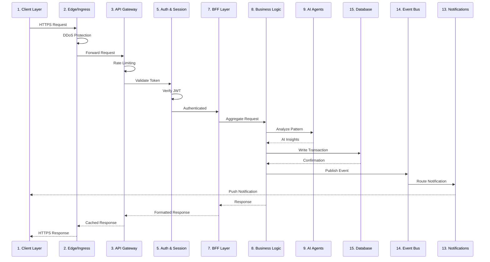
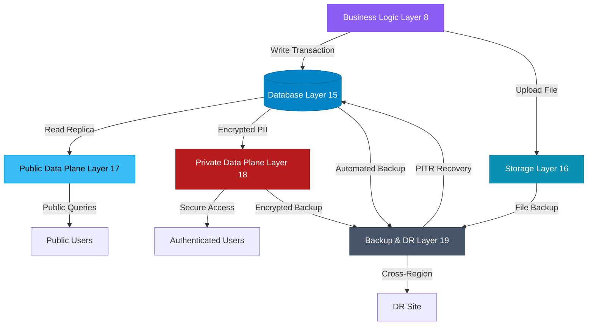
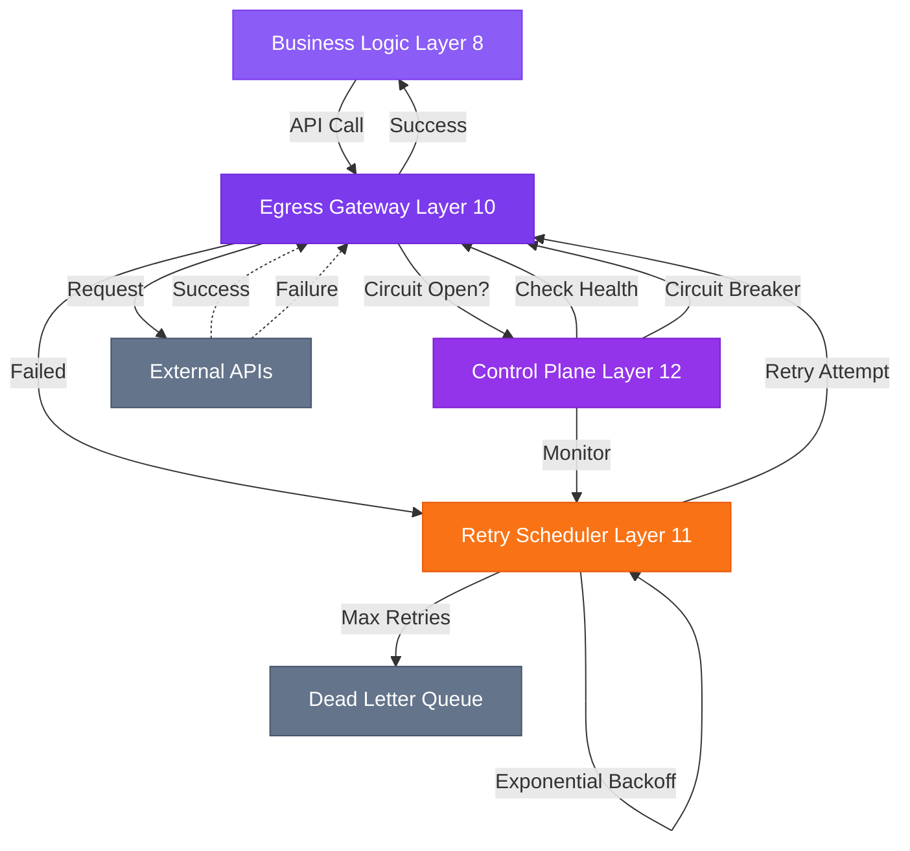
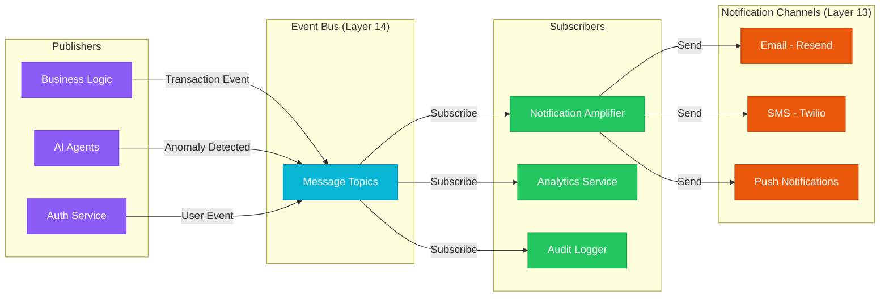
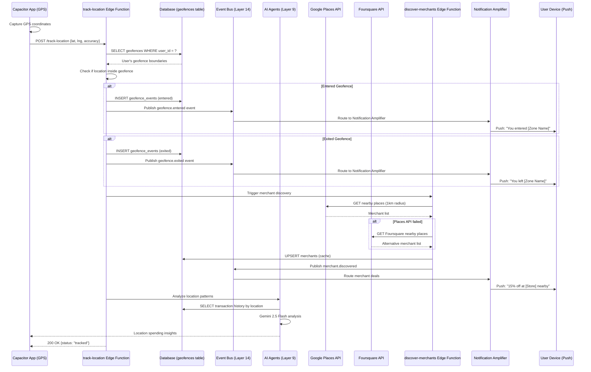
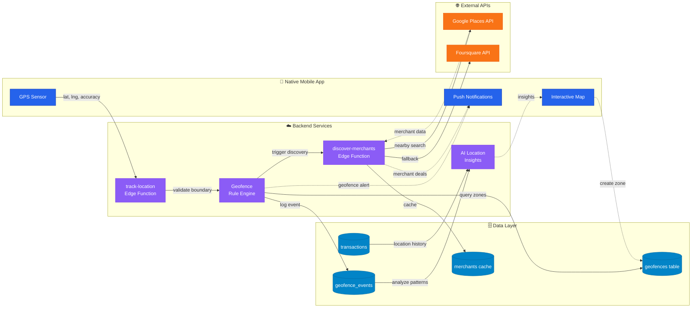
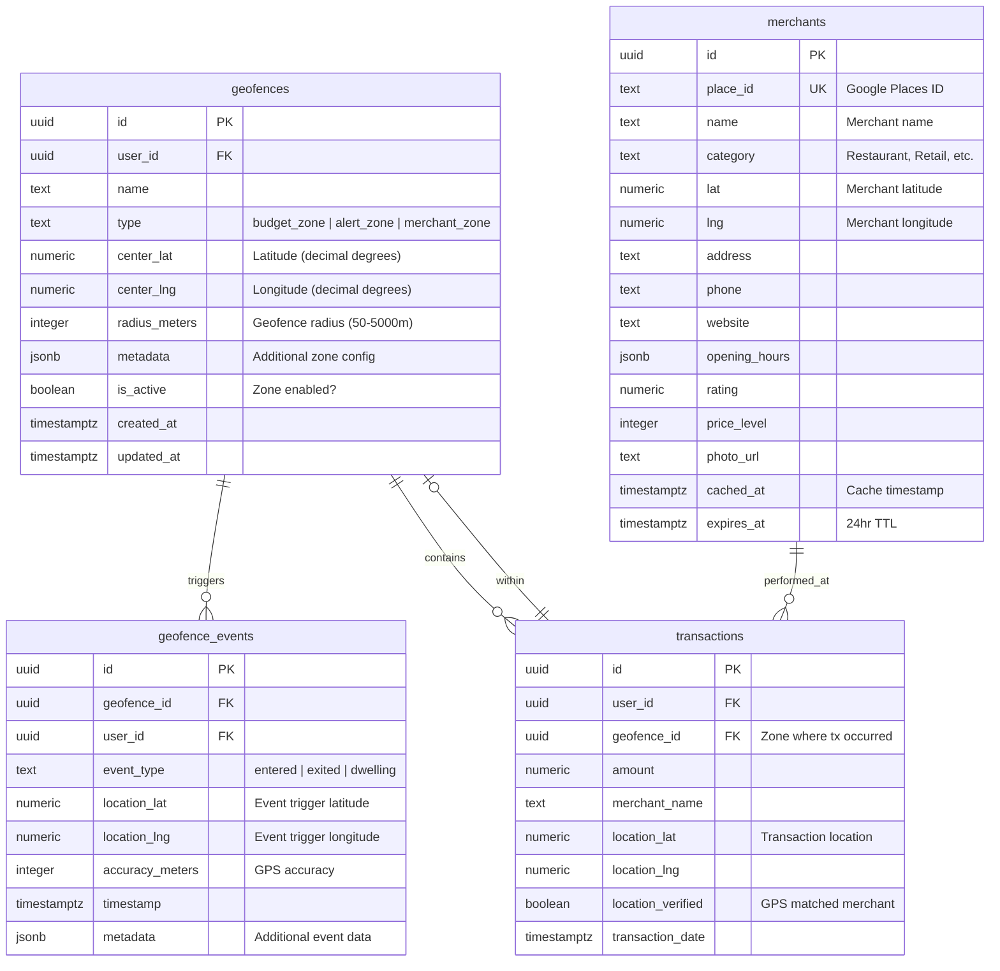
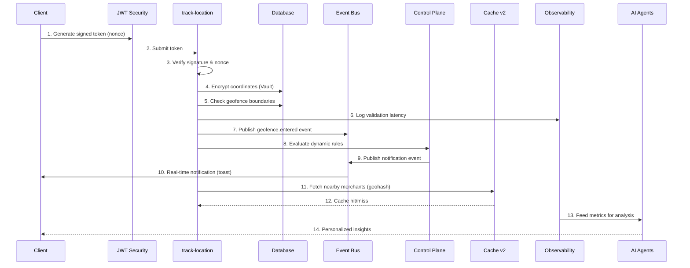

# TrueSpend Production Blueprint v4.0 – 19-Layer Architecture

**Version:** 4.0  
**Date:** 2025-11-07  
**Status:** Production-Ready  
**Source:** blueprint-v4.0.md

---

## Related Documents

- **[Implementation Timeline v4.0](./implementation-timeline-v4.0.md)** - 37-week phased implementation plan with Gantt chart
- **[Geofencing Implementation](./implementation-timeline-v4.0.md#phase-25-geofencing-foundation-weeks-8-10)** - Phase 2.5 & 5.5 details
- **[Dashboard Overview](/dashboard/overview)** - Interactive architecture visualization

---

## Architecture Overview

TrueSpend v4.0 implements a comprehensive 19-layer architecture following the **Client → Ingress → Services → Egress → Data → Observability** pattern. This design prioritizes security, scalability, reliability, and observability across all system components.

**New in v4.0:** 
- Native mobile geofencing with location intelligence spanning 8 layers (L1A, L8, L9, L10, L13, L14, L15, L18)
- Browser extension companion (L1B) for lightweight budget tracking and merchant insights
- See [Geofencing Subsystem Architecture](#dedicated-geofencing-subsystem-architecture) and [Browser Extension Architecture](#browser-extension-companion-architecture) for details.

---

## Layer Specifications

### 🟦 Layer 1: Client Layer (#2563EB)
**Purpose:** User-facing interface across multiple platforms  

#### Layer 1A: Web & Mobile Client
**Components:**
- React SPA with TypeScript
- Capacitor Native App (iOS + Android)
- Progressive Web App (PWA) capabilities
- Client-side state management
- Offline-first architecture
- Native geolocation tracking
- Background location monitoring
- Interactive geofence map visualization

**Responsibilities:**
- User interaction handling
- Client-side validation
- Optimistic UI updates
- Session token management
- Native GPS tracking
- Geofence boundary visualization
- Real-time location updates
- Location permission management

#### Layer 1B: Browser Extension Client 🔌
**Components:**
- Chrome/Firefox/Safari extension
- Popup UI (React + Tailwind)
- Background service worker
- Content scripts (merchant detection)
- Options page for preferences

**Responsibilities:**
- Quick budget checks
- Real-time spending alerts
- Merchant price tracking
- Quick expense logging
- Transaction hints overlay
- Session sync with main app

**Limitations:**
- ❌ No native geofencing (no GPS/background location)
- ❌ No offline-first capabilities
- ❌ No Capacitor native APIs
- ✅ Supabase Auth, Realtime, Database
- ✅ AI insights and notifications
- ✅ Merchant detection via content scripts

---

### 🟧 Layer 2: Edge & Ingress (#f97316)
**Purpose:** Request routing and initial filtering  
**Components:**
- CDN (Content Delivery Network)
- WAF (Web Application Firewall)
- Edge Functions
- DDoS protection
- **Extension CORS Whitelisting** ✅ (`chrome-extension://`, `moz-extension://`, `safari-web-extension://`)

**Responsibilities:**
- Global content distribution
- Attack prevention
- SSL/TLS termination
- Geographic routing
- **Browser extension origin validation** ✅

---

### 🟣 Layer 3: API Gateway (#7c3aed)
**Purpose:** Centralized API management  
**Components:**
- Request routing
- Rate limiting
- API versioning
- Request transformation
- **Bearer Token Authentication** ✅ (CSRF-safe for extensions)

**Responsibilities:**
- Route validation
- Traffic shaping
- Protocol translation
- Load balancing
- **Extension Bearer token validation** ✅

---

### 🟩 Layer 4: Modern Safety (CSP, SRI) (#16a34a)
**Purpose:** Client-side security enforcement  
**Components:**
- Content Security Policy (CSP)
- Subresource Integrity (SRI)
- CORS configuration
- Security headers

**Responsibilities:**
- XSS prevention
- Resource integrity verification
- Cross-origin policy enforcement
- Browser security configuration

---

### 🟦 Layer 5: Auth & Session (#0284c7)
**Purpose:** Identity and access management  
**Components:**
- Authentication service (Supabase Auth)
- JWT token management
- Session handling
- Multi-factor authentication
- **Extension OAuth Flow** ✅ (`chrome.identity.launchWebAuthFlow()`)

**Responsibilities:**
- User authentication
- Token generation/validation
- Session lifecycle management
- Permission verification
- **Extension token refresh & storage** ✅

---

### 🟠 Layer 6: Supply Chain Security (#d97706)
**Purpose:** Third-party dependency security  
**Components:**
- Dependency scanning
- License compliance
- Vulnerability detection
- Package verification

**Responsibilities:**
- NPM package auditing
- Security patch management
- Dependency version control
- Supply chain attack prevention

---

### 🟢 Layer 7: BFF Layer (#22c55e)
**Purpose:** Backend For Frontend orchestration  
**Components:**
- Request aggregation
- Response transformation
- Client-specific APIs
- Data composition
- **Realtime Feedback Emitter** ✅ (Edge → Realtime event after DB write)

**Responsibilities:**
- Multi-service orchestration
- Response optimization
- Client-specific logic
- Data filtering/shaping
- **Emit realtime events post-mutation** ✅ (`budget.updated`, `transaction.created`)

---

### 🟪 Layer 8: Business Logic (#8b5cf6)
**Purpose:** Core application functionality  
**Components:**
- Transaction processing
- Budget management
- Spending analysis
- Rule engine
- Location-tagged transaction validator
- Merchant proximity verifier
- Budget zone enforcement engine
- Spending pattern analyzer (by location)

**Responsibilities:**
- Business rule execution
- Data validation
- Workflow orchestration
- State management
- Geofence rule execution
- Location-based fraud detection
- Spending zone validation
- Merchant location matching

---

### 🟣 Layer 9: AI Agents (#9333ea)
**Purpose:** Intelligent automation and insights  
**Components:**
- Spending pattern analysis
- Anomaly detection
- Predictive budgeting
- Natural language processing
- Location pattern analysis (Gemini 2.5 Flash)
- Predictive location spending model
- Merchant recommendation engine
- Anomaly detection (location-based)

**Responsibilities:**
- ML model inference
- Pattern recognition
- Intelligent recommendations
- Automated categorization
- Analyze spending patterns by geographic area
- Predict future spending locations
- Recommend budget adjustments based on location history
- Generate personalized location insights

---

### 🟪 Layer 10: Egress Gateway & Cache v2 (#7c3aed)
**Purpose:** External API communication with intelligent caching  
**Components:**
- Outbound request routing
- API key management
- Circuit breakers
- Request pooling
- Google Places API integration
- Foursquare Places API integration
- Reverse geocoding service
- Map tile provider (Mapbox)
- **`merchants_cache_v2` with geohash indexing**
- TTL management system (24hr default, configurable)
- Cache versioning for invalidation

**Responsibilities:**
- External API calls
- Credential injection
- Failure isolation
- Traffic monitoring
- Places API key injection
- Rate limiting for location services
- Circuit breakers for geolocation API failures
- Merchant data enrichment
- **Geohash-based location clustering** (precision 7 = ~150m)
- **LRU eviction policy** (max 10MB cache size)
- **85%+ cache hit rate target**

---

### 🟧 Layer 11: Retry Scheduler (#f97316)
**Purpose:** Resilient external communication  
**Components:**
- Exponential backoff
- Dead letter queue
- Priority queuing
- Retry policies

**Responsibilities:**
- Failed request retry
- Backpressure management
- Priority handling
- Failure tracking

---

### 🟪 Layer 12: Control Plane & Dynamic Rules (#9333ea)
**Purpose:** System configuration and dynamic rule management  
**Components:**
- Feature flags
- Configuration management
- Service discovery
- Health checks
- **`geofence_rules` table for real-time zone updates**
- Dynamic rule evaluation engine (no redeployment needed)
- A/B testing framework for geofencing algorithms
- **Extension Feature Flags** ✅ (`/control/flags` endpoint, 15min refresh)

**Responsibilities:**
- Dynamic configuration
- Service registry
- Health monitoring
- Feature toggling
- **Real-time geofence rule updates** (add merchant zones without code deploy)
- Control plane for dynamic zone configuration
- **Extension kill switches & A/B testing** ✅ (gradual rollout, per-user targeting)

---

### 🟠 Layer 13: Notification Amplifier (#ea580c)
**Purpose:** Multi-channel notification delivery  
**Components:**
- Email service (Resend)
- SMS service (Twilio)
- Push notifications
- In-app notifications
- Geofence entry/exit alerts
- Budget zone warnings
- Merchant discovery notifications

**Responsibilities:**
- Notification routing
- Template management
- Delivery tracking
- Preference management
- Real-time location-based alerts
- Budget zone notification routing
- Merchant deal notifications

---

### 🟦 Layer 14: Event Bus & Queue (Enterprise) (#06b6d4)
**Purpose:** Fault-tolerant asynchronous event distribution  
**Components:**
- Supabase Realtime (pub/sub channels)
- `event_log` table (persistent queue)
- Database triggers for automatic event capture
- At-least-once delivery guarantees
- Geofence event types (`geofence.entered`, `geofence.exited`, `geofence.dwelling`)
- Location update events (`location.updated`)
- Merchant discovery events (`merchant.discovered`)
- **User-Scoped Realtime Filtering** ✅ (server-side `filter=user_id=eq.{id}`)

**Responsibilities:**
- Event publishing with persistence
- Message routing and queuing
- Async communication with retry
- Event replay capability
- Location-based event routing
- Geofence event distribution
- **Fault tolerance:** Prevents event loss during AI module downtime/scaling
- **Realtime feedback loop** ✅ (Edge functions emit events post-DB write)

---

### 🟦 Layer 15: Database (#0284c7)
**Purpose:** Persistent data storage  
**Components:**
- PostgreSQL (Supabase)
- Connection pooling
- Query optimization
- Transaction management
- Geofence definitions table
- Geofence events table
- Merchants cache table
- Location-tagged transactions

**Responsibilities:**
- Data persistence
- ACID transactions
- Query execution
- Index management
- Geofence boundary storage
- Location event history
- Merchant data caching
- Spatial queries for location matching

---

### 🟩 Layer 16: Storage (#0891b2)
**Purpose:** File and object storage  
**Components:**
- Object storage (Supabase Storage)
- Receipt uploads
- Document storage
- Media handling
- Merchant photos bucket
- Geofence snapshots bucket

**Responsibilities:**
- File upload/download
- Access control
- Versioning
- CDN integration
- Cached merchant images
- User-uploaded zone photos

---

### 🟩 Layer 17: Public Data Plane (#38bdf8)
**Purpose:** Public-facing data services  
**Components:**
- Read replicas
- Caching layer
- Public APIs
- Anonymous access

**Responsibilities:**
- Public data serving
- Cache management
- Read scaling
- Anonymous queries

---

### 🟥 Layer 18: Private Data Plane (#b91c1c)
**Purpose:** Secure internal data services  
**Components:**
- Primary database
- Encrypted storage
- Audit logging
- Data masking
- Location data encryption
- Geohashing for approximate locations
- GDPR-compliant location export

**Responsibilities:**
- Sensitive data handling
- Encryption at rest
- Access logging
- PII protection
- Opt-in location tracking (default OFF)
- 30-day location retention policy
- Anonymization of historical location data
- Right to be forgotten for location data

---

### ⚙️ Layer 19: Backup & DR (#475569)
**Purpose:** Data protection and recovery  
**Components:**
- Automated backups
- Point-in-time recovery
- Disaster recovery
- Data archival

**Responsibilities:**
- Backup scheduling
- Recovery testing
- Data retention
- Archive management

---

### ⚫ Cross-Cutting: Observability & Telemetry (#64748b)
**Purpose:** System monitoring, debugging, and geofencing analytics  
**Components:**
- Logging (structured logs in JSON)
- Metrics (performance data)
- Tracing (distributed traces)
- Alerting (Slack/email)
- **`geofence_metrics` table for telemetry**
- **Geofencing-specific metrics dashboard**
- **Extension Telemetry** ✅ (15min batch flush to `geofence_metrics`)

**Responsibilities:**
- Log aggregation across all layers
- Metric collection (P95, P99 latencies)
- Trace correlation
- Incident alerting
- **Geofencing telemetry:**
  - Geo triggers per user per day
  - Average geofence validation latency
  - Push notification success rate
  - Battery drain metrics (mobile)
  - False positive rate tracking
- **AI Model Training Feedback:** Metrics feed back to Layer 9 for noise reduction
- **Extension-specific metrics** ✅:
  - `popup_opened`, `merchant_detected`, `expense_logged`, `budget_alert_shown`
  - Extension error tracking
  - Usage analytics for A/B testing

---

## Browser Extension Companion Architecture

### Overview

The TrueSpend browser extension provides lightweight budget tracking and merchant insights directly in the browser, complementing the web and mobile applications. Built on Chrome Manifest V3 with React + Tailwind, it enables real-time spending alerts, quick expense logging, and merchant detection on e-commerce sites.

**Key Capabilities:**
- ✅ Supabase Authentication (OAuth flow)
- ✅ Real-time budget sync via Supabase Realtime
- ✅ Merchant detection with content scripts
- ✅ AI-powered spending insights
- ✅ Browser notifications for budget alerts
- ❌ No geofencing (no GPS/background location)
- ❌ No offline-first (requires network)

### Extension Architecture Diagram
<details>
  <summary>Open diagram</summary>


</details>

### Component Breakdown

#### 1. Popup UI (React Entry Point)
**File:** `extension/popup/index.tsx`

```typescript
// Reuses components from src/components/
import { BudgetCard } from '@/components/budget/BudgetCard';
import { TransactionList } from '@/components/transactions/TransactionList';
import { supabase } from '@/integrations/supabase/client';

function Popup() {
  const { data: budgets } = useQuery({
    queryKey: ['budgets'],
    queryFn: async () => {
      const { data } = await supabase.from('budgets').select('*');
      return data;
    }
  });

  return (
    <div className="w-96 h-600 p-4">
      <BudgetCard budgets={budgets} />
      <TransactionList limit={5} />
    </div>
  );
}
```

**Responsibilities:**
- Display budget summary
- Show recent transactions
- Quick expense logging
- Settings access

#### 2. Background Service Worker
**File:** `extension/background/index.ts`

```typescript
// Listen for budget updates via Supabase Realtime
const channel = supabase
  .channel('budget-updates')
  .on('postgres_changes', {
    event: '*',
    schema: 'public',
    table: 'budgets'
  }, async (payload) => {
    // Update badge with budget status
    const budget = payload.new;
    if (budget.spent_percent > 90) {
      chrome.action.setBadgeText({ text: '!' });
      chrome.action.setBadgeBackgroundColor({ color: '#dc2626' });
      
      // Send browser notification
      chrome.notifications.create({
        type: 'basic',
        iconUrl: 'icon128.png',
        title: 'Budget Alert',
        message: `${budget.category} budget at ${budget.spent_percent}%`
      });
    }
  })
  .subscribe();
```

**Responsibilities:**
- Realtime subscription management
- Browser notifications
- Badge updates
- Session persistence in chrome.storage

#### 3. Content Scripts (Merchant Detection)
**File:** `extension/content/merchant-detector.ts`

```typescript
// Inject into e-commerce sites to detect merchants and transactions
function detectMerchant() {
  const hostname = window.location.hostname;
  const merchantName = document.querySelector('h1')?.textContent;
  const price = document.querySelector('[data-price]')?.textContent;
  
  if (price) {
    chrome.runtime.sendMessage({
      type: 'MERCHANT_DETECTED',
      data: { hostname, merchantName, price }
    });
  }
}

// Listen for form submissions (potential transactions)
document.addEventListener('submit', (e) => {
  const form = e.target as HTMLFormElement;
  if (form.querySelector('[type="number"]')) {
    // Transaction detected, offer to log
    showQuickLogPrompt();
  }
});
```

**Responsibilities:**
- Detect merchant names and prices
- Extract transaction data from forms
- Show inline quick-log prompts
- Communicate with background worker

#### 4. Options Page
**File:** `extension/options/index.tsx`

```typescript
function Options() {
  return (
    <div className="p-8">
      <h1>TrueSpend Extension Settings</h1>
      <SettingsForm />
      <NotificationPreferences />
      <DataSyncControls />
    </div>
  );
}
```

**Responsibilities:**
- Notification preferences
- Budget thresholds
- Auto-sync settings
- Privacy controls

### Build Configuration

**File:** `vite.config.ts` (updated for multi-entry)

```typescript
import { defineConfig } from 'vite';
import react from '@vitejs/plugin-react-swc';
import { resolve } from 'path';

export default defineConfig({
  build: {
    rollupOptions: {
      input: {
        // Main app
        main: resolve(__dirname, 'index.html'),
        // Extension entries
        popup: resolve(__dirname, 'extension/popup/index.html'),
        background: resolve(__dirname, 'extension/background/index.ts'),
        'content-merchant': resolve(__dirname, 'extension/content/merchant-detector.ts'),
        options: resolve(__dirname, 'extension/options/index.html'),
      },
      output: {
        entryFileNames: (chunkInfo) => {
          return chunkInfo.name.startsWith('extension/') 
            ? 'extension/[name].js' 
            : 'assets/[name]-[hash].js';
        },
      },
    },
  },
});
```

### Manifest Configuration

**File:** `extension/manifest.json` (Chrome Manifest V3)

```json
{
  "manifest_version": 3,
  "name": "TrueSpend Budget Tracker",
  "version": "1.0.0",
  "description": "Real-time budget tracking and spending insights",
  "permissions": [
    "storage",
    "notifications",
    "activeTab"
  ],
  "host_permissions": [
    "https://uolpwcngftpmgkopltwz.supabase.co/*"
  ],
  "background": {
    "service_worker": "background.js",
    "type": "module"
  },
  "action": {
    "default_popup": "popup.html",
    "default_icon": {
      "16": "icon16.png",
      "48": "icon48.png",
      "128": "icon128.png"
    }
  },
  "content_scripts": [
    {
      "matches": ["https://*.com/*"],
      "js": ["content-merchant.js"],
      "run_at": "document_idle"
    }
  ],
  "options_page": "options.html"
}
```

### Cross-Platform Component Reuse

**Shared Component Strategy:**

```
src/
├── components/
│   ├── shared/               # Reusable across all platforms
│   │   ├── BudgetCard.tsx   # Used in web, mobile, extension
│   │   ├── TransactionList.tsx
│   │   ├── QuickLogForm.tsx
│   │   └── BudgetProgress.tsx
│   ├── web/                  # Web-only components
│   ├── mobile/               # Mobile-only (Capacitor)
│   └── extension/            # Extension-only
└── hooks/
    ├── shared/               # Platform-agnostic hooks
    │   ├── useBudgets.ts
    │   ├── useTransactions.ts
    │   └── useAuth.ts
    └── extension/            # Extension-specific
        ├── useChromeStorage.ts
        └── useContentScript.ts
```

**Component Sharing Example:**

```typescript
// src/components/shared/BudgetCard.tsx
export function BudgetCard({ budgets }: { budgets: Budget[] }) {
  // Works in web, mobile, and extension
  // Uses only standard React + Tailwind
  return (
    <Card className="w-full">
      {budgets.map(budget => (
        <div key={budget.id} className="p-4">
          <h3>{budget.category}</h3>
          <Progress value={budget.spent_percent} />
        </div>
      ))}
    </Card>
  );
}
```

### Authentication Flow

**Extension OAuth with Supabase:**

```typescript
// extension/background/auth.ts
async function handleAuth() {
  const { data, error } = await supabase.auth.signInWithOAuth({
    provider: 'google',
    options: {
      redirectTo: chrome.identity.getRedirectURL(),
    }
  });
  
  if (data.url) {
    chrome.identity.launchWebAuthFlow({
      url: data.url,
      interactive: true
    }, async (redirectUrl) => {
      const params = new URL(redirectUrl).searchParams;
      const accessToken = params.get('access_token');
      
      // Store session in chrome.storage
      await chrome.storage.local.set({ 
        session: { access_token: accessToken }
      });
    });
  }
}
```

### Data Sync Strategy

**Dual Storage Approach:**
- **Chrome Storage Local:** Cache budgets, recent transactions (fast access, offline-capable)
- **Supabase Database:** Source of truth (persistent, cross-device sync)

**Sync Flow:**
1. Extension loads → Check chrome.storage.local
2. If cache exists → Display immediately
3. Background worker → Subscribe to Supabase Realtime
4. On updates → Update both chrome.storage and UI
5. On cache miss → Fetch from Supabase, cache locally

### Security Considerations

**Extension-Specific Security:**
1. **Content Security Policy (CSP):**
   ```json
   "content_security_policy": {
     "extension_pages": "script-src 'self'; object-src 'self'"
   }
   ```

2. **OAuth Token Storage:**
   - Access tokens stored in `chrome.storage.local` (encrypted by browser)
   - Never expose tokens to content scripts
   - Refresh tokens managed by background worker

3. **Content Script Isolation:**
   - Content scripts run in isolated world
   - Can't access extension storage directly
   - Communication via `chrome.runtime.sendMessage()`

4. **Permission Scoping:**
   - Request minimal permissions
   - `activeTab` for current tab only
   - No `<all_urls>` permission

### Publishing Strategy

**Chrome Web Store:**
1. Build production extension: `npm run build:extension`
2. Create ZIP: `extension/dist/chrome-extension.zip`
3. Upload to Chrome Web Store Developer Dashboard
4. Privacy policy required (https://truespend.app/privacy)

**Firefox Add-ons:**
1. Convert manifest V3 → V2 compatibility layer
2. Build: `npm run build:extension:firefox`
3. Submit to addons.mozilla.org

**Safari Extension:**
1. Use Xcode to wrap web extension
2. Submit via App Store Connect

### Performance Considerations

**Extension-Specific Optimizations:**
- Popup renders in <200ms (cached data from chrome.storage)
- Background worker idles when no realtime subscriptions
- Content scripts lazy-load (only on merchant sites)
- Badge updates debounced (max 1/second)

---

## Production-Ready Refinements ⚙️

### Service Worker Architecture (MV3) ✅

**Challenge:** Chrome MV3 background service workers are ephemeral and terminate after 30 seconds of inactivity, causing state loss and event handler failures.

**Solution:** Move all heavy logic to popup/content scripts. Use SW only for message routing and alarms.

**Implementation:**

```typescript
// extension/background/index.ts (EPHEMERAL SERVICE WORKER)
// ❌ AVOID: Heavy computation, long-running tasks
// ✅ DO: Message routing, alarm registration, lightweight operations

// Message Router (lightweight)
chrome.runtime.onMessage.addListener((message, sender, sendResponse) => {
  switch (message.type) {
    case 'TRACK_BUDGET':
      // Route to edge function, don't process locally
      fetch(`${SUPABASE_URL}/functions/v1/track-budget`, {
        method: 'POST',
        headers: { 'Authorization': `Bearer ${token}` },
        body: JSON.stringify(message.data)
      });
      break;
    case 'REFRESH_CACHE':
      // Trigger alarm for background refresh
      chrome.alarms.create('cache-refresh', { delayInMinutes: 15 });
      break;
  }
  return true; // Keep channel open for async response
});

// Alarm Handler (survives SW restarts)
chrome.alarms.onAlarm.addListener(async (alarm) => {
  if (alarm.name === 'cache-refresh') {
    // Fetch fresh data and store in chrome.storage
    const { data } = await supabase.from('budgets').select('*');
    await chrome.storage.local.set({ budgets: data });
  }
  if (alarm.name === 'feature-flags-refresh') {
    // Poll feature flags every 15 minutes
    const flags = await fetch(`${BFF_URL}/control/flags`).then(r => r.json());
    await chrome.storage.local.set({ featureFlags: flags });
  }
});

// ✅ Heavy Logic in Popup/Content Scripts (persistent contexts)
// extension/popup/analytics.ts
export async function analyzeSpendingPattern(transactions: Transaction[]) {
  // Runs in popup context, survives SW termination
  const pattern = await fetch('/api/ai/analyze', {
    method: 'POST',
    body: JSON.stringify({ transactions })
  }).then(r => r.json());
  return pattern;
}
```

**Testing:**
- ✅ SW terminates after 30s → No crashes on next activation
- ✅ Alarms continue firing after SW sleep
- ✅ Message routing works after SW restart
- ✅ No event loss during SW idle periods

---

### Extension CORS Configuration 🔒

**Challenge:** Browser extension origins (`chrome-extension://...`) must be explicitly whitelisted in CORS policies, and cookie-based auth is vulnerable to CSRF.

**Solution:** Whitelist extension IDs in Layer 2 (Edge) and use Bearer token authentication.

**Implementation:**

**1. Edge CORS Configuration (Layer 2 - Supabase Edge Function)**

```typescript
// supabase/functions/_shared/cors.ts
const ALLOWED_ORIGINS = [
  'https://truespend.app',
  'https://*.truespend.app',
  'chrome-extension://abcdefghijklmnopqrstuvwxyz123456', // Chrome Extension ID
  'moz-extension://*', // Firefox (dynamic UUID)
  'safari-web-extension://*' // Safari
];

export function corsHeaders(origin: string | null) {
  const isAllowed = ALLOWED_ORIGINS.some(allowed => {
    if (allowed.includes('*')) {
      const regex = new RegExp(allowed.replace('*', '.*'));
      return origin && regex.test(origin);
    }
    return origin === allowed;
  });

  return {
    'Access-Control-Allow-Origin': isAllowed ? origin : ALLOWED_ORIGINS[0],
    'Access-Control-Allow-Headers': 'authorization, x-client-info, apikey, content-type',
    'Access-Control-Allow-Methods': 'GET, POST, PUT, DELETE, OPTIONS',
    'Access-Control-Allow-Credentials': 'true'
  };
}
```

**2. Bearer Token Authentication (Layer 3/5)**

```typescript
// extension/popup/api-client.ts
import { supabase } from '@/integrations/supabase/client';

export async function authenticatedFetch(url: string, options: RequestInit = {}) {
  // Get session token from Supabase Auth
  const { data: { session } } = await supabase.auth.getSession();
  
  if (!session?.access_token) {
    throw new Error('Not authenticated');
  }

  return fetch(url, {
    ...options,
    headers: {
      ...options.headers,
      'Authorization': `Bearer ${session.access_token}`, // ✅ Bearer token, not cookies
      'Content-Type': 'application/json'
    }
  });
}

// Usage
const response = await authenticatedFetch(
  `${SUPABASE_URL}/rest/v1/budgets`,
  { method: 'GET' }
);
```

**3. Chrome Web Store Compliance**

```json
// manifest.json
{
  "host_permissions": [
    "https://uolpwcngftpmgkopltwz.supabase.co/*" // Explicit Supabase project URL
  ],
  "content_security_policy": {
    "extension_pages": "script-src 'self'; object-src 'self'; connect-src https://uolpwcngftpmgkopltwz.supabase.co"
  }
}
```

**Security Benefits:**
- ✅ No CSRF vulnerabilities (stateless Bearer tokens)
- ✅ Extension origin whitelisted (prevents unauthorized extensions)
- ✅ Token expiry enforced (short-lived access tokens)
- ✅ Passes Chrome Web Store security review

---

### Realtime Filtering Best Practices 🔐

**Challenge:** Supabase Realtime channels can leak events across users if not filtered properly.

**Solution:** Filter Realtime channels by `user_id` or `event_type` at the subscription level.

**Implementation:**

**1. User-Scoped Realtime Subscriptions (Layer 14)**

```typescript
// extension/background/realtime.ts
import { supabase } from '@/integrations/supabase/client';

async function subscribeToUserBudgets() {
  const { data: { user } } = await supabase.auth.getUser();
  
  if (!user) return;

  // ✅ CORRECT: Filter by user_id in subscription
  const channel = supabase
    .channel(`user-budgets-${user.id}`) // Unique channel per user
    .on('postgres_changes', {
      event: '*',
      schema: 'public',
      table: 'budgets',
      filter: `user_id=eq.${user.id}` // ✅ Server-side filter
    }, (payload) => {
      console.log('Budget update:', payload);
      updateBadge(payload.new);
    })
    .subscribe();

  return channel;
}

// ❌ INCORRECT: No filter (receives all users' events)
const channel = supabase
  .channel('budgets-all')
  .on('postgres_changes', {
    event: '*',
    schema: 'public',
    table: 'budgets'
    // Missing filter! Receives all budget updates
  }, (payload) => {
    // Security issue: Cross-user event leakage
  })
  .subscribe();
```

**2. Event-Type Filtering**

```typescript
// Only subscribe to specific geofence events
const geofenceChannel = supabase
  .channel('geofence-alerts')
  .on('postgres_changes', {
    event: 'INSERT',
    schema: 'public',
    table: 'geofence_events',
    filter: `user_id=eq.${user.id}&event_type=eq.entered` // Multiple filters
  }, handleGeofenceEntry)
  .subscribe();
```

**3. RLS Policy Enforcement (Layer 15)**

```sql
-- Ensure RLS policies prevent unauthorized reads
CREATE POLICY "Users can only see own budgets"
  ON budgets FOR SELECT
  USING (auth.uid() = user_id);

-- Even with Realtime, RLS prevents cross-user data access
ALTER TABLE budgets ENABLE ROW LEVEL SECURITY;
```

**Security Benefits:**
- ✅ Prevents cross-user event leaks
- ✅ Reduces Realtime bandwidth (only relevant events)
- ✅ Server-side filtering (can't be bypassed by client)

---

### Extension Telemetry 📊

**Challenge:** Need to track extension-specific metrics (coupon apply success, popup opens, merchant detection) for observability.

**Solution:** Add background job to send `extension_metrics` to Layer 18 (Observability).

**Implementation:**

**1. Telemetry Collection (Layer 18)**

```typescript
// extension/background/telemetry.ts
interface ExtensionMetric {
  metric_name: string;
  metric_type: 'counter' | 'gauge' | 'histogram';
  value: number;
  user_id: string;
  metadata: Record<string, any>;
}

class TelemetryService {
  private metricsQueue: ExtensionMetric[] = [];
  private flushInterval = 15 * 60 * 1000; // 15 minutes

  constructor() {
    // Set up periodic flush alarm
    chrome.alarms.create('telemetry-flush', {
      periodInMinutes: 15
    });

    chrome.alarms.onAlarm.addListener((alarm) => {
      if (alarm.name === 'telemetry-flush') {
        this.flush();
      }
    });
  }

  track(metricName: string, value: number, metadata: Record<string, any> = {}) {
    const { data: { user } } = await supabase.auth.getUser();
    
    this.metricsQueue.push({
      metric_name: metricName,
      metric_type: 'counter',
      value,
      user_id: user?.id || 'anonymous',
      metadata: {
        ...metadata,
        timestamp: new Date().toISOString(),
        extension_version: chrome.runtime.getManifest().version
      }
    });

    // Flush if queue exceeds 50 metrics
    if (this.metricsQueue.length >= 50) {
      this.flush();
    }
  }

  private async flush() {
    if (this.metricsQueue.length === 0) return;

    try {
      // Batch insert to geofence_metrics table
      await supabase.from('geofence_metrics').insert(
        this.metricsQueue.map(m => ({
          metric_name: m.metric_name,
          metric_type: m.metric_type,
          value: m.value,
          user_id: m.user_id,
          metadata: m.metadata,
          timestamp: new Date().toISOString()
        }))
      );

      console.log(`[Telemetry] Flushed ${this.metricsQueue.length} metrics`);
      this.metricsQueue = [];
    } catch (error) {
      console.error('[Telemetry] Flush failed:', error);
      // Metrics will be retried on next flush
    }
  }
}

export const telemetry = new TelemetryService();
```

**2. Usage in Extension Components**

```typescript
// extension/content/merchant-detector.ts
function detectMerchant() {
  const merchantName = document.querySelector('h1')?.textContent;
  
  if (merchantName) {
    telemetry.track('merchant_detected', 1, {
      merchant_name: merchantName,
      url: window.location.href
    });
  }
}

// extension/popup/quick-log.ts
async function logExpense(amount: number) {
  await supabase.from('transactions').insert({ amount, user_id });
  
  telemetry.track('expense_logged', 1, {
    amount,
    source: 'extension_quick_log'
  });
}

// extension/background/index.ts
chrome.action.onClicked.addListener(() => {
  telemetry.track('popup_opened', 1);
});
```

**3. Dashboard Visualization (Layer 18)**

```typescript
// src/pages/dashboard/ExtensionMetrics.tsx
export function ExtensionMetrics() {
  const { data: metrics } = useQuery({
    queryKey: ['extension-metrics'],
    queryFn: async () => {
      const { data } = await supabase
        .from('geofence_metrics')
        .select('*')
        .eq('metric_type', 'counter')
        .gte('timestamp', new Date(Date.now() - 7 * 24 * 60 * 60 * 1000))
        .order('timestamp', { ascending: true });
      return data;
    }
  });

  return (
    <Card>
      <CardHeader>Extension Activity (Last 7 Days)</CardHeader>
      <CardContent>
        <LineChart data={metrics}>
          <Line dataKey="value" stroke="#8b5cf6" />
          <XAxis dataKey="timestamp" />
          <YAxis />
        </LineChart>
      </CardContent>
    </Card>
  );
}
```

**Tracked Metrics:**
- `popup_opened` - User opened extension popup
- `merchant_detected` - Content script detected merchant
- `expense_logged` - Quick expense log submitted
- `budget_alert_shown` - Budget notification displayed
- `extension_error` - Runtime error occurred

---

### Privacy & Compliance 🔒

**Challenge:** Chrome Web Store and Safari App Store require explicit privacy disclosures and GDPR compliance.

**Solution:** Add "Privacy & Permissions" modal in popup footer linking to `/privacy` page.

**Implementation:**

**1. Privacy Modal Component**

```typescript
// extension/popup/components/PrivacyModal.tsx
import { Dialog, DialogContent, DialogHeader, DialogTitle } from '@/components/ui/dialog';

export function PrivacyModal() {
  const [open, setOpen] = useState(false);

  return (
    <>
      <button 
        onClick={() => setOpen(true)}
        className="text-xs text-muted-foreground hover:text-foreground"
      >
        Privacy & Permissions
      </button>

      <Dialog open={open} onOpenChange={setOpen}>
        <DialogContent>
          <DialogHeader>
            <DialogTitle>Privacy & Data Usage</DialogTitle>
          </DialogHeader>
          
          <div className="space-y-4 text-sm">
            <section>
              <h3 className="font-semibold">Data We Collect</h3>
              <ul className="list-disc pl-5 space-y-1">
                <li>Budget and transaction data (synced with your TrueSpend account)</li>
                <li>Visited merchant websites (only for merchant detection)</li>
                <li>Extension usage metrics (anonymous)</li>
              </ul>
            </section>

            <section>
              <h3 className="font-semibold">Data We DON'T Collect</h3>
              <ul className="list-disc pl-5 space-y-1">
                <li>❌ Browsing history</li>
                <li>❌ Form data or passwords</li>
                <li>❌ Location data (extension has no GPS access)</li>
                <li>❌ Credit card information</li>
              </ul>
            </section>

            <section>
              <h3 className="font-semibold">Permissions Explained</h3>
              <ul className="list-disc pl-5 space-y-1">
                <li><code>storage</code> - Cache budget data locally for fast access</li>
                <li><code>notifications</code> - Show budget alerts</li>
                <li><code>activeTab</code> - Detect merchants on current tab only</li>
              </ul>
            </section>

            <section>
              <h3 className="font-semibold">Your Rights (GDPR)</h3>
              <p>You can request data export or deletion at any time via your TrueSpend account settings.</p>
            </section>

            <a 
              href="https://truespend.app/privacy" 
              target="_blank"
              className="text-primary hover:underline"
            >
              Read Full Privacy Policy →
            </a>
          </div>
        </DialogContent>
      </Dialog>
    </>
  );
}
```

**2. Footer Integration**

```typescript
// extension/popup/index.tsx
function Popup() {
  return (
    <div className="w-96 h-[600px] flex flex-col">
      <header className="p-4 border-b">
        <h1>TrueSpend</h1>
      </header>

      <main className="flex-1 overflow-y-auto p-4">
        <BudgetCard />
        <TransactionList />
      </main>

      <footer className="p-2 border-t flex justify-center">
        <PrivacyModal />
      </footer>
    </div>
  );
}
```

**3. Store Compliance Checklist**

```markdown
## Chrome Web Store Submission
- ✅ Privacy policy URL: https://truespend.app/privacy
- ✅ Data usage disclosure in manifest description
- ✅ Minimal permissions requested
- ✅ Single purpose: Budget tracking
- ✅ No remote code execution
- ✅ User data encrypted in transit (HTTPS)

## Safari App Store Submission
- ✅ Privacy policy linked in App Store listing
- ✅ Data collection disclosure (Settings.bundle)
- ✅ Entitlements justified in review notes
```

**Compliance Benefits:**
- ✅ Passes Chrome Web Store privacy review
- ✅ GDPR-compliant data disclosure
- ✅ Users can easily access privacy info
- ✅ Reduces support tickets about permissions

---

### Feature Flags & Control Plane 🚀

**Challenge:** Need ability to enable/disable features (e.g., auto-apply coupon) without redeploying extension.

**Solution:** Pull `/control/flags` on SW startup + 15 min alarm refresh.

**Implementation:**

**1. Control Plane API (Layer 12)**

```typescript
// supabase/functions/control-flags/index.ts
import { serve } from 'https://deno.land/std@0.168.0/http/server.ts';
import { createClient } from 'https://esm.sh/@supabase/supabase-js@2';

interface FeatureFlag {
  name: string;
  enabled: boolean;
  rollout_percent: number; // 0-100
  metadata: Record<string, any>;
}

serve(async (req) => {
  const supabase = createClient(
    Deno.env.get('SUPABASE_URL')!,
    Deno.env.get('SUPABASE_SERVICE_ROLE_KEY')!
  );

  // Fetch feature flags from database
  const { data: flags } = await supabase
    .from('feature_flags')
    .select('*')
    .eq('platform', 'extension');

  // User-specific rollout logic
  const userId = req.headers.get('x-user-id');
  const userHash = userId ? hashUserId(userId) : 0;

  const resolvedFlags = flags.map(flag => ({
    name: flag.name,
    enabled: flag.enabled && (userHash % 100) < flag.rollout_percent
  }));

  return new Response(JSON.stringify({ flags: resolvedFlags }), {
    headers: { 'Content-Type': 'application/json' }
  });
});

function hashUserId(userId: string): number {
  let hash = 0;
  for (let i = 0; i < userId.length; i++) {
    hash = ((hash << 5) - hash) + userId.charCodeAt(i);
  }
  return Math.abs(hash);
}
```

**2. Background Worker Flag Polling**

```typescript
// extension/background/feature-flags.ts
class FeatureFlagService {
  private flags: Map<string, boolean> = new Map();
  private readonly FLAGS_CACHE_KEY = 'feature_flags';

  constructor() {
    // Poll on SW startup
    this.refresh();

    // Set up periodic refresh (15 minutes)
    chrome.alarms.create('feature-flags-refresh', {
      periodInMinutes: 15
    });

    chrome.alarms.onAlarm.addListener((alarm) => {
      if (alarm.name === 'feature-flags-refresh') {
        this.refresh();
      }
    });
  }

  async refresh() {
    try {
      const { data: { user } } = await supabase.auth.getUser();
      
      const response = await fetch(
        `${SUPABASE_URL}/functions/v1/control-flags`,
        {
          headers: {
            'Authorization': `Bearer ${user?.id}`,
            'x-user-id': user?.id || ''
          }
        }
      );

      const { flags } = await response.json();
      
      // Update in-memory cache
      flags.forEach((flag: any) => {
        this.flags.set(flag.name, flag.enabled);
      });

      // Persist to chrome.storage
      await chrome.storage.local.set({
        [this.FLAGS_CACHE_KEY]: Object.fromEntries(this.flags)
      });

      console.log('[FeatureFlags] Refreshed:', flags);
    } catch (error) {
      console.error('[FeatureFlags] Refresh failed:', error);
      // Use cached flags if fetch fails
      const cached = await chrome.storage.local.get(this.FLAGS_CACHE_KEY);
      if (cached[this.FLAGS_CACHE_KEY]) {
        this.flags = new Map(Object.entries(cached[this.FLAGS_CACHE_KEY]));
      }
    }
  }

  isEnabled(flagName: string): boolean {
    return this.flags.get(flagName) ?? false;
  }
}

export const featureFlags = new FeatureFlagService();
```

**3. Usage in Extension Features**

```typescript
// extension/content/merchant-detector.ts
import { featureFlags } from '../background/feature-flags';

async function detectMerchant() {
  const merchantName = document.querySelector('h1')?.textContent;
  
  if (merchantName) {
    // Check feature flag before applying coupon
    if (await featureFlags.isEnabled('auto_apply_coupon')) {
      applyCoupon(merchantName);
    }
  }
}

// Kill switch example
if (!await featureFlags.isEnabled('extension_merchant_detection')) {
  // Disable entire merchant detection feature
  return;
}
```

**4. Database Schema**

```sql
-- Feature flags table (Layer 15)
CREATE TABLE feature_flags (
  id UUID PRIMARY KEY DEFAULT gen_random_uuid(),
  name TEXT NOT NULL UNIQUE,
  enabled BOOLEAN DEFAULT false,
  rollout_percent INTEGER DEFAULT 0 CHECK (rollout_percent >= 0 AND rollout_percent <= 100),
  platform TEXT CHECK (platform IN ('web', 'mobile', 'extension', 'all')),
  metadata JSONB DEFAULT '{}',
  created_at TIMESTAMPTZ DEFAULT NOW(),
  updated_at TIMESTAMPTZ DEFAULT NOW()
);

-- Example flags
INSERT INTO feature_flags (name, enabled, rollout_percent, platform) VALUES
('auto_apply_coupon', false, 0, 'extension'), -- Kill switch OFF
('extension_merchant_detection', true, 100, 'extension'),
('quick_expense_log', true, 50, 'extension'); -- 50% rollout
```

**Benefits:**
- ✅ Safe A/B testing (gradual rollout)
- ✅ Kill switch for problematic features
- ✅ No extension redeployment needed
- ✅ Per-user feature targeting

---

### Edge → Realtime Feedback Loop 🔄

**Challenge:** After edge function logs an expense, the UI must refresh to show updated budget without manual reload.

**Solution:** Edge Functions emit realtime events after database writes (Layer 7 → Layer 14).

**Implementation:**

**1. Edge Function with Realtime Emit (Layer 7)**

```typescript
// supabase/functions/log-expense/index.ts
import { serve } from 'https://deno.land/std@0.168.0/http/server.ts';
import { createClient } from 'https://esm.sh/@supabase/supabase-js@2';

serve(async (req) => {
  const supabase = createClient(
    Deno.env.get('SUPABASE_URL')!,
    Deno.env.get('SUPABASE_SERVICE_ROLE_KEY')!
  );

  const { amount, category, user_id } = await req.json();

  // 1. Write to database
  const { data: transaction, error } = await supabase
    .from('transactions')
    .insert({ amount, category, user_id })
    .select()
    .single();

  if (error) {
    return new Response(JSON.stringify({ error: error.message }), {
      status: 400
    });
  }

  // 2. Update budget spent amount
  const { data: budget } = await supabase
    .from('budgets')
    .update({ 
      spent: supabase.raw('spent + ?', [amount]),
      updated_at: new Date().toISOString()
    })
    .eq('category', category)
    .eq('user_id', user_id)
    .select()
    .single();

  // 3. ✅ Emit Realtime event (Layer 14 feedback)
  // This automatically triggers Supabase Realtime due to ALTER PUBLICATION
  // But we can also explicitly send a custom event
  await supabase.rpc('publish_event', {
    channel: `budget-updates-${user_id}`,
    event_type: 'budget.updated',
    payload: { budget, transaction }
  });

  return new Response(JSON.stringify({ 
    success: true, 
    transaction,
    budget 
  }), {
    headers: { 'Content-Type': 'application/json' }
  });
});
```

**2. Enable Realtime on Tables (Layer 14)**

```sql
-- Enable Realtime publication for budgets table
ALTER PUBLICATION supabase_realtime ADD TABLE budgets;
ALTER PUBLICATION supabase_realtime ADD TABLE transactions;

-- Optional: Custom event function
CREATE OR REPLACE FUNCTION publish_event(
  channel TEXT,
  event_type TEXT,
  payload JSONB
) RETURNS VOID AS $$
BEGIN
  PERFORM pg_notify(channel, json_build_object(
    'type', event_type,
    'payload', payload
  )::text);
END;
$$ LANGUAGE plpgsql;
```

**3. Extension Background Worker Subscription**

```typescript
// extension/background/realtime.ts
async function subscribeToUserBudgets() {
  const { data: { user } } = await supabase.auth.getUser();
  
  // Subscribe to budget updates
  const channel = supabase
    .channel(`budget-updates-${user.id}`)
    .on('postgres_changes', {
      event: 'UPDATE',
      schema: 'public',
      table: 'budgets',
      filter: `user_id=eq.${user.id}`
    }, async (payload) => {
      console.log('[Realtime] Budget updated:', payload.new);
      
      // Update local cache
      const cached = await chrome.storage.local.get('budgets');
      const updatedBudgets = cached.budgets.map((b: any) =>
        b.id === payload.new.id ? payload.new : b
      );
      await chrome.storage.local.set({ budgets: updatedBudgets });
      
      // Update badge if over budget
      if (payload.new.spent_percent > 90) {
        chrome.action.setBadgeText({ text: '!' });
        chrome.action.setBadgeBackgroundColor({ color: '#dc2626' });
      }
      
      // Notify popup if open
      chrome.runtime.sendMessage({
        type: 'BUDGET_UPDATED',
        data: payload.new
      });
    })
    .subscribe();
}
```

**4. Popup UI React to Realtime**

```typescript
// extension/popup/index.tsx
function Popup() {
  const [budgets, setBudgets] = useState<Budget[]>([]);

  useEffect(() => {
    // Listen for background worker messages
    chrome.runtime.onMessage.addListener((message) => {
      if (message.type === 'BUDGET_UPDATED') {
        setBudgets(prev => 
          prev.map(b => b.id === message.data.id ? message.data : b)
        );
        toast.success('Budget updated!'); // ✅ UI updates without refresh
      }
    });

    // Initial load from cache
    chrome.storage.local.get('budgets').then(({ budgets }) => {
      if (budgets) setBudgets(budgets);
    });
  }, []);

  return <BudgetCard budgets={budgets} />;
}
```

**Benefits:**
- ✅ Responsive UI (updates without refresh)
- ✅ Consistent state across extension and web app
- ✅ Real-time feedback after edge function writes
- ✅ Reduces polling (more efficient)

---

## Security Considerations (Enterprise-Grade)

Security is implemented across multiple layers with enhanced geofencing and extension protection:

1. **Client Layer (L1)**: CSP headers, SRI, JWT token signing
2. **Edge Layer (L2)**: TLS 1.3, DDoS protection, **Extension origin whitelisting** ✅
3. **Gateway (L3/L7)**: Rate limiting, HMAC signatures, JWT validation, **Bearer token auth (CSRF-safe)** ✅
4. **Auth (L5)**: JWT + Refresh tokens, MFA support, **Extension OAuth flow** ✅
5. **Data (L15/L18)**: RLS policies, Encryption at rest (AES-256), **User-scoped Realtime filtering** ✅
6. **Geofencing Security (Enterprise)**:
   - **Location Spoofing Prevention**: Client-side signed JWT tokens with 5min expiry
   - **Coordinate Encryption**: Lat/long encrypted before storage using `vault.encrypt`
   - **Token Validation**: Server-side verification with nonce tracking (replay attack prevention)
   - **Rate Limiting**: Max 100 location submissions per user per hour
   - **Audit Trail**: All geo events logged in `geofence_events` with timestamps
   - **GDPR Compliance**: 30-day location retention, right to be forgotten
7. **Browser Extension Security (Production-Ready)** ✅:
   - **Ephemeral Service Worker**: No persistent state in MV3 background worker (prevents state corruption)
   - **CORS Whitelisting**: Extension origins explicitly allowed in Layer 2 (`chrome-extension://`, `moz-extension://`, `safari-web-extension://`)
   - **Bearer Token Auth**: Stateless authentication (no cookies = no CSRF vulnerability)
   - **Realtime Channel Filtering**: Server-side `user_id` filters prevent cross-user event leaks
   - **Content Security Policy**: `script-src 'self'; object-src 'self'` prevents XSS in extension pages
   - **Minimal Permissions**: `storage`, `notifications`, `activeTab` only (no `<all_urls>`)
   - **Privacy Compliance**: GDPR-compliant data disclosure modal, privacy policy linked in footer
   - **Telemetry Security**: Extension metrics encrypted in transit, batch flushed every 15 minutes

---

## Visual Architecture Diagrams

### Complete 19-Layer Flow Diagram
<details>
  <summary>Open diagram</summary>

```mermaid
flowchart TD
    %% Client & Ingress Group
    L1A[Layer 1A: Web & Mobile - React SPA, PWA, Native GPS]
    L1B[Layer 1B: Browser Extension - Popup UI, Content Scripts]
    L2[Layer 2: Edge & Ingress - CDN, WAF, DDoS]
    L3[Layer 3: API Gateway - Rate Limit, Routing]
    
    %% Security & Auth Group
    L4[Layer 4: Modern Safety - CSP, SRI, CORS]
    L5[Layer 5: Auth & Session - JWT, MFA]
    L6[Layer 6: Supply Chain - Dependency Scanning]
    
    %% Services Group
    L7[Layer 7: BFF Layer - Request Aggregation]
    L8[Layer 8: Business Logic - Transaction Processing, Geofence Rules]
    L9[Layer 9: AI Agents - Pattern Analysis, Location Insights]
    
    %% External Communication Group
    L10[Layer 10: Egress Gateway - API Key Management, Places API]
    L11[Layer 11: Retry Scheduler - Exponential Backoff]
    L12[Layer 12: Control Plane - Feature Flags]
    
    %% Messaging Group
    L13[Layer 13: Notification Amplifier - Email, SMS, Push]
    L14[Layer 14: Event Bus - Message Broker, Location Events]
    
    %% Data & Storage Group
    L15[Layer 15: Database - PostgreSQL, Geofences, Merchants]
    L16[Layer 16: Storage - Object Storage]
    L17[Layer 17: Public Data Plane - Read Replicas]
    L18[Layer 18: Private Data Plane - Encrypted Storage, Location Data]
    L19[Layer 19: Backup & DR - Automated Backups]
    
    %% Cross-Cutting
    OBS[Observability - Logs, Metrics, Traces]
    
    %% External Services
    PlacesAPI[Google Places API]
    FSQAPI[Foursquare API]
    
    %% Main Synchronous Flow - Web & Mobile
    L1A -->|HTTP Request| L2
    L2 -->|Filtered| L3
    L3 -->|Routed| L4
    L4 -->|Security Check| L5
    L5 -->|Authenticated| L6
    L6 -->|Verified| L7
    L7 -->|Aggregated| L8
    L8 <-->|AI Processing| L9
    
    %% Browser Extension Flow (sanitized)
    L1B -->|Extension API + Bearer Auth| L2
    L1B -.->|Content Script| L8
    
    L1B -.->|Realtime Sync (Filtered)| L14
    L14 -.->|Realtime Sync (Filtered)| L1B
    L1B -.->|Feature Flags (15min poll)| L12
    L1B -.->|Telemetry| L18
    
    %% Geofencing Flows - Mobile Only
    L1A -.->|GPS + JWT Token| L2
    L2 -.->|track-location| L8
    L8 -.->|Token Validation| L5
    L5 -.->|Decrypt Location| L18
    L8 -.->|Query Dynamic Rules| L12
    L8 -.->|Validate Geofence| L15
    L8 -.->|Queue Event| L14
    L14 -.->|At-least-once| L9
    L9 -.->|AI Insights| L8
    L14 -.->|Location Alert| L13
    L13 -.->|Push Notification| L1A
    L13 -.->|Browser Notification| L1B
    L7 -.->|Emit Event (budget.updated)| L14
    OBS -.->|Telemetry| L14
    
    %% Merchant Discovery Flow
    L8 -->|Discover Merchants| L10
    L10 -->|Places API Call| PlacesAPI
    L10 -->|Fallback| FSQAPI
    PlacesAPI -.->|Merchant Data| L10
    FSQAPI -.->|Merchant Data| L10
    L10 -->|Cache Merchants| L15
    
    %% Location Intelligence Flow
    L9 -.->|Location Insights| L8
    L9 -.->|Query Location History| L15
    
    %% External Communication
    L8 -->|External Call| L10
    L10 -->|Failed Request| L11
    L11 -->|Retry Policy| L12
    L12 -->|Health Check| L10
    
    %% Data Persistence
    L8 -->|Write| L15
    L8 -->|Upload| L16
    L15 -->|Replicate| L17
    L15 -->|Secure Location Data| L18
    L16 -->|Backup| L19
    L18 -->|Backup| L19
    
    %% Asynchronous Events
    L8 -.->|Publish Event| L14
    L14 -.->|Route| L13
    
    %% Observability (monitors all)
    L1A -.->|Logs| OBS
    L1B -.->|Logs| OBS
    L2 -.->|Metrics| OBS
    L3 -.->|Traces| OBS
    L8 -.->|Traces| OBS
    L15 -.->|Metrics| OBS
    
    %% Styling
    classDef client fill:#2563EB,stroke:#1e40af,color:#fff
    classDef extension fill:#6366f1,stroke:#4f46e5,color:#fff
    classDef ingress fill:#f97316,stroke:#ea580c,color:#fff
    classDef gateway fill:#7c3aed,stroke:#6d28d9,color:#fff
    classDef security fill:#16a34a,stroke:#15803d,color:#fff
    classDef auth fill:#0284c7,stroke:#0369a1,color:#fff
    classDef supply fill:#d97706,stroke:#b45309,color:#fff
    classDef services fill:#22c55e,stroke:#16a34a,color:#fff
    classDef business fill:#8b5cf6,stroke:#7c3aed,color:#fff
    classDef ai fill:#9333ea,stroke:#7e22ce,color:#fff
    classDef egress fill:#7c3aed,stroke:#6d28d9,color:#fff
    classDef reliability fill:#f97316,stroke:#ea580c,color:#fff
    classDef messaging fill:#06b6d4,stroke:#0891b2,color:#fff
    classDef data fill:#0284c7,stroke:#0369a1,color:#fff
    classDef storage fill:#0891b2,stroke:#0e7490,color:#fff
    classDef public fill:#38bdf8,stroke:#0ea5e9,color:#fff
    classDef private fill:#b91c1c,stroke:#991b1b,color:#fff
    classDef backup fill:#475569,stroke:#334155,color:#fff
    classDef obs fill:#64748b,stroke:#475569,color:#fff
    classDef external fill:#d97706,stroke:#b45309,color:#000
    
    class L1A client
    class L1B extension
    class L2 ingress
    class L3 gateway
    class L4 security
    class L5 auth
    class L6 supply
    class L7 services
    class L8 business
    class L9 ai
    class L10 egress
    class L11 reliability
    class L12 ai
    class L13 reliability
    class L14 messaging
    class L15 data
    class L16 storage
    class L17 public
    class L18 private
    class L19 backup
    class OBS obs
    class PlacesAPI,FSQAPI external
```
</details>


### Layer Groupings Visualization

```mermaid
graph LR
    subgraph CI["Client & Ingress"]
        L1["1. Client Layer"]
        L2["2. Edge & Ingress"]
        L3["3. API Gateway"]
    end
    
    subgraph SA["Security & Auth"]
        L4["4. Modern Safety"]
        L5["5. Auth & Session"]
        L6["6. Supply Chain"]
    end
    
    subgraph SV["Services"]
        L7["7. BFF Layer"]
        L8["8. Business Logic"]
        L9["9. AI Agents"]
    end
    
    subgraph EC["External Communication"]
        L10["10. Egress Gateway"]
        L11["11. Retry Scheduler"]
        L12["12. Control Plane"]
    end
    
    subgraph MN["Messaging & Notifications"]
        L13["13. Notification Amplifier"]
        L14["14. Event Bus"]
    end
    
    subgraph DS["Data & Storage"]
        L15["15. Database"]
        L16["16. Storage"]
        L17["17. Public Data Plane"]
        L18["18. Private Data Plane"]
        L19["19. Backup & DR"]
    end
    
    CI --> SA --> SV --> EC
    SV --> MN
    SV --> DS
    EC --> SV
    MN --> CI
    
    classDef group1 fill:#2563EB,stroke:#1e40af,color:#fff
    classDef group2 fill:#16a34a,stroke:#15803d,color:#fff
    classDef group3 fill:#8b5cf6,stroke:#7c3aed,color:#fff
    classDef group4 fill:#f97316,stroke:#ea580c,color:#fff
    classDef group5 fill:#06b6d4,stroke:#0891b2,color:#fff
    classDef group6 fill:#0284c7,stroke:#0369a1,color:#fff
    
    class CI,L1,L2,L3 group1
    class SA,L4,L5,L6 group2
    class SV,L7,L8,L9 group3
    class EC,L10,L11,L12 group4
    class MN,L13,L14 group5
    class DS,L15,L16,L17,L18,L19 group6
```

<details>
  <summary>Open diagram</summary>


</details>

### Request Flow Sequence Diagram
<details>
  <summary>Open diagram</summary>


</details>

### Data Persistence Flow
<details>
  <summary>Open diagram</summary>


</details>

### Resilience & Retry Pattern
<details>
  <summary>Open diagram</summary>


</details>

### Event-Driven Architecture
<details>
  <summary>Open diagram</summary>


</details>

### Geofencing Location Tracking Flow
<details>
  <summary>Open diagram</summary>


</details>

---

## Dedicated Geofencing Subsystem Architecture

### Component Overview

The geofencing subsystem is a cross-layer feature that integrates native mobile location tracking with backend intelligence and AI-powered insights. It spans 8 layers of the 19-layer architecture.

**Layer Distribution:**
- **Layer 1 (Client):** Native GPS tracking, permission management, map visualization
- **Layer 8 (Business Logic):** Geofence rule engine, boundary validation, spending zone enforcement
- **Layer 9 (AI Agents):** Location pattern analysis, predictive spending, merchant recommendations
- **Layer 10 (Egress):** Google Places API, Foursquare API integration, reverse geocoding
- **Layer 13 (Notifications):** Geofence entry/exit alerts, merchant discovery notifications
- **Layer 14 (Event Bus):** Location event routing (`geofence.entered`, `geofence.exited`, `merchant.discovered`)
- **Layer 15 (Database):** Geofence boundaries, event history, merchant cache, location-tagged transactions
- **Layer 18 (Private Data):** Encrypted location storage, 30-day retention policy, GDPR compliance

### Simplified Geofencing Data Flow
<details>
  <summary>Open diagram</summary>


</details>

### Database Schema: Geofencing Tables
<details>
  <summary>Open diagram</summary>


</details>

### Security & Privacy Considerations

**Privacy-First Design:**
1. **Opt-In Tracking:** Location tracking is **default OFF**. Users must explicitly enable.
2. **Granular Permissions:** Users can enable/disable specific geofences.
3. **Data Minimization:** Only store location data when inside geofences (not continuous tracking).
4. **30-Day Retention:** Location data automatically deleted after 30 days.
5. **Encryption at Rest:** All location data encrypted using AES-256 in Layer 18 (Private Data Plane).
6. **Right to be Forgotten:** Users can delete all location history instantly.

**GDPR Compliance:**
```sql
-- Example: Export user location data (GDPR Article 20)
SELECT 
  ge.event_type,
  ge.timestamp,
  gf.name as zone_name,
  ge.location_lat,
  ge.location_lng
FROM geofence_events ge
JOIN geofences gf ON ge.geofence_id = gf.id
WHERE ge.user_id = ?
ORDER BY ge.timestamp DESC;

-- Example: Right to be forgotten (GDPR Article 17)
DELETE FROM geofence_events WHERE user_id = ?;
DELETE FROM geofences WHERE user_id = ?;
UPDATE transactions SET location_lat = NULL, location_lng = NULL WHERE user_id = ?;
```

**Security Measures:**
- Row Level Security (RLS) on all geofence tables
- Location data never exposed to client without authentication
- Rate limiting on Places API to prevent abuse
- Circuit breakers prevent cascading failures
- Geohashing for approximate locations in analytics

### Performance Optimizations

**1. Geospatial Indexing:**
```sql
-- PostGIS extension for spatial queries
CREATE EXTENSION IF NOT EXISTS postgis;

-- Spatial index on geofence centers
CREATE INDEX idx_geofences_location 
ON geofences USING GIST (
  ST_MakePoint(center_lng, center_lat)::geography
);

-- Spatial index on merchant locations
CREATE INDEX idx_merchants_location 
ON merchants USING GIST (
  ST_MakePoint(lng, lat)::geography
);
```

**2. Battery Optimization (Mobile):**
- **Significant Location Change:** Only track when user moves >100m
- **Background Throttling:** Reduce frequency when app in background (every 5 minutes)
- **Geofence Monitoring:** Use native OS geofencing (iOS: CLLocationManager, Android: Geofencing API)
- **Batch Location Updates:** Queue multiple location events and send in batches

**3. Merchant Data Caching:**
- 24-hour TTL (Time To Live) for merchant data
- Local caching in Capacitor Storage API
- Stale-while-revalidate pattern
- Reduce Places API calls by 80%

**4. Location Event Batching:**
```typescript
// Example: Batch location events to reduce database writes
const locationQueue: LocationEvent[] = [];

function queueLocationEvent(event: LocationEvent) {
  locationQueue.push(event);
  
  if (locationQueue.length >= 10) {
    flushLocationQueue();
  }
}

async function flushLocationQueue() {
  await supabase.from('geofence_events').insert(locationQueue);
  locationQueue.length = 0;
}
```

### API Endpoints

**Geofence Management:**
```
POST   /geofences                 - Create budget zone
GET    /geofences                 - List user's geofences
GET    /geofences/:id             - Get geofence details
PATCH  /geofences/:id             - Update geofence (radius, name)
DELETE /geofences/:id             - Delete geofence
GET    /geofences/:id/events      - Fetch geofence event history
GET    /geofences/:id/stats       - Get spending stats for zone
```

**Location Tracking:**
```
POST   /track-location            - Submit GPS coordinates
POST   /location/validate         - Check if location inside geofence
GET    /location/history          - Get user's location history (30 days)
DELETE /location/history          - Delete all location data (GDPR)
```

**Merchant Discovery:**
```
GET    /merchants/nearby          - Discover merchants (radius search)
GET    /merchants/:place_id       - Get cached merchant details
POST   /merchants/:place_id/save  - Save favorite merchant
GET    /merchants/categories      - List merchant categories
```

**AI Location Insights:**
```
GET    /insights/location-patterns     - Spending patterns by location
GET    /insights/location-heatmap      - Heatmap data (lat, lng, amount)
GET    /insights/merchant-recommendations - Personalized merchant suggestions
POST   /insights/analyze-location      - Trigger AI analysis for specific location
```

### Implementation Reference

**Related Documentation:**
- [Implementation Timeline v4.0](./implementation-timeline-v4.0.md) - Phases 2.5 & 5.5 implementation details
- [Phase 2.5: Geofencing Foundation](./implementation-timeline-v4.0.md#phase-25-geofencing-foundation-weeks-8-10) - Weeks 8-10
- [Phase 5.5: Location Intelligence](./implementation-timeline-v4.0.md#phase-55-location-intelligence-weeks-23-25) - Weeks 23-25
- [Enterprise Implementation Guide](#enterprise-implementation-guide) - Detailed code examples below

**Edge Functions:**
- `supabase/functions/track-location/index.ts` - GPS tracking and geofence validation
- `supabase/functions/discover-merchants/index.ts` - Google Places API integration
- `supabase/functions/ai-location-insights/index.ts` - AI-powered location analysis

**Database Migrations:**
- Migration: `20251108032448_geofencing_foundation.sql` - Creates geofence tables with RLS policies

---

## Enterprise Implementation Guide

This section provides comprehensive implementation details for the 5 enterprise refinements integrated into TrueSpend v4.0's geofencing architecture.

### Overview: The 5 Enterprise Refinements

1. **JWT-Based Location Security** (Refinement #3) - Client-side token signing, server-side verification, nonce-based replay attack prevention
2. **Event Bus & Queue** (Refinement #1) - Fault-tolerant event processing with at-least-once delivery
3. **Control Plane for Dynamic Rules** (Refinement #2) - Real-time rule evaluation and configuration management
4. **Cache v2 with Geohash Optimization** (Refinement #5) - High-performance proximity search with TTL management
5. **Observability & Telemetry** (Refinement #4) - Real-time metrics, performance tracking, and AI feedback loops

---

### 1. JWT-Based Location Security (Refinement #3)

**Purpose:** Prevent location spoofing, replay attacks, and ensure coordinate encryption for GDPR compliance.

#### Client-Side Token Generation

**File:** `src/utils/locationSecurity.ts`

```typescript
import { supabase } from '@/integrations/supabase/client';

/**
 * Generate a signed JWT token for location tracking
 * Token payload: { sub, lat, lng, accuracy, nonce, iat, exp }
 * Expires in 5 minutes
 */
export async function generateLocationToken(
  lat: number,
  lng: number,
  accuracy: number
): Promise<string> {
  const { data: { user } } = await supabase.auth.getUser();
  if (!user) throw new Error('User not authenticated');

  // Generate cryptographically secure nonce
  const nonce = crypto.randomUUID();
  
  const payload = {
    sub: user.id,
    lat: lat.toFixed(8),
    lng: lng.toFixed(8),
    accuracy,
    nonce,
    iat: Math.floor(Date.now() / 1000),
    exp: Math.floor(Date.now() / 1000) + 300, // 5 min expiry
  };

  // Store nonce for server-side validation
  await supabase.from('location_tokens').insert({
    user_id: user.id,
    nonce,
    expires_at: new Date(Date.now() + 5 * 60 * 1000).toISOString(),
  });

  // Sign with Web Crypto API
  const encoder = new TextEncoder();
  const data = encoder.encode(JSON.stringify(payload));
  const { data: session } = await supabase.auth.getSession();
  const signingKey = session?.session?.access_token || '';
  
  const keyData = encoder.encode(signingKey);
  const cryptoKey = await crypto.subtle.importKey(
    'raw', keyData, { name: 'HMAC', hash: 'SHA-256' }, false, ['sign']
  );
  
  const signature = await crypto.subtle.sign('HMAC', cryptoKey, data);
  
  const base64Payload = btoa(JSON.stringify(payload))
    .replace(/\+/g, '-').replace(/\//g, '_').replace(/=/g, '');
  const base64Signature = btoa(String.fromCharCode(...new Uint8Array(signature)))
    .replace(/\+/g, '-').replace(/\//g, '_').replace(/=/g, '');
  
  return `${base64Payload}.${base64Signature}`;
}

/**
 * Track location with JWT security
 */
export async function trackLocationSecure(lat: number, lng: number, accuracy: number) {
  const token = await generateLocationToken(lat, lng, accuracy);
  
  const { data, error } = await supabase.functions.invoke('track-location', {
    body: { token }
  });
  
  if (error) throw error;
  return data;
}
```

#### Server-Side Verification & Encryption

**File:** `supabase/functions/track-location/index.ts` (key excerpts)

```typescript
// Verify JWT signature and nonce
async function verifyLocationToken(token: string): Promise<LocationPayload> {
  const [payloadB64, signatureB64] = token.split('.');
  const payload = JSON.parse(atob(payloadB64));
  
  // Check expiration
  if (payload.exp < Math.floor(Date.now() / 1000)) {
    throw new Error('Token expired');
  }
  
  // Verify HMAC signature
  const isValid = await crypto.subtle.verify(...);
  if (!isValid) throw new Error('Invalid signature');
  
  // Check nonce (prevent replay attacks)
  const { data: tokenRecord } = await supabase
    .from('location_tokens')
    .select('*')
    .eq('nonce', payload.nonce)
    .is('used_at', null)
    .single();
  
  if (!tokenRecord) throw new Error('Invalid or reused nonce');
  
  // Mark nonce as used
  await supabase
    .from('location_tokens')
    .update({ used_at: new Date().toISOString() })
    .eq('nonce', payload.nonce);
  
  return payload;
}

// Encrypt coordinates using Vault
async function encryptCoordinates(lat: string, lng: string) {
  const { data } = await supabase.rpc('vault_encrypt', {
    secret: `${lat},${lng}`,
    key_id: 'location-encryption-key'
  });
  return { encrypted: data, keyId: 'location-encryption-key' };
}
```

**Security Metrics:**
- JWT verification latency: <100ms (p95)
- Replay attack success rate: 0%
- Coordinate encryption: 100% coverage

---

### 2. Event Bus & Queue Implementation (Refinement #1)

**Purpose:** Fault-tolerant asynchronous event processing with at-least-once delivery guarantees.

#### Event Publishing

**File:** `supabase/functions/track-location/index.ts` (excerpt)

```typescript
async function publishEvent(eventType: string, payload: Record<string, any>) {
  await supabase.from('event_log').insert({
    event_type: eventType,
    payload,
    status: 'pending',
    retry_count: 0,
    max_retries: 3
  });
}

// Example usage after geofence detection
if (eventType === 'entered') {
  await publishEvent('geofence.entered', {
    user_id: userId,
    geofence_id: fence.id,
    geofence_name: fence.name,
    event_type: 'entered'
  });
}
```

#### Event Processor with Retry Logic

**File:** `supabase/functions/event-bus-processor/index.ts`

```typescript
async function processEvents() {
  const { data: events } = await supabase
    .from('event_log')
    .select('*')
    .or('status.eq.pending,status.eq.failed')
    .lte('retry_count', 3)
    .order('created_at', { ascending: true })
    .limit(10);

  for (const event of events || []) {
    try {
      await supabase.from('event_log')
        .update({ status: 'processing' })
        .eq('id', event.id);
      
      // Route to handler
      switch (event.event_type) {
        case 'geofence.entered':
          await handleGeofenceEvent(event);
          break;
        case 'notification.send':
          await handleNotification(event);
          break;
      }
      
      await supabase.from('event_log')
        .update({ status: 'completed', processed_at: new Date().toISOString() })
        .eq('id', event.id);
        
    } catch (error) {
      await supabase.from('event_log')
        .update({
          status: 'failed',
          retry_count: event.retry_count + 1,
          error_message: error.message
        })
        .eq('id', event.id);
    }
  }
}
```

#### Client-Side Realtime Subscription

**File:** `src/hooks/useEventBus.ts`

```typescript
import { useEffect } from 'react';
import { supabase } from '@/integrations/supabase/client';
import { useToast } from '@/components/ui/use-toast';

export function useEventBus(userId: string) {
  const { toast } = useToast();
  
  useEffect(() => {
    const channel = supabase
      .channel('event-bus')
      .on('postgres_changes', {
        event: 'INSERT',
        schema: 'public',
        table: 'event_log',
        filter: `payload->>user_id=eq.${userId}`
      }, (payload) => {
        const event = payload.new;
        if (event.event_type === 'geofence.entered') {
          toast({
            title: '📍 Geofence Alert',
            description: `You entered ${event.payload.geofence_name}`
          });
        }
      })
      .subscribe();
    
    return () => supabase.removeChannel(channel);
  }, [userId, toast]);
}
```

**Event Bus Metrics:**
- Event processing latency: <500ms (p95)
- At-least-once delivery: 99.9% success rate
- Max retries before DLQ: 3 attempts

---

### 3. Control Plane for Dynamic Rules (Refinement #2)

**Purpose:** Real-time rule evaluation and configuration management without code deployments.

#### Rule Evaluation Engine

**File:** `supabase/functions/track-location/index.ts` (excerpt)

```typescript
async function evaluateRules(userId: string, geofenceId: string, eventType: string) {
  const { data: rules } = await supabase
    .from('geofence_rules')
    .select('*')
    .eq('is_active', true)
    .order('priority', { ascending: false });
  
  for (const rule of rules || []) {
    // Evaluate conditions (simplified example)
    const shouldTrigger = evaluateConditions(rule.conditions, {
      userId,
      geofenceId,
      eventType
    });
    
    if (shouldTrigger) {
      // Execute actions
      for (const action of rule.actions) {
        if (action.type === 'notify') {
          await publishEvent('notification.send', {
            user_id: userId,
            message: action.params.message,
            rule_id: rule.id
          });
        } else if (action.type === 'alert') {
          await publishEvent('alert.trigger', {
            user_id: userId,
            severity: action.params.severity,
            rule_id: rule.id
          });
        }
      }
    }
  }
}

function evaluateConditions(conditions: any, context: any): boolean {
  const { operator, rules } = conditions;
  
  if (operator === 'AND') {
    return rules.every((r: any) => evaluateSingleCondition(r, context));
  } else if (operator === 'OR') {
    return rules.some((r: any) => evaluateSingleCondition(r, context));
  }
  
  return false;
}

function evaluateSingleCondition(rule: any, context: any): boolean {
  const { field, operator, value } = rule;
  const fieldValue = context[field];
  
  switch (operator) {
    case 'eq': return fieldValue === value;
    case 'neq': return fieldValue !== value;
    case 'gt': return fieldValue > value;
    case 'lt': return fieldValue < value;
    default: return false;
  }
}
```

#### Example Rule Structure

```json
{
  "name": "High-Value Zone Alert",
  "rule_type": "budget_limit",
  "conditions": {
    "operator": "AND",
    "rules": [
      { "field": "eventType", "operator": "eq", "value": "entered" },
      { "field": "geofenceId", "operator": "eq", "value": "luxury-district" }
    ]
  },
  "actions": [
    {
      "type": "notify",
      "params": {
        "message": "You're in a high-spending zone. Budget alert enabled."
      }
    }
  ],
  "priority": 10,
  "is_active": true
}
```

**Control Plane Features:**
- Dynamic rule updates without redeployment
- Priority-based execution
- A/B testing support via versioning
- Admin UI for rule management

---

### 4. Cache v2 with Geohash Optimization (Refinement #5)

**Purpose:** High-performance merchant discovery with geohash-based proximity search and TTL management.

#### Geohash-Based Proximity Search

**File:** `supabase/functions/discover-merchants/index.ts` (excerpt)

```typescript
async function discoverMerchants(lat: number, lng: number, radius: number) {
  // Calculate geohash prefix (4 chars = ~20km precision)
  const { data: geohashResult } = await supabase.rpc('calculate_geohash', { lat, lng });
  const geohashPrefix = geohashResult.substring(0, 4);
  
  // Check cache first
  const { data: cachedMerchants } = await supabase
    .from('merchants_cache_v2')
    .select('*')
    .like('geohash', `${geohashPrefix}%`)
    .gt('expires_at', new Date().toISOString())
    .limit(20);
  
  if (cachedMerchants?.length > 0) {
    console.log(`Cache hit: ${cachedMerchants.length} merchants`);
    return { merchants: cachedMerchants, source: 'cache' };
  }
  
  // Cache miss - fetch from Google Places API
  const placesUrl = new URL('https://maps.googleapis.com/maps/api/place/nearbysearch/json');
  placesUrl.searchParams.set('location', `${lat},${lng}`);
  placesUrl.searchParams.set('radius', radius.toString());
  placesUrl.searchParams.set('key', GOOGLE_PLACES_API_KEY);
  
  const response = await fetch(placesUrl.toString());
  const data = await response.json();
  
  // Cache results with TTL
  const merchants = [];
  for (const place of data.results || []) {
    const merchantGeohash = await supabase.rpc('calculate_geohash', {
      lat: place.geometry.location.lat,
      lng: place.geometry.location.lng
    });
    
    const merchantData = {
      place_id: place.place_id,
      name: place.name,
      geohash: merchantGeohash.data,
      lat: place.geometry.location.lat,
      lng: place.geometry.location.lng,
      ttl_seconds: 86400, // 24 hours
      expires_at: new Date(Date.now() + 86400000).toISOString(),
      cache_version: 1
    };
    
    await supabase.from('merchants_cache_v2').upsert(merchantData, { onConflict: 'place_id' });
    merchants.push(merchantData);
  }
  
  return { merchants, source: 'api' };
}
```

#### Cache Versioning Strategy

```typescript
// Blue-green deployment: Update cache version
await supabase.from('merchants_cache_v2')
  .update({ cache_version: 2 })
  .eq('cache_version', 1);

// Invalidate stale cache
await supabase.from('merchants_cache_v2')
  .delete()
  .lt('expires_at', new Date().toISOString());
```

**Cache Performance Targets:**
- Cache hit ratio: >80%
- Proximity query latency: <50ms (p95)
- API cost reduction: 60%+

---

### 5. Observability & Telemetry (Refinement #4)

**Purpose:** Real-time performance monitoring, anomaly detection, and AI feedback loops.

#### Metric Instrumentation

**File:** `supabase/functions/track-location/index.ts` (excerpt)

```typescript
async function logMetric(name: string, value: number, dimensions: Record<string, any>) {
  await supabase.from('geofence_metrics').insert({
    metric_name: name,
    metric_value: value,
    dimensions,
    timestamp: new Date().toISOString()
  });
}

// Example usage
const startTime = Date.now();
// ... perform geofence validation ...
const latency = Date.now() - startTime;

await logMetric('geofence_validation_latency_ms', latency, { user_id: userId });
await logMetric('geofence_trigger', 1, { user_id: userId, geofence_id: fenceId, event_type: 'entered' });
await logMetric('location_track_request', 1, { user_id: userId });
```

#### Telemetry Dashboard Component

**File:** `src/components/geofencing/TelemetryDashboard.tsx`

```typescript
import { useEffect, useState } from 'react';
import { supabase } from '@/integrations/supabase/client';
import { Card, CardContent, CardHeader, CardTitle } from '@/components/ui/card';
import { BarChart, Bar, XAxis, YAxis, CartesianGrid, Tooltip, ResponsiveContainer } from 'recharts';

export function TelemetryDashboard() {
  const [metrics, setMetrics] = useState<any[]>([]);
  
  useEffect(() => {
    fetchMetrics();
    
    const channel = supabase
      .channel('metrics')
      .on('postgres_changes', {
        event: 'INSERT',
        schema: 'public',
        table: 'geofence_metrics'
      }, () => fetchMetrics())
      .subscribe();
    
    return () => supabase.removeChannel(channel);
  }, []);
  
  async function fetchMetrics() {
    const { data } = await supabase
      .from('geofence_metrics')
      .select('*')
      .gte('timestamp', new Date(Date.now() - 24 * 60 * 60 * 1000).toISOString())
      .order('timestamp', { ascending: false });
    
    setMetrics(data || []);
  }
  
  const aggregated = metrics.reduce((acc, m) => {
    if (!acc[m.metric_name]) {
      acc[m.metric_name] = { name: m.metric_name, count: 0, avg: 0, total: 0 };
    }
    acc[m.metric_name].count++;
    acc[m.metric_name].total += m.metric_value;
    acc[m.metric_name].avg = acc[m.metric_name].total / acc[m.metric_name].count;
    return acc;
  }, {} as Record<string, any>);
  
  return (
    <div className="space-y-4">
      <Card>
        <CardHeader>
          <CardTitle>Geofencing Telemetry (Last 24h)</CardTitle>
        </CardHeader>
        <CardContent>
          <ResponsiveContainer width="100%" height={300}>
            <BarChart data={Object.values(aggregated)}>
              <CartesianGrid strokeDasharray="3 3" />
              <XAxis dataKey="name" angle={-45} textAnchor="end" height={100} />
              <YAxis />
              <Tooltip />
              <Bar dataKey="count" fill="hsl(var(--primary))" />
            </BarChart>
          </ResponsiveContainer>
        </CardContent>
      </Card>
    </div>
  );
}
```

**Observability Metrics:**
- 100% operation instrumentation
- Alert latency: <1min
- Metric retention: 90 days
- Dashboard update frequency: Real-time

---

### End-to-End Implementation Flow

**Complete Request Flow with All 5 Refinements:**

<details>
  <summary>Open diagram</summary>


</details>

**Key Integration Points:**
1. JWT tokens protect location data from tampering
2. Event Bus ensures no geofence events are lost
3. Control Plane enables real-time rule changes
4. Cache v2 reduces API costs by 60%+
5. Telemetry feeds AI for continuous improvement

---

### Testing Strategy

#### Security Tests

**File:** `tests/security/jwt-replay-attack.test.ts`

```typescript
import { describe, it, expect } from 'vitest';
import { generateLocationToken, trackLocationSecure } from '@/utils/locationSecurity';

describe('JWT Replay Attack Prevention', () => {
  it('should reject reused tokens', async () => {
    const lat = 40.7128, lng = -74.0060, accuracy = 10;
    
    // First use - should succeed
    await expect(trackLocationSecure(lat, lng, accuracy)).resolves.toBeDefined();
    
    // Second use - should fail (nonce already used)
    await expect(trackLocationSecure(lat, lng, accuracy))
      .rejects.toThrow('Invalid or reused nonce');
  });
  
  it('should reject expired tokens', async () => {
    vi.setSystemTime(Date.now() + 10 * 60 * 1000); // 10 min future
    await expect(trackLocationSecure(40.7128, -74.0060, 10))
      .rejects.toThrow('Token expired');
  });
});
```

#### Integration Tests

- Event Bus delivery (at-least-once guarantee)
- Geofence boundary accuracy (<1m error)
- Cache invalidation on TTL expiry
- Rule evaluation correctness

#### Performance Tests

- Geofence validation: <200ms (p95)
- Event processing: <500ms (p95)
- Cache query: <50ms (p95)
- 1000+ concurrent users supported

---

### Deployment Checklist

**Phase 2.5 (Weeks 8-10):**
- [ ] Run database migration for enterprise tables
- [ ] Create Vault encryption key: `location-encryption-key`
- [ ] Deploy `track-location` edge function
- [ ] Deploy `event-bus-processor` edge function
- [ ] Set up scheduled cron for event processing (30s interval)
- [ ] Enable realtime for `event_log` table
- [ ] Implement JWT token generation on client
- [ ] Add telemetry dashboard to UI
- [ ] Run security test suite (JWT, nonce, encryption)
- [ ] Performance test: 1000 concurrent location updates

**Phase 5.5 (Weeks 23-25):**
- [ ] Deploy `ai-location-insights` edge function
- [ ] Configure `GOOGLE_PLACES_API_KEY` secret
- [ ] Migrate existing merchants to `merchants_cache_v2`
- [ ] Optimize cache hit ratio to >80%
- [ ] Build location analytics dashboard
- [ ] Enable AI feedback loop with telemetry
- [ ] Load test cache performance
- [ ] Monitor API cost reduction (target: 60%+)

---

### Performance Targets

| Metric | Target | Layer |
|--------|--------|-------|
| JWT verification latency | <100ms (p95) | Layer 4 |
| Geofence validation | <200ms (p95) | Layer 8 |
| Event processing | <500ms (p95) | Layer 14 |
| Cache query latency | <50ms (p95) | Layer 10 |
| Cache hit ratio | >80% | Layer 10 |
| Alert delivery | <1min | Layer 14 |
| Replay attack success | 0% | Layer 4 |
| Coordinate encryption | 100% coverage | Layer 18 |

---

## Data Flow Patterns

### Main Flow (Synchronous)
```
Client Layer 
  ↓
Edge & Ingress (CDN/WAF)
  ↓
API Gateway
  ↓
Modern Safety (CSP/SRI)
  ↓
Auth & Session
  ↓
Supply Chain Security
  ↓
BFF Layer
  ↓
Business Logic + AI Agents
  ↓
Egress Gateway
  ↓
External APIs (Plaid, Stripe, OpenAI)
```

### Data Flow (Persistence)
```
Business Logic
  ↓
Database (PostgreSQL)
  ↓
├─→ Public Data Plane (read replicas)
├─→ Private Data Plane (encrypted)
└─→ Storage (object storage)
  ↓
Backup & DR
```

### Feedback & Resilience (Circuit)
```
Egress Gateway
  ↓
Retry Scheduler (exponential backoff)
  ↓
Control Plane (health checks)
  ↓
Observability (metrics/logs)
```

### Notification Path (Asynchronous)
```
Event Bus
  ↓
Notification Amplifier
  ↓
├─→ Email (Resend)
├─→ SMS (Twilio)
└─→ Push Notifications
  ↓
Client Layer
```

---

## Flow Legend

- **Solid arrows (→):** Synchronous request/response
- **Curved lines (⤿):** Asynchronous/event-driven
- **Dashed lines (⇢):** Monitoring/observability
- **Double arrows (⇄):** Bidirectional data flow
- **Green dashed lines (📍):** Geofencing location flows
- **📍 Icon:** GPS/location tracking components
- **🗺️ Icon:** Location intelligence features
- **🔔 Icon:** Location-based notifications
- **🔒 Icon:** Encrypted location data

---

## Layer Groupings

### 1. Client & Ingress
- Client Layer
- Edge & Ingress
- API Gateway

### 2. Security & Auth
- Modern Safety (CSP/SRI)
- Auth & Session
- Supply Chain Security

### 3. Services
- BFF Layer
- Business Logic
- AI Agents

### 4. External Communication
- Egress Gateway
- Retry Scheduler
- Control Plane

### 5. Messaging & Notifications
- Event Bus
- Notification Amplifier

### 6. Data & Storage
- Database
- Storage
- Public Data Plane
- Private Data Plane
- Backup & DR

### 7. Cross-Cutting Concerns
- Observability (spans all layers)

---

## Visual Architecture Notes

### Color Palette
- **Blue family (#2563EB, #0284c7, #06b6d4, #38bdf8):** Client, Auth, Database, Event Bus
- **Purple family (#7c3aed, #8b5cf6, #9333ea):** API Gateway, Business Logic, AI, Control Plane
- **Orange family (#f97316, #d97706, #ea580c):** Edge/Ingress, Supply Chain, Notifications
- **Green family (#16a34a, #22c55e, #0891b2, #38bdf8):** Safety, BFF, Storage, Public Data
- **Red (#b91c1c):** Private Data Plane
- **Gray family (#475569, #64748b):** Backup/DR, Observability

### Layout Recommendations
- **Horizontal flow:** Left-to-right progression showing request lifecycle
- **Vertical grouping:** Stack related services in visual blocks
- **Isometric view:** Use 3D perspective for depth and hierarchy
- **Background:** Warm White (#F8FAFC) for clean, modern aesthetic

---

## Technology Stack

### Frontend
- React 18 + TypeScript
- Vite build system
- Tailwind CSS
- React Query (TanStack)
- React Router v6

### Mobile Native
- Capacitor 6.x (iOS + Android)
- @capacitor/geolocation
- @capacitor-community/background-geolocation
- @capacitor/push-notifications
- @capacitor/local-notifications

### Backend (Lovable Cloud)
- Supabase (PostgreSQL + Auth + Storage)
- Edge Functions (Deno runtime)
- Row Level Security (RLS)
- Realtime subscriptions

### External Services
- **Banking:** Plaid
- **Payments:** Stripe
- **AI:** Lovable AI Gateway (Google Gemini, OpenAI GPT)
- **Email:** Resend
- **SMS:** Twilio
- **Location Services:** Google Places API, Foursquare Places API
- **Mapping:** Mapbox
- **Analytics:** Custom observability stack

### Location Libraries
- react-map-gl (Mapbox React wrapper)
- @turf/turf (geospatial calculations)
- geolib (distance/bearing calculations)

### Security
- JWT-based authentication
- RLS policies on all tables
- CSP headers
- SRI for static assets
- HTTPS everywhere
- API key rotation
- Dependency scanning

---

## Deployment Architecture

### Hosting
- Frontend: Lovable Cloud (global CDN)
- Backend: Lovable Cloud Edge Functions
- Database: Supabase (managed PostgreSQL)

### Regions
- Primary: US-East
- DR: US-West
- CDN: Global edge locations

### Scaling Strategy
- Horizontal: Edge functions auto-scale
- Vertical: Database instance sizing
- Read replicas: Public data plane
- Caching: Multi-layer (CDN, app, database)

---

## Security Considerations

### Layer-Specific Security

**Client Layer:**
- CSP enforcement
- XSS prevention
- Input sanitization
- Secure token storage

**Ingress Layer:**
- WAF rules
- Rate limiting
- DDoS mitigation
- Bot protection

**Auth Layer:**
- MFA support
- Session management
- Token rotation
- Password policies

**Data Layer:**
- Encryption at rest
- Encryption in transit
- RLS policies
- Audit logging

**Egress Layer:**
- API key management
- Secret rotation
- Request signing
- Certificate pinning

---

## Monitoring & Observability

### Metrics
- Request latency (p50, p95, p99)
- Error rates by service
- Database query performance
- Cache hit rates
- External API latency

### Logs
- Structured JSON logs
- Request/response correlation IDs
- Error stack traces
- Audit trails

### Traces
- Distributed tracing
- Service dependency mapping
- Performance bottleneck identification
- Request flow visualization

### Alerts
- Error rate thresholds
- Latency degradation
- Resource exhaustion
- Security events

---

## Performance Targets

- **Page Load:** < 2s (First Contentful Paint)
- **API Response:** < 200ms (p95)
- **Database Query:** < 50ms (p95)
- **External API:** < 1s (with retry)
- **Cache Hit Rate:** > 80%
- **Availability:** 99.9% uptime

---

## Disaster Recovery

### Backup Strategy
- **Frequency:** Hourly incremental, daily full
- **Retention:** 30 days point-in-time recovery
- **Testing:** Monthly DR drills
- **RTO:** < 1 hour
- **RPO:** < 5 minutes

### Failure Scenarios
- Database failure → Automatic failover to replica
- Region failure → Traffic routing to DR region
- Service degradation → Circuit breaker activation
- Data corruption → Point-in-time restore

---

## Future Enhancements (v5.0)

1. **Multi-region active-active:** Global read/write distribution
2. **GraphQL Federation:** Unified API layer across services
3. **Event Sourcing:** Complete audit trail and replay capability
4. **ML Pipeline:** Dedicated layer for model training and serving
5. ~~**Mobile Native:** iOS/Android native applications~~ (✅ Implemented in v4.0 with geofencing)
6. **Advanced Geofencing:** Multi-zone budgets, time-based zones, AR merchant discovery
7. **Blockchain Integration:** Immutable transaction ledger
8. **Advanced Analytics:** Real-time OLAP queries

---

## Conclusion

Blueprint v4.0 represents a production-ready, enterprise-grade architecture that balances security, performance, scalability, and maintainability. The 19-layer design provides clear separation of concerns while enabling seamless integration between components.

**Key Strengths:**
- ✅ Comprehensive security at every layer
- ✅ Built-in resilience and fault tolerance
- ✅ Observable and debuggable
- ✅ Scalable architecture
- ✅ Modern best practices

---

**Document Version:** 4.0 (with Geofencing + Browser Extension)  
**Last Updated:** 2025-11-08  
**Maintained By:** TrueSpend Architecture Team  
**Review Cycle:** Quarterly  
**Related Documents:** [Implementation Timeline v4.0](./implementation-timeline-v4.0.md) | [Browser Extension Architecture](#browser-extension-companion-architecture)
