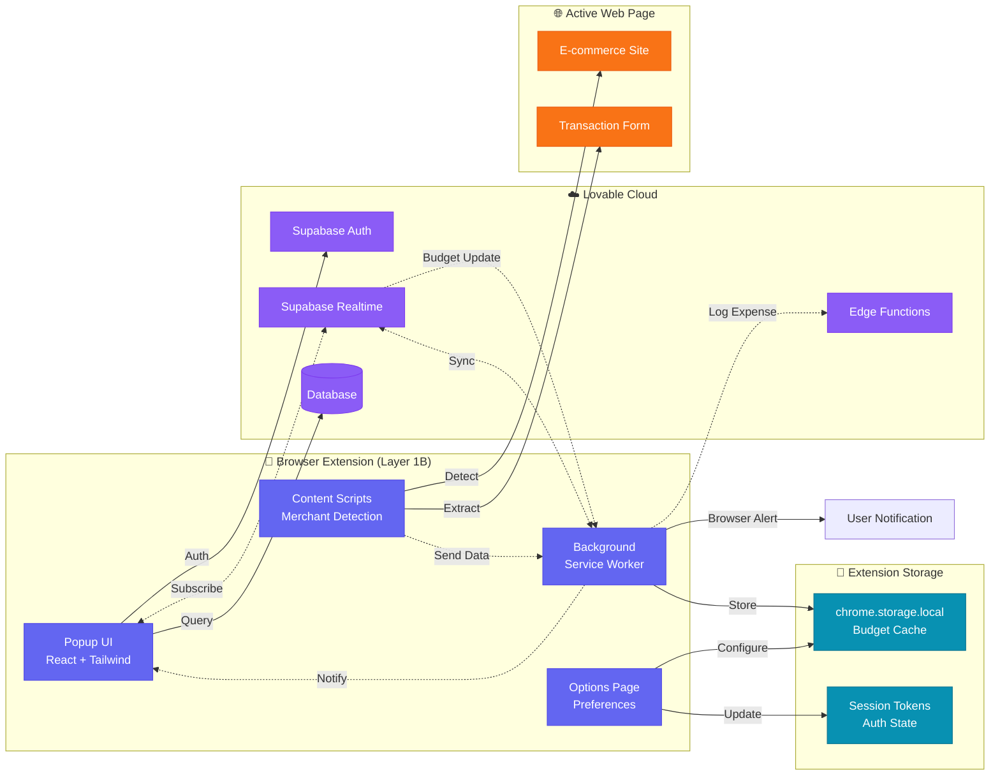
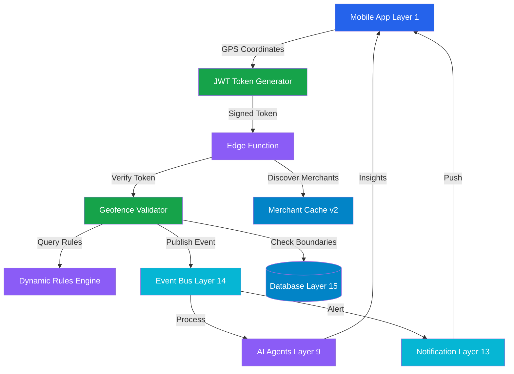
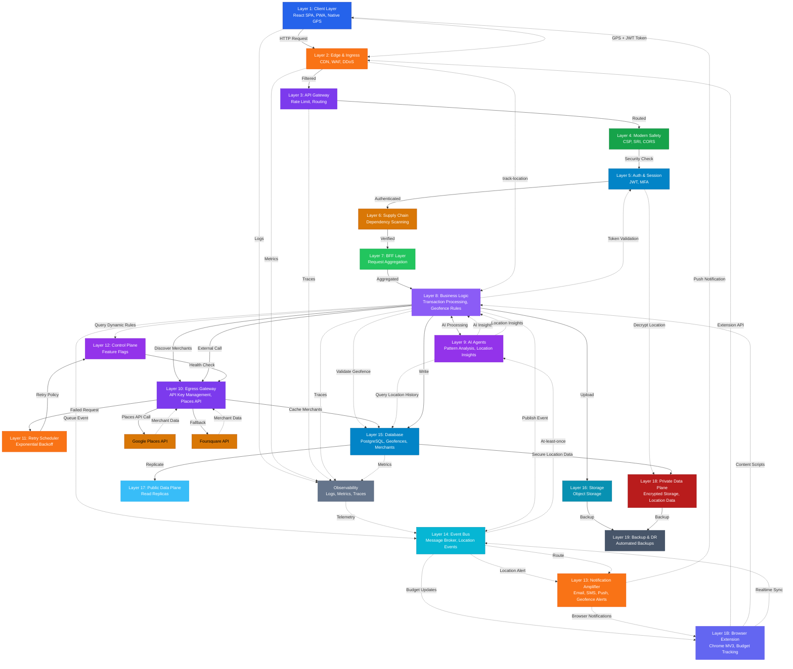
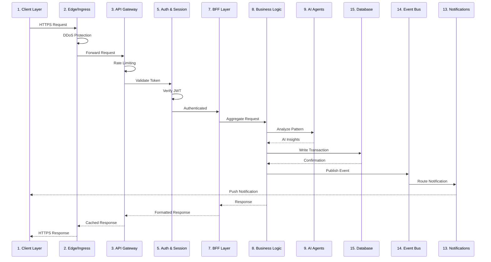
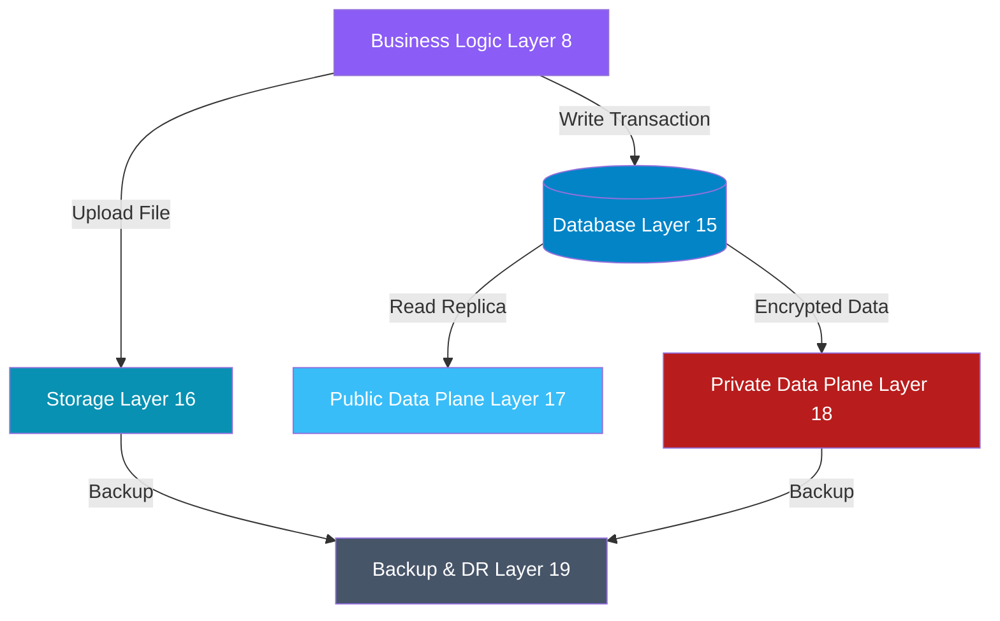

# TrueSpend Production Blueprint v4.1 – 19-Layer Architecture

**Version:** 4.1  
**Date:** 2025-11-08  
**Status:** Production-Ready  
**Source:** blueprint-v4.1.md

---

## Related Documents

- **[Implementation Guide v4.1](./blueprint-v4.1-implementation.md)** - Complete code examples and detailed implementation
- **[Implementation Timeline v4.1](./implementation-timeline-v4.1.md)** - 37-week phased implementation plan with Gantt chart
- **[Dashboard Overview](/dashboard/overview)** - Interactive architecture visualization

---

## Architecture Overview

TrueSpend v4.1 implements a comprehensive 19-layer architecture following the **Client → Ingress → Services → Egress → Data → Observability** pattern. This design prioritizes security, scalability, reliability, and observability across all system components.

**New in v4.0/v4.1:** 
- Native mobile geofencing with location intelligence spanning 8 layers (L1, L8, L9, L10, L13, L14, L15, L18)
- Browser extension companion for lightweight budget tracking
- See [Geofencing Subsystem Architecture](#dedicated-geofencing-subsystem-architecture) for detailed geofencing implementation.
- See [Blueprint v4.1 Implementation Guide](./blueprint-v4.1-implementation.md) for all code examples.

---

## Layer Specifications

### 🟦 Layer 1: Client Layer (#2563EB)
**Purpose:** User-facing interface across multiple platforms  

**Components:**
- React SPA with TypeScript
- Capacitor Native App (iOS + Android)
- Progressive Web App (PWA) capabilities
- Client-side state management
- Offline-first architecture
- Native geolocation tracking
- Background location monitoring
- Interactive geofence map visualization

**Responsibilities:**
- User interaction handling
- Client-side validation
- Optimistic UI updates
- Session token management
- Native GPS tracking
- Geofence boundary visualization
- Real-time location updates
- Location permission management

*Note: Browser extension companion architecture is detailed in the [Browser Extension Companion Architecture](#browser-extension-companion-architecture) section.*

---

### 🟧 Layer 2: Edge & Ingress (#f97316)
**Purpose:** Request routing and initial filtering  
**Components:**
- CDN (Content Delivery Network)
- WAF (Web Application Firewall)
- Edge Functions
- DDoS protection

**Responsibilities:**
- Global content distribution
- Attack prevention
- SSL/TLS termination
- Geographic routing

---

### 🟣 Layer 3: API Gateway (#7c3aed)
**Purpose:** Centralized API management  
**Components:**
- Request routing
- Rate limiting
- API versioning
- Request transformation
- **Bearer Token Authentication** ✅ (CSRF-safe for extensions)

**Responsibilities:**
- Route validation
- Traffic shaping
- Protocol translation
- Load balancing
- **Extension Bearer token validation** ✅

---

### 🟩 Layer 4: Modern Safety (CSP, SRI) (#16a34a)
**Purpose:** Client-side security enforcement  
**Components:**
- Content Security Policy (CSP)
- Subresource Integrity (SRI)
- CORS configuration
- Security headers

**Responsibilities:**
- XSS prevention
- Resource integrity verification
- Cross-origin policy enforcement
- Browser security configuration

---

### 🟦 Layer 5: Auth & Session (#0284c7)
**Purpose:** Identity and access management  
**Components:**
- Authentication service (Supabase Auth)
- JWT token management
- Session handling
- Multi-factor authentication
- **Extension OAuth Flow** ✅

**Responsibilities:**
- User authentication
- Token generation/validation
- Session lifecycle management
- Permission verification
- **Extension token refresh & storage** ✅

---

### 🟠 Layer 6: Supply Chain Security (#d97706)
**Purpose:** Third-party dependency security  
**Components:**
- Dependency scanning
- License compliance
- Vulnerability detection
- Package verification

**Responsibilities:**
- NPM package auditing
- Security patch management
- Dependency version control
- Supply chain attack prevention

---

### 🟢 Layer 7: BFF Layer (#22c55e)
**Purpose:** Backend For Frontend orchestration  
**Components:**
- Request aggregation
- Response transformation
- Client-specific APIs
- Data composition
- **Realtime Feedback Emitter** ✅ (Edge → Realtime event after DB write)

**Responsibilities:**
- Multi-service orchestration
- Response optimization
- Client-specific logic
- Data filtering/shaping
- **Emit realtime events post-mutation** ✅

---

### 🟪 Layer 8: Business Logic (#8b5cf6)
**Purpose:** Core application functionality  
**Components:**
- Transaction processing
- Budget management
- Spending analysis
- Rule engine
- Location-tagged transaction validator
- Merchant proximity verifier
- Budget zone enforcement engine
- Spending pattern analyzer (by location)

**Responsibilities:**
- Business rule execution
- Data validation
- Workflow orchestration
- State management
- Geofence rule execution
- Location-based fraud detection
- Spending zone validation
- Merchant location matching

---

### 🟣 Layer 9: AI Agents (#9333ea)
**Purpose:** Intelligent automation and insights  
**Components:**
- Spending pattern analysis
- Anomaly detection
- Predictive budgeting
- Natural language processing
- Location pattern analysis (Gemini 2.5 Flash)
- Predictive location spending model
- Merchant recommendation engine
- Anomaly detection (location-based)

**Responsibilities:**
- ML model inference
- Pattern recognition
- Intelligent recommendations
- Automated categorization
- Analyze spending patterns by geographic area
- Predict future spending locations
- Recommend budget adjustments based on location history
- Generate personalized location insights

---

### 🟪 Layer 10: Egress Gateway & Cache v2 (#7c3aed)
**Purpose:** External API communication with intelligent caching  
**Components:**
- Outbound request routing
- API key management
- Circuit breakers
- Request pooling
- Google Places API integration
- Foursquare Places API integration
- Reverse geocoding service
- Map tile provider (Mapbox)
- **Cache v2 with geohash indexing**
- TTL management system (24hr default, configurable)
- Cache versioning for invalidation

**Responsibilities:**
- External API calls
- Credential injection
- Failure isolation
- Traffic monitoring
- Places API key injection
- Rate limiting for location services
- Circuit breakers for geolocation API failures
- Merchant data enrichment
- **Geohash-based location clustering** (precision 7 = ~150m)
- **LRU eviction policy** (max 10MB cache size)
- **85%+ cache hit rate target**

---

### 🟧 Layer 11: Retry Scheduler (#f97316)
**Purpose:** Resilient external communication  
**Components:**
- Exponential backoff
- Dead letter queue
- Priority queuing
- Retry policies

**Responsibilities:**
- Failed request retry
- Backpressure management
- Priority handling
- Failure tracking

---

### 🟪 Layer 12: Control Plane & Dynamic Rules (#9333ea)
**Purpose:** System configuration and dynamic rule management  
**Components:**
- Feature flags
- Configuration management
- Service discovery
- Health checks
- **Dynamic rule evaluation engine** (no redeployment needed)
- A/B testing framework for geofencing algorithms
- **Extension Feature Flags** ✅ (15min refresh)

**Responsibilities:**
- Dynamic configuration
- Service registry
- Health monitoring
- Feature toggling
- **Real-time geofence rule updates** (add merchant zones without code deploy)
- Control plane for dynamic zone configuration
- **Extension kill switches & A/B testing** ✅ (gradual rollout, per-user targeting)

---

### 🟠 Layer 13: Notification Amplifier (#ea580c)
**Purpose:** Multi-channel notification delivery  
**Components:**
- Email service (Resend)
- SMS service (Twilio)
- Push notifications
- In-app notifications
- Geofence entry/exit alerts
- Budget zone warnings
- Merchant discovery notifications

**Responsibilities:**
- Notification routing
- Template management
- Delivery tracking
- Preference management
- Real-time location-based alerts
- Budget zone notification routing
- Merchant deal notifications

---

### 🟦 Layer 14: Event Bus & Queue (Enterprise) (#06b6d4)
**Purpose:** Fault-tolerant asynchronous event distribution  
**Components:**
- Supabase Realtime (pub/sub channels)
- Event log table (persistent queue)
- Database triggers for automatic event capture
- At-least-once delivery guarantees
- Geofence event types
- Location update events
- Merchant discovery events
- **User-Scoped Realtime Filtering** ✅ (server-side filtering)

**Responsibilities:**
- Event publishing with persistence
- Message routing and queuing
- Async communication with retry
- Event replay capability
- Location-based event routing
- Geofence event distribution
- **Fault tolerance:** Prevents event loss during AI module downtime/scaling
- **Realtime feedback loop** ✅ (Edge functions emit events post-DB write)

---

### 🟦 Layer 15: Database (#0284c7)
**Purpose:** Persistent data storage  
**Components:**
- PostgreSQL (Supabase)
- Connection pooling
- Query optimization
- Transaction management
- Geofence definitions table
- Geofence events table
- Merchants cache table
- Location-tagged transactions

**Responsibilities:**
- Data persistence
- ACID transactions
- Query execution
- Index management
- Geofence boundary storage
- Location event history
- Merchant data caching
- Spatial queries for location matching

---

### 🟩 Layer 16: Storage (#0891b2)
**Purpose:** File and object storage  
**Components:**
- Object storage (Supabase Storage)
- Receipt uploads
- Document storage
- Media handling
- Merchant photos bucket
- Geofence snapshots bucket

**Responsibilities:**
- File upload/download
- Access control
- Versioning
- CDN integration
- Cached merchant images
- User-uploaded zone photos

---

### 🟩 Layer 17: Public Data Plane (#38bdf8)
**Purpose:** Public-facing data services  
**Components:**
- Read replicas
- Caching layer
- Public APIs
- Anonymous access

**Responsibilities:**
- Public data serving
- Cache management
- Read scaling
- Anonymous queries

---

### 🟥 Layer 18: Private Data Plane (#b91c1c)
**Purpose:** Secure internal data services  
**Components:**
- Primary database
- Encrypted storage
- Audit logging
- Data masking
- Location data encryption
- Geohashing for approximate locations
- GDPR-compliant location export

**Responsibilities:**
- Sensitive data handling
- Encryption at rest
- Access logging
- PII protection
- Opt-in location tracking (default OFF)
- 30-day location retention policy
- Anonymization of historical location data
- Right to be forgotten for location data

---

### ⚙️ Layer 19: Backup & DR (#475569)
**Purpose:** Data protection and recovery  
**Components:**
- Automated backups
- Point-in-time recovery
- Disaster recovery
- Data archival

**Responsibilities:**
- Backup scheduling
- Recovery testing
- Data retention
- Archive management

---

### ⚫ Cross-Cutting: Observability & Telemetry (#64748b)
**Purpose:** System monitoring, debugging, and geofencing analytics  
**Components:**
- Logging (structured logs in JSON)
- Metrics (performance data)
- Tracing (distributed traces)
- Alerting (Slack/email)
- **Geofence metrics table for telemetry**
- **Geofencing-specific metrics dashboard**
- **Extension Telemetry** ✅ (15min batch flush)

**Responsibilities:**
- Log aggregation across all layers
- Metric collection (P95, P99 latencies)
- Trace correlation
- Incident alerting
- **Geofencing telemetry:**
  - Geo triggers per user per day
  - Average geofence validation latency
  - Push notification success rate
  - Battery drain metrics (mobile)
  - False positive rate tracking
- **AI Model Training Feedback:** Metrics feed back to Layer 9 for noise reduction
- **Extension-specific metrics** ✅

---

## Browser Extension Companion Architecture

### Overview

The TrueSpend browser extension provides lightweight budget tracking and merchant insights directly in the browser, complementing the web and mobile applications. Built on Chrome Manifest V3 with React + Tailwind, it enables real-time spending alerts, quick expense logging, and merchant detection on e-commerce sites.

**Key Capabilities:**
- ✅ Supabase Authentication (OAuth flow)
- ✅ Real-time budget sync via Supabase Realtime
- ✅ Merchant detection with content scripts
- ✅ AI-powered spending insights
- ✅ Browser notifications for budget alerts
- ❌ No geofencing (no GPS/background location)
- ❌ No offline-first (requires network)

### Extension Architecture Diagram



### Component Breakdown

#### 1. Popup UI (React Entry Point)
See [Implementation Guide](./blueprint-v4.1-implementation.md#popup-ui-implementation) for complete code examples.

**Responsibilities:**
- Display budget summary
- Show recent transactions
- Quick expense logging
- Settings access

#### 2. Background Service Worker
See [Implementation Guide](./blueprint-v4.1-implementation.md#background-service-worker) for complete code examples.

**Responsibilities:**
- Realtime subscription management
- Browser notifications
- Badge updates
- Session persistence in chrome.storage

#### 3. Content Scripts (Merchant Detection)
See [Implementation Guide](./blueprint-v4.1-implementation.md#content-scripts) for complete code examples.

**Responsibilities:**
- Detect merchant names and prices
- Extract transaction data from forms
- Show inline quick-log prompts
- Communicate with background worker

#### 4. Options Page
See [Implementation Guide](./blueprint-v4.1-implementation.md#options-page) for complete code examples.

**Responsibilities:**
- Notification preferences
- Budget thresholds
- Auto-sync settings
- Privacy controls

### Build Configuration

See [Implementation Guide](./blueprint-v4.1-implementation.md#build-configuration) for Vite configuration.

### Manifest Configuration

See [Implementation Guide](./blueprint-v4.1-implementation.md#manifest-configuration) for Chrome Manifest V3 configuration.

### Cross-Platform Component Reuse

**Shared Component Strategy:**

```
src/
├── components/
│   ├── shared/               # Reusable across all platforms
│   │   ├── BudgetCard.tsx   # Used in web, mobile, extension
│   │   ├── TransactionList.tsx
│   │   ├── QuickLogForm.tsx
│   │   └── BudgetProgress.tsx
│   ├── web/                  # Web-only components
│   ├── mobile/               # Mobile-only (Capacitor)
│   └── extension/            # Extension-only
└── hooks/
    ├── shared/               # Platform-agnostic hooks
    │   ├── useBudgets.ts
    │   ├── useTransactions.ts
    │   └── useAuth.ts
    └── extension/            # Extension-specific
        ├── useChromeStorage.ts
        └── useContentScript.ts
```

### Authentication Flow

See [Implementation Guide](./blueprint-v4.1-implementation.md#authentication-flow) for OAuth implementation.

### Data Sync Strategy

**Dual Storage Approach:**
- **Chrome Storage Local:** Cache budgets, recent transactions (fast access, offline-capable)
- **Supabase Database:** Source of truth (persistent, cross-device sync)

**Sync Flow:**
1. Extension loads → Check chrome.storage.local
2. If cache exists → Display immediately
3. Background worker → Subscribe to Supabase Realtime
4. On updates → Update both chrome.storage and UI
5. On cache miss → Fetch from Supabase, cache locally

### Security Considerations

**Extension-Specific Security:**
1. **Content Security Policy (CSP)** - Prevents inline scripts
2. **OAuth Token Storage** - Encrypted by browser in chrome.storage.local
3. **Content Script Isolation** - Cannot access extension storage directly
4. **Permission Scoping** - Minimal permissions requested

### Publishing Strategy

**Chrome Web Store:**
1. Build production extension
2. Create ZIP package
3. Upload to Chrome Web Store Developer Dashboard
4. Privacy policy required

**Firefox Add-ons:**
1. Convert manifest V3 → V2 compatibility layer
2. Build for Firefox
3. Submit to addons.mozilla.org

**Safari Extension:**
1. Use Xcode to wrap web extension
2. Submit via App Store Connect

### Performance Considerations

**Extension-Specific Optimizations:**
- Popup renders in <200ms (cached data from chrome.storage)
- Background worker idles when no realtime subscriptions
- Content scripts lazy-load (only on merchant sites)
- Badge updates debounced (max 1/second)

---

## Production-Ready Refinements ⚙️

### Service Worker Architecture (MV3) ✅

**Challenge:** Chrome MV3 background service workers are ephemeral and terminate after 30 seconds of inactivity, causing state loss and event handler failures.

**Solution:** Move all heavy logic to popup/content scripts. Use SW only for message routing and alarms.

See [Implementation Guide](./blueprint-v4.1-implementation.md#service-worker-architecture) for complete code examples.

**Testing:**
- ✅ SW terminates after 30s → No crashes on next activation
- ✅ Alarms continue firing after SW sleep
- ✅ Message routing works after SW restart
- ✅ No event loss during SW idle periods

---

### Extension CORS Configuration 🔒

**Challenge:** Browser extension origins must be explicitly whitelisted in CORS policies, and cookie-based auth is vulnerable to CSRF.

**Solution:** Whitelist extension IDs in Layer 2 (Edge) and use Bearer token authentication.

See [Implementation Guide](./blueprint-v4.1-implementation.md#extension-cors-configuration) for complete code examples.

**Security Benefits:**
- ✅ No CSRF vulnerabilities (stateless Bearer tokens)
- ✅ Extension origin whitelisted (prevents unauthorized extensions)
- ✅ Token expiry enforced (short-lived access tokens)
- ✅ Passes Chrome Web Store security review

---

### Realtime Filtering Best Practices 🔐

**Challenge:** Supabase Realtime channels can leak events across users if not filtered properly.

**Solution:** Filter Realtime channels by user_id or event_type at the subscription level.

See [Implementation Guide](./blueprint-v4.1-implementation.md#realtime-filtering) for complete code examples.

---

## Dedicated Geofencing Subsystem Architecture

### Overview

The geofencing subsystem spans **8 layers** (L1, L8, L9, L10, L13, L14, L15, L18) and provides native mobile location tracking with enterprise-grade security, fault tolerance, and AI-powered insights.

### Geofencing Data Flow



### 5 Enterprise Refinements

The geofencing implementation includes 5 production-ready refinements:

1. **JWT-Based Location Security** - Client-side token signing, server-side verification, nonce-based replay attack prevention
2. **Event Bus & Queue** - Fault-tolerant event processing with at-least-once delivery
3. **Control Plane for Dynamic Rules** - Real-time rule evaluation and configuration management
4. **Cache v2 with Geohash Optimization** - High-performance proximity search with TTL management
5. **Observability & Telemetry** - Real-time metrics, performance tracking, and AI feedback loops

See [Implementation Guide](./blueprint-v4.1-implementation.md#enterprise-implementation-guide) for detailed implementation of all 5 refinements.

### Security Features

**Geofencing Security (Enterprise):**
- **Location Spoofing Prevention**: Client-side signed JWT tokens with 5min expiry
- **Coordinate Encryption**: Lat/long encrypted before storage
- **Token Validation**: Server-side verification with nonce tracking (replay attack prevention)
- **Rate Limiting**: Max 100 location submissions per user per hour
- **Audit Trail**: All geo events logged with timestamps
- **GDPR Compliance**: 30-day location retention, right to be forgotten

---

## Security Considerations (Enterprise-Grade)

Security is implemented across multiple layers with enhanced geofencing and extension protection:

1. **Client Layer (L1)**: CSP headers, SRI, JWT token signing
2. **Edge Layer (L2)**: TLS 1.3, DDoS protection, **Extension origin whitelisting** ✅
3. **Gateway (L3/L7)**: Rate limiting, HMAC signatures, JWT validation, **Bearer token auth (CSRF-safe)** ✅
4. **Auth (L5)**: JWT + Refresh tokens, MFA support, **Extension OAuth flow** ✅
5. **Data (L15/L18)**: RLS policies, Encryption at rest (AES-256), **User-scoped Realtime filtering** ✅
6. **Geofencing Security (Enterprise)**: JWT tokens, coordinate encryption, nonce tracking
7. **Browser Extension Security (Production-Ready)** ✅:
   - Ephemeral Service Worker
   - CORS Whitelisting
   - Bearer Token Auth
   - Realtime Channel Filtering
   - Content Security Policy
   - Minimal Permissions
   - Privacy Compliance
   - Telemetry Security

---

## Visual Architecture Diagrams

### Complete 19-Layer Flow Diagram (with Browser Extension)



### Layer Groupings Visualization

```mermaid
graph LR
    subgraph CI["Client & Ingress"]
        L1["1. Client Layer"]
        L2["2. Edge & Ingress"]
        L3["3. API Gateway"]
    end
    
    subgraph SA["Security & Auth"]
        L4["4. Modern Safety"]
        L5["5. Auth & Session"]
        L6["6. Supply Chain"]
    end
    
    subgraph SV["Services"]
        L7["7. BFF Layer"]
        L8["8. Business Logic"]
        L9["9. AI Agents"]
    end
    
    subgraph EC["External Communication"]
        L10["10. Egress Gateway"]
        L11["11. Retry Scheduler"]
        L12["12. Control Plane"]
    end
    
    subgraph MN["Messaging & Notifications"]
        L13["13. Notification Amplifier"]
        L14["14. Event Bus"]
    end
    
    subgraph DS["Data & Storage"]
        L15["15. Database"]
        L16["16. Storage"]
        L17["17. Public Data Plane"]
        L18["18. Private Data Plane"]
        L19["19. Backup & DR"]
    end
    
    CI --> SA --> SV --> EC
    SV --> MN
    SV --> DS
    EC --> SV
    MN --> CI
    
    classDef group1 fill:#2563EB,stroke:#1e40af,color:#fff
    classDef group2 fill:#16a34a,stroke:#15803d,color:#fff
    classDef group3 fill:#8b5cf6,stroke:#7c3aed,color:#fff
    classDef group4 fill:#f97316,stroke:#ea580c,color:#fff
    classDef group5 fill:#06b6d4,stroke:#0891b2,color:#fff
    classDef group6 fill:#0284c7,stroke:#0369a1,color:#fff
    
    class CI,L1,L2,L3 group1
    class SA,L4,L5,L6 group2
    class SV,L7,L8,L9 group3
    class EC,L10,L11,L12 group4
    class MN,L13,L14 group5
    class DS,L15,L16,L17,L18,L19 group6
```



### Request Flow Sequence Diagram



### Data Persistence Flow



---

## Data Flow Patterns

### Main Flow (Synchronous)
```
Client Layer 
  ↓
Edge & Ingress (CDN/WAF)
  ↓
API Gateway
  ↓
Modern Safety (CSP/SRI)
  ↓
Auth & Session
  ↓
Supply Chain Security
  ↓
BFF Layer
  ↓
Business Logic + AI Agents
  ↓
Egress Gateway
  ↓
External APIs (Plaid, Stripe, OpenAI)
```

### Data Flow (Persistence)
```
Business Logic
  ↓
Database (PostgreSQL)
  ↓
├─→ Public Data Plane (read replicas)
├─→ Private Data Plane (encrypted)
└─→ Storage (object storage)
  ↓
Backup & DR
```

### Feedback & Resilience (Circuit)
```
Egress Gateway
  ↓
Retry Scheduler (exponential backoff)
  ↓
Control Plane (health checks)
  ↓
Observability (metrics/logs)
```

### Notification Path (Asynchronous)
```
Event Bus
  ↓
Notification Amplifier
  ↓
├─→ Email (Resend)
├─→ SMS (Twilio)
└─→ Push Notifications
  ↓
Client Layer
```

---

## Flow Legend

- **Solid arrows (→):** Synchronous request/response
- **Curved lines (⤿):** Asynchronous/event-driven
- **Dashed lines (⇢):** Monitoring/observability
- **Double arrows (⇄):** Bidirectional data flow
- **Green dashed lines (📍):** Geofencing location flows
- **📍 Icon:** GPS/location tracking components
- **🗺️ Icon:** Location intelligence features
- **🔔 Icon:** Location-based notifications
- **🔒 Icon:** Encrypted location data

---

## Layer Groupings

### 1. Client & Ingress
- Client Layer
- Edge & Ingress
- API Gateway

### 2. Security & Auth
- Modern Safety (CSP/SRI)
- Auth & Session
- Supply Chain Security

### 3. Services
- BFF Layer
- Business Logic
- AI Agents

### 4. External Communication
- Egress Gateway
- Retry Scheduler
- Control Plane

### 5. Messaging & Notifications
- Event Bus
- Notification Amplifier

### 6. Data & Storage
- Database
- Storage
- Public Data Plane
- Private Data Plane
- Backup & DR

### 7. Cross-Cutting Concerns
- Observability (spans all layers)

---

## Visual Architecture Notes

### Color Palette
- **Blue family (#2563EB, #0284c7, #06b6d4, #38bdf8):** Client, Auth, Database, Event Bus
- **Purple family (#7c3aed, #8b5cf6, #9333ea):** API Gateway, Business Logic, AI, Control Plane
- **Orange family (#f97316, #d97706, #ea580c):** Edge/Ingress, Supply Chain, Notifications
- **Green family (#16a34a, #22c55e, #0891b2, #38bdf8):** Safety, BFF, Storage, Public Data
- **Red (#b91c1c):** Private Data Plane
- **Gray family (#475569, #64748b):** Backup/DR, Observability

### Layout Recommendations
- **Horizontal flow:** Left-to-right progression showing request lifecycle
- **Vertical grouping:** Stack related services in visual blocks
- **Isometric view:** Use 3D perspective for depth and hierarchy
- **Background:** Warm White (#F8FAFC) for clean, modern aesthetic

---

## Technology Stack

### Frontend
- React 18 + TypeScript
- Vite build system
- Tailwind CSS
- React Query (TanStack)
- React Router v6

### Mobile Native
- Capacitor 6.x (iOS + Android)
- Native geolocation plugins
- Push notifications
- Background geolocation

### Backend (Lovable Cloud)
- Supabase (PostgreSQL + Auth + Storage)
- Edge Functions (Deno runtime)
- Row Level Security (RLS)
- Realtime subscriptions

### External Services
- **Banking:** Plaid
- **Payments:** Stripe
- **AI:** Lovable AI Gateway (Google Gemini, OpenAI GPT)
- **Email:** Resend
- **SMS:** Twilio
- **Location Services:** Google Places API, Foursquare Places API
- **Mapping:** Mapbox
- **Analytics:** Custom observability stack

### Location Libraries
- react-map-gl (Mapbox React wrapper)
- @turf/turf (geospatial calculations)
- geolib (distance/bearing calculations)

### Security
- JWT-based authentication
- RLS policies on all tables
- CSP headers
- SRI for static assets
- HTTPS everywhere
- API key rotation
- Dependency scanning

---

## Deployment Architecture

### Hosting
- Frontend: Lovable Cloud (global CDN)
- Backend: Lovable Cloud Edge Functions
- Database: Supabase (managed PostgreSQL)

### Regions
- Primary: US-East
- DR: US-West
- CDN: Global edge locations

### Scaling Strategy
- Horizontal: Edge functions auto-scale
- Vertical: Database instance sizing
- Read replicas: Public data plane
- Caching: Multi-layer (CDN, app, database)

---

## Security Considerations

### Layer-Specific Security

**Client Layer:**
- CSP enforcement
- XSS prevention
- Input sanitization
- Secure token storage

**Ingress Layer:**
- WAF rules
- Rate limiting
- DDoS mitigation
- Bot protection

**Auth Layer:**
- MFA support
- Session management
- Token rotation
- Password policies

**Data Layer:**
- Encryption at rest
- Encryption in transit
- RLS policies
- Audit logging

**Egress Layer:**
- API key management
- Secret rotation
- Request signing
- Certificate pinning

---

## Monitoring & Observability

### Metrics
- Request latency (p50, p95, p99)
- Error rates by service
- Database query performance
- Cache hit rates
- External API latency

### Logs
- Structured JSON logs
- Request/response correlation IDs
- Error stack traces
- Audit trails

### Traces
- Distributed tracing
- Service dependency mapping
- Performance bottleneck identification
- Request flow visualization

### Alerts
- Error rate thresholds
- Latency degradation
- Resource exhaustion
- Security events

---

## Performance Targets

- **Page Load:** < 2s (First Contentful Paint)
- **API Response:** < 200ms (p95)
- **Database Query:** < 50ms (p95)
- **External API:** < 1s (with retry)
- **Cache Hit Rate:** > 80%
- **Availability:** 99.9% uptime

---

## Disaster Recovery

### Backup Strategy
- **Frequency:** Hourly incremental, daily full
- **Retention:** 30 days point-in-time recovery
- **Testing:** Monthly DR drills
- **RTO:** < 1 hour
- **RPO:** < 5 minutes

### Failure Scenarios
- Database failure → Automatic failover to replica
- Region failure → Traffic routing to DR region
- Service degradation → Circuit breaker activation
- Data corruption → Point-in-time restore

---

## Future Enhancements (v5.0)

1. **Multi-region active-active:** Global read/write distribution
2. **GraphQL Federation:** Unified API layer across services
3. **Event Sourcing:** Complete audit trail and replay capability
4. **ML Pipeline:** Dedicated layer for model training and serving
5. ~~**Mobile Native:** iOS/Android native applications~~ (✅ Implemented in v4.0 with geofencing)
6. **Advanced Geofencing:** Multi-zone budgets, time-based zones, AR merchant discovery
7. **Blockchain Integration:** Immutable transaction ledger
8. **Advanced Analytics:** Real-time OLAP queries

---

## Conclusion

Blueprint v4.1 represents a production-ready, enterprise-grade architecture that balances security, performance, scalability, and maintainability. The 19-layer design provides clear separation of concerns while enabling seamless integration between components.

**Key Strengths:**
- ✅ Comprehensive security at every layer
- ✅ Built-in resilience and fault tolerance
- ✅ Observable and debuggable
- ✅ Scalable architecture
- ✅ Modern best practices
- ✅ Browser extension support
- ✅ Enterprise geofencing

**For Implementation Details:**
See [Blueprint v4.1 Implementation Guide](./blueprint-v4.1-implementation.md) for all code examples, detailed configurations, and step-by-step implementation instructions.

---

**Document Version:** 4.1  
**Last Updated:** 2025-11-08  
**Maintained By:** TrueSpend Architecture Team  
**Review Cycle:** Quarterly  
**Related Documents:** [Implementation Guide v4.1](./blueprint-v4.1-implementation.md) | [Implementation Timeline v4.1](./implementation-timeline-v4.1.md)
