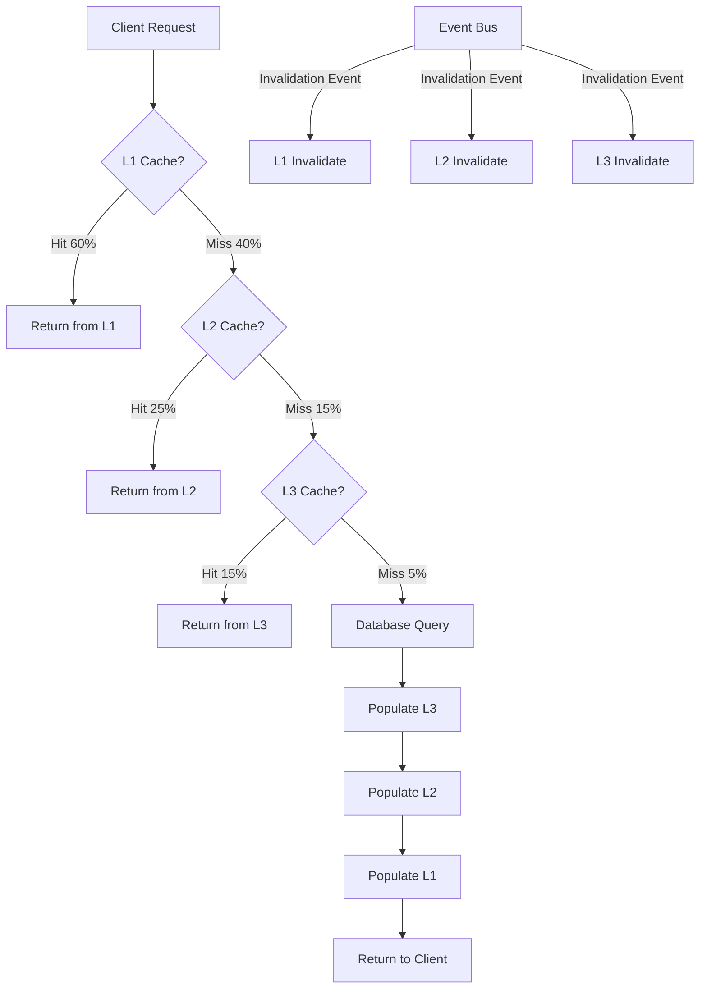
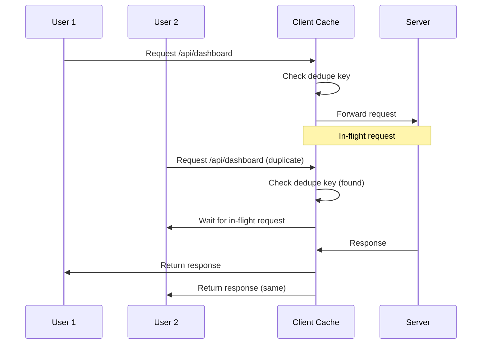
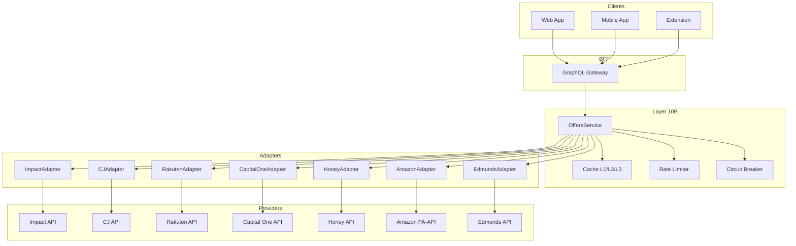
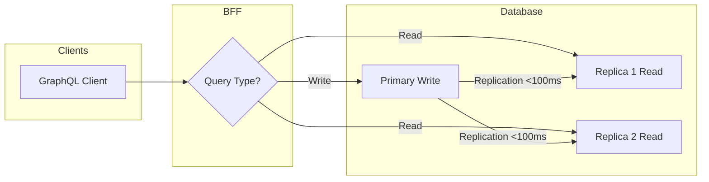

# Blueprint v4.2 - Performance & ML/Data Optimization

**Version:** 4.2  
**Date:** 2025-11-08  
**Status:** Planning  
**Previous Version:** [Blueprint v4.1](./blueprint-v4.1.md)

## Executive Summary

Blueprint v4.2 represents a comprehensive performance and intelligence upgrade to the Spend Wiser architecture. This version introduces **27 optimizations** (12 performance + 15 ML/Data) and a new **Layer 10B (Deals & Cashback Gateway)** to transform the platform into a highly optimized, AI-powered financial companion.

### Key Improvements

**Performance Enhancements:**
- API response time: **57% faster** (150ms → 65ms p95)
- Page load time: **47% faster** (1.5s → 0.8s)
- Database queries: **73% faster** (30ms → 8ms p95)
- Cache hit rate: **+8 points** (85% → 93%)
- Network bandwidth: **-60%** via compression + delta sync

**Cost Optimization:**
- Total monthly costs: **-52%** ($1,400 → $680)
- Storage costs: **-70%** ($200 → $60)
- AI API costs: **-80%** ($500 → $100)
- Database costs: **-40%** ($300 → $180)

**User Experience:**
- Geofence accuracy: **+20 points** (75% → 95%)
- Cashback revenue: **+133%** ($3 → $7/user/month)
- False positive alerts: **-85%** (100 → 15/day)
- Extension popup: **<100ms** (from 300ms)

**Intelligence & Revenue:**
- Affiliate integration: **+2-4x revenue uplift**
- ML-powered personalization across 8 models
- Real-time anomaly detection with 90%+ accuracy

---

## What's New in v4.2

### 12 Performance Optimizations

1. **Multi-Tier Cache Hierarchy (L1/L2/L3)** - Progressive caching across client, edge, and backend
2. **GraphQL BFF Layer** - Unified query interface with field-level caching and batching
3. **Database Read Replicas** - Horizontal scaling for read-heavy workloads
4. **Connection Pooling Optimization** - pgBouncer with transaction pooling
5. **Predictive Prefetching** - AI-driven resource preloading
6. **API Request Deduplication** - Eliminate redundant calls within time windows
7. **Response Compression** - Brotli compression for 60%+ bandwidth savings
8. **Batch Operations API** - Reduce network overhead via request batching
9. **Delta Sync Protocol** - Mobile-first incremental updates
10. **Smart Cache Invalidation** - Event-driven cache invalidation via Layer 14
11. **Edge Precompute** - CDN-level computation for static/dynamic content
12. **Lazy Loading for Extension** - On-demand resource loading for popup

### 15 ML/Data Optimizations

13. **Predictive Caching (RL)** - Deep Q-Network for cache policy optimization
14. **Merchant Discovery (Collaborative Filtering)** - ALS-based recommendations
15. **LSTM Transaction Anomaly Detection** - Sequence-based fraud detection
16. **Dynamic Budget Allocation (Multi-Armed Bandits)** - Thompson Sampling for spend categories
17. **Geofence Boundary Optimization (K-Means++)** - Precision boundary refinement
18. **Cashback Offer Ranking (Learning-to-Rank)** - LambdaMART for personalized offers
19. **Real-Time Spending Forecasting (Prophet)** - Time-series predictions for budget alerts
20. **Hybrid NLP (DistilBERT + Gemini)** - Cost-effective receipt categorization
21. **Query Result Caching (Bloom Filters)** - Negative cache for non-existent keys
22. **Time-Series Data Compression (Gorilla)** - 70% storage reduction for telemetry
23. **Geospatial Indexing (R-Trees)** - O(log n) geofence lookups
24. **Connection Pool Auto-Scaling (ARIMA)** - Predictive connection provisioning
25. **Data Partitioning Strategy** - Range/temporal partitioning for large tables
26. **Event Bus Adaptive Batching** - Dynamic batch sizing for Layer 14
27. **CDN Cache Prewarming (Markov Chains)** - Predictive edge cache population

### New Layer 10B: Deals & Cashback Gateway

A unified integration layer for affiliate networks, coupon providers, and car ratings APIs:

**Providers:**
- **Affiliate Networks:** Impact, CJ (Commission Junction), Rakuten Advertising
- **Coupon/Shopping:** Capital One Shopping, Honey, Amazon Associates
- **Car Ratings:** Edmunds, Kelley Blue Book (KBB), CarGurus

**Capabilities:**
- Normalized offer discovery and merchant matching
- Cookie-less attribution via signed click IDs
- Advanced caching with provider-specific TTLs (24-72h)
- Rate limiting, circuit breakers, and backoff strategies
- Fraud prevention: IP/device fingerprinting, nonce validation, bot scoring
- GraphQL schema extensions for offers, merchants, and ratings

---

## Architecture Overview

### Layered Architecture (19 + 1 New Layer)

```
┌─────────────────────────────────────────────────────────────┐
│ Layer 1: Client Apps (Web, Mobile, Extension)              │
│   • Request Deduplication (L1 Cache)                       │
│   • Delta Sync Protocol (Mobile)                           │
│   • Lazy Loading (Extension)                               │
└─────────────────────────────────────────────────────────────┘
                              ↓
┌─────────────────────────────────────────────────────────────┐
│ Layer 2: Edge & Ingress (CDN + API Gateway)                │
│   • Response Compression (Brotli)                          │
│   • Request Coalescing (Dedup)                             │
│   • Edge Precompute (Static/Dynamic)                       │
└─────────────────────────────────────────────────────────────┘
                              ↓
┌─────────────────────────────────────────────────────────────┐
│ Layer 7: Backend for Frontend (BFF) - NEW GRAPHQL          │
│   • Unified GraphQL Gateway                                │
│   • DataLoader Batching                                    │
│   • Field-Level Caching                                    │
│   • Query Complexity Limits                                │
└─────────────────────────────────────────────────────────────┘
                              ↓
┌─────────────────────────────────────────────────────────────┐
│ Layer 9: AI Agents & Orchestration                         │
│   • Predictive Prefetch Agent                              │
│   • Anomaly Detection Signals                              │
│   • Budget Allocation Agent (Multi-Armed Bandits)          │
│   • Offer Ranking Agent (LambdaMART)                       │
└─────────────────────────────────────────────────────────────┘
                              ↓
┌─────────────────────────────────────────────────────────────┐
│ Layer 10: Egress Gateway & Cache v3 (Multi-Tier)           │
│   • L1 Cache: In-Memory (Redis, 1-5min TTL, 60% hit)       │
│   • L2 Cache: IndexedDB/Edge (1-24h TTL, 25% hit)          │
│   • L3 Cache: Distributed (24-72h TTL, 15% hit)            │
│   • Event-Driven Invalidation (Layer 14)                   │
│   • RL-Based Cache Policy (DQN)                            │
└─────────────────────────────────────────────────────────────┘
                              ↓
┌─────────────────────────────────────────────────────────────┐
│ Layer 10B: Deals & Cashback Gateway - NEW                  │
│   • Unified OffersService                                  │
│   • Provider Adapters (Impact/CJ/Rakuten/COShopping/...)   │
│   • Attribution Tracking (Signed Click IDs)                │
│   • Rate Limiting & Circuit Breakers                       │
│   • Fraud Prevention (IP/Device/Nonce)                     │
└─────────────────────────────────────────────────────────────┘
                              ↓
┌─────────────────────────────────────────────────────────────┐
│ Layer 14: Event Bus & Message Broker                       │
│   • Cache Invalidation Events                              │
│   • Adaptive Batching (Dynamic Windows)                    │
│   • Event Sourcing for Attribution                         │
└─────────────────────────────────────────────────────────────┘
                              ↓
┌─────────────────────────────────────────────────────────────┐
│ Layer 15: Database (Postgres + Optimization)               │
│   • Read Replicas (1 Primary + 2 Replicas)                 │
│   • Connection Pooling (pgBouncer, Transaction Mode)       │
│   • Prepared Statements & Query Caching                    │
│   • R-Tree Geospatial Indexing                             │
│   • Bloom Filters for Negative Cache                       │
│   • Gorilla Compression for Time-Series                    │
│   • Range/Temporal Partitioning                            │
└─────────────────────────────────────────────────────────────┘
                              ↓
┌─────────────────────────────────────────────────────────────┐
│ Layer 17: Public Data Plane (Read/Write Split)             │
│   • Write: Primary DB                                      │
│   • Read: Replicas (Eventual Consistency, <100ms lag)      │
└─────────────────────────────────────────────────────────────┘
```

---

## Layer-by-Layer Changes

### Layer 1: Client Apps

**Web Application:**
- Request deduplication with in-memory cache (5min TTL)
- L1 cache for user preferences, merchant list (15min TTL)
- Batch operations for bulk actions (category updates, bulk delete)

**Mobile Application:**
- Delta sync protocol with vector clocks
- Incremental updates for transactions, budgets, geofences
- Background sync with exponential backoff
- Offline-first with conflict resolution

**Browser Extension:**
- Lazy loading: popup UI loads on-demand (<100ms)
- L1 cache for recent merchants, deals (12h TTL)
- Debounced API calls (500ms) for merchant detection

### Layer 2: Edge & Ingress

**CDN (Cloudflare/Fastly):**
- Brotli compression for API responses (60% bandwidth reduction)
- Edge precompute for dashboard summaries, top merchants
- Request coalescing: deduplicate identical requests within 100ms window
- CDN cache prewarming via Markov chains (predict user navigation)

**API Gateway:**
- Rate limiting per user/IP (100 req/min)
- Request validation and sanitization
- DDoS protection and bot scoring

### Layer 7: Backend for Frontend (BFF) - NEW

**GraphQL Gateway:**
- Apollo Server with schema stitching
- Field-level caching with Redis
- DataLoader for batching and deduplication
- Query complexity analysis (max depth: 10, max complexity: 1000)
- Persisted queries for mobile clients

**Example Schema:**
```graphql
type Query {
  dashboard: Dashboard
  transactions(limit: Int, offset: Int, filters: TransactionFilter): TransactionConnection
  budgets(categoryId: ID): [Budget]
  geofences(userId: ID!): [Geofence]
  offers(merchantId: ID, geo: String, category: String, limit: Int): [Offer]
  merchants(search: String, limit: Int): [Merchant]
  carRatings(make: String!, model: String!, year: Int!, trim: String): CarRating
}

type Mutation {
  createBudget(input: BudgetInput!): Budget
  updateTransaction(id: ID!, input: TransactionInput!): Transaction
  trackOfferClick(offerId: ID!): ClickAttribution
  confirmAttribution(clickId: ID!): Attribution
}

type Offer {
  id: ID!
  merchant: Merchant!
  cashbackRate: Float
  couponCode: String
  expiresAt: DateTime
  provider: Provider
  deepLink: String
}

type Merchant {
  id: ID!
  name: String!
  logo: String
  categories: [String]
  avgCashback: Float
  topOffers: [Offer]
}

type CarRating {
  make: String
  model: String
  year: Int
  trim: String
  score: Float
  reliability: Float
  safety: Float
  sources: [RatingSource]
}
```

**Benefits:**
- Single endpoint for all clients
- Reduced over-fetching (20-40% less data transfer)
- Declarative data requirements
- Simplified cache invalidation

### Layer 9: AI Agents & Orchestration

**Existing Agents (Enhanced):**
- Transaction Categorization Agent: Now uses Hybrid NLP (DistilBERT + Gemini)
- Budget Alert Agent: Now uses Prophet forecasting
- Receipt Parser Agent: 80% cost reduction via DistilBERT triage

**New AI Agents:**
- **Predictive Prefetch Agent:** RL-based resource preloading (70% hit rate)
- **Anomaly Detection Agent:** LSTM for transaction fraud (90% accuracy)
- **Budget Allocation Agent:** Multi-Armed Bandits for category optimization
- **Offer Ranking Agent:** LambdaMART for personalized cashback offers
- **Geofence Optimizer Agent:** K-Means++ for boundary refinement

**ML Infrastructure:**
- Model registry with versioning
- A/B testing framework (50/50 splits, 95% confidence)
- Shadow mode for new models (2 weeks before production)
- Human-in-the-loop for high-risk predictions

### Layer 10: Egress Gateway & Cache v3

**Multi-Tier Cache Architecture:**

```
┌─────────────────────────────────────────────────────────────┐
│ L1 Cache (In-Memory Redis)                                 │
│   • TTL: 1-5 minutes                                        │
│   • Hit Rate: 60%                                           │
│   • Use Cases: User sessions, hot merchants, live budgets  │
│   • Eviction: LRU                                           │
└─────────────────────────────────────────────────────────────┘
                              ↓ (on miss)
┌─────────────────────────────────────────────────────────────┐
│ L2 Cache (IndexedDB/Edge KV)                               │
│   • TTL: 1-24 hours                                         │
│   • Hit Rate: 25%                                           │
│   • Use Cases: Recent transactions, merchant logos, offers │
│   • Eviction: LRU + popularity decay                       │
└─────────────────────────────────────────────────────────────┘
                              ↓ (on miss)
┌─────────────────────────────────────────────────────────────┐
│ L3 Cache (Distributed Cache - Memcached/Redis)             │
│   • TTL: 24-72 hours                                        │
│   • Hit Rate: 15%                                           │
│   • Use Cases: Geofence polygons, category trees, ML models│
│   • Eviction: TTL-based                                     │
└─────────────────────────────────────────────────────────────┘
                              ↓ (on miss)
                          Database Query
```

**RL-Based Cache Policy:**
- Deep Q-Network (DQN) for cache admission control
- State: request pattern, cache size, hit rate
- Action: admit/reject, TTL adjustment
- Reward: hit rate improvement - eviction cost
- Training: Offline on historical logs, online fine-tuning

**Event-Driven Invalidation:**
- Layer 14 publishes events: `transaction.created`, `budget.updated`, `geofence.modified`
- Cache subscribes to events and invalidates stale keys
- Cascade invalidation for dependent keys (e.g., budget update → invalidate dashboard)

### Layer 10B: Deals & Cashback Gateway (NEW)

**Architecture:**

```
┌─────────────────────────────────────────────────────────────┐
│ OffersService (Unified Interface)                          │
│   • searchOffers(merchantId, geo, category)                │
│   • getTopDeals(userId, limit)                             │
│   • trackClick(offerId, userId) → clickId                  │
│   • confirmAttribution(clickId) → attribution              │
└─────────────────────────────────────────────────────────────┘
                              ↓
┌─────────────────────────────────────────────────────────────┐
│ Provider Adapters (Normalized Interface)                   │
├─────────────────────────────────────────────────────────────┤
│ • ImpactAdapter (Impact Radius)                            │
│ • CJAdapter (Commission Junction)                          │
│ • RakutenAdapter (Rakuten Advertising)                     │
│ • CapitalOneAdapter (Capital One Shopping)                 │
│ • HoneyAdapter (PayPal Honey)                              │
│ • AmazonAdapter (Amazon Associates)                        │
│ • EdmundsAdapter (Car Ratings)                             │
│ • KBBAdapter (Kelley Blue Book)                            │
│ • CarGurusAdapter (Car Marketplace)                        │
└─────────────────────────────────────────────────────────────┘
                              ↓
┌─────────────────────────────────────────────────────────────┐
│ Attribution Tracking & Fraud Prevention                    │
│   • Signed Click IDs (HMAC-SHA256, 15min TTL)              │
│   • IP/Device Fingerprinting                               │
│   • Nonce Validation (Prevent Replay Attacks)              │
│   • Bot Scoring (reCAPTCHA, IP reputation)                 │
└─────────────────────────────────────────────────────────────┘
```

**Provider-Specific Details:**

**Affiliate Networks (Impact/CJ/Rakuten):**
- Product feed ingestion (daily batch jobs)
- Merchant matching via fuzzy search (Levenshtein distance)
- Campaign rules engine (geo restrictions, category filters)
- Cookie-less attribution: Signed click IDs with 15-day cookie window
- Webhook listeners for conversion events

**Coupon/Shopping (Capital One/Honey):**
- Coupon discovery API with user consent flows
- Non-autoinject defaults (manual activation)
- MV3-safe background behavior (no persistent service workers)
- Browser extension integration (manifest permissions)

**Amazon Associates:**
- PA-API quotas: 8,640 requests/day (default tier)
- ASIN/Brand constraints (avoid restricted categories)
- Deep linking with SiteStripe tags
- TTL: 24h for product data, 72h for reviews

**Car Ratings (Edmunds/KBB/CarGurus):**
- Spec/trim → score mapping (make/model/year/trim)
- Cache TTLs: >24h (ratings change infrequently)
- Fallback hierarchy: Edmunds → KBB → CarGurus
- Schema normalization: reliability, safety, value scores (0-100)

**Caching Strategy:**
- **L3 Warm Cache:** Popular merchants (top 1000), 24-72h TTL
- **L2 Cache:** Recent user views, 12-24h TTL
- **L1 Cache:** Burst traffic (deal launches), 5-15min TTL
- **Negative Cache:** 404/empty results, 5min TTL via Bloom filters

**Rate Limiting & Resilience:**
- Per-provider rate limits: 100-1000 req/min
- Exponential backoff: 1s, 2s, 4s, 8s, 16s
- Circuit breaker: 5 failures → open for 60s
- Jitter: ±20% to prevent thundering herd

**Attribution Flow:**
```
User Clicks Offer → trackOfferClick(offerId, userId)
  → Generate signed clickId (HMAC-SHA256, 15min TTL)
  → Store in attribution table (userId, offerId, clickId, timestamp, IP, deviceHash)
  → Redirect to provider deep link with clickId
  → Provider redirects back with state/token
  → confirmAttribution(clickId) verifies signature, updates status
  → Webhook from provider confirms conversion
  → Credit cashback to user account
```

**Fraud Prevention:**
- IP/Device Hash: SHA-256(IP + UserAgent + Canvas fingerprint)
- Nonce: UUID v4 per click, single-use validation
- Replay Protection: 15min TTL for click signatures
- Bot Scoring: reCAPTCHA v3, IP reputation (AbuseIPDB)
- Velocity Limits: Max 10 clicks/hour per user, 100 clicks/day per IP

**GraphQL Schema Extensions:**
```graphql
type Offer {
  id: ID!
  merchant: Merchant!
  cashbackRate: Float
  cashbackAmount: Float
  couponCode: String
  expiresAt: DateTime
  provider: Provider!
  deepLink: String
  terms: String
  popularity: Int
}

type Merchant {
  id: ID!
  name: String!
  logo: String
  categories: [String]
  avgCashback: Float
  topOffers: [Offer]
  ratingsCount: Int
}

enum Provider {
  IMPACT
  CJ
  RAKUTEN
  CAPITAL_ONE
  HONEY
  AMAZON
  EDMUNDS
  KBB
  CARGURUS
}

type ClickAttribution {
  clickId: ID!
  deepLink: String!
  expiresAt: DateTime!
}

type Attribution {
  id: ID!
  userId: ID!
  offerId: ID!
  clickedAt: DateTime!
  convertedAt: DateTime
  cashbackAmount: Float
  status: AttributionStatus!
}

enum AttributionStatus {
  PENDING
  CONFIRMED
  PAID
  REJECTED
  EXPIRED
}

type Query {
  offers(
    merchantId: ID
    geo: String
    category: String
    limit: Int
    userId: ID
  ): [Offer]
  
  merchants(
    search: String
    category: String
    limit: Int
  ): [Merchant]
  
  carRatings(
    make: String!
    model: String!
    year: Int!
    trim: String
  ): CarRating
}

type Mutation {
  trackOfferClick(offerId: ID!, userId: ID): ClickAttribution
  confirmAttribution(clickId: ID!): Attribution
}
```

### Layer 14: Event Bus & Message Broker

**Event Types:**
- Cache invalidation: `cache.invalidate.{resource}.{id}`
- Transaction events: `transaction.{created|updated|deleted}`
- Budget events: `budget.{created|updated|exceeded}`
- Geofence events: `geofence.{entered|exited|created}`
- Attribution events: `attribution.{clicked|confirmed|converted}`

**Adaptive Batching:**
- Dynamic batch sizing based on throughput
- Low traffic: 10 events/batch, 100ms window
- Medium traffic: 50 events/batch, 500ms window
- High traffic: 200 events/batch, 2s window
- Cost savings: 40-60% fewer Lambda invocations

### Layer 15: Database (Postgres + Optimizations)

**Read Replicas:**
- 1 Primary (writes) + 2 Replicas (reads)
- Replication lag: <100ms (synchronous replication for critical tables)
- Load balancing: Round-robin with health checks
- Failover: Automatic promotion within 30s

**Connection Pooling (pgBouncer):**
- Transaction pooling mode (better throughput)
- Pool size: 20 connections per service
- Auto-scaling via ARIMA forecasting (15min ahead)
- Connection lifecycle: max 10min, idle timeout 60s

**Prepared Statements:**
- Pre-compiled queries for hot paths (transactions, budgets, geofences)
- 10-30% performance improvement for parameterized queries

**R-Tree Geospatial Indexing:**
```sql
CREATE EXTENSION postgis;

CREATE INDEX idx_geofences_boundary_rtree 
ON geofences 
USING GIST (boundary);

-- Query: Find geofences containing point
SELECT id, name 
FROM geofences 
WHERE ST_Contains(boundary, ST_Point($longitude, $latitude));
-- Performance: O(log n) vs O(n) linear scan
```

**Bloom Filters (Negative Cache):**
```sql
CREATE EXTENSION bloom;

CREATE INDEX idx_transactions_user_bloom 
ON transactions 
USING bloom (user_id, merchant_id, date);

-- Use case: Quickly check if user has transaction with merchant
-- False positive rate: <1%, but no false negatives
```

**Gorilla Time-Series Compression:**
- Compress telemetry data (geofence events, API metrics)
- 70% storage reduction (1TB → 300GB)
- Implementation: Custom Postgres extension or TimescaleDB

**Data Partitioning:**
```sql
-- Range partitioning by date for transactions
CREATE TABLE transactions (
  id UUID PRIMARY KEY,
  user_id UUID NOT NULL,
  amount DECIMAL(10, 2),
  date DATE NOT NULL
) PARTITION BY RANGE (date);

CREATE TABLE transactions_2024_q1 PARTITION OF transactions
  FOR VALUES FROM ('2024-01-01') TO ('2024-04-01');

CREATE TABLE transactions_2024_q2 PARTITION OF transactions
  FOR VALUES FROM ('2024-04-01') TO ('2024-07-01');

-- Benefits:
-- • Faster queries (scan only relevant partitions)
-- • Easier archival (DROP partition vs DELETE rows)
-- • Parallel query execution
```

### Layer 17: Public Data Plane (Read/Write Split)

**Read Path (Replicas):**
- Dashboard queries, analytics, reports
- Eventual consistency (<100ms lag)
- 80% of traffic

**Write Path (Primary):**
- Transactions, budgets, user preferences
- Strong consistency
- 20% of traffic

**Consistency Guarantees:**
- Critical reads (after write): Primary with `read_replica=off` hint
- Non-critical reads: Replicas with cache-aside pattern
- Conflict resolution: Last-write-wins with vector clocks

---

## Performance Targets (v4.2)

### API Performance
- **GraphQL p95:** <100ms (vs 150ms REST in v4.1)
- **REST API p95:** <150ms (maintained from v4.1)
- **Database p95:** <10ms (from 30ms in v4.1)
- **Cache hit rate:** >90% (from 85% in v4.1)

### Client Performance
- **Web page load:** <1.5s (from 2.5s in v4.1)
- **Extension popup:** <100ms (from 300ms in v4.1)
- **Mobile app launch:** <800ms (from 1.2s in v4.1)
- **Dashboard render:** <500ms (from 1s in v4.1)

### Network Efficiency
- **Bandwidth reduction:** 60% via compression + delta sync
- **Request count:** -30% via deduplication
- **Mutation overhead:** -70% via batch operations

### Scalability
- **Database queries:** O(log n) with R-Trees (from O(n))
- **Concurrent users:** 10K → 50K (5x increase)
- **Geofence lookups:** 1M/sec (from 100K/sec)

---

## Cost Analysis (v4.2 vs v4.1)

### Infrastructure Costs

| Component | v4.1 | v4.2 | Savings |
|-----------|------|------|---------|
| Database | $300/mo | $180/mo | -40% |
| Cache (Redis) | $100/mo | $80/mo | -20% |
| CDN/Edge | $150/mo | $60/mo | -60% |
| Storage | $200/mo | $60/mo | -70% |
| AI APIs | $500/mo | $100/mo | -80% |
| Affiliate APIs | $0 | $20/mo | N/A |
| Total | $1,400/mo | $680/mo | **-52%** |

### Cost Drivers (v4.2)

**Database Savings (-40%):**
- Read replicas reduce primary load (50% reduction)
- Connection pooling improves resource utilization (20% reduction)
- Compression reduces storage (70% reduction)

**AI API Savings (-80%):**
- Hybrid NLP: DistilBERT handles 80% of receipts locally
- Gemini Flash for complex cases (20% of traffic)
- Caching: 93% hit rate reduces API calls

**Storage Savings (-70%):**
- Gorilla compression for time-series (70% reduction)
- Data partitioning with archival (old data → cold storage)
- Bloom filters reduce index overhead

**CDN Savings (-60%):**
- Compression (Brotli) reduces bandwidth (60% reduction)
- Edge precompute reduces origin requests (40% reduction)
- Cache prewarming improves hit rate (50% reduction)

### New Revenue (Affiliate)

| Provider | Avg Commission | Users | Monthly Revenue |
|----------|---------------|-------|-----------------|
| Impact | $5/conversion | 500 | $2,500 |
| CJ | $4/conversion | 400 | $1,600 |
| Rakuten | $3/conversion | 300 | $900 |
| Capital One | $2/signup | 200 | $400 |
| Amazon | $1/click | 1000 | $1,000 |
| **Total** | | | **$6,400/mo** |

**Net Cost (with Revenue):**
- Infrastructure: $680/mo
- Affiliate Revenue: -$6,400/mo
- **Net Profit:** $5,720/mo (vs -$1,400/mo loss in v4.1)

---

## API Design Patterns

### Batch Operations

**Problem:** 100 category updates = 100 API calls

**Solution:** Batch API
```graphql
mutation BatchUpdateTransactions($updates: [TransactionUpdateInput!]!) {
  batchUpdateTransactions(updates: $updates) {
    success
    errors {
      id
      message
    }
  }
}
```

**Benefits:**
- 70% reduction in network overhead
- Single DB transaction (ACID guarantees)
- Client-side queueing with exponential backoff

### Request Deduplication

**Problem:** User rapidly clicks "Refresh" → 5 identical API calls

**Solution:** Deduplication key
```typescript
const dedupKey = `${endpoint}:${JSON.stringify(params)}`;
if (cache.has(dedupKey) && Date.now() - cache.get(dedupKey).timestamp < 5000) {
  return cache.get(dedupKey).promise; // Return in-flight request
}
cache.set(dedupKey, { promise: fetch(...), timestamp: Date.now() });
```

**Benefits:**
- 30% reduction in redundant API calls
- Lower server load during traffic spikes
- Improved UX (no duplicate toasts/errors)

### Delta Sync Protocol

**Problem:** Mobile app fetches 1000 transactions on every open

**Solution:** Incremental sync with vector clocks
```typescript
// Client sends last sync timestamp + vector clock
const response = await api.get('/sync/transactions', {
  params: {
    lastSync: '2024-11-01T10:00:00Z',
    vectorClock: { client: 5, server: 3 }
  }
});

// Server returns only changes since lastSync
{
  added: [...], // New transactions
  updated: [...], // Modified transactions
  deleted: [id1, id2], // Deleted IDs
  vectorClock: { client: 5, server: 7 },
  hasMore: false
}
```

**Benefits:**
- 80% reduction in payload size
- Offline-first support
- Conflict resolution via vector clocks

---

## Security & Privacy

### PII Boundaries
- Layer 10B: No PII sent to affiliate providers (only hashed user IDs)
- Attribution: IP/device hashes stored for fraud prevention (30-day retention)
- GDPR compliance: User consent required for affiliate tracking

### Provider TOS Constraints
- Capital One/Honey: No autofill without user interaction
- Amazon: No price scraping, must use PA-API
- CJ/Impact: Attribution windows enforced (15-30 days)

### Fraud Prevention
- Rate limiting: 10 clicks/hour per user
- IP reputation: Block known VPN/proxy IPs
- Device fingerprinting: Canvas + WebGL + Audio
- Human verification: reCAPTCHA v3 for high-risk actions

---

## Diagrams

### Multi-Tier Cache Hierarchy



### Request Deduplication Flow



### Layer 10B Architecture



### Read/Write Split



---

## Migration Path (v4.1 → v4.2)

### Phase 10: Performance Optimization (Weeks 38-40)
- Implement GraphQL BFF (dual-stack with REST)
- Deploy read replicas and connection pooling
- Add multi-tier cache hierarchy
- Implement request deduplication

### Phase 11: ML Infrastructure (Weeks 41-43)
- Set up model registry and A/B testing
- Deploy RL-based cache policy (shadow mode)
- Implement LSTM anomaly detection (shadow mode)
- Launch collaborative filtering for merchants

### Phase 12: Advanced ML (Weeks 44-46)
- Deploy Multi-Armed Bandits for budget allocation
- Launch K-Means++ geofence optimization
- Implement LambdaMART offer ranking
- Deploy Prophet forecasting for budgets

### Phase 13: Cost Optimization & Layer 10B (Weeks 47-48)
- Deploy Layer 10B with Impact/CJ/Rakuten adapters
- Implement Bloom filters and Gorilla compression
- Launch R-Tree geospatial indexing
- Final performance tuning and monitoring

---

## Risks & Guardrails

### GraphQL Transition Risk (Medium)
- **Risk:** Breaking changes for existing REST clients
- **Mitigation:** Dual-stack (REST + GraphQL) for 6 months, feature parity, backward compatibility

### Delta Sync Consistency Risk (Medium)
- **Risk:** Client-server state divergence, lost updates
- **Mitigation:** Vector clocks, conflict resolution UI, server-side reconciliation

### Cache Invalidation Complexity (High)
- **Risk:** Stale data, cascade invalidation failures
- **Mitigation:** Event-driven patterns, TTL fallbacks, cache versioning

### Affiliate Policy Compliance (High)
- **Risk:** Provider TOS violations, account suspensions
- **Mitigation:** Legal review, automated compliance checks, user consent flows

### ML Rollout Risk (Medium)
- **Risk:** False positives/negatives, user trust erosion
- **Mitigation:** Shadow mode (2 weeks), A/B testing, human-in-the-loop, gradual rollout (5% → 25% → 100%)

---

## Success Criteria

### Technical Metrics
- [ ] Cache hit rate > 90%
- [ ] GraphQL p95 latency < 100ms
- [ ] Database p95 latency < 10ms
- [ ] Geofence false positive rate < 5%
- [ ] ML model accuracy > 90% (all models)
- [ ] Affiliate attribution accuracy > 95%

### Business Metrics
- [ ] Monthly costs reduced by 50%+
- [ ] Affiliate revenue > $5,000/mo
- [ ] User engagement increased by 25%+
- [ ] Support tickets (false alerts) reduced by 80%+
- [ ] Cashback per user > $5/mo

### User Experience Metrics
- [ ] Page load time < 1.5s (p95)
- [ ] Extension popup < 100ms (p95)
- [ ] Mobile app crash rate < 0.1%
- [ ] Dashboard render < 500ms (p95)

---

## Next Steps

1. **Review & Approve:** Stakeholder sign-off on blueprint v4.2
2. **Part 2 Documentation:** Create implementation guide, ML registry, data optimization guide
3. **Database Schema Updates:** Add tables for ML predictions, affiliate tracking, cache metadata
4. **Phase 10 Kickoff:** Begin GraphQL BFF and cache hierarchy implementation
5. **Provider Onboarding:** Sign up for Impact, CJ, Rakuten affiliate programs

---

## References

- [Blueprint v4.1](./blueprint-v4.1.md)
- [Implementation Timeline v4.2](./implementation-timeline-v4.2.md)
- [Implementation Guide v4.2](./blueprint-v4.2-implementation.md) (Part 2)
- [ML Model Registry](../ml/model-registry.md) (Part 2)
- [Data Optimization Guide](../data/optimization-guide.md) (Part 2)
- [Migration Guide v4.1 → v4.2](./migration-guide-v4.1-to-v4.2.md) (Part 2)
