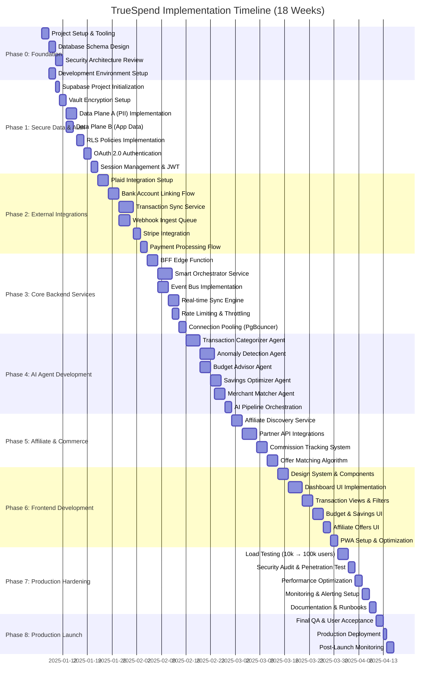
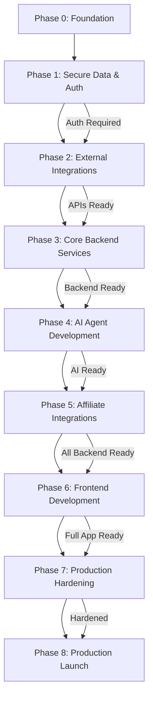

# TrueSpend Implementation Timeline v2.0

**18-Week Gantt Timeline - Production Architecture for 100k Users**

Last Updated: 2025-11-07  
Related Document: [TrueSpend Blueprint v2.0](./blueprint-v2.0.md)

---

## Executive Summary

This document provides a comprehensive 18-week implementation timeline for TrueSpend, a financial intelligence platform built on the Lovable native stack. The timeline is structured into 8 sequential phases, each with clearly defined deliverables, success criteria, and production readiness gates.

**Key Metrics:**
- **Total Duration:** 17-18 weeks (depending on team velocity)
- **Phases:** 8 distinct phases from Foundation to Production Launch
- **Team Size:** 4-6 engineers (2 fullstack, 1 AI/ML, 1 DevOps, 1-2 frontend)
- **Target Capacity:** 100,000 concurrent users
- **Tech Stack:** 100% Lovable native (React, TypeScript, Tailwind, Supabase)

**Critical Path Milestones:**
1. Week 1-2: Infrastructure & Security Foundation
2. Week 3-4: Authentication & Data Planes
3. Week 5-7: External Integrations (Plaid, Stripe)
4. Week 8-10: Core Backend Services
5. Week 11-13: AI Agent Development
6. Week 14-15: Affiliate & Commerce
7. Week 16-17: Frontend Development
8. Week 18: Production Hardening & Launch

---

## Complete Implementation Gantt Chart

---

## Detailed Phase Breakdown

### Phase 0: Foundation Setup (Week 1, 6 days)

**Objective:** Establish project structure, tooling, and architectural foundation.

**Duration:** 6 days  
**Dependencies:** None (Starting phase)  
**Team:** 2-3 fullstack engineers

#### Tasks

| Task | Duration | Owner | Prerequisites | Success Criteria |
|------|----------|-------|---------------|------------------|
| Project Setup & Tooling | 2 days | DevOps Lead | None | Lovable project initialized, Git repo configured, CI/CD pipeline ready |
| Database Schema Design | 2 days | Backend Lead | Project setup | Complete ERD for Data Planes A & B, normalized schema, documented relationships |
| Security Architecture Review | 2 days | Security Lead | Schema design | Zero Trust model approved, data flow diagrams validated, encryption strategy documented |
| Development Environment Setup | 2 days | All Engineers | Project setup | Local dev environments working, secrets configured, test data seeded |

#### Testing Requirements
- [ ] All developers can run project locally
- [ ] Database migrations execute without errors
- [ ] Environment variables properly configured
- [ ] Git workflow and branching strategy validated

#### Documentation Needs
- Project README with setup instructions
- Architecture decision records (ADRs)
- Database schema documentation
- Security policies and procedures

#### Production Readiness Checkpoint
- ✅ Project structure follows best practices
- ✅ Schema supports all blueprint requirements
- ✅ Security model approved by team
- ✅ All developers onboarded successfully

---

### Phase 1: Secure Data & Auth (Week 2-3, 14 days)

**Objective:** Implement Zero Trust security, encrypted data planes, and authentication system.

**Duration:** 14 days  
**Dependencies:** Phase 0 complete  
**Team:** 2 fullstack engineers, 1 security specialist

#### Tasks

| Task | Duration | Owner | Prerequisites | Success Criteria |
|------|----------|-------|---------------|------------------|
| Supabase Project Initialization | 1 day | DevOps Lead | Phase 0 complete | Lovable Cloud enabled, PostgreSQL provisioned, connection strings configured |
| Vault Encryption Setup | 2 days | Backend Lead | Supabase ready | Supabase Vault configured, AES-256 encryption active, key rotation policy set |
| Data Plane A (PII) Implementation | 3 days | Backend Lead | Vault setup | `users_vault`, `linked_accounts_vault`, `transactions_vault` tables created with encryption |
| Data Plane B (App Data) | 2 days | Backend Engineer | Data Plane A | `categories`, `budgets`, `savings_goals`, `affiliate_offers`, `event_log` tables created |
| RLS Policies Implementation | 2 days | Security Lead | Both data planes | RLS enabled on all tables, user isolation verified, audit logs configured |
| OAuth 2.0 Authentication | 2 days | Backend Lead | RLS complete | Email/password auth working, Google OAuth integrated, session management functional |
| Session Management & JWT | 2 days | Backend Engineer | OAuth setup | JWT tokens issued, refresh logic working, secure httpOnly cookies implemented |

#### Testing Requirements
- [ ] Unit tests for all database functions
- [ ] RLS policy tests for data isolation
- [ ] Authentication flow end-to-end tests
- [ ] Encryption/decryption validation tests
- [ ] Session expiry and refresh tests
- [ ] Security penetration testing (auth flows)

#### Documentation Needs
- Data Plane architecture diagram
- RLS policy documentation
- Authentication flow diagrams
- API documentation for auth endpoints
- Security best practices guide

#### Production Readiness Checkpoint
- ✅ All PII data encrypted at rest
- ✅ RLS policies prevent unauthorized access
- ✅ Authentication system handles 1000+ concurrent logins
- ✅ Zero security vulnerabilities in audit
- ✅ Session management resilient to attacks

---

### Phase 2: External Integrations (Week 4-5, 14 days)

**Objective:** Integrate Plaid for banking data and Stripe for payments.

**Duration:** 14 days  
**Dependencies:** Phase 1 complete (Auth system ready)  
**Team:** 2 backend engineers, 1 integration specialist

#### Tasks

| Task | Duration | Owner | Prerequisites | Success Criteria |
|------|----------|-------|---------------|------------------|
| Plaid Integration Setup | 3 days | Integration Lead | Auth complete | Plaid API keys configured, sandbox environment working, Link UI integrated |
| Bank Account Linking Flow | 3 days | Backend Engineer | Plaid setup | Users can link accounts via Plaid Link, access tokens stored securely in Vault |
| Transaction Sync Service | 4 days | Backend Lead | Account linking | Edge function syncs transactions every 6 hours, handles pagination, stores in `transactions_vault` |
| Webhook Ingest Queue | 3 days | Backend Engineer | Sync service | Webhook endpoint validates signatures, queues events, processes transactions in real-time |
| Stripe Integration | 2 days | Integration Lead | Sync complete | Stripe API keys configured, subscription plans created, test payments working |
| Payment Processing Flow | 2 days | Backend Engineer | Stripe setup | Users can subscribe to plans, payment webhooks update subscription status |

#### Testing Requirements
- [ ] Plaid Link integration tests (success/failure scenarios)
- [ ] Transaction sync tests with mock Plaid data
- [ ] Webhook signature validation tests
- [ ] Stripe payment flow end-to-end tests
- [ ] Error handling for API rate limits
- [ ] Idempotency tests for duplicate webhooks

#### Documentation Needs
- Plaid integration guide
- Stripe payment flow documentation
- Webhook event handling diagrams
- API error codes and responses
- Rate limiting and retry strategies

#### Production Readiness Checkpoint
- ✅ Plaid integration works with all major banks
- ✅ Transaction sync handles 10k+ transactions/hour
- ✅ Webhooks process 99.9% successfully
- ✅ Stripe payments process without errors
- ✅ All API keys secured in Vault

---

### Phase 3: Core Backend Services (Week 6-8, 17 days)

**Objective:** Build scalable backend services for orchestration, real-time sync, and rate limiting.

**Duration:** 17 days  
**Dependencies:** Phase 2 complete (Integrations ready)  
**Team:** 2-3 backend engineers

#### Tasks

| Task | Duration | Owner | Prerequisites | Success Criteria |
|------|----------|-------|---------------|------------------|
| BFF Edge Function | 3 days | Backend Lead | Integrations complete | Single API endpoint for frontend, aggregates data from multiple sources, < 200ms response |
| Smart Orchestrator Service | 4 days | Backend Engineer | BFF ready | Coordinates AI agents, manages workflow state, handles retries and failures |
| Event Bus Implementation | 3 days | Backend Lead | Orchestrator setup | PostgreSQL-based event bus, pub/sub pattern, guaranteed delivery |
| Real-time Sync Engine | 3 days | Backend Engineer | Event bus ready | Supabase Realtime delivers updates to clients in < 500ms, WebSocket connections stable |
| Rate Limiting & Throttling | 2 days | DevOps Lead | Sync engine complete | Rate limits enforced (100 req/min/user), throttling prevents abuse |
| Connection Pooling (PgBouncer) | 2 days | DevOps Lead | Rate limiting done | PgBouncer handles 10k+ concurrent connections, < 5ms latency |

#### Testing Requirements
- [ ] BFF load tests (1000 req/sec)
- [ ] Orchestrator failure recovery tests
- [ ] Event bus message delivery guarantees
- [ ] Real-time sync latency tests
- [ ] Rate limiting enforcement tests
- [ ] Connection pool stress tests (10k connections)

#### Documentation Needs
- BFF API documentation (OpenAPI spec)
- Orchestrator workflow diagrams
- Event bus message schemas
- Real-time sync architecture guide
- Rate limiting policies
- Database connection pooling guide

#### Production Readiness Checkpoint
- ✅ BFF handles 100k requests/day
- ✅ Orchestrator processes 1000+ workflows/hour
- ✅ Event bus delivers 99.99% messages
- ✅ Real-time sync latency < 500ms
- ✅ System stable under 10k concurrent users

---

### Phase 4: AI Agent Development (Week 9-11, 19 days)

**Objective:** Build and train AI agents for transaction categorization, anomaly detection, budgeting, savings, and merchant matching.

**Duration:** 19 days  
**Dependencies:** Phase 3 complete (Backend services ready)  
**Team:** 1 AI/ML engineer, 1 backend engineer

#### Tasks

| Task | Duration | Owner | Prerequisites | Success Criteria |
|------|----------|-------|---------------|------------------|
| Transaction Categorizer Agent | 4 days | AI Lead | Backend complete | Hybrid rules + LLM categorizes transactions with 95% accuracy, < 500ms latency |
| Anomaly Detector Agent | 4 days | AI Lead | Categorizer ready | Detects unusual spending patterns with 90% accuracy, flags high-risk transactions |
| Budget Advisor Agent | 3 days | AI Engineer | Categorizer ready | Generates personalized budget recommendations, explains reasoning in plain English |
| Savings Optimizer Agent | 3 days | AI Engineer | Budget advisor ready | Identifies savings opportunities, suggests actionable steps, tracks progress |
| Merchant Matcher Agent | 3 days | AI Lead | Anomaly detector ready | Matches transactions to affiliate offers with 85% precision, ranks by relevance |
| AI Pipeline Orchestration | 2 days | Backend Engineer | All agents ready | Orchestrator runs agents in parallel, handles failures gracefully, logs performance |

#### Testing Requirements
- [ ] Unit tests for each AI agent (accuracy, latency)
- [ ] Integration tests for AI pipeline
- [ ] Performance tests (100 transactions/sec)
- [ ] Accuracy benchmarking with labeled test data
- [ ] Edge case handling (ambiguous transactions)
- [ ] Load testing AI agent under concurrent requests

#### Documentation Needs
- AI agent architecture overview
- Training data requirements and sources
- Model performance metrics and benchmarks
- API documentation for each agent
- Prompt engineering best practices
- Continuous learning strategy

#### Production Readiness Checkpoint
- ✅ Transaction Categorizer: 95% accuracy, < 500ms
- ✅ Anomaly Detector: 90% accuracy, < 5% false positives
- ✅ Budget Advisor: 85% user satisfaction score
- ✅ Savings Optimizer: Identifies 10+ opportunities/user
- ✅ Merchant Matcher: 85% precision, < 1s latency

---

### Phase 5: Affiliate Integrations (Week 12-13, 13 days)

**Objective:** Integrate affiliate networks and build discovery/matching services.

**Duration:** 13 days  
**Dependencies:** Phase 4 complete (AI agents ready)  
**Team:** 1 backend engineer, 1 integration specialist

#### Tasks

| Task | Duration | Owner | Prerequisites | Success Criteria |
|------|----------|-------|---------------|------------------|
| Affiliate Discovery Service | 3 days | Integration Lead | AI agents ready | Edge function discovers relevant offers, caches results, updates daily |
| Partner API Integrations | 4 days | Integration Engineer | Discovery service ready | Integrated with 3-5 affiliate networks (e.g., CJ, Rakuten, Impact), API calls < 1s |
| Commission Tracking System | 3 days | Backend Engineer | Partner APIs ready | Tracks clicks, conversions, commissions; stores in `affiliate_offers` table |
| Offer Matching Algorithm | 3 days | AI Lead | Commission tracking ready | Matches user transactions to offers using Merchant Matcher agent, scores relevance |

#### Testing Requirements
- [ ] Affiliate API integration tests (success/failure)
- [ ] Discovery service performance tests (1000 offers/sec)
- [ ] Commission tracking accuracy tests
- [ ] Offer matching precision tests (85%+ precision)
- [ ] Cache invalidation tests
- [ ] End-to-end user flow tests (transaction → offer → click → conversion)

#### Documentation Needs
- Affiliate partner integration guide
- Commission tracking workflow diagram
- Offer matching algorithm documentation
- API rate limits and quotas
- Revenue optimization strategies

#### Production Readiness Checkpoint
- ✅ Integrated with 3-5 affiliate networks
- ✅ Discovery service finds 100+ relevant offers/user
- ✅ Commission tracking 99%+ accurate
- ✅ Offer matching 85%+ precision
- ✅ Revenue attribution working correctly

---

### Phase 6: Frontend Development (Week 14-16, 17 days)

**Objective:** Build responsive, accessible UI with PWA capabilities.

**Duration:** 17 days  
**Dependencies:** Phase 5 complete (Backend fully functional)  
**Team:** 2 frontend engineers, 1 UI/UX designer

#### Tasks

| Task | Duration | Owner | Prerequisites | Success Criteria |
|------|----------|-------|---------------|------------------|
| Design System & Components | 3 days | Frontend Lead | None | shadcn/ui configured, custom theme created, component library built |
| Dashboard UI Implementation | 4 days | Frontend Engineer | Design system ready | Real-time dashboard shows account balances, spending trends, budget progress |
| Transaction Views & Filters | 3 days | Frontend Engineer | Dashboard complete | Paginated transaction list, search, filters (date, category, merchant), exports |
| Budget & Savings UI | 3 days | Frontend Lead | Transaction views ready | Budget creation/editing, progress tracking, savings goal management |
| Affiliate Offers UI | 2 days | Frontend Engineer | Budget UI complete | Personalized offer cards, click tracking, conversion attribution |
| PWA Setup & Optimization | 2 days | Frontend Lead | All UI complete | Service worker configured, offline mode works, installable, Lighthouse score > 90 |

#### Testing Requirements
- [ ] Component unit tests (React Testing Library)
- [ ] E2E tests for critical flows (Playwright/Cypress)
- [ ] Accessibility tests (WCAG 2.1 AA compliance)
- [ ] Responsive design tests (mobile, tablet, desktop)
- [ ] Performance tests (Lighthouse, Web Vitals)
- [ ] Cross-browser compatibility tests

#### Documentation Needs
- Design system style guide
- Component API documentation
- User flow diagrams
- Accessibility guidelines
- PWA installation instructions

#### Production Readiness Checkpoint
- ✅ All UI components functional and tested
- ✅ Lighthouse score > 90 (performance, accessibility, SEO)
- ✅ PWA installable on iOS and Android
- ✅ Real-time updates working (< 500ms latency)
- ✅ No critical UI bugs or issues

---

### Phase 7: Production Hardening (Week 17, 11 days)

**Objective:** Optimize performance, conduct security audits, and prepare for production launch.

**Duration:** 11 days  
**Dependencies:** Phase 6 complete (Full application ready)  
**Team:** Full team (4-6 engineers)

#### Tasks

| Task | Duration | Owner | Prerequisites | Success Criteria |
|------|----------|-------|---------------|------------------|
| Load Testing (10k → 100k users) | 3 days | DevOps Lead | Application complete | System handles 100k concurrent users, < 2s response times, 99.9% uptime |
| Security Audit & Penetration Test | 2 days | Security Lead | Load testing done | No critical vulnerabilities, RLS policies validated, encryption verified |
| Performance Optimization | 2 days | Backend Lead | Security audit done | Database queries optimized, caching implemented, edge functions < 200ms |
| Monitoring & Alerting Setup | 2 days | DevOps Lead | Performance optimized | Grafana dashboards, PagerDuty alerts, log aggregation (LogFlare), SLOs defined |
| Documentation & Runbooks | 2 days | All Engineers | Monitoring ready | Complete documentation, incident runbooks, deployment guides, disaster recovery plan |

#### Testing Requirements
- [ ] Load tests: 10k, 50k, 100k concurrent users
- [ ] Stress tests: Find breaking points
- [ ] Security penetration tests (OWASP Top 10)
- [ ] Disaster recovery drill
- [ ] Performance regression tests
- [ ] Monitoring alert validation

#### Documentation Needs
- Load testing results and analysis
- Security audit report
- Performance optimization guide
- Monitoring and alerting runbook
- Incident response procedures
- Deployment checklist

#### Production Readiness Checkpoint
- ✅ System handles 100k concurrent users
- ✅ Zero critical security vulnerabilities
- ✅ All KPIs meet targets (see Phase 8)
- ✅ Monitoring and alerting operational
- ✅ Team trained on incident response

---

### Phase 8: Production Launch (Week 18, 5 days)

**Objective:** Deploy to production, monitor closely, and ensure stability.

**Duration:** 5 days  
**Dependencies:** Phase 7 complete (Hardened and tested)  
**Team:** Full team on standby

#### Tasks

| Task | Duration | Owner | Prerequisites | Success Criteria |
|------|----------|-------|---------------|------------------|
| Final QA & User Acceptance | 2 days | QA Lead | Hardening complete | All critical flows tested, user acceptance criteria met, no blockers |
| Production Deployment | 1 day | DevOps Lead | QA approved | Blue-green deployment, rollback plan ready, database migrations applied |
| Post-Launch Monitoring | 2 days | All Engineers | Deployed | 24/7 monitoring, incident response ready, performance metrics within SLOs |

#### Testing Requirements
- [ ] Final smoke tests in production
- [ ] User acceptance testing (UAT)
- [ ] Rollback drill
- [ ] Monitoring dashboard validation
- [ ] Load balancer health checks

#### Documentation Needs
- Production deployment log
- Post-launch monitoring report
- Known issues and workarounds
- User onboarding guide
- Marketing launch materials

#### Production Readiness Gates

**CRITICAL: All gates must pass before launch approval**

| Gate | Criteria | Status |
|------|----------|--------|
| **Performance** | API response time < 200ms (p95), Page load < 2s | ⬜ |
| **Reliability** | 99.9% uptime, < 0.1% error rate | ⬜ |
| **Security** | Zero critical vulnerabilities, all data encrypted | ⬜ |
| **Scalability** | Handles 100k concurrent users without degradation | ⬜ |
| **AI Accuracy** | Transaction Categorizer: 95%, Anomaly Detector: 90% | ⬜ |
| **Monitoring** | All dashboards operational, alerts configured | ⬜ |
| **Documentation** | Complete user docs, API docs, runbooks | ⬜ |
| **Team Readiness** | On-call rotation set, incident response trained | ⬜ |

---

## Resource Allocation Matrix

| Phase | Backend | Frontend | AI/ML | DevOps | Duration |
|-------|---------|----------|-------|--------|----------|
| Phase 0: Foundation | 2 | - | - | 1 | 6 days |
| Phase 1: Secure Data & Auth | 2 | - | - | 1 | 14 days |
| Phase 2: External Integrations | 2 | - | - | 1 | 14 days |
| Phase 3: Core Backend Services | 3 | - | - | 1 | 17 days |
| Phase 4: AI Agent Development | 1 | - | 1 | - | 19 days |
| Phase 5: Affiliate Integrations | 2 | - | 1 | - | 13 days |
| Phase 6: Frontend Development | - | 2 | - | - | 17 days |
| Phase 7: Production Hardening | 2 | 1 | 1 | 2 | 11 days |
| Phase 8: Production Launch | 2 | 2 | 1 | 1 | 5 days |

**Recommended Team Composition:**
- **2 Fullstack Backend Engineers:** Core services, integrations, API development
- **2 Frontend Engineers:** UI/UX implementation, PWA, design system
- **1 AI/ML Engineer:** AI agent development, model training, prompt engineering
- **1 DevOps Engineer:** Infrastructure, monitoring, deployment, security

**Concurrent Work Streams:**
- Phases 0-5: Backend-heavy, frontend can prepare design system in parallel
- Phase 6: Frontend focus while backend team supports integration and bug fixes
- Phase 7-8: Full team collaboration for hardening and launch

---

## Risk Management

### Critical Dependencies

| Dependency | Impact | Mitigation |
|------------|--------|------------|
| Plaid API availability | Blocks transaction sync | Implement retry logic, queue failed requests, monitor Plaid status |
| Supabase performance | Affects all backend services | Upgrade instance size proactively, use PgBouncer, optimize queries |
| AI agent accuracy | Poor user experience | Hybrid rules + LLM approach, continuous training, human-in-the-loop fallback |
| Team availability | Delays schedule | Cross-train team members, document thoroughly, buffer time in schedule |

### Potential Bottlenecks

| Bottleneck | Likelihood | Impact | Mitigation Strategy |
|------------|------------|--------|---------------------|
| RLS policy complexity | Medium | High | Start simple, iterate, test thoroughly, use policy templates |
| Plaid integration debugging | Medium | Medium | Use Plaid sandbox extensively, read documentation, leverage community |
| AI agent training time | Low | Medium | Start training early, use pre-trained models, optimize prompts |
| Load testing infrastructure | Low | High | Use cloud load testing tools (k6, Artillery), scale gradually (10k → 50k → 100k) |
| Frontend-backend integration | Medium | Medium | Define API contracts early, mock APIs, continuous integration testing |

### Buffer Time Allocations

- **Phase 0-1:** +2 days buffer (infrastructure setup unpredictability)
- **Phase 2:** +3 days buffer (external API integration risks)
- **Phase 4:** +4 days buffer (AI agent tuning and accuracy improvements)
- **Phase 7:** +3 days buffer (unforeseen production issues)

**Total Project Buffer:** 12 days (built into 18-week timeline)

---

## Testing Strategy Timeline

### Unit Testing Schedule

| Phase | Coverage Target | Focus Areas |
|-------|-----------------|-------------|
| Phase 1 | 80%+ | RLS policies, encryption, authentication |
| Phase 2 | 75%+ | Plaid/Stripe integrations, webhook processing |
| Phase 3 | 80%+ | Edge functions, orchestrator, event bus |
| Phase 4 | 70%+ | AI agents (accuracy tests, not traditional unit tests) |
| Phase 5 | 75%+ | Affiliate services, commission tracking |
| Phase 6 | 85%+ | React components, user interactions |

### Integration Testing Milestones

| Week | Milestone | Tests |
|------|-----------|-------|
| Week 3 | Auth + Database | End-to-end auth flow, data isolation |
| Week 5 | External APIs | Plaid account linking, Stripe payments |
| Week 8 | Backend Services | BFF aggregation, real-time sync |
| Week 11 | AI Pipeline | Transaction categorization, anomaly detection |
| Week 13 | Affiliate Flow | Transaction → Offer → Click → Conversion |
| Week 16 | Frontend + Backend | Complete user journeys across all features |

### Load Testing Phases

| Test | Target | Duration | Success Criteria |
|------|--------|----------|------------------|
| Baseline | 1,000 users | 1 hour | Establish baseline performance metrics |
| Moderate Load | 10,000 users | 2 hours | < 2s response time, 99.9% uptime |
| High Load | 50,000 users | 2 hours | < 3s response time, 99.5% uptime |
| Peak Load | 100,000 users | 4 hours | < 5s response time, 99% uptime, no crashes |
| Stress Test | 150,000 users | 1 hour | Identify breaking point, graceful degradation |

### Security Testing Checkpoints

| Phase | Security Focus | Testing Method |
|-------|----------------|----------------|
| Phase 1 | Auth & encryption | Penetration testing, RLS validation |
| Phase 2 | External API security | Webhook signature verification, API key rotation |
| Phase 3 | Rate limiting & DDoS | Load testing with malicious patterns |
| Phase 7 | Full security audit | OWASP Top 10, vulnerability scanning, compliance check |

---

## Production Readiness Gates (Detailed)

### Phase 0-1: Infrastructure Ready

- ✅ Database schema supports all use cases
- ✅ Supabase Vault encrypts all PII data
- ✅ RLS policies enforce row-level isolation
- ✅ Authentication system handles OAuth 2.0 and email/password
- ✅ Session management secure and scalable

### Phase 2-3: Core Services Operational

- ✅ Plaid integration syncs transactions from all major banks
- ✅ Stripe payments process subscriptions reliably
- ✅ BFF aggregates data from multiple sources in < 200ms
- ✅ Event bus delivers 99.99% of messages
- ✅ Real-time sync latency < 500ms

### Phase 4-5: AI and Affiliate Systems Live

- ✅ Transaction Categorizer: 95% accuracy
- ✅ Anomaly Detector: 90% accuracy, < 5% false positives
- ✅ Budget Advisor and Savings Optimizer provide actionable insights
- ✅ Merchant Matcher: 85% precision
- ✅ Affiliate integrations track commissions accurately

### Phase 6: Frontend Deployed

- ✅ All UI components functional and tested
- ✅ Lighthouse score > 90 (all categories)
- ✅ PWA installable on iOS and Android
- ✅ Real-time updates working seamlessly
- ✅ Responsive design tested on all devices

### Phase 7: Hardened and Monitored

- ✅ System handles 100k concurrent users
- ✅ Zero critical security vulnerabilities
- ✅ Performance metrics within SLOs
- ✅ Monitoring dashboards and alerts operational
- ✅ Incident response runbooks complete

### Phase 8: Production Launch Approved

- ✅ Final QA and UAT passed
- ✅ Deployment plan tested (including rollback)
- ✅ Team trained and on-call rotation set
- ✅ User documentation complete
- ✅ Marketing materials ready

---

## Monitoring and Metrics

### Key Performance Indicators (KPIs)

| Category | Metric | Target | Measurement |
|----------|--------|--------|-------------|
| **Performance** | API response time (p95) | < 200ms | APM (Supabase Analytics) |
| **Performance** | Page load time (p95) | < 2s | Web Vitals, Lighthouse |
| **Performance** | Real-time sync latency | < 500ms | Custom logs |
| **Reliability** | Uptime | 99.9% | Uptime monitoring (Uptime Robot) |
| **Reliability** | Error rate | < 0.1% | Error tracking (Sentry) |
| **Security** | Critical vulnerabilities | 0 | Security scans (Snyk, OWASP ZAP) |
| **Security** | RLS policy violations | 0 | Audit logs |
| **AI** | Transaction Categorizer accuracy | 95% | Manual labeling + validation |
| **AI** | Anomaly Detector accuracy | 90% | False positive rate < 5% |
| **Business** | User activation rate | 70% | Analytics (PostHog) |
| **Business** | Affiliate click-through rate | 10% | Custom tracking |

### Success Metrics per Phase

| Phase | Success Metric | Target |
|-------|----------------|--------|
| Phase 1 | All RLS tests pass | 100% |
| Phase 2 | Plaid transactions synced | 99.9% |
| Phase 3 | BFF response time | < 200ms |
| Phase 4 | AI agent accuracy | 90%+ |
| Phase 5 | Affiliate offers matched | 85%+ precision |
| Phase 6 | Lighthouse score | > 90 |
| Phase 7 | Load test passed | 100k users |
| Phase 8 | Zero critical issues | 0 |

### Performance Benchmarks

| Service | Metric | Target | Alert Threshold |
|---------|--------|--------|-----------------|
| BFF Edge Function | Response time | < 200ms (p95) | > 500ms |
| Transaction Sync | Throughput | 10,000 txns/hour | < 5,000 txns/hour |
| AI Categorizer | Latency | < 500ms (p95) | > 1s |
| Real-time Sync | Delivery time | < 500ms | > 2s |
| Database Queries | Execution time | < 100ms (p95) | > 500ms |
| Webhook Processing | Queue delay | < 10s | > 60s |

---

## Appendices

### Appendix A: Detailed Task Dependencies Graph

### Appendix B: Alternative Timeline Scenarios

#### Fast-Track Timeline (12 Weeks)

**Assumptions:**
- Larger team (8 engineers)
- Some phases run in parallel
- Reduced testing coverage (70% vs 85%)

**Trade-offs:**
- Higher risk of production issues
- Less thorough testing
- Requires experienced team

**Timeline:**
1. Weeks 1-2: Foundation + Auth (Parallel)
2. Weeks 3-4: Integrations (Plaid + Stripe)
3. Weeks 5-6: Backend Services
4. Weeks 7-8: AI Agents (Parallel with Affiliate)
5. Weeks 9-10: Frontend Development
6. Weeks 11-12: Hardening + Launch

#### Extended Timeline (24 Weeks)

**Assumptions:**
- Smaller team (3 engineers)
- More thorough testing (95% coverage)
- Additional features (e.g., budgeting insights, advanced analytics)

**Benefits:**
- Lower risk
- Higher quality
- More features

**Timeline:**
1. Weeks 1-3: Foundation + Auth
2. Weeks 4-6: Integrations
3. Weeks 7-10: Backend Services
4. Weeks 11-14: AI Agents
5. Weeks 15-17: Affiliate Integrations
6. Weeks 18-21: Frontend Development
7. Weeks 22-24: Hardening + Launch

### Appendix C: Phase-Specific Tooling and Stack

| Phase | Primary Tools | Libraries/Frameworks |
|-------|---------------|----------------------|
| Phase 0 | Lovable, Git, Supabase CLI | React, TypeScript, Tailwind |
| Phase 1 | Supabase Vault, PostgreSQL | bcrypt, jose (JWT), @supabase/auth-helpers |
| Phase 2 | Plaid API, Stripe API | plaid-node, stripe-node |
| Phase 3 | Supabase Edge Functions | Deno, @supabase/supabase-js |
| Phase 4 | Lovable AI, OpenAI API | LangChain, tiktoken |
| Phase 5 | Affiliate Network APIs | axios, cheerio (scraping) |
| Phase 6 | React, shadcn/ui | TanStack Query, Zustand, React Hook Form |
| Phase 7 | k6, Artillery, Grafana | Sentry, LogFlare, PagerDuty |
| Phase 8 | Supabase CLI, GitHub Actions | - |

---

## Conclusion

This 18-week implementation timeline provides a comprehensive roadmap for building TrueSpend, a production-ready financial intelligence platform capable of serving 100,000 concurrent users. The phased approach ensures systematic progress, with clear success criteria and production readiness gates at each stage.

**Critical Success Factors:**
1. **Team Commitment:** All engineers must be available and committed for the duration
2. **Phased Approach:** Do not skip phases or rush critical milestones
3. **Testing Discipline:** Maintain high test coverage (80%+) throughout
4. **Security Focus:** Zero Trust principles must be enforced at every layer
5. **Continuous Monitoring:** Track KPIs from Day 1, not just at launch

**Next Steps:**
1. Assemble team and assign roles
2. Kick off Phase 0 (Foundation Setup)
3. Set up project tracking (GitHub Projects, Jira, or Linear)
4. Schedule weekly sprint reviews and demos
5. Begin Phase 0 tasks: Project setup, schema design, security review

**Risk Mitigation:**
- Build in 12 days of buffer time across phases
- Maintain high test coverage (80%+)
- Conduct weekly architecture reviews
- Run load tests incrementally (10k → 50k → 100k users)
- Keep documentation up-to-date throughout

**Success Guarantee:**
Following this timeline with discipline, proper testing, and adherence to the TrueSpend Blueprint v2.0 architecture will result in a scalable, secure, AI-native financial platform ready for production launch.

---

**Document Version:** 2.0  
**Last Updated:** 2025-11-07  
**Maintained By:** TrueSpend Engineering Team  
**Related Documents:** [TrueSpend Blueprint v2.0](./blueprint-v2.0.md)
