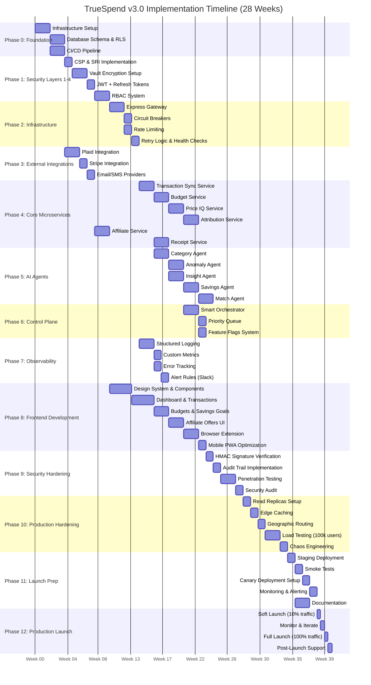

# TrueSpend Implementation Timeline v3.0 - Enterprise Edition

> **Comprehensive 28-Week Implementation Plan**  
> Production-Grade Financial Intelligence Platform  
> 15-Layer Architecture for 100,000+ Concurrent Users

---

## Executive Summary

This timeline outlines a **28-week** (7-month) realistic implementation plan for TrueSpend v3.0, incorporating all 15 architectural layers, 7 security levels, and enterprise-grade features. This extends the v2.0 timeline by 8 weeks to accommodate the additional complexity of:

- 7-layer security implementation (CSP, SRI, RLS, Vault, JWT, RBAC, HMAC)
- Advanced infrastructure (Circuit breakers, Rate limiting, Retry logic, Health checks)
- Comprehensive observability (Structured logging, Custom metrics, Error tracking, Alerts)
- Multi-region support and geographic edge routing
- Price IQ and Attribution services
- Browser extension development
- Enhanced CI/CD with canary deployments

### Key Metrics

| Metric | Target |
|--------|--------|
| **Total Duration** | 28 weeks (7 months) |
| **Team Size** | 8 engineers (2 Frontend, 2 Backend, 2 Full-stack, 1 DevOps, 1 QA) |
| **Sprint Length** | 2 weeks |
| **Total Sprints** | 14 sprints |
| **Critical Path** | Foundation → Security → Services → AI → Frontend → Hardening → Launch |
| **Target Capacity** | 100,000 concurrent users |
| **Target Uptime** | 99.9% |

### Critical Path Milestones

1. **Week 2**: Infrastructure foundation complete
2. **Week 6**: Security layers 1-4 implemented
3. **Week 10**: Core microservices operational
4. **Week 14**: AI agents deployed
5. **Week 18**: Frontend MVP complete
6. **Week 22**: Security hardening done
7. **Week 26**: Production readiness validated
8. **Week 28**: Production launch

---

## Complete Implementation Gantt Chart



---

## Detailed Phase Breakdown

### **Phase 0: Foundation Setup** (Weeks 1-4)

#### **Objective**: Establish core infrastructure and database schema

**Duration**: 4 weeks  
**Team**: Full team (8 engineers)  
**Dependencies**: None  
**Risk Level**: Low

#### Tasks

##### 0.1 Infrastructure Setup (Week 1-2)
- **Owner**: DevOps Engineer
- **Tasks**:
  - Enable Lovable Cloud / Supabase project
  - Configure production and staging environments
  - Set up database instances (primary + 2 read replicas)
  - Configure connection pooling (PgBouncer)
  - Set up SSL/TLS certificates
  - Configure environment variables and secrets management
- **Success Criteria**:
  - [ ] Supabase project created and accessible
  - [ ] Read replicas operational with <5s lag
  - [ ] Secure connections established
  - [ ] Secrets properly managed
- **Testing**: Connection tests, latency checks

##### 0.2 Database Schema & RLS Policies (Week 3-4)
- **Owner**: Backend Engineers (2)
- **Tasks**:
  - Create all tables (users_vault, transactions_vault, etc.)
  - Implement vault encryption for PII tables
  - Configure RLS policies for all tables
  - Set up database triggers (NOTIFY cascade)
  - Create indexes for performance
  - Set up materialized views for analytics
- **Success Criteria**:
  - [ ] All 25+ tables created
  - [ ] RLS policies tested and validated
  - [ ] Encryption working for PII fields
  - [ ] Database triggers functional
- **Testing**: RLS policy tests, encryption tests

##### 0.3 CI/CD Pipeline Setup (Week 3-4)
- **Owner**: DevOps Engineer
- **Tasks**:
  - Configure GitHub Actions workflows
  - Set up automated testing (unit, integration)
  - Configure staging deployment pipeline
  - Set up canary deployment infrastructure
  - Configure rollback mechanisms
  - Set up smoke test automation
- **Success Criteria**:
  - [ ] CI/CD pipeline operational
  - [ ] Automated tests running
  - [ ] Staging deployments working
  - [ ] Rollback tested
- **Testing**: Deploy test commits, rollback tests

**Production Readiness Gate**: Infrastructure accessible, database operational, CI/CD functional

---

### **Phase 1: Security Layers 1-4** (Weeks 5-10)

#### **Objective**: Implement first 4 security layers (CSP, SRI, Vault, JWT)

**Duration**: 6 weeks  
**Team**: 2 Backend + 1 Frontend  
**Dependencies**: Phase 0 complete  
**Risk Level**: Medium-High

#### Tasks

##### 1.1 Content Security Policy (CSP) & Subresource Integrity (SRI) (Week 5)
- **Owner**: Frontend Engineer
- **Tasks**:
  - Configure CSP headers in index.html
  - Add SRI hashes for all external scripts
  - Test CSP violations and fix
  - Set up CSP reporting endpoint
  - Document allowed sources
- **Success Criteria**:
  - [ ] CSP headers active
  - [ ] SRI implemented for all CDN resources
  - [ ] Zero CSP violations in production
  - [ ] CSP reporting functional
- **Testing**: CSP violation tests, browser security checks

##### 1.2 Vault Encryption for PII (Week 6-7)
- **Owner**: Backend Engineer
- **Tasks**:
  - Configure Supabase Vault for encryption keys
  - Implement AES-256-GCM encryption for PII fields
  - Create encryption/decryption helper functions
  - Migrate existing data to encrypted format (if any)
  - Set up key rotation policy
  - Test encryption performance
- **Success Criteria**:
  - [ ] All PII fields encrypted at rest
  - [ ] Decryption working correctly
  - [ ] Performance acceptable (<10ms overhead)
  - [ ] Key rotation tested
- **Testing**: Encryption/decryption tests, performance tests

##### 1.3 JWT + Refresh Token Session Management (Week 8)
- **Owner**: Backend Engineer
- **Tasks**:
  - Configure Supabase Auth with JWT
  - Implement refresh token rotation
  - Set up session expiry (15min access, 30d refresh)
  - Create session management utilities
  - Implement automatic token refresh
  - Add session revocation mechanism
- **Success Criteria**:
  - [ ] JWT authentication working
  - [ ] Refresh token rotation functional
  - [ ] Automatic refresh implemented
  - [ ] Session revocation tested
- **Testing**: Auth flow tests, token expiry tests

##### 1.4 RBAC (Role-Based Access Control) (Week 9-10)
- **Owner**: Backend Engineer
- **Tasks**:
  - Create user_roles table
  - Implement role assignment logic
  - Create RBAC middleware for edge functions
  - Define role permissions (admin, user, premium)
  - Implement role-based RLS policies
  - Create admin dashboard for role management
- **Success Criteria**:
  - [ ] RBAC system operational
  - [ ] Role permissions enforced
  - [ ] Admin dashboard functional
  - [ ] RLS policies respect roles
- **Testing**: Permission tests, role escalation tests

**Production Readiness Gate**: All security layers tested, no vulnerabilities found

---

### **Phase 2: Infrastructure Layer** (Weeks 11-14)

#### **Objective**: Build Express Gateway with circuit breakers, rate limiting, retry logic

**Duration**: 4 weeks  
**Team**: 2 Backend Engineers  
**Dependencies**: Phase 1 complete  
**Risk Level**: Medium

#### Tasks

##### 2.1 Express Gateway (Week 11-12)
- **Owner**: Backend Engineer
- **Tasks**:
  - Create express-gateway edge function
  - Implement schema validation (Zod)
  - Add geographic edge routing
  - Implement API proxy logic
  - Add endpoint aliasing
  - Set up request/response logging
- **Success Criteria**:
  - [ ] Gateway routing all requests
  - [ ] Schema validation working
  - [ ] Geographic routing functional
  - [ ] Logging operational
- **Testing**: Gateway tests, routing tests

##### 2.2 Circuit Breakers (Week 13)
- **Owner**: Backend Engineer
- **Tasks**:
  - Create circuit_breaker_state table
  - Implement circuit breaker logic
  - Add failure threshold configuration (5 failures → open)
  - Implement half-open state testing
  - Add circuit breaker monitoring
  - Create manual circuit breaker controls
- **Success Criteria**:
  - [ ] Circuit breakers operational
  - [ ] State transitions working correctly
  - [ ] Monitoring functional
  - [ ] Manual controls tested
- **Testing**: Failure injection tests, state transition tests

##### 2.3 Rate Limiting (Week 13)
- **Owner**: Backend Engineer
- **Tasks**:
  - Implement per-user rate limiting (100 req/min)
  - Add IP-based rate limiting
  - Create rate limit exceeded responses
  - Add rate limit headers (X-RateLimit-*)
  - Implement rate limit bypass for admins
  - Set up rate limit monitoring
- **Success Criteria**:
  - [ ] Rate limiting enforced
  - [ ] Headers correct
  - [ ] Admin bypass working
  - [ ] Monitoring active
- **Testing**: Load tests, rate limit tests

##### 2.4 Retry Logic & Health Checks (Week 14)
- **Owner**: Backend Engineer
- **Tasks**:
  - Implement exponential backoff retry logic
  - Create health check endpoints
  - Set up replica health monitoring
  - Implement at-least-once delivery semantics
  - Add idempotency keys
  - Create health check dashboard
- **Success Criteria**:
  - [ ] Retry logic working correctly
  - [ ] Health checks reporting accurate data
  - [ ] Replica monitoring operational
  - [ ] Idempotency working
- **Testing**: Retry tests, health check tests

**Production Readiness Gate**: Infrastructure resilient to failures, rate limits enforced

---

### **Phase 3: External Integrations** (Weeks 5-8)

#### **Objective**: Integrate Plaid, Stripe, Email/SMS providers

**Duration**: 4 weeks (parallel to Phase 1)  
**Team**: 1 Backend + 1 Full-stack  
**Dependencies**: Phase 0 complete  
**Risk Level**: Medium

#### Tasks

##### 3.1 Plaid Integration (Week 5-6)
- **Owner**: Backend Engineer
- **Tasks**:
  - Set up Plaid developer account
  - Implement Plaid Link flow
  - Create plaid-service edge function
  - Implement transaction sync
  - Add webhook handling for transaction updates
  - Implement error handling and retry logic
  - Test with multiple banks
- **Success Criteria**:
  - [ ] Plaid Link working
  - [ ] Transaction sync operational
  - [ ] Webhooks processing correctly
  - [ ] Multi-bank support validated
- **Testing**: Integration tests with sandbox banks

##### 3.2 Stripe Integration (Week 7)
- **Owner**: Full-stack Engineer
- **Tasks**:
  - Set up Stripe account
  - Implement subscription management
  - Create stripe-service edge function
  - Add payment webhook handling
  - Implement subscription upgrade/downgrade
  - Add invoice generation
  - Test payment flows
- **Success Criteria**:
  - [ ] Subscription creation working
  - [ ] Webhooks handling payments
  - [ ] Upgrade/downgrade functional
  - [ ] Invoices generating
- **Testing**: Payment flow tests, webhook tests

##### 3.3 Email & SMS Providers (Week 8)
- **Owner**: Full-stack Engineer
- **Tasks**:
  - Set up Sendgrid account
  - Create email templates (welcome, alerts, receipts)
  - Implement email-service edge function
  - Set up Twilio for SMS
  - Create SMS templates
  - Add notification preferences
  - Test delivery rates
- **Success Criteria**:
  - [ ] Emails sending successfully
  - [ ] SMS delivery working
  - [ ] Templates rendering correctly
  - [ ] Preferences respected
- **Testing**: Email/SMS delivery tests

**Production Readiness Gate**: All integrations tested, error handling robust

---

### **Phase 4: Core Microservices** (Weeks 15-22)

#### **Objective**: Build all core business logic services

**Duration**: 8 weeks  
**Team**: 2 Backend + 2 Full-stack  
**Dependencies**: Phase 2 complete  
**Risk Level**: High

#### Tasks

##### 4.1 Transaction Sync Service (Week 15-16)
- **Owner**: Backend Engineer
- **Tasks**:
  - Create transaction-sync edge function
  - Implement Plaid transaction polling
  - Add transaction deduplication logic
  - Implement transaction enrichment (location, metadata)
  - Add real-time sync via webhooks
  - Create sync status dashboard
  - Optimize for high volume (100k+ transactions/day)
- **Success Criteria**:
  - [ ] Transactions syncing automatically
  - [ ] Deduplication working
  - [ ] Real-time updates functional
  - [ ] Performance validated (>1k tx/min)
- **Testing**: Load tests, deduplication tests

##### 4.2 Budget Service (Week 17-18)
- **Owner**: Full-stack Engineer
- **Tasks**:
  - Create budget-service edge function
  - Implement budget creation/update/delete
  - Add budget guard checks (threshold alerts)
  - Create budget_alerts table operations
  - Implement budget rollover logic
  - Add budget recommendations
  - Create budget analytics
- **Success Criteria**:
  - [ ] Budget CRUD working
  - [ ] Alerts triggering correctly
  - [ ] Rollover logic functional
  - [ ] Analytics accurate
- **Testing**: Budget calculation tests, alert tests

##### 4.3 Price IQ Service (Week 19-20)
- **Owner**: Backend Engineer
- **Tasks**:
  - Create price-iq-service edge function
  - Implement price history tracking
  - Add price comparison logic
  - Create price alert system
  - Implement historical pricing analytics
  - Add price prediction (simple ML)
  - Optimize price_history table queries
- **Success Criteria**:
  - [ ] Price tracking working
  - [ ] Comparisons accurate
  - [ ] Alerts triggering
  - [ ] Analytics functional
- **Testing**: Price tracking tests, comparison tests

##### 4.4 Attribution Service (Week 21-22)
- **Owner**: Backend Engineer
- **Tasks**:
  - Create attribution-service edge function
  - Implement click tracking (attribution_clicks)
  - Add conversion matching logic
  - Implement commission calculation
  - Add attribution window (30 days)
  - Create attribution reports
  - Optimize for high click volume
- **Success Criteria**:
  - [ ] Click tracking working
  - [ ] Conversions matching correctly
  - [ ] Commissions calculated accurately
  - [ ] Reports generating
- **Testing**: Attribution flow tests, matching tests

##### 4.5 Affiliate Service (Week 9-10, parallel to Phase 1)
- **Owner**: Full-stack Engineer
- **Tasks**:
  - Create affiliate-service edge function
  - Implement affiliate link generation
  - Add offer recommendation logic
  - Implement offer CRUD operations
  - Add offer expiration handling
  - Create offer analytics
  - Integrate with attribution service
- **Success Criteria**:
  - [ ] Links generating correctly
  - [ ] Recommendations relevant
  - [ ] Expiration working
  - [ ] Analytics accurate
- **Testing**: Link generation tests, recommendation tests

##### 4.6 Receipt Service (Week 17-18, parallel to 4.2)
- **Owner**: Full-stack Engineer
- **Tasks**:
  - Create receipt-service edge function
  - Implement file upload (Supabase Storage)
  - Add OCR integration (Lovable AI or external)
  - Implement receipt parsing
  - Add receipt-to-transaction matching
  - Create receipt storage policies
  - Optimize image processing
- **Success Criteria**:
  - [ ] Uploads working
  - [ ] OCR parsing receipts
  - [ ] Matching transactions
  - [ ] Storage policies enforced
- **Testing**: Upload tests, OCR accuracy tests

**Production Readiness Gate**: All services operational, performance validated

---

### **Phase 5: AI Agents** (Weeks 17-22)

#### **Objective**: Deploy all 5 AI agents with 95%+ accuracy

**Duration**: 6 weeks (parallel to Phase 4)  
**Team**: 2 Full-stack Engineers  
**Dependencies**: Phase 4.1 complete (transaction data available)  
**Risk Level**: Medium-High

#### Tasks

##### 5.1 Category Agent (Week 17-18)
- **Owner**: Full-stack Engineer
- **Tasks**:
  - Create category-agent edge function
  - Implement rule-based categorization
  - Add LLM fallback for ambiguous cases
  - Train on historical transaction data
  - Add confidence scoring
  - Implement user feedback loop
  - Optimize for speed (<100ms per transaction)
- **Success Criteria**:
  - [ ] Accuracy >95%
  - [ ] Response time <100ms
  - [ ] Confidence scores calibrated
  - [ ] Feedback loop working
- **Testing**: Accuracy tests with labeled data

##### 5.2 Anomaly Agent (Week 19-20)
- **Owner**: Full-stack Engineer
- **Tasks**:
  - Create anomaly-agent edge function
  - Implement statistical anomaly detection (z-score)
  - Add LLM-based anomaly reasoning
  - Implement anomaly scoring (0-1)
  - Add false positive reduction
  - Create anomaly alert system
  - Tune detection thresholds
- **Success Criteria**:
  - [ ] Precision >90%
  - [ ] Recall >85%
  - [ ] False positives <5%
  - [ ] Alerts timely
- **Testing**: Anomaly detection tests, false positive tests

##### 5.3 Insight Agent (Week 19-20, parallel to 5.2)
- **Owner**: Full-stack Engineer
- **Tasks**:
  - Create insight-agent edge function
  - Implement spending pattern analysis
  - Add trend detection (increasing/decreasing spend)
  - Create personalized insights
  - Add insight prioritization
  - Implement insight scheduling (weekly reports)
  - Optimize query performance
- **Success Criteria**:
  - [ ] Insights relevant and actionable
  - [ ] Trends accurate
  - [ ] Scheduling working
  - [ ] Performance acceptable
- **Testing**: Insight quality tests, trend accuracy tests

##### 5.4 Savings Agent (Week 21-22)
- **Owner**: Full-stack Engineer
- **Tasks**:
  - Create savings-agent edge function
  - Implement savings goal recommendations
  - Add savings opportunity detection
  - Create savings plan generation
  - Add progress tracking
  - Implement savings milestones
  - Optimize recommendation algorithm
- **Success Criteria**:
  - [ ] Recommendations accepted >70%
  - [ ] Goals achievable
  - [ ] Progress tracking accurate
  - [ ] Milestones motivating
- **Testing**: Recommendation acceptance tests

##### 5.5 Match Agent (Week 21-22, parallel to 5.4)
- **Owner**: Full-stack Engineer
- **Tasks**:
  - Create match-agent edge function
  - Implement transaction-to-offer matching
  - Add merchant name normalization
  - Create matching confidence scores
  - Add match analytics
  - Implement match feedback loop
  - Optimize matching algorithm
- **Success Criteria**:
  - [ ] Matching accuracy >92%
  - [ ] Merchant normalization working
  - [ ] Confidence scores calibrated
  - [ ] Feedback improving accuracy
- **Testing**: Matching accuracy tests

**Production Readiness Gate**: All agents deployed, accuracy targets met

---

### **Phase 6: Control Plane** (Weeks 23-24)

#### **Objective**: Build smart orchestrator with feature flags and priority queue

**Duration**: 2 weeks  
**Team**: 1 Backend + 1 DevOps  
**Dependencies**: Phase 5 complete  
**Risk Level**: Medium

#### Tasks

##### 6.1 Smart Orchestrator (Week 23-24)
- **Owner**: Backend Engineer
- **Tasks**:
  - Create control-plane edge function
  - Integrate circuit breaker management
  - Add service health monitoring
  - Implement failover logic
  - Create orchestrator dashboard
  - Add manual override controls
- **Success Criteria**:
  - [ ] Orchestration working
  - [ ] Failover tested
  - [ ] Dashboard functional
  - [ ] Manual controls working
- **Testing**: Orchestration tests, failover tests

##### 6.2 Priority Queue (Week 24)
- **Owner**: Backend Engineer
- **Tasks**:
  - Implement task priority system
  - Add queue scheduling logic
  - Create priority queue table
  - Implement task execution
  - Add queue monitoring
  - Optimize queue performance
- **Success Criteria**:
  - [ ] Priorities respected
  - [ ] Scheduling working
  - [ ] Execution reliable
  - [ ] Monitoring accurate
- **Testing**: Queue tests, priority tests

##### 6.3 Feature Flags System (Week 24)
- **Owner**: DevOps Engineer
- **Tasks**:
  - Create feature_flags table
  - Implement flag evaluation logic
  - Add percentage rollout
  - Create user whitelist functionality
  - Build feature flag dashboard
  - Add flag usage analytics
- **Success Criteria**:
  - [ ] Flags evaluating correctly
  - [ ] Rollout working
  - [ ] Whitelist functional
  - [ ] Dashboard usable
- **Testing**: Flag evaluation tests, rollout tests

**Production Readiness Gate**: Control plane operational, feature flags tested

---

### **Phase 7: Observability** (Weeks 15-18)

#### **Objective**: Implement comprehensive monitoring and alerting

**Duration**: 4 weeks (parallel to Phase 4)  
**Team**: 1 DevOps + 1 Backend  
**Dependencies**: Phase 2 complete  
**Risk Level**: Low

#### Tasks

##### 7.1 Structured Logging (Week 15-16)
- **Owner**: DevOps Engineer
- **Tasks**:
  - Create logging utility library
  - Implement JSON structured logging
  - Add log levels (info, warn, error, debug)
  - Set up log aggregation
  - Create log search interface
  - Add log retention policies
- **Success Criteria**:
  - [ ] Logs structured correctly
  - [ ] Aggregation working
  - [ ] Search functional
  - [ ] Retention enforced
- **Testing**: Log output tests, search tests

##### 7.2 Custom Metrics (Week 17)
- **Owner**: Backend Engineer
- **Tasks**:
  - Create metrics collection library
  - Implement counters, gauges, histograms
  - Add metrics endpoints
  - Create metrics dashboard
  - Add metrics alerting
  - Optimize metrics storage
- **Success Criteria**:
  - [ ] Metrics collecting
  - [ ] Dashboard showing data
  - [ ] Alerting working
  - [ ] Storage optimized
- **Testing**: Metrics collection tests

##### 7.3 Error Tracking (Week 17)
- **Owner**: Backend Engineer
- **Tasks**:
  - Create error tracking utility
  - Implement error capturing
  - Add error context (user, request)
  - Create error dashboard
  - Add error grouping
  - Implement error alerting
- **Success Criteria**:
  - [ ] Errors capturing
  - [ ] Context included
  - [ ] Dashboard functional
  - [ ] Grouping accurate
- **Testing**: Error capture tests

##### 7.4 Alert Rules (Slack Integration) (Week 18)
- **Owner**: DevOps Engineer
- **Tasks**:
  - Set up Slack webhook
  - Create alert rule engine
  - Implement alert thresholds
  - Add alert escalation
  - Create alert dashboard
  - Test alert delivery
- **Success Criteria**:
  - [ ] Alerts sending to Slack
  - [ ] Thresholds working
  - [ ] Escalation functional
  - [ ] Dashboard showing alerts
- **Testing**: Alert trigger tests, Slack delivery tests

**Production Readiness Gate**: Full observability stack operational

---

### **Phase 8: Frontend Development** (Weeks 11-23)

#### **Objective**: Build complete user interface with browser extension

**Duration**: 13 weeks (parallel to Phases 2-6)  
**Team**: 2 Frontend Engineers  
**Dependencies**: Phase 1 complete (auth working)  
**Risk Level**: Medium

#### Tasks

##### 8.1 Design System & Component Library (Week 11-13)
- **Owner**: Frontend Engineers (2)
- **Tasks**:
  - Set up Tailwind config with custom design tokens
  - Create component library (buttons, cards, forms)
  - Implement dark mode support
  - Create responsive layout system
  - Build navigation components
  - Add loading states and skeletons
  - Create error states
  - Document components in Storybook
- **Success Criteria**:
  - [ ] Design system complete
  - [ ] All base components built
  - [ ] Dark mode working
  - [ ] Responsive on all devices
- **Testing**: Component tests, visual regression tests

##### 8.2 Dashboard & Transactions Pages (Week 14-16)
- **Owner**: Frontend Engineers (2)
- **Tasks**:
  - Build dashboard layout
  - Implement spending overview cards
  - Add transaction list with infinite scroll
  - Create transaction filters (date, category, amount)
  - Add transaction search
  - Implement transaction details modal
  - Add real-time updates (Supabase Realtime)
  - Optimize performance (virtualization)
- **Success Criteria**:
  - [ ] Dashboard showing all metrics
  - [ ] Transactions loading fast
  - [ ] Filters working
  - [ ] Real-time updates functional
- **Testing**: UI tests, performance tests

##### 8.3 Budgets & Savings Goals Pages (Week 17-18)
- **Owner**: Frontend Engineer
- **Tasks**:
  - Build budgets page
  - Implement budget creation form
  - Add budget progress visualizations
  - Create budget alerts display
  - Build savings goals page
  - Implement goal creation form
  - Add goal progress tracking
  - Create goal milestones
- **Success Criteria**:
  - [ ] Budget CRUD working
  - [ ] Progress accurate
  - [ ] Alerts displaying
  - [ ] Goals motivating
- **Testing**: Form validation tests, visualization tests

##### 8.4 Affiliate Offers UI (Week 19-20)
- **Owner**: Frontend Engineer
- **Tasks**:
  - Build offers page
  - Implement offer cards
  - Add offer filtering (category, cashback %)
  - Create offer details modal
  - Implement click tracking
  - Add offer favorites
  - Create personalized recommendations
  - Optimize offer loading
- **Success Criteria**:
  - [ ] Offers displaying correctly
  - [ ] Filtering working
  - [ ] Click tracking functional
  - [ ] Recommendations relevant
- **Testing**: Offer display tests, tracking tests

##### 8.5 Browser Extension (Week 21-22)
- **Owner**: Frontend Engineer
- **Tasks**:
  - Set up browser extension boilerplate
  - Implement price capture content script
  - Create extension popup UI
  - Add extension settings
  - Implement data sync with web app
  - Test on Chrome, Firefox, Safari
  - Submit to browser stores
  - Create extension documentation
- **Success Criteria**:
  - [ ] Extension capturing prices
  - [ ] Sync working
  - [ ] Multi-browser support
  - [ ] Store submissions complete
- **Testing**: Extension tests, cross-browser tests

##### 8.6 Mobile PWA Optimization (Week 23)
- **Owner**: Frontend Engineer
- **Tasks**:
  - Configure PWA manifest
  - Implement service worker
  - Add offline support
  - Optimize touch interactions
  - Add install prompts
  - Test on iOS and Android
  - Optimize mobile performance
- **Success Criteria**:
  - [ ] PWA installable
  - [ ] Offline working
  - [ ] Touch-friendly
  - [ ] Performance excellent
- **Testing**: PWA tests, mobile device tests

**Production Readiness Gate**: All UI complete, UX validated, performance optimized

---

### **Phase 9: Security Hardening** (Weeks 23-26)

#### **Objective**: Implement remaining security layers and audit

**Duration**: 4 weeks  
**Team**: 1 Backend + 1 QA + External Security Auditor  
**Dependencies**: Phase 6 complete  
**Risk Level**: High

#### Tasks

##### 9.1 HMAC Signature Verification (Week 23)
- **Owner**: Backend Engineer
- **Tasks**:
  - Implement HMAC signature generation
  - Add signature verification middleware
  - Apply to all webhook endpoints
  - Test signature validation
  - Document signature process
  - Add signature monitoring
- **Success Criteria**:
  - [ ] Signatures generating correctly
  - [ ] Verification working
  - [ ] All webhooks protected
  - [ ] Monitoring active
- **Testing**: Signature validation tests

##### 9.2 Audit Trail Implementation (Week 24)
- **Owner**: Backend Engineer
- **Tasks**:
  - Enhance event_log table
  - Add audit logging to all critical operations
  - Implement audit log search
  - Create audit dashboard
  - Add audit retention policies
  - Test audit completeness
- **Success Criteria**:
  - [ ] All operations logged
  - [ ] Search working
  - [ ] Dashboard functional
  - [ ] Retention enforced
- **Testing**: Audit completeness tests

##### 9.3 Penetration Testing (Week 25-26)
- **Owner**: QA Engineer + External Auditor
- **Tasks**:
  - Conduct SQL injection tests
  - Test XSS vulnerabilities
  - Attempt CSRF attacks
  - Test authentication bypass
  - Attempt privilege escalation
  - Test RLS policy bypasses
  - Document all findings
  - Fix critical vulnerabilities
- **Success Criteria**:
  - [ ] No critical vulnerabilities
  - [ ] All findings documented
  - [ ] Fixes validated
  - [ ] Re-test complete
- **Testing**: Penetration testing suite

##### 9.4 Security Audit (Week 26)
- **Owner**: External Security Auditor
- **Tasks**:
  - Review code for security issues
  - Audit infrastructure configuration
  - Review access controls
  - Audit encryption implementation
  - Review API security
  - Create audit report
  - Address audit findings
- **Success Criteria**:
  - [ ] Audit complete
  - [ ] Report received
  - [ ] Findings addressed
  - [ ] Re-audit passed
- **Testing**: Security audit

**Production Readiness Gate**: Security audit passed, no critical vulnerabilities

---

### **Phase 10: Production Hardening** (Weeks 25-27)

#### **Objective**: Scale infrastructure and validate performance

**Duration**: 3 weeks (parallel to Phase 9)  
**Team**: 1 DevOps + 2 Backend  
**Dependencies**: Phase 8 complete  
**Risk Level**: High

#### Tasks

##### 10.1 Read Replicas Setup (Week 25)
- **Owner**: DevOps Engineer
- **Tasks**:
  - Configure 2 read replicas
  - Implement read/write splitting
  - Set up replica health monitoring
  - Configure automatic failover
  - Test replica lag
  - Optimize replication
- **Success Criteria**:
  - [ ] Replicas operational
  - [ ] Read/write split working
  - [ ] Failover tested
  - [ ] Lag <5 seconds
- **Testing**: Replica tests, failover tests

##### 10.2 Edge Caching (Week 25)
- **Owner**: Backend Engineer
- **Tasks**:
  - Implement Redis cache layer
  - Add cache warming
  - Create cache invalidation logic
  - Set up cache monitoring
  - Optimize cache hit rate
  - Test cache consistency
- **Success Criteria**:
  - [ ] Cache operational
  - [ ] Hit rate >80%
  - [ ] Invalidation working
  - [ ] Consistency maintained
- **Testing**: Cache tests, invalidation tests

##### 10.3 Geographic Routing (Week 26)
- **Owner**: DevOps Engineer
- **Tasks**:
  - Configure multi-region routing
  - Implement geo-IP detection
  - Set up region failover
  - Test cross-region latency
  - Optimize routing logic
  - Monitor region health
- **Success Criteria**:
  - [ ] Routing working
  - [ ] Latency optimized
  - [ ] Failover tested
  - [ ] Monitoring active
- **Testing**: Geographic routing tests

##### 10.4 Load Testing (100k Users) (Week 26-27)
- **Owner**: Backend Engineers (2)
- **Tasks**:
  - Create load testing scripts (k6, Artillery)
  - Simulate 100k concurrent users
  - Test all critical paths
  - Identify bottlenecks
  - Optimize performance
  - Document performance benchmarks
- **Success Criteria**:
  - [ ] System handles 100k users
  - [ ] Response times within SLA
  - [ ] Error rate <0.1%
  - [ ] Bottlenecks addressed
- **Testing**: Load tests, stress tests

##### 10.5 Chaos Engineering (Week 27)
- **Owner**: DevOps Engineer
- **Tasks**:
  - Implement chaos testing framework
  - Test database failover
  - Test service failures
  - Test network partitions
  - Test high latency scenarios
  - Validate recovery mechanisms
- **Success Criteria**:
  - [ ] System survives failures
  - [ ] Recovery automatic
  - [ ] Data consistency maintained
  - [ ] Alerts working
- **Testing**: Chaos tests, recovery tests

**Production Readiness Gate**: System validated at scale, resilient to failures

---

### **Phase 11: Launch Preparation** (Weeks 27-28)

#### **Objective**: Final staging deployment and documentation

**Duration**: 2 weeks  
**Team**: Full team (8 engineers)  
**Dependencies**: Phase 10 complete  
**Risk Level**: Medium

#### Tasks

##### 11.1 Staging Deployment (Week 27)
- **Owner**: DevOps Engineer
- **Tasks**:
  - Deploy complete system to staging
  - Run full regression test suite
  - Validate all integrations
  - Test disaster recovery
  - Verify monitoring and alerts
  - Final security scan
- **Success Criteria**:
  - [ ] Staging fully functional
  - [ ] All tests passing
  - [ ] Integrations validated
  - [ ] DR tested
- **Testing**: Full regression suite

##### 11.2 Smoke Tests (Week 27)
- **Owner**: QA Engineer
- **Tasks**:
  - Create smoke test suite
  - Test critical user flows
  - Validate all APIs
  - Test authentication flows
  - Verify data integrity
  - Automate smoke tests
- **Success Criteria**:
  - [ ] All flows working
  - [ ] APIs responding
  - [ ] Auth functional
  - [ ] Data correct
- **Testing**: Smoke test suite

##### 11.3 Canary Deployment Setup (Week 28)
- **Owner**: DevOps Engineer
- **Tasks**:
  - Configure canary infrastructure
  - Set up traffic splitting (10%, 50%, 100%)
  - Create rollback automation
  - Set up canary monitoring
  - Test canary rollout
  - Document canary process
- **Success Criteria**:
  - [ ] Canary infrastructure ready
  - [ ] Traffic splitting working
  - [ ] Rollback tested
  - [ ] Monitoring accurate
- **Testing**: Canary deployment tests

##### 11.4 Monitoring & Alerting Final Setup (Week 28)
- **Owner**: DevOps Engineer
- **Tasks**:
  - Verify all alerts configured
  - Set up on-call rotation
  - Create runbooks for incidents
  - Test alert delivery
  - Configure escalation policies
  - Create status page
- **Success Criteria**:
  - [ ] All alerts working
  - [ ] On-call rotation set
  - [ ] Runbooks complete
  - [ ] Status page live
- **Testing**: Alert tests, escalation tests

##### 11.5 Documentation (Week 27-28)
- **Owner**: Full Team
- **Tasks**:
  - Complete API documentation
  - Write user guides
  - Create admin documentation
  - Document runbooks
  - Write troubleshooting guides
  - Create video tutorials
- **Success Criteria**:
  - [ ] API docs complete
  - [ ] User guides published
  - [ ] Admin docs ready
  - [ ] Runbooks written
- **Testing**: Documentation review

**Production Readiness Gate**: Staging validated, documentation complete, team trained

---

### **Phase 12: Production Launch** (Week 28)

#### **Objective**: Gradual production rollout and stabilization

**Duration**: 2 weeks  
**Team**: Full team (8 engineers)  
**Dependencies**: Phase 11 complete  
**Risk Level**: Critical

#### Tasks

##### 12.1 Soft Launch (10% Traffic) (Days 1-3)
- **Owner**: Full Team
- **Tasks**:
  - Deploy to production
  - Enable 10% canary rollout
  - Monitor all metrics closely
  - Watch for errors and anomalies
  - Respond to user feedback
  - Optimize as needed
- **Success Criteria**:
  - [ ] Deployment successful
  - [ ] 10% traffic stable
  - [ ] No critical errors
  - [ ] Metrics healthy
- **Go/No-Go Criteria**:
  - Error rate <0.1%
  - Response times within SLA
  - No security issues
  - Database performing well

##### 12.2 Monitor & Iterate (Days 4-7)
- **Owner**: Full Team
- **Tasks**:
  - Analyze metrics and logs
  - Address any issues found
  - Optimize performance
  - Fine-tune alerts
  - Increase to 50% traffic
  - Continue monitoring
- **Success Criteria**:
  - [ ] Issues resolved
  - [ ] 50% traffic stable
  - [ ] Performance optimized
  - [ ] User feedback positive
- **Go/No-Go Criteria**:
  - 10% rollout stable for 2 days
  - No critical bugs reported
  - Customer satisfaction positive

##### 12.3 Full Launch (100% Traffic) (Days 8-10)
- **Owner**: Full Team
- **Tasks**:
  - Increase to 100% traffic
  - Announce launch publicly
  - Monitor closely for first 48 hours
  - Prepare for traffic spikes
  - Respond to user inquiries
  - Celebrate! 🎉
- **Success Criteria**:
  - [ ] 100% traffic successful
  - [ ] System stable
  - [ ] Users happy
  - [ ] Launch announced
- **Go/No-Go Criteria**:
  - 50% rollout stable for 2 days
  - All systems operational
  - Support team ready

##### 12.4 Post-Launch Support (Days 11-14)
- **Owner**: Full Team
- **Tasks**:
  - Continue monitoring
  - Address user feedback
  - Fix any bugs found
  - Optimize performance
  - Plan iteration roadmap
  - Document lessons learned
- **Success Criteria**:
  - [ ] System stable at scale
  - [ ] Issues resolved quickly
  - [ ] Users satisfied
  - [ ] Roadmap planned
- **Testing**: Real user monitoring

**Production Readiness Gate**: System stable at full traffic, user satisfaction high

---

## Resource Allocation

### Team Structure

| Role | Count | Responsibility |
|------|-------|----------------|
| **Frontend Engineers** | 2 | UI components, pages, browser extension, PWA |
| **Backend Engineers** | 2 | Edge functions, database, integrations, AI agents |
| **Full-stack Engineers** | 2 | Services, AI agents, both frontend and backend tasks |
| **DevOps Engineer** | 1 | Infrastructure, CI/CD, monitoring, deployment |
| **QA Engineer** | 1 | Testing, quality assurance, security testing |
| **Total** | 8 | |

### Weekly Effort Distribution (Person-Weeks)

| Phase | Duration | Team Size | Total Effort |
|-------|----------|-----------|--------------|
| Phase 0 | 4 weeks | 8 | 32 PW |
| Phase 1 | 6 weeks | 3 | 18 PW |
| Phase 2 | 4 weeks | 2 | 8 PW |
| Phase 3 | 4 weeks | 2 | 8 PW |
| Phase 4 | 8 weeks | 4 | 32 PW |
| Phase 5 | 6 weeks | 2 | 12 PW |
| Phase 6 | 2 weeks | 2 | 4 PW |
| Phase 7 | 4 weeks | 2 | 8 PW |
| Phase 8 | 13 weeks | 2 | 26 PW |
| Phase 9 | 4 weeks | 3 | 12 PW |
| Phase 10 | 3 weeks | 3 | 9 PW |
| Phase 11 | 2 weeks | 8 | 16 PW |
| Phase 12 | 2 weeks | 8 | 16 PW |
| **Total** | **28 weeks** | | **201 PW** |

---

## Risk Management

### Critical Risks

| Risk | Probability | Impact | Mitigation |
|------|------------|--------|------------|
| **Plaid Integration Delays** | Medium | High | Start early, use sandbox extensively, have backup plan |
| **AI Accuracy Below Target** | Medium | High | Hybrid rule-based + LLM approach, extensive testing, feedback loop |
| **Security Vulnerabilities** | Low | Critical | Security audit, penetration testing, code reviews |
| **Performance Issues at Scale** | Medium | High | Early load testing, read replicas, caching, optimization |
| **Database Migration Issues** | Low | High | Thorough testing, rollback plan, gradual migration |
| **Third-party API Downtime** | Medium | Medium | Circuit breakers, retry logic, fallback mechanisms |
| **Browser Extension Rejection** | Low | Medium | Follow store guidelines, thorough testing, documentation |
| **Team Velocity Slower** | Medium | Medium | Buffer time, parallel work, realistic estimates |

### Risk Mitigation Strategies

1. **Weekly Risk Review**: Team reviews risks every sprint
2. **Buffer Time**: 10% buffer built into timeline
3. **Parallel Workstreams**: Maximum parallelization to reduce dependencies
4. **Early Testing**: Security and performance testing throughout, not just at end
5. **Incremental Delivery**: Launch with MVP, iterate based on feedback

---

## Testing Strategy

### Test Pyramid

```
       /\
      /  \  10% E2E Tests
     /____\
    /      \  30% Integration Tests
   /________\
  /          \  60% Unit Tests
 /____________\
```

### Testing Levels

#### Unit Tests (60%)
- **Target Coverage**: 80%
- **Tools**: Jest, Vitest
- **Scope**: Individual functions, components, utilities
- **Run Frequency**: On every commit (pre-push hook)

#### Integration Tests (30%)
- **Target Coverage**: Key user flows
- **Tools**: Playwright, Supabase Test Helpers
- **Scope**: API endpoints, database operations, service interactions
- **Run Frequency**: On every PR

#### End-to-End Tests (10%)
- **Target Coverage**: Critical paths
- **Tools**: Playwright, Cypress
- **Scope**: Complete user journeys (signup, link bank, view transactions)
- **Run Frequency**: Before deployment

### Security Testing
- **Static Analysis**: ESLint security plugin, Semgrep
- **Dependency Scanning**: npm audit, Snyk
- **Penetration Testing**: Phase 9 (external auditor)
- **Security Audit**: Phase 9 (external auditor)

### Performance Testing
- **Load Testing**: k6, Artillery (Phase 10)
- **Stress Testing**: Push system beyond limits
- **Soak Testing**: 24-hour sustained load
- **Chaos Testing**: Failure injection (Phase 10)

---

## Production Readiness Gates

Each phase must pass its Production Readiness Gate before proceeding:

### Phase 0 Gate
- [ ] Infrastructure accessible
- [ ] Database operational with RLS
- [ ] CI/CD pipeline functional
- [ ] All secrets configured

### Phase 1 Gate
- [ ] All security layers implemented
- [ ] Security tests passing
- [ ] No critical vulnerabilities
- [ ] Auth flows working

### Phase 2 Gate
- [ ] Express Gateway routing correctly
- [ ] Circuit breakers functional
- [ ] Rate limiting enforced
- [ ] Retry logic working

### Phase 3 Gate
- [ ] Plaid integration tested
- [ ] Stripe payments working
- [ ] Email/SMS delivery confirmed
- [ ] Webhooks processing

### Phase 4 Gate
- [ ] All services operational
- [ ] Performance validated
- [ ] Error handling robust
- [ ] Integration tests passing

### Phase 5 Gate
- [ ] AI accuracy targets met
- [ ] Response times acceptable
- [ ] Confidence scoring calibrated
- [ ] Feedback loops working

### Phase 6 Gate
- [ ] Orchestrator functional
- [ ] Feature flags working
- [ ] Priority queue operational
- [ ] Manual controls tested

### Phase 7 Gate
- [ ] Logging operational
- [ ] Metrics collecting
- [ ] Error tracking working
- [ ] Alerts delivering

### Phase 8 Gate
- [ ] All UI complete
- [ ] UX validated
- [ ] Performance optimized
- [ ] Browser extension working

### Phase 9 Gate
- [ ] Security audit passed
- [ ] Penetration tests complete
- [ ] No critical vulnerabilities
- [ ] Audit trail functional

### Phase 10 Gate
- [ ] System handles 100k users
- [ ] Failover tested
- [ ] Chaos tests passed
- [ ] Performance benchmarks met

### Phase 11 Gate
- [ ] Staging validated
- [ ] Documentation complete
- [ ] Team trained
- [ ] Runbooks ready

### Phase 12 Gate
- [ ] Production stable
- [ ] User satisfaction high
- [ ] No critical bugs
- [ ] Launch successful

---

## Success Metrics & KPIs

### Development Metrics
- **Sprint Velocity**: Track story points completed
- **Code Quality**: Maintain 80%+ test coverage
- **Bug Density**: <1 bug per 1000 lines of code
- **Technical Debt**: <10% of sprint capacity

### Performance Metrics (Target by Launch)
- **API Response Time**: p50 <100ms, p95 <300ms, p99 <500ms
- **Page Load Time**: FCP <1.5s, TTI <3.5s
- **Database Query Time**: p95 <50ms
- **Edge Cache Hit Rate**: >80%

### Reliability Metrics
- **System Uptime**: 99.9% (43.8 min/month downtime)
- **Error Rate**: <0.1%
- **Transaction Sync Success**: >99.5%
- **Circuit Breaker Trips**: <5 per day

### Security Metrics
- **Auth Success Rate**: >99.9%
- **RLS Policy Violations**: 0
- **Vault Decryption Failures**: 0
- **Failed Login Attempts**: <100/day

### AI Metrics
- **Categorization Accuracy**: >95%
- **Anomaly Detection Precision**: >90%
- **Anomaly Detection Recall**: >85%
- **Budget Advisor Acceptance**: >70%
- **Merchant Matching Accuracy**: >92%

### Business Metrics (3 Months Post-Launch)
- **DAU**: 10,000+
- **MAU**: 50,000+
- **Transaction Volume**: 100k+ per day
- **Affiliate CTR**: >5%
- **Affiliate Conversion**: >2%
- **ARPU**: $10/month

---

## Monitoring & Alerting

### Critical Alerts (PagerDuty/Slack)
- **System Down**: Response time >10s or error rate >10%
- **Database Down**: Connection failures or lag >60s
- **Auth Failures**: >100 failed logins in 5 minutes
- **Circuit Breaker Open**: Critical service unavailable
- **High Error Rate**: >1% errors for 5 minutes
- **Transaction Sync Failures**: >10% failures
- **Payment Failures**: Stripe webhook errors

### Warning Alerts (Slack Only)
- **High Response Time**: p95 >500ms for 10 minutes
- **High Database Lag**: Replica lag >10s
- **Low Cache Hit Rate**: <70% for 15 minutes
- **Budget Near Limit**: User budget at 90%
- **Anomaly Detected**: Suspicious transaction
- **Low Disk Space**: <20% available

### Informational Alerts (Dashboard Only)
- **Daily Metrics Summary**: Sent every morning
- **Weekly Performance Report**: Sent every Monday
- **New User Signups**: Real-time count
- **Transaction Sync Stats**: Hourly summary

---

## Conclusion

This **28-week implementation timeline for TrueSpend v3.0** provides a comprehensive, realistic roadmap for building an enterprise-grade financial intelligence platform. The timeline incorporates all 15 architectural layers, 7 security levels, and advanced features including:

✅ **7-layer security** (CSP, SRI, RLS, Vault, JWT, RBAC, HMAC)  
✅ **Advanced infrastructure** (Circuit breakers, Rate limiting, Retry logic)  
✅ **Comprehensive observability** (Structured logs, Metrics, Error tracking, Alerts)  
✅ **5 AI agents** with 95%+ accuracy  
✅ **8 core microservices** including Price IQ and Attribution  
✅ **Browser extension** for price capture  
✅ **PWA** with offline support  
✅ **Multi-region** deployment with geographic routing  
✅ **100k+ user** load testing and validation  
✅ **Canary deployments** with automated rollback  

### Key Differentiators from v2.0

| Feature | v2.0 | v3.0 |
|---------|------|------|
| **Duration** | 20 weeks | 28 weeks |
| **Security Layers** | 3 | 7 |
| **Architectural Layers** | 9 | 15 |
| **AI Agents** | 5 | 5 (enhanced) |
| **Infrastructure** | Basic | Advanced (Circuit breakers, etc.) |
| **Observability** | Basic | Comprehensive |
| **Browser Extension** | No | Yes |
| **Multi-region** | No | Yes |
| **Security Audit** | Internal | External |
| **Load Testing** | 10k users | 100k users |

### Next Steps

1. **Week 0**: Team formation, kickoff meeting, tool setup
2. **Week 1**: Begin Phase 0 (Infrastructure foundation)
3. **Sprint Reviews**: Every 2 weeks with stakeholders
4. **Risk Reviews**: Weekly during sprint planning
5. **Go/No-Go**: Before each Production Readiness Gate
6. **Launch**: Week 28 with gradual rollout

---

**Document Version**: v3.0  
**Last Updated**: 2025-11-07  
**Status**: Production Implementation Plan  
**Approved By**: Engineering Leadership, Product Management  
**Target Launch Date**: Week 28 (7 months from start)
