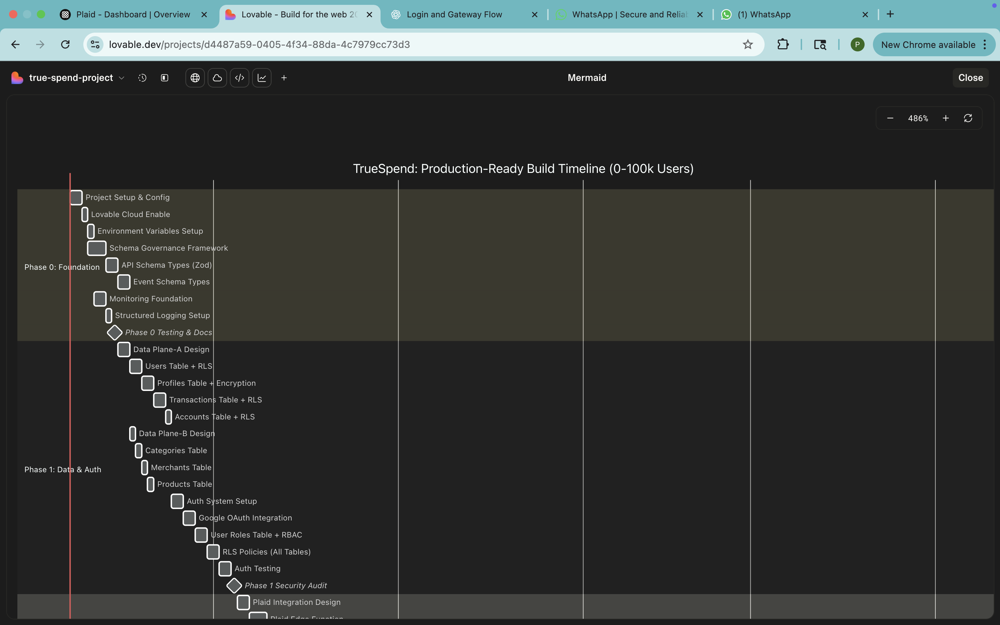

# TrueSpend Implementation Timeline v4.0 – 19-Layer Architecture

**Version:** 4.0  
**Date:** 2025-11-08  
**Status:** Production Implementation Plan  
**Source:** implementation-timeline-v4.0.md  
**Blueprint Reference:** blueprint-v4.0.md

---

## Visual Timeline Overview

*Interactive Gantt chart visualization showing the complete 28-week implementation timeline with all 8 phases, detailed tasks, and critical milestones. The hierarchical structure displays project setup, data architecture, authentication, external services, core features, UI/UX, security hardening, testing, and launch preparation phases.*

---

## Executive Summary

This document outlines the phased implementation approach for TrueSpend v4.0's comprehensive 19-layer architecture. The implementation is structured across 8 phases spanning 28 weeks, with each phase building upon previous layers while maintaining system stability and security.

**Total Duration:** 28 weeks (7 months)  
**Team Size:** 6-8 engineers  
**Total Story Points:** ~340 SP  

---

## Phase Overview

| Phase | Duration | Layers Implemented | Risk Level | Dependencies |
|-------|----------|-------------------|------------|--------------|
| Phase 1 | 4 weeks | Foundation & Client (L1, L15, L16) | Medium | None |
| Phase 2 | 3 weeks | Security & Ingress (L2, L3, L4) | High | Phase 1 |
| Phase 3 | 4 weeks | Auth & Safety (L5, L6) | High | Phase 2 |
| Phase 4 | 5 weeks | Core Services (L7, L8, L9) | Critical | Phase 3 |
| Phase 5 | 3 weeks | External Communication (L10, L11, L12) | Medium | Phase 4 |
| Phase 6 | 3 weeks | Messaging & Events (L13, L14) | Medium | Phase 4 |
| Phase 7 | 4 weeks | Data Planes (L17, L18, L19) | High | Phase 1 |
| Phase 8 | 2 weeks | Observability & Polish | Low | All Phases |

---

## Phase 1: Foundation & Client Layer (Weeks 1-4)

**Objective:** Establish core infrastructure and client foundation  
**Duration:** 4 weeks  
**Team:** 3 Frontend, 2 Backend, 1 DevOps  
**Story Points:** 34 SP

### Layers Implemented
- **Layer 1:** Client Layer (React SPA, PWA)
- **Layer 15:** Database (PostgreSQL with Supabase)
- **Layer 16:** Storage (Object storage for receipts/documents)

### Week 1: Project Setup & Infrastructure
**Story Points:** 8 SP

**Tasks:**
- [ ] Initialize React + TypeScript + Vite project
- [ ] Configure Tailwind CSS design system
- [ ] Set up Lovable Cloud / Supabase project
- [ ] Create initial database schema
- [ ] Configure development environment
- [ ] Set up version control and CI/CD pipeline

**Deliverables:**
- Running development environment
- Basic project structure
- Database connection established
- CI/CD pipeline configured

### Week 2: Client Layer Foundation
**Story Points:** 10 SP

**Tasks:**
- [ ] Implement PWA capabilities (service worker, manifest)
- [ ] Create routing structure (React Router v6)
- [ ] Set up state management (React Query/TanStack)
- [ ] Design component library foundation
- [ ] Implement offline-first architecture
- [ ] Create responsive layout system

**Deliverables:**
- PWA-enabled application
- Navigation structure
- Reusable component library
- Offline capability

### Week 3: Database Layer
**Story Points:** 8 SP

**Tasks:**
- [ ] Design core database schema (users, transactions, budgets)
- [ ] Set up connection pooling
- [ ] Create database indexes for performance
- [ ] Implement query optimization strategies
- [ ] Set up database migrations system
- [ ] Create seed data for testing

**Deliverables:**
- Complete database schema
- Optimized queries
- Migration system
- Test data

### Week 4: Storage Layer
**Story Points:** 8 SP

**Tasks:**
- [ ] Configure object storage buckets
- [ ] Implement file upload functionality
- [ ] Create receipt storage system
- [ ] Set up document versioning
- [ ] Implement CDN integration
- [ ] Create file access policies

**Deliverables:**
- Working file upload/download
- Receipt management system
- Secure storage access

**Phase 1 Milestone:** ✅ Core infrastructure operational

---

## Phase 2: Security & Ingress (Weeks 5-7)

**Objective:** Implement security layers and request routing  
**Duration:** 3 weeks  
**Team:** 2 Frontend, 3 Backend, 1 Security  
**Story Points:** 40 SP

### Layers Implemented
- **Layer 2:** Edge & Ingress (CDN, WAF, DDoS)
- **Layer 3:** API Gateway (Rate limiting, routing)
- **Layer 4:** Modern Safety (CSP, SRI, CORS)

### Week 5: Edge & Ingress
**Story Points:** 13 SP

**Tasks:**
- [ ] Configure CDN for global distribution
- [ ] Set up WAF rules and policies
- [ ] Implement DDoS protection
- [ ] Configure SSL/TLS certificates
- [ ] Set up edge functions for routing
- [ ] Implement geographic routing

**Deliverables:**
- Global CDN distribution
- Active WAF protection
- DDoS mitigation active
- HTTPS enforced

### Week 6: API Gateway
**Story Points:** 14 SP

**Tasks:**
- [ ] Design API gateway architecture
- [ ] Implement rate limiting per endpoint
- [ ] Create API versioning strategy (v1, v2)
- [ ] Set up request transformation
- [ ] Configure load balancing
- [ ] Implement circuit breakers

**Deliverables:**
- Functional API gateway
- Rate limiting active
- API versioning implemented

### Week 7: Modern Safety
**Story Points:** 13 SP

**Tasks:**
- [ ] Implement Content Security Policy (CSP)
- [ ] Add Subresource Integrity (SRI) checks
- [ ] Configure CORS policies
- [ ] Set security headers (HSTS, X-Frame-Options, etc.)
- [ ] Implement XSS prevention
- [ ] Add input sanitization

**Deliverables:**
- CSP enforcement
- SRI verification
- Secure CORS configuration
- Security headers active

**Phase 2 Milestone:** ✅ Secure ingress pipeline operational

---

## Phase 3: Authentication & Supply Chain (Weeks 8-11)

**Objective:** Implement identity management and dependency security  
**Duration:** 4 weeks  
**Team:** 2 Frontend, 3 Backend, 1 Security  
**Story Points:** 48 SP

### Layers Implemented
- **Layer 5:** Auth & Session (JWT, MFA)
- **Layer 6:** Supply Chain Security (Dependency scanning)

### Week 8-9: Authentication Service
**Story Points:** 24 SP

**Tasks:**
- [ ] Integrate Supabase Auth
- [ ] Implement JWT token management
- [ ] Create session handling system
- [ ] Build multi-factor authentication (MFA)
- [ ] Design login/signup flows
- [ ] Implement password policies
- [ ] Create token rotation mechanism
- [ ] Build session lifecycle management

**Deliverables:**
- Full authentication system
- MFA support
- Secure session management
- Password reset flows

### Week 10-11: Supply Chain Security
**Story Points:** 24 SP

**Tasks:**
- [ ] Set up dependency scanning (npm audit, Snyk)
- [ ] Implement license compliance checks
- [ ] Create vulnerability detection system
- [ ] Set up package verification
- [ ] Implement automated security patching
- [ ] Create dependency update policies
- [ ] Set up supply chain attack prevention
- [ ] Configure automated alerts

**Deliverables:**
- Active dependency scanning
- License compliance reports
- Automated vulnerability alerts
- Secure dependency management

**Phase 3 Milestone:** ✅ Secure authentication and supply chain

---

## Phase 4: Core Services (Weeks 12-16)

**Objective:** Build core business logic and AI capabilities  
**Duration:** 5 weeks  
**Team:** 3 Frontend, 4 Backend, 1 ML Engineer  
**Story Points:** 65 SP  
**Risk Level:** Critical

### Layers Implemented
- **Layer 7:** BFF Layer (Request aggregation)
- **Layer 8:** Business Logic (Transaction processing)
- **Layer 9:** AI Agents (Pattern analysis)

### Week 12: BFF Layer
**Story Points:** 15 SP

**Tasks:**
- [ ] Design Backend-For-Frontend architecture
- [ ] Implement request aggregation
- [ ] Create response transformation
- [ ] Build client-specific APIs
- [ ] Implement data composition
- [ ] Optimize response payloads

**Deliverables:**
- Functional BFF layer
- Optimized API responses
- Client-specific endpoints

### Week 13-14: Business Logic
**Story Points:** 30 SP

**Tasks:**
- [ ] Implement transaction processing engine
- [ ] Build budget management system
- [ ] Create spending analysis logic
- [ ] Implement rule engine
- [ ] Build data validation layer
- [ ] Create workflow orchestration
- [ ] Implement state management
- [ ] Build notification triggers

**Deliverables:**
- Transaction processing
- Budget management
- Spending analytics
- Rule engine

### Week 15-16: AI Agents
**Story Points:** 20 SP

**Tasks:**
- [ ] Integrate Lovable AI Gateway
- [ ] Implement spending pattern analysis
- [ ] Build anomaly detection system
- [ ] Create predictive budgeting
- [ ] Implement NLP for categorization
- [ ] Build intelligent recommendations
- [ ] Create automated categorization
- [ ] Implement ML model inference

**Deliverables:**
- AI-powered insights
- Anomaly detection
- Predictive budgeting
- Smart categorization

**Phase 4 Milestone:** ✅ Core business logic operational with AI

---

## Phase 5: External Communication (Weeks 17-19)

**Objective:** Implement resilient external API communication  
**Duration:** 3 weeks  
**Team:** 1 Frontend, 3 Backend, 1 DevOps  
**Story Points:** 42 SP

### Layers Implemented
- **Layer 10:** Egress Gateway (API management)
- **Layer 11:** Retry Scheduler (Resilience)
- **Layer 12:** Control Plane (Configuration)

### Week 17: Egress Gateway
**Story Points:** 14 SP

**Tasks:**
- [ ] Build outbound request router
- [ ] Implement API key management
- [ ] Create circuit breakers
- [ ] Set up request pooling
- [ ] Implement credential injection
- [ ] Build traffic monitoring

**Deliverables:**
- Egress gateway operational
- Secure API key handling
- Circuit breaker protection

### Week 18: Retry Scheduler
**Story Points:** 14 SP

**Tasks:**
- [ ] Implement exponential backoff
- [ ] Create dead letter queue
- [ ] Build priority queuing
- [ ] Design retry policies
- [ ] Implement backpressure management
- [ ] Create failure tracking

**Deliverables:**
- Intelligent retry system
- DLQ handling
- Priority-based retries

### Week 19: Control Plane
**Story Points:** 14 SP

**Tasks:**
- [ ] Implement feature flags system
- [ ] Build configuration management
- [ ] Create service discovery
- [ ] Set up health checks
- [ ] Build dynamic configuration
- [ ] Implement service registry

**Deliverables:**
- Feature flag system
- Dynamic configuration
- Service health monitoring

**Phase 5 Milestone:** ✅ Resilient external communication

---

## Phase 6: Messaging & Events (Weeks 20-22)

**Objective:** Build asynchronous communication and notifications  
**Duration:** 3 weeks  
**Team:** 2 Frontend, 3 Backend  
**Story Points:** 38 SP

### Layers Implemented
- **Layer 13:** Notification Amplifier (Multi-channel)
- **Layer 14:** Event Bus (Message broker)

### Week 20: Event Bus
**Story Points:** 18 SP

**Tasks:**
- [ ] Design event-driven architecture
- [ ] Implement message broker
- [ ] Create event streaming
- [ ] Build topic management
- [ ] Implement subscription handling
- [ ] Create event replay capability
- [ ] Build async communication

**Deliverables:**
- Event bus operational
- Message routing
- Event subscriptions

### Week 21-22: Notification Amplifier
**Story Points:** 20 SP

**Tasks:**
- [ ] Integrate Resend for email
- [ ] Integrate Twilio for SMS
- [ ] Implement push notifications
- [ ] Build in-app notifications
- [ ] Create template management
- [ ] Implement delivery tracking
- [ ] Build preference management
- [ ] Create notification routing

**Deliverables:**
- Multi-channel notifications
- Email/SMS/Push working
- Delivery tracking
- User preferences

**Phase 6 Milestone:** ✅ Event-driven notifications operational

---

## Phase 7: Data Planes & DR (Weeks 23-26)

**Objective:** Implement data security and disaster recovery  
**Duration:** 4 weeks  
**Team:** 1 Frontend, 3 Backend, 2 DevOps  
**Story Points:** 45 SP

### Layers Implemented
- **Layer 17:** Public Data Plane (Read replicas)
- **Layer 18:** Private Data Plane (Encrypted storage)
- **Layer 19:** Backup & DR (Recovery)

### Week 23: Public Data Plane
**Story Points:** 12 SP

**Tasks:**
- [ ] Set up read replicas
- [ ] Implement caching layer
- [ ] Create public APIs
- [ ] Configure anonymous access
- [ ] Optimize read scaling
- [ ] Build cache management

**Deliverables:**
- Read replicas active
- Public API endpoints
- Cache optimization

### Week 24: Private Data Plane
**Story Points:** 15 SP

**Tasks:**
- [ ] Configure primary database
- [ ] Implement encryption at rest
- [ ] Set up audit logging
- [ ] Implement data masking
- [ ] Build PII protection
- [ ] Create access logging

**Deliverables:**
- Encrypted storage
- Audit trails
- PII protection
- Secure access

### Week 25-26: Backup & DR
**Story Points:** 18 SP

**Tasks:**
- [ ] Configure automated backups
- [ ] Implement point-in-time recovery (PITR)
- [ ] Set up disaster recovery site
- [ ] Create data archival
- [ ] Build backup scheduling
- [ ] Implement recovery testing
- [ ] Configure cross-region backups
- [ ] Create runbooks

**Deliverables:**
- Automated backups (hourly/daily)
- PITR capability
- DR site ready
- Recovery procedures

**Phase 7 Milestone:** ✅ Data protection and DR ready

---

## Phase 8: Observability & Polish (Weeks 27-28)

**Objective:** Complete observability and system optimization  
**Duration:** 2 weeks  
**Team:** Full team (6-8 engineers)  
**Story Points:** 28 SP

### Cross-Cutting Layer
- **Observability:** Logs, Metrics, Traces, Alerts

### Week 27: Observability
**Story Points:** 15 SP

**Tasks:**
- [ ] Implement structured logging
- [ ] Set up metrics collection
- [ ] Create distributed tracing
- [ ] Build alerting system
- [ ] Implement log aggregation
- [ ] Create performance dashboards
- [ ] Set up trace correlation
- [ ] Build incident alerting

**Deliverables:**
- Full observability stack
- Performance dashboards
- Alert system
- Distributed tracing

### Week 28: System Polish & Launch Prep
**Story Points:** 13 SP

**Tasks:**
- [ ] Performance optimization
- [ ] Security audit
- [ ] Load testing
- [ ] Documentation completion
- [ ] User acceptance testing
- [ ] Bug fixes and refinements
- [ ] Launch runbook creation
- [ ] Team training

**Deliverables:**
- Production-ready system
- Complete documentation
- Launch plan
- Trained team

**Phase 8 Milestone:** ✅ System ready for production launch

---

## Critical Path Analysis

### High-Risk Dependencies
1. **Phase 3 → Phase 4:** Auth must be complete before business logic
2. **Phase 4 → Phase 5:** Business logic before external integrations
3. **Phase 1 → Phase 7:** Database must be stable before data planes
4. **All Phases → Phase 8:** Observability requires all layers

### Parallel Workstreams
- **Weeks 12-22:** Phase 5 & 6 can run partially in parallel with Phase 4
- **Weeks 23-26:** Phase 7 runs parallel to Phase 6 completion
- **Week 27-28:** Full team convergence for launch

---

## Resource Allocation

### Team Composition
- **Frontend Engineers:** 3 FTE
- **Backend Engineers:** 4 FTE
- **DevOps Engineers:** 1 FTE
- **Security Engineer:** 1 FTE (Phases 2-3)
- **ML Engineer:** 1 FTE (Phase 4)

### Technology Stack Requirements
- React 18, TypeScript, Vite, Tailwind
- Supabase (PostgreSQL, Auth, Storage)
- Lovable Cloud (Edge Functions)
- Plaid, Stripe, Resend, Twilio
- Lovable AI Gateway

---

## Risk Mitigation

### Critical Risks
| Risk | Impact | Probability | Mitigation |
|------|--------|-------------|------------|
| Auth delays block Phase 4 | High | Medium | Start Phase 3 early, allocate extra resources |
| AI integration complexity | Medium | High | Use Lovable AI Gateway, no external dependencies |
| External API reliability | High | Medium | Implement robust retry/circuit breaker |
| Data migration issues | High | Low | Thorough testing, PITR backups |
| Performance bottlenecks | Medium | Medium | Load testing throughout, optimization phase |

---

## Success Metrics

### Phase Completion Criteria
- [ ] All automated tests passing (>90% coverage)
- [ ] Security audit passed
- [ ] Performance targets met (see blueprint-v4.0.md)
- [ ] Documentation complete
- [ ] Team sign-off

### Production Readiness Checklist
- [ ] All 19 layers implemented and tested
- [ ] Security audit completed
- [ ] Load testing passed (1000+ concurrent users)
- [ ] DR drills successful (RTO < 1hr, RPO < 5min)
- [ ] Observability dashboard operational
- [ ] Launch runbook approved
- [ ] Team training complete
- [ ] Legal/compliance review passed

---

## Milestones Summary

| Week | Milestone | Deliverable |
|------|-----------|-------------|
| 4 | Phase 1 Complete | Core infrastructure operational |
| 7 | Phase 2 Complete | Secure ingress pipeline |
| 11 | Phase 3 Complete | Auth & supply chain secure |
| 16 | Phase 4 Complete | Core business logic + AI |
| 19 | Phase 5 Complete | Resilient external communication |
| 22 | Phase 6 Complete | Event-driven notifications |
| 26 | Phase 7 Complete | Data protection & DR ready |
| 28 | Phase 8 Complete | Production launch ready |

---

## Post-Launch Plan

### Week 29-32 (Month 1 Post-Launch)
- Monitor system stability
- Collect user feedback
- Address critical bugs
- Optimize performance
- Scale infrastructure as needed

### Week 33-40 (Months 2-3 Post-Launch)
- Implement user-requested features
- Enhance AI capabilities
- Optimize costs
- Expand integrations
- Plan v5.0 features

---

## Appendix: Integration Timeline

### External Service Integration Schedule

**Banking (Plaid):**
- Week 13: Integration design
- Week 14: Implementation
- Week 15: Testing

**Payments (Stripe):**
- Week 14: Integration design
- Week 15: Implementation
- Week 16: Testing

**AI (Lovable AI Gateway):**
- Week 15: Integration design
- Week 16: Implementation
- Week 17: Testing

**Email (Resend):**
- Week 21: Integration design
- Week 21: Implementation
- Week 22: Testing

**SMS (Twilio):**
- Week 21: Integration design
- Week 22: Implementation
- Week 22: Testing

---

**Document Version:** 4.0  
**Last Updated:** 2025-11-08  
**Maintained By:** TrueSpend Project Management Team  
**Review Cycle:** Weekly during implementation
