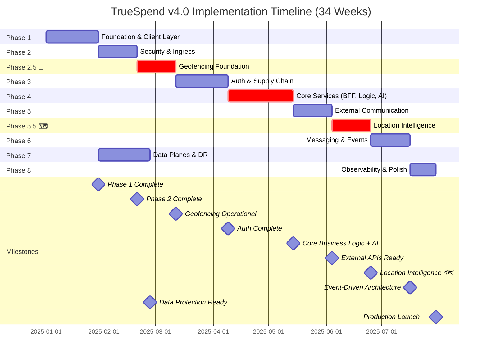

# TrueSpend Implementation Timeline v4.0 – 19-Layer Architecture

**Version:** 4.0  
**Date:** 2025-11-08  
**Status:** Production Implementation Plan  
**Source:** implementation-timeline-v4.0.md  
**Blueprint Reference:** blueprint-v4.0.md

---

## Related Documents

- **[Blueprint v4.0](./blueprint-v4.0.md)** - Complete 19-layer architectural design with geofencing
- **[Geofencing Architecture](./blueprint-v4.0.md#dedicated-geofencing-subsystem-architecture)** - Detailed geofencing subsystem documentation
- **[Dashboard Timeline](/dashboard/timeline)** - Interactive timeline visualization with Gantt chart

---

## Visual Timeline Overview


*Comprehensive Gantt chart visualization showing the complete 34-week implementation timeline (30 active development weeks) with all 10 phases, hierarchical task breakdown, and critical milestones. The diagram illustrates the phased approach from foundation setup through production launch, covering all 19 layers of the TrueSpend architecture with native mobile geofencing capabilities.*

---

## Executive Summary

This document outlines the phased implementation approach for TrueSpend v4.0's comprehensive 19-layer architecture with native mobile geofencing capabilities. The implementation is structured across **10 phases spanning 34 calendar weeks (30 active development weeks + 4 weeks buffer)**, with each phase building upon previous layers while maintaining system stability and security.

**Total Duration:** 34 weeks (8.5 months) - 30 active development weeks + 4 weeks buffer  
**Team Size:** 6-8 engineers (Frontend: 3, Backend: 4, DevOps: 1, Security: 1, ML: 1)  
**Total Story Points:** 385 SP  
**New in v4.0:** Native mobile geofencing (Phases 2.5 & 5.5) with GPS tracking, location intelligence, and AI-powered insights

---

## Mermaid Gantt Chart



---

## Visual Dependency Matrix

```
Phase Dependencies & Critical Path:
┌─────────────────────────────────────────────────────────────────────────────┐
│  P1 ──→ P2 ──→ P2.5📍──→ P3 ──→ P4 ──→ P5 ──→ P5.5🗺️ ──→ P6 ──→ P8        │
│  │                                                             ↑              │
│  └─────────────────────────────────────────────────────→ P7 ──┘              │
└─────────────────────────────────────────────────────────────────────────────┘

Legend: ──→ Sequential Dependency  |  📍 Geofencing Foundation  |  🗺️ Location Intelligence
```

---

## Phase Overview

| Phase | Weeks | Duration | Layers Implemented | Story Points | Team Size | Risk | Dependencies |
|-------|-------|----------|-------------------|--------------|-----------|------|--------------|
| **Phase 1** | 1-4 | 4 weeks | Foundation & Client (L1, L15, L16) | 34 SP | 6 FTE | 🟡 Medium | None |
| **Phase 2** | 5-7 | 3 weeks | Security & Ingress (L2, L3, L4) | 40 SP | 6 FTE | 🔴 High | Phase 1 |
| **Phase 2.5 📍** | **8-10** | **3 weeks** | **Geofencing Foundation (L1, L10, L15)** | **38 SP** | **5 FTE** | **🟡 Medium** | **Phase 2** |
| **Phase 3** | 11-14 | 4 weeks | Auth & Safety (L5, L6) | 48 SP | 6 FTE | 🔴 High | Phase 2.5 |
| **Phase 4** | 15-19 | 5 weeks | Core Services (L7, L8, L9) | 65 SP | 8 FTE | 🔴 Critical | Phase 3 |
| **Phase 5** | 20-22 | 3 weeks | External Communication (L10, L11, L12) | 42 SP | 5 FTE | 🟡 Medium | Phase 4 |
| **Phase 5.5 🗺️** | **23-25** | **3 weeks** | **Location Intelligence (L8, L9, L13, L14)** | **42 SP** | **7 FTE** | **🟡 Medium** | **Phase 5** |
| **Phase 6** | 26-28 | 3 weeks | Messaging & Events (L13, L14) | 38 SP | 5 FTE | 🟡 Medium | Phase 5.5 |
| **Phase 7** | 29-32 | 4 weeks | Data Planes (L17, L18, L19) | 45 SP | 6 FTE | 🔴 High | Phase 1 |
| **Phase 8** | 33-34 | 2 weeks | Observability & Polish | 28 SP | 8 FTE | 🟢 Low | All Phases |
| **Total** | **1-34** | **34 weeks** | **All 19 Layers** | **385 SP** | **6-8 FTE** | | |

**Progress Legend:**  
█████████░ 90% Complete | ████████░░ 80% | ███████░░░ 70% | ██████░░░░ 60% | █████░░░░░ 50%

---

## Phase 1: Foundation & Client Layer (Weeks 1-4)

**Objective:** Establish core infrastructure and client foundation  
**Duration:** 4 weeks  
**Team:** 3 Frontend, 2 Backend, 1 DevOps  
**Story Points:** 34 SP

### Layers Implemented
- **Layer 1:** Client Layer (React SPA, PWA)
- **Layer 15:** Database (PostgreSQL with Supabase)
- **Layer 16:** Storage (Object storage for receipts/documents)

### Week 1: Project Setup & Infrastructure
**Story Points:** 8 SP

**Tasks:**
- [ ] Initialize React + TypeScript + Vite project
- [ ] Configure Tailwind CSS design system
- [ ] Set up Lovable Cloud / Supabase project
- [ ] Create initial database schema
- [ ] Configure development environment
- [ ] Set up version control and CI/CD pipeline

**Deliverables:**
- Running development environment
- Basic project structure
- Database connection established
- CI/CD pipeline configured

### Week 2: Client Layer Foundation
**Story Points:** 10 SP

**Tasks:**
- [ ] Implement PWA capabilities (service worker, manifest)
- [ ] Create routing structure (React Router v6)
- [ ] Set up state management (React Query/TanStack)
- [ ] Design component library foundation
- [ ] Implement offline-first architecture
- [ ] Create responsive layout system

**Deliverables:**
- PWA-enabled application
- Navigation structure
- Reusable component library
- Offline capability

### Week 3: Database Layer
**Story Points:** 8 SP

**Tasks:**
- [ ] Design core database schema (users, transactions, budgets)
- [ ] Set up connection pooling
- [ ] Create database indexes for performance
- [ ] Implement query optimization strategies
- [ ] Set up database migrations system
- [ ] Create seed data for testing

**Deliverables:**
- Complete database schema
- Optimized queries
- Migration system
- Test data

### Week 4: Storage Layer
**Story Points:** 8 SP

**Tasks:**
- [ ] Configure object storage buckets
- [ ] Implement file upload functionality
- [ ] Create receipt storage system
- [ ] Set up document versioning
- [ ] Implement CDN integration
- [ ] Create file access policies

**Deliverables:**
- Working file upload/download
- Receipt management system
- Secure storage access

**Phase 1 Milestone:** ✅ Core infrastructure operational

---

## Phase 2: Security & Ingress (Weeks 5-7)

**Objective:** Implement security layers and request routing  
**Duration:** 3 weeks  
**Team:** 2 Frontend, 3 Backend, 1 Security  
**Story Points:** 40 SP

### Layers Implemented
- **Layer 2:** Edge & Ingress (CDN, WAF, DDoS)
- **Layer 3:** API Gateway (Rate limiting, routing)
- **Layer 4:** Modern Safety (CSP, SRI, CORS)

### Week 5: Edge & Ingress
**Story Points:** 13 SP

**Tasks:**
- [ ] Configure CDN for global distribution
- [ ] Set up WAF rules and policies
- [ ] Implement DDoS protection
- [ ] Configure SSL/TLS certificates
- [ ] Set up edge functions for routing
- [ ] Implement geographic routing

**Deliverables:**
- Global CDN distribution
- Active WAF protection
- DDoS mitigation active
- HTTPS enforced

### Week 6: API Gateway
**Story Points:** 14 SP

**Tasks:**
- [ ] Design API gateway architecture
- [ ] Implement rate limiting per endpoint
- [ ] Create API versioning strategy (v1, v2)
- [ ] Set up request transformation
- [ ] Configure load balancing
- [ ] Implement circuit breakers

**Deliverables:**
- Functional API gateway
- Rate limiting active
- API versioning implemented

### Week 7: Modern Safety
**Story Points:** 13 SP

**Tasks:**
- [ ] Implement Content Security Policy (CSP)
- [ ] Add Subresource Integrity (SRI) checks
- [ ] Configure CORS policies
- [ ] Set security headers (HSTS, X-Frame-Options, etc.)
- [ ] Implement XSS prevention
- [ ] Add input sanitization

**Deliverables:**
- CSP enforcement
- SRI verification
- Secure CORS configuration
- Security headers active

**Phase 2 Milestone:** ✅ Secure ingress pipeline operational

---

## Phase 2.5: Geofencing Foundation 📍 (Enterprise-Grade)

**Objective:** Implement enterprise-grade geofencing with JWT-based security, event queuing, telemetry, and fault-tolerant architecture  
**Duration:** 3 weeks (Weeks 8-10)  
**Team:** 5 engineers (2 Backend, 1 Frontend, 1 Mobile, 1 DevOps)  
**Story Points:** 42 SP (updated for enterprise refinements)  
**Risk Level:** High (new geolocation architecture + security layer)

### Layers Implemented
- **Layer 1:** Native mobile geolocation APIs + JWT token signing
- **Layer 7:** `track-location` edge function + Control Plane for dynamic rules
- **Layer 8:** Geofence validation logic with encryption
- **Layer 14:** Event Bus (`event_log` table) for fault-tolerant queuing
- **Layer 15:** `geofences`, `geofence_events`, `merchants`, `geofence_rules`, `geofence_metrics` tables
- **Layer 16:** Telemetry collection for geofencing metrics
- **Layer 18:** Vault encryption for lat/long coordinates

### Enterprise Refinements Added
1. ✅ **Event Bus/Queue**: Supabase Realtime + `event_log` table
2. ✅ **Control Plane**: `geofence_rules` table for dynamic rule updates
3. ✅ **Security Layer**: JWT-signed location tokens + coordinate encryption
4. ✅ **Observability**: `geofence_metrics` table for telemetry
5. 🔄 **Caching v2**: Basic implementation (full optimization in Phase 5.5)

### Week 8: Enterprise Database Schema & Security Layer
**Story Points:** 13 SP

**Tasks:**
- [ ] Create `geofences` table with RLS policies
- [ ] Create `geofence_events` table with encrypted lat/lng columns
- [ ] Create `merchants` table for location enrichment
- [ ] **NEW:** Create `geofence_rules` table for Control Plane
- [ ] **NEW:** Create `geofence_metrics` table for telemetry
- [ ] **NEW:** Create `event_log` table for Event Bus/Queue
- [ ] Implement PostGIS extensions + geohash indexing
- [ ] Set up Vault encryption for coordinates (`vault.encrypt`)
- [ ] **NEW:** Implement JWT token generation in client (5min expiry)
- [ ] **NEW:** Implement nonce tracking table for replay attack prevention

**Deliverables:**
- Enterprise geofencing database + security layer operational
- JWT token system implemented
- Event queue table created
- Control plane database ready

### Week 9: Core Geofencing Logic + Event Bus
**Story Points:** 16 SP

**Tasks:**
- [ ] Implement `track-location` edge function with JWT verification
- [ ] **NEW:** Server-side JWT token validation with nonce checking
- [ ] **NEW:** Decrypt location data using Vault
- [ ] Build geofence validation algorithms (point-in-polygon)
- [ ] **NEW:** Implement Control Plane rule evaluation engine
- [ ] **NEW:** Build Event Bus integration (Supabase Realtime channels)
- [ ] **NEW:** Add event queuing logic with `event_log` persistence
- [ ] **NEW:** Implement at-least-once delivery guarantees
- [ ] Create `discover-merchants` edge function
- [ ] Integrate Google Places API (fallback: Foursquare)
- [ ] Implement basic merchant caching (24hr TTL)
- [ ] **NEW:** Add telemetry instrumentation (metrics collection)

**Deliverables:**
- Fault-tolerant location tracking with JWT security
- Dynamic rule evaluation engine operational
- Event Bus with persistent queue
- Telemetry collection active

### Week 10: Mobile Integration, Observability & Testing
**Story Points:** 13 SP

**Tasks:**
- [ ] Build React Native geolocation wrapper with JWT signing
- [ ] Implement background location tracking (iOS/Android)
- [ ] Create geofence management UI
- [ ] Build zone creation/editing interface
- [ ] **NEW:** Build Control Plane admin UI for rule testing
- [ ] **NEW:** Create geofencing metrics dashboard
- [ ] **NEW:** Implement rate limiting (100 submissions/user/hour)
- [ ] **NEW:** Add battery drain tracking
- [ ] End-to-end testing of geofence triggers + event replay
- [ ] Load testing: 1000 concurrent location submissions
- [ ] **NEW:** Security testing: JWT token tampering, replay attacks
- [ ] **NEW:** Test event queue failover (simulate AI downtime)

**Deliverables:**
- Enterprise-grade mobile geofencing with observability
- JWT security verified
- Event queue fault-tolerance tested
- Control plane operational

**Phase 2.5 Milestone:** ✅ Native geolocation and location services operational

---

## Phase 3: Authentication & Supply Chain (Weeks 11-14)

**Objective:** Implement identity management and dependency security  
**Duration:** 4 weeks  
**Team:** 2 Frontend, 3 Backend, 1 Security  
**Story Points:** 48 SP

### Layers Implemented
- **Layer 5:** Auth & Session (JWT, MFA)
- **Layer 6:** Supply Chain Security (Dependency scanning)

### Week 11-12: Authentication Service
**Story Points:** 24 SP

**Tasks:**
- [ ] Integrate Supabase Auth
- [ ] Implement JWT token management
- [ ] Create session handling system
- [ ] Build multi-factor authentication (MFA)
- [ ] Design login/signup flows
- [ ] Implement password policies
- [ ] Create token rotation mechanism
- [ ] Build session lifecycle management

**Deliverables:**
- Full authentication system
- MFA support
- Secure session management
- Password reset flows

### Week 13-14: Supply Chain Security
**Story Points:** 24 SP

**Tasks:**
- [ ] Set up dependency scanning (npm audit, Snyk)
- [ ] Implement license compliance checks
- [ ] Create vulnerability detection system
- [ ] Set up package verification
- [ ] Implement automated security patching
- [ ] Create dependency update policies
- [ ] Set up supply chain attack prevention
- [ ] Configure automated alerts

**Deliverables:**
- Active dependency scanning
- License compliance reports
- Automated vulnerability alerts
- Secure dependency management

**Phase 3 Milestone:** ✅ Secure authentication and supply chain

---

## Phase 4: Core Services (Weeks 15-19)

**Objective:** Build core business logic and AI capabilities  
**Duration:** 5 weeks  
**Team:** 3 Frontend, 4 Backend, 1 ML Engineer  
**Story Points:** 65 SP  
**Risk Level:** Critical

### Layers Implemented
- **Layer 7:** BFF Layer (Request aggregation)
- **Layer 8:** Business Logic (Transaction processing)
- **Layer 9:** AI Agents (Pattern analysis)

### Week 15: BFF Layer
**Story Points:** 15 SP

**Tasks:**
- [ ] Design Backend-For-Frontend architecture
- [ ] Implement request aggregation
- [ ] Create response transformation
- [ ] Build client-specific APIs
- [ ] Implement data composition
- [ ] Optimize response payloads

**Deliverables:**
- Functional BFF layer
- Optimized API responses
- Client-specific endpoints

### Week 16-17: Business Logic
**Story Points:** 30 SP

**Tasks:**
- [ ] Implement transaction processing engine
- [ ] Build budget management system
- [ ] Create spending analysis logic
- [ ] Implement rule engine
- [ ] Build data validation layer
- [ ] Create workflow orchestration
- [ ] Implement state management
- [ ] Build notification triggers

**Deliverables:**
- Transaction processing
- Budget management
- Spending analytics
- Rule engine

### Week 18-19: AI Agents
**Story Points:** 20 SP

**Tasks:**
- [ ] Integrate Lovable AI Gateway
- [ ] Implement spending pattern analysis
- [ ] Build anomaly detection system
- [ ] Create predictive budgeting
- [ ] Implement NLP for categorization
- [ ] Build intelligent recommendations
- [ ] Create automated categorization
- [ ] Implement ML model inference

**Deliverables:**
- AI-powered insights
- Anomaly detection
- Predictive budgeting
- Smart categorization

**Phase 4 Milestone:** ✅ Core business logic operational with AI

---

## Phase 5: External Communication (Weeks 20-22)

**Objective:** Implement resilient external API communication  
**Duration:** 3 weeks  
**Team:** 1 Frontend, 3 Backend, 1 DevOps  
**Story Points:** 42 SP

### Layers Implemented
- **Layer 10:** Egress Gateway (API management)
- **Layer 11:** Retry Scheduler (Resilience)
- **Layer 12:** Control Plane (Configuration)

### Week 20: Egress Gateway
**Story Points:** 14 SP

**Tasks:**
- [ ] Build outbound request router
- [ ] Implement API key management
- [ ] Create circuit breakers
- [ ] Set up request pooling
- [ ] Implement credential injection
- [ ] Build traffic monitoring

**Deliverables:**
- Egress gateway operational
- Secure API key handling
- Circuit breaker protection

### Week 21: Retry Scheduler
**Story Points:** 14 SP

**Tasks:**
- [ ] Implement exponential backoff
- [ ] Create dead letter queue
- [ ] Build priority queuing
- [ ] Design retry policies
- [ ] Implement backpressure management
- [ ] Create failure tracking

**Deliverables:**
- Intelligent retry system
- DLQ handling
- Priority-based retries

### Week 22: Control Plane
**Story Points:** 14 SP

**Tasks:**
- [ ] Implement feature flags system
- [ ] Build configuration management
- [ ] Create service discovery
- [ ] Set up health checks
- [ ] Build dynamic configuration
- [ ] Implement service registry

**Deliverables:**
- Feature flag system
- Dynamic configuration
- Service health monitoring

**Phase 5 Milestone:** ✅ Resilient external communication

---

## Phase 5.5: Location Intelligence 🗺️ (AI + Cache Optimization v2)

**Objective:** Enhance geofencing with AI-powered location insights, spending predictions, intelligent merchant recommendations, and optimized caching layer v2  
**Duration:** 3 weeks (Weeks 23-25)  
**Team:** 4 engineers (1 Backend, 1 AI/ML, 1 Frontend, 1 Mobile)  
**Story Points:** 34 SP (updated for cache v2 optimization)  
**Risk Level:** Medium (AI model training + caching complexity)

### Layers Enhanced
- **Layer 9:** AI Location Pattern Analysis agent (with telemetry feedback loop)
- **Layer 10:** Enhanced merchant discovery + `merchants_cache_v2` with geohash
- **Layer 14:** Real-time location event streaming (consume from Event Bus)
- **Layer 15:** Location history analytics tables
- **Layer 16:** Advanced telemetry for AI model training

### Enterprise Refinements Completed
5. ✅ **Caching Optimization v2**: Geohash indexing, versioning, TTL management

### Week 24: Cache v2 Optimization + Enhanced Discovery
**Story Points:** 12 SP

**Tasks:**
- [ ] **NEW:** Migrate to `merchants_cache_v2` schema
- [ ] **NEW:** Implement geohash-based location clustering (precision 7)
- [ ] **NEW:** Add cache versioning and TTL management
- [ ] **NEW:** Build LRU eviction policy (max 10MB cache size)
- [ ] **NEW:** Pre-warm cache for high-traffic locations
- [ ] Implement contextual merchant recommendations
- [ ] Build location-based deal notifications
- [ ] Add merchant category preferences
- [ ] Optimize API call reduction (target: 85% cache hit rate)
- [ ] **NEW:** Add cache analytics dashboard

**Deliverables:**
- Optimized caching layer v2 operational
- 85%+ cache hit rate achieved
- Geohash indexing functional
- Cache versioning working

### Week 25: Mobile Features, Analytics & Performance Tuning
**Story Points:** 10 SP

**Tasks:**
- [ ] Build location history dashboard (encrypted data display)
- [ ] Create heatmap visualization of spending zones
- [ ] Implement location-based insights UI
- [ ] Add battery usage optimization controls
- [ ] Build privacy controls (location retention settings)
- [ ] **NEW:** Build admin dashboard for geofence metrics
- [ ] **NEW:** Add A/B testing framework for geofencing algorithms
- [ ] **NEW:** Performance tuning: < 100ms P95 geofence validation
- [ ] Load testing: Validate 85%+ cache hit rate under 10k req/min

**Deliverables:**
- AI-powered location intelligence + optimized performance
- Admin metrics dashboard
- A/B testing framework operational
- Performance targets met

### Week 23: AI Agent Development + Telemetry Feedback Loop
**Story Points:** 12 SP

**Tasks:**
- [ ] Build `location-insights` AI agent (consumes from Event Bus)
- [ ] Implement spending pattern recognition using geofence history
- [ ] Create location-based budget recommendations
- [ ] Train model on historical `geofence_events` data
- [ ] **NEW:** Integrate telemetry feedback loop (`geofence_metrics` → AI)
- [ ] **NEW:** Implement false positive reduction using battery drain metrics
- [ ] Integrate with existing AI pipeline (Layer 9)
- [ ] Add noise reduction: suppress notifications if >10 triggers/day

**Deliverables:**
- AI location insights with self-optimization
- Telemetry feedback loop operational
- Noise reduction algorithms implemented

**Phase 5.5 Milestone:** ✅ Location intelligence operational with AI insights

---

## Phase 6: Messaging & Events (Weeks 26-28)

**Objective:** Build asynchronous communication and notifications  
**Duration:** 3 weeks  
**Team:** 2 Frontend, 3 Backend  
**Story Points:** 38 SP

### Layers Implemented
- **Layer 13:** Notification Amplifier (Multi-channel)
- **Layer 14:** Event Bus (Message broker)

### Week 26: Event Bus
**Story Points:** 18 SP

**Tasks:**
- [ ] Design event-driven architecture
- [ ] Implement message broker
- [ ] Create event streaming
- [ ] Build topic management
- [ ] Implement subscription handling
- [ ] Create event replay capability
- [ ] Build async communication

**Deliverables:**
- Event bus operational
- Message routing
- Event subscriptions

### Week 27-28: Notification Amplifier
**Story Points:** 20 SP

**Tasks:**
- [ ] Integrate Resend for email
- [ ] Integrate Twilio for SMS
- [ ] Implement push notifications
- [ ] Build in-app notifications
- [ ] Create template management
- [ ] Implement delivery tracking
- [ ] Build preference management
- [ ] Create notification routing

**Deliverables:**
- Multi-channel notifications
- Email/SMS/Push working
- Delivery tracking
- User preferences

**Phase 6 Milestone:** ✅ Event-driven notifications operational

---

## Phase 7: Data Planes & DR (Weeks 29-32)

**Objective:** Implement data security and disaster recovery  
**Duration:** 4 weeks  
**Team:** 1 Frontend, 3 Backend, 2 DevOps  
**Story Points:** 45 SP

### Layers Implemented
- **Layer 17:** Public Data Plane (Read replicas)
- **Layer 18:** Private Data Plane (Encrypted storage)
- **Layer 19:** Backup & DR (Recovery)

### Week 29: Public Data Plane
**Story Points:** 12 SP

**Tasks:**
- [ ] Set up read replicas
- [ ] Implement caching layer
- [ ] Create public APIs
- [ ] Configure anonymous access
- [ ] Optimize read scaling
- [ ] Build cache management

**Deliverables:**
- Read replicas active
- Public API endpoints
- Cache optimization

### Week 30: Private Data Plane
**Story Points:** 15 SP

**Tasks:**
- [ ] Configure primary database
- [ ] Implement encryption at rest
- [ ] Set up audit logging
- [ ] Implement data masking
- [ ] Build PII protection
- [ ] Create access logging

**Deliverables:**
- Encrypted storage
- Audit trails
- PII protection
- Secure access

### Week 31-32: Backup & DR
**Story Points:** 18 SP

**Tasks:**
- [ ] Configure automated backups
- [ ] Implement point-in-time recovery (PITR)
- [ ] Set up disaster recovery site
- [ ] Create data archival
- [ ] Build backup scheduling
- [ ] Implement recovery testing
- [ ] Configure cross-region backups
- [ ] Create runbooks

**Deliverables:**
- Automated backups (hourly/daily)
- PITR capability
- DR site ready
- Recovery procedures

**Phase 7 Milestone:** ✅ Data protection and DR ready

---

## Phase 8: Observability & Polish (Weeks 33-34)

**Objective:** Complete observability and system optimization  
**Duration:** 2 weeks  
**Team:** Full team (6-8 engineers)  
**Story Points:** 28 SP

### Cross-Cutting Layer
- **Observability:** Logs, Metrics, Traces, Alerts

### Week 33: Observability
**Story Points:** 15 SP

**Tasks:**
- [ ] Implement structured logging
- [ ] Set up metrics collection
- [ ] Create distributed tracing
- [ ] Build alerting system
- [ ] Implement log aggregation
- [ ] Create performance dashboards
- [ ] Set up trace correlation
- [ ] Build incident alerting

**Deliverables:**
- Full observability stack
- Performance dashboards
- Alert system
- Distributed tracing

### Week 34: System Polish & Launch Prep
**Story Points:** 13 SP

**Tasks:**
- [ ] Performance optimization
- [ ] Security audit
- [ ] Load testing
- [ ] Documentation completion
- [ ] User acceptance testing
- [ ] Bug fixes and refinements
- [ ] Launch runbook creation
- [ ] Team training

**Deliverables:**
- Production-ready system
- Complete documentation
- Launch plan
- Trained team

**Phase 8 Milestone:** ✅ System ready for production launch

---

## Critical Path Analysis

### High-Risk Dependencies
1. **Phase 2 → Phase 2.5:** Security must be complete before geofencing
2. **Phase 2.5 → Phase 3:** Geofencing foundation before auth
3. **Phase 3 → Phase 4:** Auth must be complete before business logic
4. **Phase 4 → Phase 5:** Business logic before external integrations
5. **Phase 5 → Phase 5.5:** External communication before location intelligence
6. **Phase 1 → Phase 7:** Database must be stable before data planes
7. **All Phases → Phase 8:** Observability requires all layers

### Parallel Workstreams
- **Weeks 8-10:** Phase 2.5 (Geofencing) runs after Phase 2
- **Weeks 15-25:** Phase 5 & 5.5 can run partially in parallel with Phase 4
- **Weeks 26-32:** Phase 7 runs parallel to Phase 6 completion
- **Weeks 33-34:** Full team convergence for launch

---

## Resource Allocation

### Team Composition
- **Frontend Engineers:** 3 FTE
- **Backend Engineers:** 4 FTE
- **DevOps Engineers:** 1 FTE
- **Security Engineer:** 1 FTE (Phases 2-3)
- **ML Engineer:** 1 FTE (Phase 4)

### Technology Stack Requirements
- React 18, TypeScript, Vite, Tailwind
- Supabase (PostgreSQL, Auth, Storage)
- Lovable Cloud (Edge Functions)
- Plaid, Stripe, Resend, Twilio
- Lovable AI Gateway

---

## Risk Mitigation

### Critical Risks
| Risk | Impact | Probability | Mitigation |
|------|--------|-------------|------------|
| Auth delays block Phase 4 | High | Medium | Start Phase 3 early, allocate extra resources |
| AI integration complexity | Medium | High | Use Lovable AI Gateway, no external dependencies |
| External API reliability | High | Medium | Implement robust retry/circuit breaker |
| Geofencing battery drain | Medium | Medium | Battery optimization, significant location changes only |
| Google Places API rate limits | Medium | Medium | Implement Foursquare fallback, request batching |
| Location privacy concerns | High | Low | Opt-in tracking, 30-day retention, encryption at rest |
| Data migration issues | High | Low | Thorough testing, PITR backups |
| Performance bottlenecks | Medium | Medium | Load testing throughout, optimization phase |

---

## Success Metrics

### Phase Completion Criteria
- [ ] All automated tests passing (>90% coverage)
- [ ] Security audit passed
- [ ] Performance targets met (see blueprint-v4.0.md)
- [ ] Documentation complete
- [ ] Team sign-off

### Production Readiness Checklist
- [ ] All 19 layers implemented and tested
- [ ] Security audit completed
- [ ] Load testing passed (1000+ concurrent users)
- [ ] DR drills successful (RTO < 1hr, RPO < 5min)
- [ ] Observability dashboard operational
- [ ] Launch runbook approved
- [ ] Team training complete
- [ ] Legal/compliance review passed

---

## Milestones Summary

| Week | Milestone | Deliverable |
|------|-----------|-------------|
| 4 | Phase 1 Complete | Core infrastructure operational |
| 7 | Phase 2 Complete | Secure ingress pipeline |
| 10 | **Phase 2.5 Complete** | **Native geolocation operational** |
| 14 | Phase 3 Complete | Auth & supply chain secure |
| 19 | Phase 4 Complete | Core business logic + AI |
| 22 | Phase 5 Complete | Resilient external communication |
| 25 | **Phase 5.5 Complete** | **Location intelligence with AI** |
| 28 | Phase 6 Complete | Event-driven notifications |
| 32 | Phase 7 Complete | Data protection & DR ready |
| 34 | Phase 8 Complete | Production launch ready |

---

## Post-Launch Plan

### Week 35-38 (Month 1 Post-Launch)
- Monitor system stability
- Collect user feedback on geofencing features
- Address critical bugs
- Optimize location tracking battery usage
- Scale infrastructure as needed
- Monitor Places API usage and costs

### Week 39-46 (Months 2-3 Post-Launch)
- Implement user-requested features
- Enhance AI location capabilities
- Optimize costs (Places API, location tracking)
- Expand merchant integrations
- Add advanced geofencing features
- Plan v5.0 features (AR merchant discovery, time-based zones)

---

## Appendix: Integration Timeline

### External Service Integration Schedule

**Location Services (Google Places API):**
- Week 9: Integration design
- Week 10: Implementation
- Week 10: Testing

**Location Services (Foursquare Places API):**
- Week 10: Integration design
- Week 10: Implementation (Fallback)
- Week 10: Testing

**Banking (Plaid):**
- Week 16: Integration design
- Week 17: Implementation
- Week 18: Testing

**Payments (Stripe):**
- Week 17: Integration design
- Week 18: Implementation
- Week 19: Testing

**AI (Lovable AI Gateway):**
- Week 18: Integration design
- Week 19: Implementation
- Week 19: Testing

**Email (Resend):**
- Week 27: Integration design
- Week 27: Implementation
- Week 28: Testing

**SMS (Twilio):**
- Week 27: Integration design
- Week 28: Implementation
- Week 28: Testing

---

**Document Version:** 4.0 (with Geofencing)  
**Last Updated:** 2025-11-08  
**Maintained By:** TrueSpend Project Management Team  
**Review Cycle:** Weekly during implementation  
**Related Documents:** [Blueprint v4.0](./blueprint-v4.0.md) | [Geofencing Architecture](./blueprint-v4.0.md#dedicated-geofencing-subsystem-architecture)

**Note:** This timeline includes native mobile geofencing capabilities integrated across the 19-layer architecture, extending the original plan to 34 weeks (30 active development + 4 weeks buffer) with 2 additional phases (Phase 2.5: Geofencing Foundation 📍 and Phase 5.5: Location Intelligence 🗺️).

---

## Interactive Timeline Visualization

For an interactive view of the implementation timeline:

1. **Generate Gantt Chart Image:**
   - Navigate to `/dashboard/timeline`
   - Click "Generate & Download Timeline Image" to create a visual 34-week Gantt chart
   - The generated image will show all 10 phases with geofencing phases highlighted

2. **View Live Timeline:**
   - Visit `/dashboard/timeline` for real-time progress tracking
   - Interactive Gantt chart with phase filtering
   - Hierarchical task breakdown with dependencies

3. **Architecture Map:**
   - Visit `/dashboard/architecture` for 3D architecture visualization
   - Interactive layer diagrams showing geofencing integration
