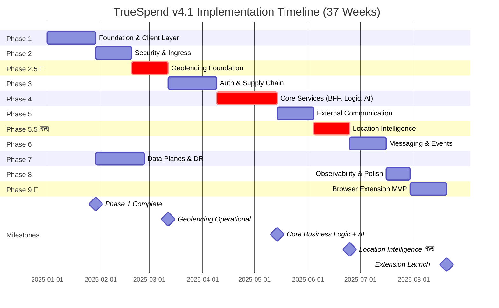

# TrueSpend Implementation Timeline v4.1 – 19-Layer Architecture

**Version:** 4.1  
**Date:** 2025-11-08  
**Status:** Production Implementation Plan  
**Source:** implementation-timeline-v4.1.md  
**Blueprint Reference:** blueprint-v4.1.md

---

## Related Documents

- **[Blueprint v4.1](./blueprint-v4.1.md)** - Complete 19-layer architectural design
- **[Implementation Guide v4.1](./blueprint-v4.1-implementation.md)** - Detailed code examples and implementation
- **[Dashboard Timeline](/dashboard/timeline)** - Interactive timeline visualization

---

## Executive Summary

This document outlines the phased implementation approach for TrueSpend v4.1's comprehensive 19-layer architecture with native mobile geofencing capabilities and browser extension companion. The implementation is structured across **11 phases spanning 37 calendar weeks (33 active development weeks + 4 weeks buffer)**.

**Total Duration:** 37 weeks (9.25 months) - 33 active development weeks + 4 weeks buffer  
**Team Size:** 6-8 engineers (Frontend: 3, Backend: 4, DevOps: 1, Security: 1, ML: 1)  
**Total Story Points:** 429 SP  
**Architecture:** 19 layers + Browser extension (Layer 1B)

---

## Mermaid Gantt Chart

---

## Phase Overview

| Phase | Weeks | Duration | Layers Implemented | Story Points | Team Size | Risk | Dependencies |
|-------|-------|----------|-------------------|--------------|-----------|------|--------------|
| **Phase 1** | 1-4 | 4 weeks | Foundation & Client (L1A, L15, L16) | 34 SP | 6 FTE | 🟡 Medium | None |
| **Phase 2** | 5-7 | 3 weeks | Security & Ingress (L2, L3, L4) | 40 SP | 6 FTE | 🔴 High | Phase 1 |
| **Phase 2.5 📍** | **8-10** | **3 weeks** | **Geofencing Foundation (L1A, L10, L15)** | **38 SP** | **5 FTE** | **🟡 Medium** | **Phase 2** |
| **Phase 3** | 11-14 | 4 weeks | Auth & Safety (L5, L6) | 48 SP | 6 FTE | 🔴 High | Phase 2.5 |
| **Phase 4** | 15-19 | 5 weeks | Core Services (L7, L8, L9) | 65 SP | 8 FTE | 🔴 Critical | Phase 3 |
| **Phase 5** | 20-22 | 3 weeks | External Communication (L10, L11, L12) | 42 SP | 5 FTE | 🟡 Medium | Phase 4 |
| **Phase 5.5 🗺️** | **23-25** | **3 weeks** | **Location Intelligence (L8, L9, L13, L14)** | **42 SP** | **7 FTE** | **🟡 Medium** | **Phase 5** |
| **Phase 6** | 26-28 | 3 weeks | Messaging & Events (L13, L14) | 38 SP | 5 FTE | 🟡 Medium | Phase 5.5 |
| **Phase 7** | 29-32 | 4 weeks | Data Planes (L17, L18, L19) | 45 SP | 6 FTE | 🔴 High | Phase 1 |
| **Phase 8** | 33-34 | 2 weeks | Observability & Polish | 28 SP | 8 FTE | 🟢 Low | All Phases |
| **Phase 9 🔌** | **35-37** | **3 weeks** | **Browser Extension (L1B)** | **44 SP** | **2 FTE** | **🟢 Low** | **Phase 8** |
| **Total** | **1-37** | **37 weeks** | **All 19 Layers + Extension** | **429 SP** | **6-8 FTE** | | |

---

## Implementation Notes

For detailed phase breakdowns, refer to [Implementation Timeline v4.0](./implementation-timeline-v4.0.md) which contains:
- Week-by-week task breakdowns
- Detailed deliverables for each phase
- Risk mitigation strategies
- Resource allocation details
- Critical path analysis

**Key Changes in v4.1:**
- All code examples moved to [Implementation Guide v4.1](./blueprint-v4.1-implementation.md)
- Blueprint v4.1 focuses on architecture overview
- Same 37-week timeline structure as v4.0
- Updated document references and cross-links

---

## Milestones Summary

| Week | Milestone | Deliverables |
|------|-----------|--------------|
| 4 | Foundation Complete | Client layer, database, storage operational |
| 10 | Geofencing Operational 📍 | Native GPS tracking, JWT security, event queue |
| 19 | Core Services Ready | Business logic, AI agents, transaction processing |
| 25 | Location Intelligence 🗺️ | AI location insights, merchant discovery |
| 34 | System Polish Complete | Full observability, performance optimization |
| 37 | Browser Extension Launch 🔌 | Extension published to Chrome Web Store |

---

**Document Version:** 4.1  
**Last Updated:** 2025-11-08  
**Maintained By:** TrueSpend Architecture Team  
**Review Cycle:** Quarterly  
**Related Documents:** [Blueprint v4.1](./blueprint-v4.1.md) | [Implementation Guide v4.1](./blueprint-v4.1-implementation.md)
