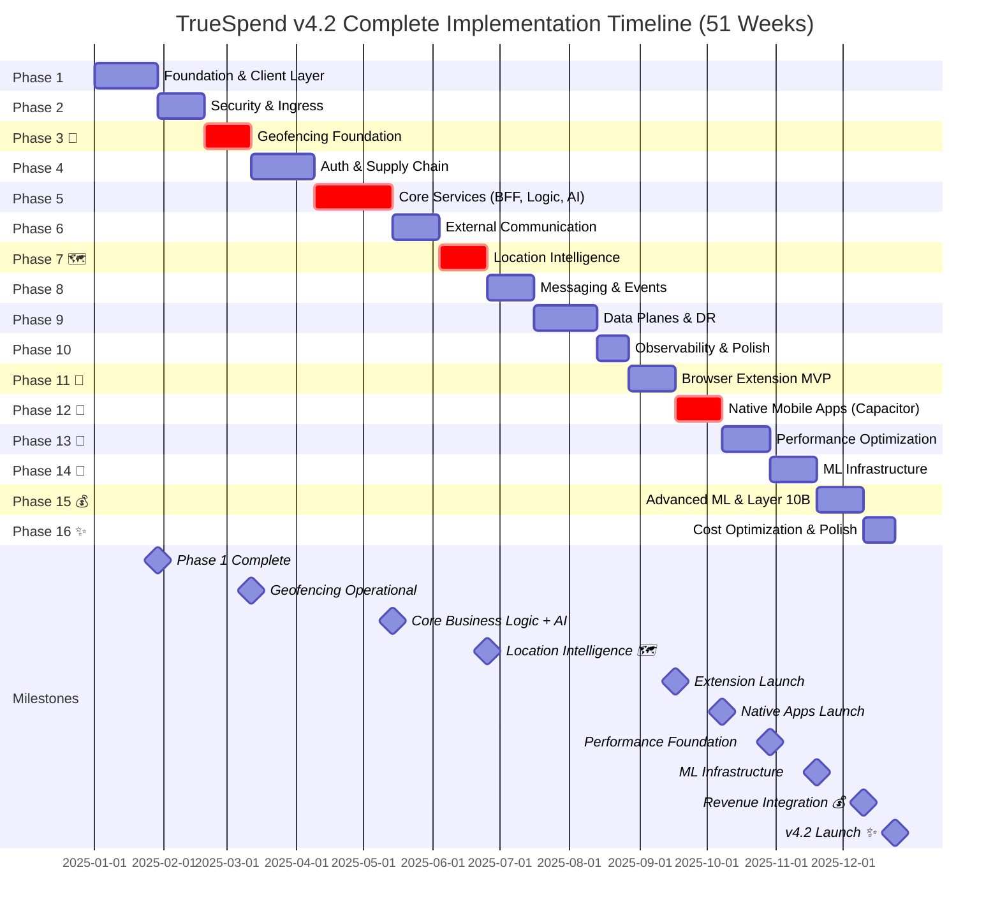
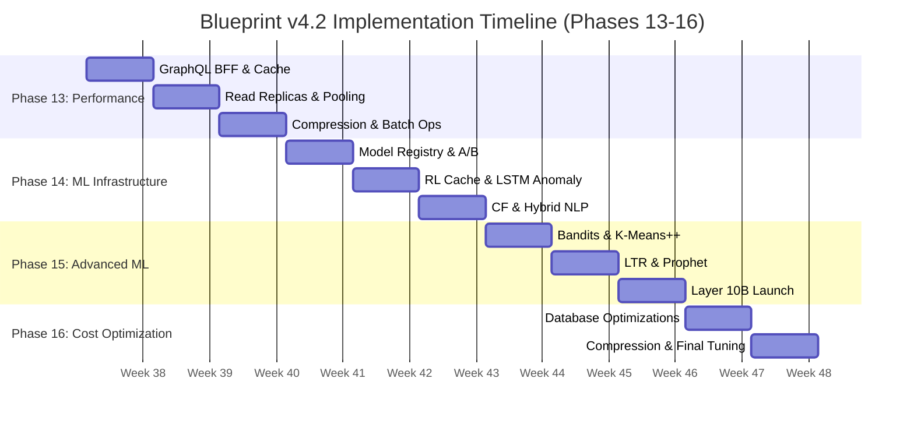

# Implementation Timeline v4.2

**Version:** 4.2  
**Total Duration:** 51 weeks (37 weeks v4.1 + 3 weeks native apps + 11 weeks optimizations)  
**Start Date:** Week 1  
**Target Completion:** Week 51  
**Blueprint:** [Blueprint v4.2](./blueprint-v4.2.md)

---

## Executive Summary

This document outlines the complete phased implementation approach for TrueSpend v4.2's comprehensive 19-layer architecture + Layer 10B with native mobile geofencing, browser extension, Capacitor native apps, performance optimization, and ML intelligence. The implementation is structured across **16 phases spanning 51 calendar weeks**.

**Total Duration:** 51 weeks (12.75 months)
- **Phases 1-10:** Core platform (37 weeks, 429 SP) - Blueprint v4.1
- **Phase 11:** Browser Extension (3 weeks, 44 SP) - Manifest V3
- **Phase 12:** Native Mobile Apps (3 weeks, 45 SP) - Capacitor iOS/Android
- **Phases 13-16:** Optimization & ML (11 weeks, 168 SP) - v4.2 enhancements

**Team Size:** 6-8 engineers (Frontend: 3, Backend: 4, DevOps: 1, Security: 1, ML: 2)  
**Total Story Points:** 677 SP (429 SP v4.1 + 89 SP apps + 168 SP v4.2)  
**Architecture:** 19 layers + Layer 10B (Deals & Cashback Gateway) + Browser extension (Layer 1B) + Capacitor Native Apps

---

## Complete Gantt Chart (All Phases)

---

## Phase Summary

| Phase | Name | Weeks | Duration | Story Points | Team Size | Risk | Dependencies |
|-------|------|-------|----------|--------------|-----------|------|--------------|
| **1** | Foundation & Client Layer (NO PWA) | 1-4 | 4 weeks | 34 SP | 6 FTE | 🟡 Medium | None |
| **2** | Security & Ingress | 5-7 | 3 weeks | 40 SP | 6 FTE | 🔴 High | Phase 1 |
| **3 📍** | Geofencing Foundation | 8-10 | 3 weeks | 38 SP | 5 FTE | 🟡 Medium | Phase 1, 2 |
| **4** | Auth & Supply Chain | 11-14 | 4 weeks | 48 SP | 6 FTE | 🔴 High | Phase 1, 2, 3 |
| **5** | Core Services (BFF, Logic, AI) | 15-19 | 5 weeks | 65 SP | 8 FTE | 🔴 Critical | Phase 4 |
| **6** | External Communication | 20-22 | 3 weeks | 42 SP | 5 FTE | 🟡 Medium | Phase 5 |
| **7 🗺️** | Location Intelligence | 23-25 | 3 weeks | 42 SP | 7 FTE | 🟡 Medium | Phase 3, 6 |
| **8** | Messaging & Events | 26-28 | 3 weeks | 38 SP | 5 FTE | 🟡 Medium | Phase 7 |
| **9** | Data Planes & DR | 29-32 | 4 weeks | 45 SP | 6 FTE | 🔴 High | Phase 8 |
| **10** | Observability & Polish | 33-34 | 2 weeks | 28 SP | 8 FTE | 🟢 Low | Phase 9 |
| **11 🔌** | Browser Extension MVP | 35-37 | 3 weeks | 44 SP | 2 FTE | 🟢 Low | Phase 10 |
| **12 📱** | Native Mobile Apps (Capacitor) | 38-40 | 3 weeks | 45 SP | 6 FTE | 🔴 High | Phase 7, 11 |
| **13 🚀** | Performance Optimization | 41-43 | 3 weeks | 52 SP | 4 FTE | 🟡 Medium | Phase 12 |
| **14 🤖** | ML Infrastructure | 44-46 | 3 weeks | 48 SP | 5 FTE | 🔴 High | Phase 13 |
| **15 💰** | Advanced ML & Layer 10B | 47-49 | 3 weeks | 42 SP | 6 FTE | 🔴 High | Phase 14 |
| **16 ✨** | Cost Optimization & Polish | 50-51 | 2 weeks | 26 SP | 4 FTE | 🟡 Medium | Phase 15 |
| **Total** | **All Phases** | **1-51** | **51 weeks** | **677 SP** | **6-8 FTE** | | |

---

## Milestones Summary

| Week | Milestone | Deliverables |
|------|-----------|--------------|
| 4 | Foundation Complete | Client layer, database, storage operational |
| 10 | Geofencing Operational 📍 | Native GPS tracking, JWT security, event queue |
| 19 | Core Services Ready | Business logic, AI agents, transaction processing |
| 25 | Location Intelligence 🗺️ | AI location insights, merchant discovery |
| 34 | System Polish Complete | Full observability, performance optimization |
| 37 | Browser Extension Launch 🔌 | Extension published to Chrome Web Store |
| 40 | Native Apps Launch 📱 | iOS/Android apps live on app stores |
| 43 | Performance Foundation Ready 🚀 | GraphQL BFF, read replicas, 90%+ cache hit rate |
| 46 | ML Infrastructure Complete 🤖 | Model registry, RL cache, LSTM anomaly detection |
| 49 | Revenue Integration Live 💰 | Layer 10B, affiliate tracking, $2K+/mo revenue |
| 51 | v4.2 Launch Ready ✨ | All optimizations deployed, 52% cost reduction |

---

## Phases 1-10: Core Platform (Weeks 1-34) - Blueprint v4.1

*For detailed week-by-week task breakdowns, refer to [Implementation Timeline v4.1](./implementation-timeline-v4.1.md).*

**Phase Overview:**
- **Phase 1 (Weeks 1-4):** Foundation & Client Layer - React, TypeScript, Supabase, storage
- **Phase 2 (Weeks 5-7):** Security & Ingress - WAF, rate limiting, DDoS protection
- **Phase 3 📍 (Weeks 8-10):** Geofencing Foundation - GPS tracking, JWT, event queue
- **Phase 4 (Weeks 11-14):** Auth & Supply Chain - Multi-factor auth, session management
- **Phase 5 (Weeks 15-19):** Core Services - BFF, business logic, AI agents
- **Phase 6 (Weeks 20-22):** External Communication - Email, SMS, push notifications
- **Phase 7 🗺️ (Weeks 23-25):** Location Intelligence - AI location insights, merchant discovery
- **Phase 8 (Weeks 26-28):** Messaging & Events - Event bus, webhooks, real-time updates
- **Phase 9 (Weeks 29-32):** Data Planes - Backup, disaster recovery, replication
- **Phase 10 (Weeks 33-34):** Observability & Polish - Monitoring, alerting, optimization

---

## Phase 12: Native Mobile Apps 📱 (Weeks 38-40)

**Duration:** 3 weeks  
**Story Points:** 45 SP
**Team:** 6 FTE (2 iOS, 2 Android, 1 Backend, 1 DevOps)  
**Goal:** Implement Capacitor native apps for iOS and Android with background location tracking, push notifications, native geofencing, and app store deployment

### Week 38: Capacitor Foundation & Permissions

**Tasks:**
1. **Capacitor Setup (8 SP)**
   - Install @capacitor/core, @capacitor/cli, @capacitor/ios, @capacitor/android
   - Initialize capacitor.config.ts with appId and server URL for hot reload
   - Add iOS and Android platforms
   - Configure hot reload for dev environment

2. **Background Location Plugin (15 SP)**
   - Install @capacitor-community/background-geolocation
   - Replace web `useGPSTracking` with `useNativeGPSTracking` hook
   - Implement continuous tracking (50m distance filter)
   - Configure iOS Info.plist (NSLocationAlwaysUsageDescription, UIBackgroundModes)
   - Configure Android foreground service (FOREGROUND_SERVICE_LOCATION permission)
   - Test background tracking with app closed/backgrounded

**Deliverables:**
- Capacitor iOS/Android projects created
- Background location tracking working on both platforms
- Hot reload configured for rapid development

---

### Week 39: Push Notifications & Geofencing

**Tasks:**
1. **Push Notification Infrastructure (12 SP)**
   - Setup APNS (Apple Push Notification Service) with .p8 key
   - Setup FCM (Firebase Cloud Messaging) for Android
   - Install @capacitor/push-notifications
   - Create `pushNotificationService.ts` for token registration
   - Store push tokens in `push_tokens` table (user_id, token, platform)
   - Create `send-card-recommendation-push` edge function

2. **Native Geofencing (10 SP)**
   - iOS: Create GeofenceManager.swift using CLLocationManager
   - Android: Implement native geofence monitoring
   - Register geofence plugin in AppDelegate/MainActivity
   - Wire up enter/exit events to React
   - Trigger card recommendations on geofence enter
   - Log geofence events to `geofence_events` table

**Deliverables:**
- Push notifications working (APNS + FCM)
- Native geofencing operational on iOS/Android
- Card recommendations sent as push notifications

---

### Week 40: iOS Widget & App Store Prep

**Tasks:**
1. **iOS Widget (WidgetKit) (10 SP)**
   - Create TrueSpendWidget.swift (small + medium sizes)
   - Display nearby store + recommended card
   - Create `widget-data` edge function for API data
   - Implement 5-minute refresh timeline
   - Test widget on home screen

2. **Build & Deploy Prep (10 SP)**
   - Configure Xcode signing with Apple Developer account
   - Generate signed IPA for TestFlight
   - Configure Android Studio Gradle for release builds
   - Generate signed APK for Google Play
   - Setup CI/CD for automated builds (optional)
   - Document deployment process

**Deliverables:**
- iOS home screen widget functional
- Signed IPA ready for App Store Connect
- Signed APK ready for Google Play Console
- Deployment documentation complete

---

**Phase 12 Success Criteria:**
- [ ] Background GPS tracking <5% battery drain per day
- [ ] Push notification delivery rate >95%
- [ ] Geofence enter latency <5 seconds
- [ ] iOS widget updates every 5 minutes
- [ ] Signed iOS IPA + Android APK ready for app stores
- [ ] Hot reload working for rapid iteration

---

## Phase 13: Performance Optimization 🚀 (Weeks 41-43)

**Duration:** 3 weeks  
**Story Points:** 52 SP  
**Goal:** Implement core performance optimizations (GraphQL, caching, read replicas, deduplication)

### Week 41: GraphQL BFF & Multi-Tier Cache

**Tasks:**
1. **GraphQL Gateway Setup (13 SP)**
   - Install Apollo Server and schema stitching
   - Define core schema (Query, Mutation, types)
   - Implement DataLoader for batching
   - Add field-level caching with Redis
   - Query complexity analysis (max depth: 10)
   - Deploy dual-stack (REST + GraphQL) with feature flags

2. **Multi-Tier Cache L1/L2 (8 SP)**
   - Configure Redis for L1 cache (1-5min TTL)
   - Implement IndexedDB for L2 cache (web/extension)
   - Cache key generation and versioning
   - LRU eviction policies

3. **Request Deduplication (5 SP)**
   - Client-side deduplication cache (5min window)
   - Deduplication key generation (endpoint + params hash)
   - In-flight request tracking

**Deliverables:**
- GraphQL gateway (dual-stack with REST)
- L1/L2 cache implementation
- Request deduplication middleware

### Week 42: Database Optimization & Read Replicas

**Tasks:**
1. **Read Replicas Setup (13 SP)**
   - Provision 2 read replicas (Postgres)
   - Configure synchronous replication (<100ms lag)
   - Implement load balancing (round-robin)
   - Add failover logic (automatic promotion)
   - Connection routing (primary vs replicas)

2. **Connection Pooling (pgBouncer) (8 SP)**
   - Deploy pgBouncer in transaction mode
   - Configure pool sizes (20 connections/service)
   - Auto-scaling hooks (ARIMA forecasting)
   - Connection lifecycle management

3. **Prepared Statements & Query Optimization (5 SP)**
   - Convert hot paths to prepared statements
   - Add query result caching (5min TTL)
   - Index optimization for slow queries

**Deliverables:**
- Read replicas with load balancing
- pgBouncer connection pooling
- Prepared statements for hot paths

### Week 43: Response Compression & Batch Operations

**Tasks:**
1. **Response Compression (8 SP)**
   - Enable Brotli compression at CDN level
   - Configure compression thresholds (>1KB)
   - Add Accept-Encoding headers
   - Measure bandwidth reduction

2. **Batch Operations API (8 SP)**
   - GraphQL batch mutation schema
   - Server-side transaction batching
   - Client-side queueing with exponential backoff
   - Error handling for partial failures

3. **Edge Precompute & CDN Optimization (5 SP)**
   - Identify cacheable dashboard summaries
   - Implement edge compute functions (Cloudflare Workers)
   - Add cache prewarming logic
   - CDN cache invalidation hooks

**Deliverables:**
- Brotli compression (60% bandwidth reduction)
- Batch operations API
- Edge precompute for dashboard

**Phase 15 Milestones:**
- [ ] GraphQL gateway live (dual-stack)
- [ ] Cache hit rate > 85%
- [ ] Read replicas handling 70% of queries
- [ ] Bandwidth reduced by 50%+
- [ ] API p95 latency < 120ms

---

## Phase 14: ML Infrastructure 🤖 (Weeks 44-46)

**Duration:** 3 weeks  
**Story Points:** 48 SP  
**Goal:** Build ML infrastructure and deploy foundational models (RL cache, LSTM anomaly, CF merchant discovery)

### Week 44: Model Registry & A/B Testing

**Tasks:**
1. **Model Registry (13 SP)**
   - Design model metadata schema (id, version, architecture, hyperparameters)
   - Implement versioning and rollback
   - Add model artifact storage (S3/Supabase Storage)
   - Create model deployment API
   - Add monitoring dashboard (accuracy, latency, error rate)

2. **A/B Testing Framework (8 SP)**
   - Implement feature flags with user bucketing
   - Add experiment tracking (control vs treatment)
   - Statistical significance testing (95% confidence)
   - Experiment dashboard (metrics, charts, decisions)

3. **Shadow Mode Infrastructure (5 SP)**
   - Dual-path execution (production + shadow model)
   - Shadow model result logging (no user impact)
   - Comparison metrics (accuracy, latency, drift)

**Deliverables:**
- Model registry with versioning
- A/B testing framework
- Shadow mode infrastructure

### Week 45: RL Cache Policy & LSTM Anomaly Detection

**Tasks:**
1. **Predictive Caching (RL-Based) (13 SP)**
   - Design DQN architecture (state, action, reward)
   - State: request pattern, cache size, hit rate
   - Action: admit/reject, TTL adjustment (1min, 5min, 15min, 1h)
   - Reward: hit rate improvement - eviction cost
   - Train offline on historical logs (1M requests)
   - Deploy in shadow mode (L3 cache)
   - Metrics: cache hit rate improvement, eviction rate

2. **LSTM Transaction Anomaly Detection (13 SP)**
   - Design LSTM autoencoder architecture
   - Features: amount, merchant, category, time, location
   - Training data: 100K transactions (normal + synthetic anomalies)
   - Reconstruction error threshold tuning
   - Deploy in shadow mode
   - Metrics: precision, recall, F1 score (target: 90%+)

**Deliverables:**
- RL cache policy (shadow mode)
- LSTM anomaly detection (shadow mode)
- Training pipelines and monitoring

### Week 46: Collaborative Filtering & Hybrid NLP

**Tasks:**
1. **Merchant Discovery (Collaborative Filtering) (8 SP)**
   - Implement ALS (Alternating Least Squares) matrix factorization
   - Features: user-merchant interaction matrix (transactions, clicks)
   - Training data: 10K users × 5K merchants
   - Top-N recommendations (N=10)
   - Deploy in production (non-critical path)
   - Metrics: CTR, conversion rate

2. **Hybrid NLP for Receipts (8 SP)**
   - Fine-tune DistilBERT for receipt categorization
   - Training data: 50K labeled receipts (20 categories)
   - Cost triage: DistilBERT (80%) → Gemini Flash (20%)
   - Deploy in production (replace Gemini-only)
   - Metrics: accuracy (target: 90%+), cost reduction (target: 80%)

3. **ML Monitoring Dashboard (5 SP)**
   - Real-time accuracy tracking
   - Latency distribution (p50, p95, p99)
   - Error rate and alert thresholds
   - Model drift detection (data distribution shifts)

**Deliverables:**
- Collaborative filtering for merchants
- Hybrid NLP for receipts (80% cost reduction)
- ML monitoring dashboard

**Phase 14 Milestones:**
- [ ] Model registry operational
- [ ] RL cache policy in shadow mode (hit rate: 93%+)
- [ ] LSTM anomaly detection in shadow mode (accuracy: 90%+)
- [ ] Collaborative filtering live (CTR: +15%)
- [ ] Hybrid NLP live (cost: -80%, accuracy: 90%+)

---

## Phase 15: Advanced ML & Layer 10B 💰 (Weeks 47-49)

**Duration:** 3 weeks  
**Story Points:** 42 SP  
**Goal:** Deploy advanced ML models (bandits, K-Means++, LTR, Prophet) and launch Layer 10B (affiliate integrations)

### Week 47: Multi-Armed Bandits & Geofence Optimization

**Tasks:**
1. **Dynamic Budget Allocation (Multi-Armed Bandits) (13 SP)**
   - Implement Thompson Sampling algorithm
   - State: category spend, remaining budget, time-to-month-end
   - Action: allocate $X to category Y
   - Reward: user satisfaction (budget adherence, no overspend alerts)
   - Train on historical budget data (10K users)
   - Deploy in production (with manual override)
   - Metrics: budget adherence rate, user satisfaction score

2. **Geofence Boundary Optimization (K-Means++) (8 SP)**
   - Cluster merchant locations (K-Means++)
   - Features: lat/lng, transaction frequency, avg spend
   - Optimize geofence radius (95% capture rate, <5% false positives)
   - Deploy in production (apply to existing geofences)
   - Metrics: capture rate, false positive rate

**Deliverables:**
- Multi-Armed Bandits for budget allocation
- K-Means++ geofence optimization
- Production deployment with monitoring

### Week 48: Offer Ranking & Spending Forecasting

**Tasks:**
1. **Cashback Offer Ranking (LambdaMART) (13 SP)**
   - Implement Learning-to-Rank (LambdaMART)
   - Features: user history, merchant category, cashback rate, offer popularity
   - Training data: 100K user-offer interactions (clicks, conversions)
   - Top-N ranking (N=10)
   - Deploy in production (Layer 10B integration)
   - Metrics: CTR, conversion rate, revenue per user

2. **Real-Time Spending Forecasting (Prophet) (8 SP)**
   - Implement Facebook Prophet for time-series forecasting
   - Features: historical spend by category, seasonality, holidays
   - Forecast horizon: 7 days ahead
   - Deploy in production (budget alert triggers)
   - Metrics: forecast accuracy (MAPE <15%)

**Deliverables:**
- LambdaMART offer ranking
- Prophet spending forecasting
- Budget alert integration

### Week 46: Layer 10B (Deals & Cashback Gateway)

**Tasks:**
1. **OffersService & Provider Adapters (13 SP)**
   - Implement unified OffersService interface
   - Provider adapters: Impact, CJ, Rakuten (Phase 1)
   - Normalized offer schema (id, merchant, cashbackRate, deepLink, expiresAt)
   - Rate limiting (100 req/min per provider)
   - Circuit breaker (5 failures → open for 60s)

2. **Attribution Tracking (8 SP)**
   - Generate signed click IDs (HMAC-SHA256, 15min TTL)
   - Store attribution records (userId, offerId, clickId, timestamp, IP, deviceHash)
   - Implement redirect flow (client → redirector → provider → callback)
   - Webhook listeners for conversion events
   - Fraud prevention: nonce validation, bot scoring

3. **GraphQL Schema Extensions (5 SP)**
   - Add `offers`, `merchants`, `trackOfferClick`, `confirmAttribution` to schema
   - Implement resolvers with caching (L2: 12h, L3: 24h)
   - Add offer popularity tracking

**Deliverables:**
- Layer 10B with Impact, CJ, Rakuten adapters
- Attribution tracking and fraud prevention
- GraphQL schema extensions

**Phase 15 Milestones:**
- [ ] Multi-Armed Bandits live (budget adherence: +20%)
- [ ] K-Means++ geofence optimization live (accuracy: 95%+)
- [ ] LambdaMART offer ranking live (CTR: +30%)
- [ ] Prophet forecasting live (accuracy: MAPE <15%)
- [ ] Layer 10B live with 3 providers (revenue: $2K+/mo)

---

## Phase 16: Cost Optimization & Polish ✨ (Weeks 50-51)

**Duration:** 2 weeks  
**Story Points:** 26 SP  
**Goal:** Deploy remaining optimizations (Bloom filters, Gorilla compression, R-Trees, partitioning, batching, CDN prewarm)

### Week 50: Database Optimizations

**Tasks:**
1. **R-Tree Geospatial Indexing (8 SP)**
   - Enable PostGIS extension
   - Create GIST index on geofences.boundary
   - Migrate geofence lookup queries to ST_Contains
   - Measure performance improvement (O(log n) vs O(n))
   - Target: <5ms per lookup

2. **Bloom Filters for Negative Cache (5 SP)**
   - Enable Bloom extension in Postgres
   - Create Bloom index on transactions (user_id, merchant_id, date)
   - Implement negative cache pattern (check existence before query)
   - Target: <1ms for negative cache hits

3. **Data Partitioning (8 SP)**
   - Partition transactions table by date (quarterly)
   - Create partitions for 2024 Q1-Q4, 2025 Q1-Q2
   - Migrate existing data (zero-downtime)
   - Add automatic partition creation (monthly cron)
   - Benefits: faster queries, easier archival

**Deliverables:**
- R-Tree geospatial indexing (5ms lookups)
- Bloom filters for negative cache
- Data partitioning for transactions

### Week 51: Time-Series Compression & Final Tuning

**Tasks:**
1. **Gorilla Time-Series Compression (8 SP)**
   - Identify time-series tables (geofence_events, api_metrics)
   - Implement Gorilla compression (custom Postgres extension or TimescaleDB)
   - Compress historical data (70% storage reduction)
   - Add compression monitoring dashboard

2. **Event Bus Adaptive Batching (5 SP)**
   - Implement dynamic batch sizing (low/medium/high traffic)
   - Low: 10 events/100ms, Medium: 50 events/500ms, High: 200 events/2s
   - Add batch size tuning logic (throughput monitoring)
   - Target: 40-60% reduction in Lambda invocations

3. **CDN Cache Prewarming (5 SP)**
   - Build Markov chain navigation model (historical user paths)
   - Identify high-probability next pages
   - Implement prewarm logic (CDN cache population)
   - Target: 50% improvement in cache hit rate for first visit

4. **Final Performance Tuning (5 SP)**
   - Load testing (10K concurrent users)
   - Bottleneck identification and fixes
   - Monitoring dashboard finalization
   - Documentation updates

**Deliverables:**
- Gorilla compression for time-series (70% storage reduction)
- Adaptive event batching (40-60% cost reduction)
- CDN cache prewarming (50% hit rate improvement)
- Final performance report

**Phase 16 Milestones:**
- [ ] R-Tree indexing live (5ms geofence lookups)
- [ ] Bloom filters live (<1ms negative cache)
- [ ] Data partitioning complete (50% query speed improvement)
- [ ] Gorilla compression live (70% storage reduction)
- [ ] Adaptive batching live (50% cost reduction)
- [ ] CDN prewarming live (50% hit rate improvement)
- [ ] All v4.2 performance targets achieved

---

## Final Success Criteria (v4.2)

### Performance
- [ ] API p95 latency < 150ms (GraphQL: <100ms)
- [ ] Database p95 latency < 10ms
- [ ] Cache hit rate > 90%
- [ ] Page load time < 1.5s
- [ ] Extension popup < 100ms

### Cost
- [ ] Total monthly costs < $700 (52% reduction)
- [ ] Storage costs < $70 (70% reduction)
- [ ] AI API costs < $120 (80% reduction)
- [ ] Database costs < $200 (40% reduction)

### ML Accuracy
- [ ] RL cache policy: 93% hit rate
- [ ] LSTM anomaly detection: 90%+ accuracy
- [ ] Collaborative filtering: 15%+ CTR uplift
- [ ] Hybrid NLP: 90%+ accuracy, 80% cost reduction
- [ ] LambdaMART offer ranking: 30%+ CTR uplift
- [ ] Prophet forecasting: MAPE <15%

### Business
- [ ] Affiliate revenue > $5,000/mo
- [ ] Cashback per user > $5/mo
- [ ] User engagement +25%
- [ ] Support tickets (false alerts) -80%

---

## Gantt Chart (Phases 13-16)

---

## Risk Mitigation

### High-Risk Areas
1. **GraphQL Transition:** Dual-stack for 6 months, backward compatibility, feature parity
2. **ML Rollout:** Shadow mode for 2 weeks, A/B testing, gradual rollout (5% → 25% → 100%)
3. **Cache Invalidation:** Event-driven patterns, TTL fallbacks, cache versioning
4. **Affiliate Compliance:** Legal review, automated compliance checks, user consent flows

### Rollback Strategy
- Feature flags for all new features
- Database backups before migrations
- Canary deployments (5% → 25% → 100%)
- Real-time monitoring with alert thresholds

---

## Resource Allocation

### Team Composition (Phases 15-18)
- Backend Engineers: 3
- Frontend Engineers: 2
- ML Engineers: 2
- DevOps Engineer: 1
- QA Engineer: 1
- Product Manager: 1

### Key Roles
- **Tech Lead:** Architecture decisions, code reviews
- **ML Lead:** Model development, training, evaluation
- **DevOps Lead:** Infrastructure, monitoring, deployment
- **QA Lead:** Test planning, automation, regression testing

---

## Dependencies

### External Dependencies
- Affiliate provider approvals (Impact, CJ, Rakuten)
- CDN provider support (Brotli compression, edge compute)
- Database instance upgrades (read replicas)
- ML training compute resources (GPU instances)

### Internal Dependencies
- Phase 12 must complete before Phase 13 (native apps before performance optimization)
- Phase 13 must complete before Phase 14 (cache infrastructure for RL model)
- Phase 14 must complete before Phase 15 (model registry for advanced ML)
- Phase 15 must complete before Phase 16 (Layer 10B for affiliate revenue)

---

## Next Steps

1. **Approve Timeline:** Stakeholder review and sign-off
2. **Resource Allocation:** Assign engineers to phases
3. **Kickoff Phase 12:** Begin Capacitor setup and background location tracking
4. **Kickoff Phase 15:** Begin GraphQL BFF and cache hierarchy
5. **Provider Onboarding:** Sign up for affiliate programs
6. **Training Data Prep:** Collect and label data for ML models

---

## References

- [Blueprint v4.2](./blueprint-v4.2.md)
- [Implementation Guide v4.2](./blueprint-v4.2-implementation.md) (Part 2)
- [ML Model Registry](../ml/model-registry.md) (Part 2)
- [Data Optimization Guide](../data/optimization-guide.md) (Part 2)
